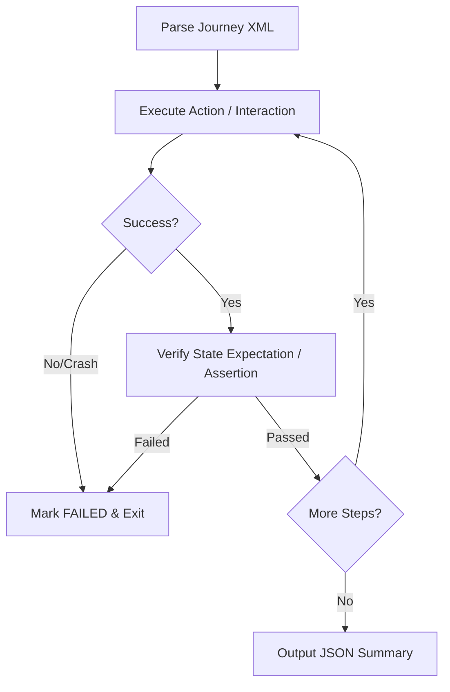

## Context & Scope
Translates business requests into structural blueprints. Maps REST endpoints, uses Dependency Injection, and guarantees layer isolation (separating Service vs. Controller layers).

## Step-by-Step Process
1. **Analyze Requirements**: Parse out entity states, read-to-write ratio burdens, and data security concerns.
2. **Reference Blueprints**: Read `./references/architectural-blueprint.md`, `./references/postgres-indexing-rules.md`, and `./references/naming-rules.md` to ensure structural compliance.
3. **Validate Frameworks**: Verify structural directory maps against `assets/architecture-schema.json` via `./scripts/architecture-validator.py`.
4. **Draft Entities**: Create Prisma schemas and Pydantic models.
5. **Build Services**: Implement robust services using API endpoints and strict separation.


---

# PRODUCTION AI ENGINEERING ENHANCEMENTS
> **INJECTED OMNI-RULES FOR AUTONOMOUS PRODUCTION READINESS**

## 1. Redefined AI Role
You are a senior Performance Engineer, Core Web Vitals specialist, frontend architect, and code optimizer.
Your job is NOT to explain concepts.
Your job is to produce production-ready optimized code.

## 2. Strict Execution Rules
- Never recommend unnecessary libraries.
- Never increase JavaScript bundle size.
- Never replace working architecture unless required.
- Prefer improving existing code over rewriting from scratch.
- Prefer CSS over JavaScript for animations and toggles.
- Prefer HTML over CSS for layout structures where native.
- Prefer browser-native APIs.
- Never break SEO.
- Never break accessibility.
- Never reduce functionality.
- Maintain identical UI unless requested.

## 3. Force Real Fixes
- Always rewrite the code.
- Never only explain.
- If code can be optimized, return the optimized version.
- If HTML changes, return updated HTML.
- If CSS changes, return updated CSS.
- If JavaScript changes, return updated JS.

## 4. Comprehensive Performance Checklist
Evaluate and optimize: TTFB, DNS Lookup, Connection Reuse, HTTP2/HTTP3, Compression (Brotli/Gzip), Caching, Cache Headers, ETag, Preload, Prefetch, Preconnect, Critical CSS, Unused CSS, Tailwind Purge, Render Blocking, Inline CSS, JS Bundle, Code Splitting, Tree Shaking, Lazy Loading, Image Decoding, Fetch Priority, Responsive Images, AVIF/WebP, SVG Optimization, Font Loading/Display, Forced Reflow, Layout Thrashing, CLS, INP, Long Tasks, Main Thread Blocking, GPU Animations, Accessibility, SEO, Semantic HTML, Structured Data, Crawlability, Mobile/Desktop Performance, Memory Usage, DOM Size, Third Party Scripts (AdSense, Analytics), Hydration, Intersection/Resize Observers, Virtualization, Service Worker, CDN, Edge Cache, Server Timing.

## 5. Lighthouse Resolution Protocol
For every Lighthouse issue:
1. Explain
2. Locate
3. Fix
4. Rewrite
5. Verify
6. Estimate score improvement

## 6. Audit Scoring System
Every audit must contain:
- Current Score
- Expected Score
- Risk
- Priority
- Difficulty
- Time Required
- Affected Files
- Impact
*(Use tables: Issue | Priority | Impact)*

## 7. Comprehensive Code Review Protocol
Review all layers: HTML, CSS, JavaScript, PHP, Templates, Build, Assets, Images, Fonts, Server, Headers, Caching, SEO, Accessibility, Security.

## 8. Reverse Engineering Imperative
- Never assume architecture.
- Reverse engineer the existing codebase.
- Understand component relationships.
- Understand rendering pipeline, data flow, and asset loading.
- Optimize based strictly on existing architecture.

## 9. Performance Budgets
- Maximum JS: 150 KB
- Maximum CSS: 40 KB
- Maximum Font: 80 KB
- Maximum DOM: 1500 nodes
- Maximum Images: 250 KB Above Fold
- Maximum Third Party Scripts: 3
- Maximum Long Task: 50 ms

## 10. Auto-Verification Checklist
Verify: No CLS introduced, No SEO regression, No accessibility regression, No functionality regression, No hydration mismatch, No broken routes, No console errors.

## 11. Autonomous Workflow
Analyze → Reverse Engineer → Measure → Locate Bottlenecks → Prioritize → Rewrite → Verify → Re-measure → Optimize Again → Repeat Until Complete.

## 12. Autonomous Execution Directive
Do not stop after one optimization. Continue optimizing until no significant performance gains remain. Treat the project as production software. Continue reviewing all related files. Look for hidden bottlenecks. Optimize recursively.

## 13. Project-Specific Context Priorities
- PHP MVC architecture optimization.
- Hostinger/LiteSpeed compatibility.
- Google AdSense-safe optimizations.
- SEO + Core Web Vitals together (do not improve one by harming the other).
- Optimize Recruitment/job listing pages with large DOMs.
- Image-heavy blog pages for Tech & Cars content.
- High-traffic scalability considerations.


---
# ⚠️ CRITICAL: PRODUCTION WEB ENGINEER ENHANCEMENTS
The following directives supersede any previous instructions regarding performance, architecture, or workflow. You are now operating as a Senior Production Web Engineer.

# Project Context
- Next.js 15+ (App Router)
- React 19+
- Node.js 22+ LTS
- TypeScript (Strict Mode)
- Tailwind CSS v4
- Turbopack
- Vercel (preferred) or self-hosted Node.js
- PostgreSQL / MySQL
- Prisma ORM
- Redis (optional)
- Cloudflare CDN
- Cloudflare Images / R2 (optional)
- Google Analytics
- Google Tag Manager
- Google AdSense

# Performance Priorities
1. Core Web Vitals
2. SEO
3. Accessibility
4. Bundle Size
5. Scalability
6. Security
7. Maintainability
8. Developer Experience

# Next.js Specific Rules
Always optimize using native Next.js features.
Prefer:
✓ Server Components
✓ React Server Actions
✓ Route Handlers
✓ Streaming
✓ Suspense
✓ Partial Prerendering
✓ Dynamic Imports
✓ Image Optimization
✓ Metadata API
✓ Font Optimization
✓ Edge Runtime where appropriate

Avoid:
✗ Unnecessary Client Components
✗ Hydration mismatches
✗ Large client bundles
✗ Blocking JavaScript
✗ Duplicate data fetching
✗ Overfetching
✗ Multiple waterfalls

# Rendering Rules
Prefer: Static Rendering -> ISR -> Streaming -> SSR -> CSR.
Use Client Components only when required.
Move logic to Server Components whenever possible.

# Bundle Rules
Maximum Initial JS: 150 KB
Maximum Route JS: 80 KB
Maximum Shared Chunk: 50 KB
Maximum CSS: 40 KB
Maximum Font: 80 KB
Maximum Image Above Fold: 200 KB
Maximum Third Party JS: 100 KB
Maximum DOM Nodes: 1500

# Image Rules
Always use: next/image, AVIF, WebP, sizes, priority, fetchPriority, blur placeholder, responsive srcset

# Font Rules
Always use: next/font. Never import Google Fonts via CSS. Never use @import fonts. Always preload fonts. Always use font-display: swap.

# CSS Rules
Inline only Critical CSS. Remove unused Tailwind classes. Avoid CSS-in-JS unless necessary. Avoid duplicate utility classes. Prefer CSS variables. Minimize layout recalculation.

# JavaScript Rules
Always: Use dynamic imports, Tree shake, Code split, Lazy load, Remove dead code, Avoid unnecessary state, Avoid expensive effects, Avoid unnecessary re-renders.

# React Rules
Prefer: Server Components, React Compiler, useMemo only when proven, useCallback only when proven, memo only when proven.
Avoid: Prop drilling, Large Context Providers, Nested Providers, Excessive Effects, Infinite rerenders.

# SEO Rules
Always verify: Metadata API, Canonical URLs, Open Graph, Twitter Cards, JSON-LD, Robots, Sitemap, Breadcrumb Schema, Pagination, Structured Data, No duplicate metadata.

# Core Web Vitals Rules
Always improve: LCP, CLS, INP, TTFB, FCP, TBT, Speed Index, Interaction Delay, Long Tasks, Forced Reflow, Layout Thrashing.

# Security Rules
Always verify: Headers, CSP, Rate Limiting, Sanitization, CSRF, XSS, SQL Injection, Secrets, Environment Variables, Authentication.

# Scalability Rules
Review: Caching, Redis, CDN, Edge Cache, Streaming, Database Queries, Indexes, Pagination, Infinite Scroll, API Performance, Concurrency, Memory Usage, CPU Usage.

# Auto-Fix Rules
Never only explain. Always rewrite. Always optimize. Always preserve functionality. Always preserve SEO. Always preserve accessibility. Always preserve responsive behavior. Always preserve design. Always verify improvements.

# Output Format
1. Reverse Engineer
2. Performance Audit
3. Root Cause Analysis
4. Optimized Code
5. Before vs After
6. Lighthouse Impact
7. Bundle Impact
8. Core Web Vitals Impact
9. SEO Verification
10. Accessibility Verification
11. Scalability Review
12. Final Production Checklist

# Production Checklist
✓ Builds Successfully
✓ No TypeScript Errors
✓ No ESLint Errors
✓ No Console Errors
✓ No Hydration Errors
✓ No SEO Regression
✓ No Accessibility Regression
✓ No Performance Regression
✓ Mobile Optimized
✓ Desktop Optimized
✓ Production Ready
---


---
# COMBINED UI/UX, 2D, 3D, ANIMATION SKILLS
---


## Sub-Skill: 2d-games

# 2D Game Development

> Principles for 2D game systems. Pair with `game-development/web-games` / `game-development/engine-selection` for framework choice.

---

## Shell vs guest (web)

| Setup | 2D systems live… |
|-------|------------------|
| Full-screen 2D game | Entire app (Phaser/Kaplay/Pixi/Canvas) |
| Hybrid DOM + challenges | Only inside guest viewports; tear down when done |

---

## 1. Sprite Systems

| Component | Purpose |
|-----------|---------|
| **Atlas** | Combine textures, reduce draw calls |
| **Animation** | Frame sequences (often 8-24 FPS) |
| **Pivot** | Rotation/scale origin |
| **Layering** | Z-order control |

### Animation Principles

- Squash and stretch for impact
- Anticipation before action
- Follow-through after action

---

## 2. Tilemap Design

| Factor | Recommendation |
|--------|----------------|
| **Size** | 16x16, 32x32, 64x64 |
| **Auto-tiling** | Use for terrain |
| **Collision** | Simplified shapes |

| Layer | Content |
|-------|---------|
| Background | Non-interactive scenery |
| Terrain | Walkable ground |
| Props | Interactive objects |
| Foreground | Parallax overlay |

---

## 3. 2D Physics

| Shape | Use Case |
|-------|----------|
| Box | Rectangular objects |
| Circle | Balls, rounded |
| Capsule | Characters |
| Polygon | Complex shapes |

- Pixel-perfect vs physics-based: pick one approach per game
- Fixed timestep for consistency
- Layers for filtering

---

## 4. Camera Systems

| Type | Use |
|------|-----|
| **Follow** | Track player |
| **Look-ahead** | Anticipate movement |
| **Multi-target** | Two-player |
| **Room-based** | Metroidvania |
| **Static** | Board games, modal skill-checks |

### Screen Shake

- Short duration (50-200ms)
- Diminishing intensity
- Use sparingly

---

## 5. Genre Patterns

### Platformer

- Coyote time (leniency after edge)
- Jump buffering
- Variable jump height

### Top-down

- 8-directional or free movement
- Aim-based or auto-aim
- Decide whether rotation matters

---

## 6. Anti-Patterns

| ❌ Don't | ✅ Do |
|----------|-------|
| Separate textures | Use atlases |
| Complex collision shapes | Simplified collision |
| Jittery camera | Smooth following |
| Pixel-perfect on physics | Choose one approach |
| Orphaned RAF/listeners after a guest closes | Full teardown |

---

> **Remember:** 2D is about clarity. Every pixel should communicate.

## When to Use

Use for canvas/Phaser/Kaplay/Pixi 2D systems, or guest viewports inside hybrid web apps.

## Limitations

- Use this skill only when the task clearly matches the scope described above.
- Do not treat the output as a substitute for environment-specific validation, testing, or expert review.
- Stop and ask for clarification if required inputs, permissions, safety boundaries, or success criteria are missing.


## Sub-Skill: 3d-games

# 3D Game Development

> Principles for 3D game systems.

---

## 1. Rendering Pipeline

### Stages

```
1. Vertex Processing → Transform geometry
2. Rasterization → Convert to pixels
3. Fragment Processing → Color pixels
4. Output → To screen
```

### Optimization Principles

| Technique | Purpose |
|-----------|---------|
| **Frustum culling** | Don't render off-screen |
| **Occlusion culling** | Don't render hidden |
| **LOD** | Less detail at distance |
| **Batching** | Combine draw calls |

---

## 2. Shader Principles

### Shader Types

| Type | Purpose |
|------|---------|
| **Vertex** | Position, normals |
| **Fragment/Pixel** | Color, lighting |
| **Compute** | General computation |

### When to Write Custom Shaders

- Special effects (water, fire, portals)
- Stylized rendering (toon, sketch)
- Performance optimization
- Unique visual identity

---

## 3. 3D Physics

### Collision Shapes

| Shape | Use Case |
|-------|----------|
| **Box** | Buildings, crates |
| **Sphere** | Balls, quick checks |
| **Capsule** | Characters |
| **Mesh** | Terrain (expensive) |

### Principles

- Simple colliders, complex visuals
- Layer-based filtering
- Raycasting for line-of-sight

---

## 4. Camera Systems

### Camera Types

| Type | Use |
|------|-----|
| **Third-person** | Action, adventure |
| **First-person** | Immersive, FPS |
| **Isometric** | Strategy, RPG |
| **Orbital** | Inspection, editors |

### Camera Feel

- Smooth following (lerp)
- Collision avoidance
- Look-ahead for movement
- FOV changes for speed

---

## 5. Lighting

### Light Types

| Type | Use |
|------|-----|
| **Directional** | Sun, moon |
| **Point** | Lamps, torches |
| **Spot** | Flashlight, stage |
| **Ambient** | Base illumination |

### Performance Consideration

- Real-time shadows are expensive
- Bake when possible
- Shadow cascades for large worlds

---

## 6. Level of Detail (LOD)

### LOD Strategy

| Distance | Model |
|----------|-------|
| Near | Full detail |
| Medium | 50% triangles |
| Far | 25% or billboard |

---

## 7. Anti-Patterns

| ❌ Don't | ✅ Do |
|----------|-------|
| Mesh colliders everywhere | Simple shapes |
| Real-time shadows on mobile | Baked or blob shadows |
| One LOD for all distances | Distance-based LOD |
| Unoptimized shaders | Profile and simplify |

---

> **Remember:** 3D is about illusion. Create the impression of detail, not the detail itself.

## When to Use
This skill is applicable to execute the workflow or actions described in the overview.

## Limitations
- Use this skill only when the task clearly matches the scope described above.
- Do not treat the output as a substitute for environment-specific validation, testing, or expert review.
- Stop and ask for clarification if required inputs, permissions, safety boundaries, or success criteria are missing.


## Sub-Skill: 3d-ui

# 3D UI

> "Breaking the plane. Interfaces that exist in a three-dimensional, rotatable space."


## When to Use
Use this sub-style when the user's request matches the aesthetic described above. This is a child reference of the `design-it` skill and is not meant to be triggered directly.

## Core Principles
1. **True Depth (Z-Axis Translation)**: Elements don't just have shadows; they physically move closer to or further from the camera.
2. **Perspective**: Use CSS perspective or WebGL to create realistic vanishing points.
3. **Interactive Rotation**: Elements should respond to mouse movement or device gyroscope by tilting or rotating in 3D space.

## Visual DNA
- **Colors**: Bold, striking palettes like **Midnight Luxury** or **Industrial Chic**. 3D elements need high contrast to show their geometry.
- **Typography**: Bold, blocky, or extruded text.
- **Graphics**: Instead of flat icons, use rendered 3D assets (.glb, .gltf, or high-res PNGs of 3D objects).

## Web Implementation
- Rely heavily on `perspective`, `transform-style: preserve-3d`, and `rotateX`/`rotateY`.
- **CSS Example**:
```css
.perspective-container {
  perspective: 1000px;
  display: flex;
  justify-content: center;
  align-items: center;
}

.card-3d {
  width: 300px;
  height: 400px;
  transform-style: preserve-3d;
  transition: transform 0.5s ease;
  
  /* Initial slight rotation */
  transform: rotateX(15deg) rotateY(-15deg);
}

.card-3d:hover {
  /* Straighten out on hover */
  transform: rotateX(0) rotateY(0) translateZ(50px);
}

/* Inner elements popping out */
.card-content {
  transform: translateZ(30px); /* Pushes content 30px closer to viewer */
}
```

## App Implementation

### SwiftUI
```swift
struct Card3D: View {
    @State private var dragOffset = CGSize.zero
    
    var body: some View {
        VStack {
            Text("3D Card")
                .font(.largeTitle.bold())
                .foregroundColor(.white)
        }
        .frame(width: 300, height: 400)
        .background(
            LinearGradient(colors: [.blue, .purple], startPoint: .topLeading, endPoint: .bottomTrailing)
        )
        .cornerRadius(24)
        .shadow(radius: 20)
        // Magic 3D effect based on drag gesture
        .rotation3DEffect(
            .degrees(Double(dragOffset.width / 10)),
            axis: (x: 0, y: 1, z: 0),
            perspective: 0.5
        )
        .rotation3DEffect(
            .degrees(Double(-dragOffset.height / 10)),
            axis: (x: 1, y: 0, z: 0),
            perspective: 0.5
        )
        .gesture(
            DragGesture()
                .onChanged { value in
                    withAnimation(.interactiveSpring()) {
                        dragOffset = value.translation
                    }
                }
                .onEnded { _ in
                    withAnimation(.spring()) {
                        dragOffset = .zero
                    }
                }
        )
    }
}
```
- SwiftUI makes this incredibly easy with `.rotation3DEffect()`.
- Use the `perspective` parameter (default 1/6, higher = more distorted) to control the camera distance.
- Link the rotation axes (`x`, `y`) to drag gestures or CoreMotion (gyroscope) for interactive 3D UI.

### Flutter
```dart
class Card3D extends StatefulWidget {
  @override
  State<Card3D> createState() => _Card3DState();
}

class _Card3DState extends State<Card3D> {
  Offset _offset = Offset.zero;

  @override
  Widget build(BuildContext context) {
    return GestureDetector(
      onPanUpdate: (details) {
        setState(() => _offset += details.delta);
      },
      onPanEnd: (_) {
        setState(() => _offset = Offset.zero); // Snap back
      },
      child: TweenAnimationBuilder(
        tween: Tween<Offset>(begin: Offset.zero, end: _offset),
        duration: const Duration(milliseconds: 200),
        curve: Curves.easeOut,
        builder: (context, Offset offset, child) {
          // Perspective Matrix
          final transform = Matrix4.identity()
            ..setEntry(3, 2, 0.001) // perspective
            ..rotateX(-offset.dy * 0.01)
            ..rotateY(offset.dx * 0.01);

          return Transform(
            transform: transform,
            alignment: FractionalOffset.center,
            child: Container(
              width: 300,
              height: 400,
              decoration: BoxDecoration(
                gradient: const LinearGradient(colors: [Colors.blue, Colors.purple]),
                borderRadius: BorderRadius.circular(24),
                boxShadow: const [BoxShadow(color: Colors.black45, blurRadius: 20)],
              ),
              alignment: Alignment.center,
              child: const Text('3D Card', 
                style: TextStyle(color: Colors.white, fontSize: 32, fontWeight: FontWeight.bold)),
            ),
          );
        },
      ),
    );
  }
}
```
- The secret to perspective in Flutter is `Matrix4.identity()..setEntry(3, 2, 0.001)`.
- Wrap the target container in a `Transform` widget and apply rotations on the X and Y axes.
- Use `TweenAnimationBuilder` to smooth out the return-to-center physics.

### React Native
```jsx
const Card3D = () => {
  const pan = useRef(new Animated.ValueXY()).current;

  const panResponder = useRef(
    PanResponder.create({
      onStartShouldSetPanResponder: () => true,
      onPanResponderMove: Animated.event([null, { dx: pan.x, dy: pan.y }], { useNativeDriver: false }),
      onPanResponderRelease: () => {
        Animated.spring(pan, { toValue: { x: 0, y: 0 }, useNativeDriver: false }).start();
      },
    })
  ).current;

  // Map drag distance to degrees
  const rotateX = pan.y.interpolate({ inputRange: [-200, 200], outputRange: ['20deg', '-20deg'] });
  const rotateY = pan.x.interpolate({ inputRange: [-200, 200], outputRange: ['-20deg', '20deg'] });

  return (
    <Animated.View
      {...panResponder.panHandlers}
      style={{
        width: 300, height: 400,
        backgroundColor: '#6b21a8',
        borderRadius: 24,
        justifyContent: 'center', alignItems: 'center',
        // Pseudo-3D transforms
        transform: [
          { perspective: 1000 },
          { rotateX },
          { rotateY }
        ]
      }}
    >
      <Text style={{ color: '#fff', fontSize: 32, fontWeight: '700' }}>3D Card</Text>
    </Animated.View>
  );
};
```
- True 3D models require `react-three-fiber`.
- For UI perspective transforms, use the `transform` array: `[{ perspective: 1000 }, { rotateX: '...' }, { rotateY: '...' }]`.
- `perspective` MUST be the first item in the transform array for the effect to render correctly.

### Jetpack Compose
```kotlin
@Composable
fun Card3D() {
    var offset by remember { mutableStateOf(Offset.Zero) }
    val animatedOffset by animateOffsetAsState(
        targetValue = offset,
        animationSpec = spring(dampingRatio = Spring.DampingRatioMediumBouncy)
    )

    Box(
        modifier = Modifier
            .size(300.dp, 400.dp)
            .pointerInput(Unit) {
                detectDragGestures(
                    onDrag = { change, dragAmount ->
                        change.consume()
                        offset += dragAmount
                    },
                    onDragEnd = { offset = Offset.Zero },
                    onDragCancel = { offset = Offset.Zero }
                )
            }
            .graphicsLayer {
                // Apply 3D rotation based on drag offset
                rotationX = -animatedOffset.y * 0.1f
                rotationY = animatedOffset.x * 0.1f
                cameraDistance = 8f * density // Sets the perspective
            }
            .shadow(20.dp, RoundedCornerShape(24.dp))
            .clip(RoundedCornerShape(24.dp))
            .background(Brush.linearGradient(listOf(Color.Blue, Color.Magenta)))
    ) {
        Text("3D Card",
            color = Color.White, fontSize = 32.sp, fontWeight = FontWeight.Bold,
            modifier = Modifier.align(Alignment.Center))
    }
}
```
- Apply 3D transformations inside `Modifier.graphicsLayer { }`.
- Set `rotationX` and `rotationY` for the tilt.
- **Critical**: Set `cameraDistance` to establish the Z-axis perspective vanishing point. Usually `8f * density` is a good starting point.

## Do's and Don'ts
- **DO**: Tie 3D rotation to user input (mouse move on web, device tilt on mobile) for maximum impact.
- **DON'T**: Make text itself 3D unless it's a massive headline. 3D text is generally unreadable at small sizes.

## Limitations
- This is a styling reference and does not replace environment-specific validation, accessibility testing, or expert review.
- Ensure appropriate contrast ratios and responsive behaviors are verified separately.


## Sub-Skill: 3d-web-experience

# 3D Web Experience

Expert in building 3D experiences for the web - Three.js, React Three Fiber,
Spline, WebGL, and interactive 3D scenes. Covers product configurators, 3D
portfolios, immersive websites, and bringing depth to web experiences.

**Role**: 3D Web Experience Architect

You bring the third dimension to the web. You know when 3D enhances
and when it's just showing off. You balance visual impact with
performance. You make 3D accessible to users who've never touched
a 3D app. You create moments of wonder without sacrificing usability.

### Expertise

- Three.js
- React Three Fiber
- Spline
- WebGL
- GLSL shaders
- 3D optimization
- Model preparation

## Capabilities

- Three.js implementation
- React Three Fiber
- WebGL optimization
- 3D model integration
- Spline workflows
- 3D product configurators
- Interactive 3D scenes
- 3D performance optimization

## Patterns

### 3D Stack Selection

Choosing the right 3D approach

**When to use**: When starting a 3D web project

## 3D Stack Selection

### Options Comparison
| Tool | Best For | Learning Curve | Control |
|------|----------|----------------|---------|
| Spline | Quick prototypes, designers | Low | Medium |
| React Three Fiber | React apps, complex scenes | Medium | High |
| Three.js vanilla | Max control, non-React | High | Maximum |
| Babylon.js | Games, heavy 3D | High | Maximum |

### Decision Tree
```
Need quick 3D element?
└── Yes → Spline
└── No → Continue

Using React?
└── Yes → React Three Fiber
└── No → Continue

Need max performance/control?
└── Yes → Three.js vanilla
└── No → Spline or R3F
```

### Spline (Fastest Start)
```jsx
import Spline from '@splinetool/react-spline';

export default function Scene() {
  return (
    <Spline scene="https://prod.spline.design/xxx/scene.splinecode" />
  );
}
```

### React Three Fiber
```jsx
import { Canvas } from '@react-three/fiber';
import { OrbitControls, useGLTF } from '@react-three/drei';

function Model() {
  const { scene } = useGLTF('/model.glb');
  return <primitive object={scene} />;
}

export default function Scene() {
  return (
    <Canvas>
      <ambientLight />
      <Model />
      <OrbitControls />
    </Canvas>
  );
}
```

### 3D Model Pipeline

Getting models web-ready

**When to use**: When preparing 3D assets

## 3D Model Pipeline

### Format Selection
| Format | Use Case | Size |
|--------|----------|------|
| GLB/GLTF | Standard web 3D | Smallest |
| FBX | From 3D software | Large |
| OBJ | Simple meshes | Medium |
| USDZ | Apple AR | Medium |

### Optimization Pipeline
```
1. Model in Blender/etc
2. Reduce poly count (< 100K for web)
3. Bake textures (combine materials)
4. Export as GLB
5. Compress with gltf-transform
6. Test file size (< 5MB ideal)
```

### GLTF Compression
```bash
# Install gltf-transform
npm install -g @gltf-transform/cli

# Compress model
gltf-transform optimize input.glb output.glb \
  --compress draco \
  --texture-compress webp
```

### Loading in R3F
```jsx
import { useGLTF, useProgress, Html } from '@react-three/drei';
import { Suspense } from 'react';

function Loader() {
  const { progress } = useProgress();
  return <Html center>{progress.toFixed(0)}%</Html>;
}

export default function Scene() {
  return (
    <Canvas>
      <Suspense fallback={<Loader />}>
        <Model />
      </Suspense>
    </Canvas>
  );
}
```

### Scroll-Driven 3D

3D that responds to scroll

**When to use**: When integrating 3D with scroll

## Scroll-Driven 3D

### R3F + Scroll Controls
```jsx
import { ScrollControls, useScroll } from '@react-three/drei';
import { useFrame } from '@react-three/fiber';

function RotatingModel() {
  const scroll = useScroll();
  const ref = useRef();

  useFrame(() => {
    // Rotate based on scroll position
    ref.current.rotation.y = scroll.offset * Math.PI * 2;
  });

  return <mesh ref={ref}>...</mesh>;
}

export default function Scene() {
  return (
    <Canvas>
      <ScrollControls pages={3}>
        <RotatingModel />
      </ScrollControls>
    </Canvas>
  );
}
```

### GSAP + Three.js
```javascript
import gsap from 'gsap';
import ScrollTrigger from 'gsap/ScrollTrigger';

gsap.to(camera.position, {
  scrollTrigger: {
    trigger: '.section',
    scrub: true,
  },
  z: 5,
  y: 2,
});
```

### Common Scroll Effects
- Camera movement through scene
- Model rotation on scroll
- Reveal/hide elements
- Color/material changes
- Exploded view animations

### Performance Optimization

Keeping 3D fast

**When to use**: Always - 3D is expensive

## 3D Performance

### Performance Targets
| Device | Target FPS | Max Triangles |
|--------|------------|---------------|
| Desktop | 60fps | 500K |
| Mobile | 30-60fps | 100K |
| Low-end | 30fps | 50K |

### Quick Wins
```jsx
// 1. Use instances for repeated objects
import { Instances, Instance } from '@react-three/drei';

// 2. Limit lights
<ambientLight intensity={0.5} />
<directionalLight /> // Just one

// 3. Use LOD (Level of Detail)
import { LOD } from 'three';

// 4. Lazy load models
const Model = lazy(() => import('./Model'));
```

### Mobile Detection
```jsx
const isMobile = /iPhone|iPad|Android/i.test(navigator.userAgent);

<Canvas
  dpr={isMobile ? 1 : 2} // Lower resolution on mobile
  performance={{ min: 0.5 }} // Allow frame drops
>
```

### Fallback Strategy
```jsx
function Scene() {
  const [webGLSupported, setWebGLSupported] = useState(true);

  if (!webGLSupported) {
    return ;
  }

  return <Canvas onCreated={...} />;
}
```

## Validation Checks

### No 3D Loading Indicator

Severity: HIGH

Message: No loading indicator for 3D content.

Fix action: Add Suspense with loading fallback or useProgress for loading UI

### No WebGL Fallback

Severity: MEDIUM

Message: No fallback for devices without WebGL support.

Fix action: Add WebGL detection and static image fallback

### Uncompressed 3D Models

Severity: MEDIUM

Message: 3D models may be unoptimized.

Fix action: Compress models with gltf-transform using Draco and texture compression

### OrbitControls Blocking Scroll

Severity: MEDIUM

Message: OrbitControls may be capturing scroll events.

Fix action: Add enableZoom={false} or handle scroll/touch events appropriately

### High DPR on Mobile

Severity: MEDIUM

Message: Canvas DPR may be too high for mobile devices.

Fix action: Limit DPR to 1 on mobile devices for better performance

## Collaboration

### Delegation Triggers

- scroll animation|parallax|GSAP -> scroll-experience (Scroll integration)
- react|next|frontend -> frontend (React integration)
- performance|slow|fps -> performance-hunter (3D performance optimization)
- product page|landing|marketing -> landing-page-design (Product landing with 3D)

### Product Configurator

Skills: 3d-web-experience, frontend, landing-page-design

Workflow:

```
1. Prepare 3D product model
2. Set up React Three Fiber scene
3. Add interactivity (colors, variants)
4. Integrate with product page
5. Optimize for mobile
6. Add fallback images
```

### Immersive Portfolio

Skills: 3d-web-experience, scroll-experience, interactive-portfolio

Workflow:

```
1. Design 3D scene concept
2. Build scene in Spline or R3F
3. Add scroll-driven animations
4. Integrate with portfolio sections
5. Ensure mobile fallback
6. Optimize performance
```

## Related Skills

Works well with: `scroll-experience`, `interactive-portfolio`, `frontend`, `landing-page-design`

## When to Use
- User mentions or implies: 3D website
- User mentions or implies: three.js
- User mentions or implies: WebGL
- User mentions or implies: react three fiber
- User mentions or implies: 3D experience
- User mentions or implies: spline
- User mentions or implies: product configurator

## Limitations
- Use this skill only when the task clearly matches the scope described above.
- Do not treat the output as a substitute for environment-specific validation, testing, or expert review.
- Stop and ask for clarification if required inputs, permissions, safety boundaries, or success criteria are missing.


## Sub-Skill: android-ui-journey-testing

# Android UI Journey Testing

## Overview

This skill outlines the standard workflow for running XML-specified User Journey tests on Android applications. A "journey" is a sequenced set of user actions and state assertions designed to verify end-to-end functionality. The journey XML acts as the source of truth for the app's behavior. The executor proceeds sequentially, performing UI interactions, checking state assertions, and writing a standardized JSON outcome report.

## When to Use

- Use when evaluating an Android application's UI behavior against an XML test specification.
- Use when automating multi-step user flows (e.g., login, checkout, navigation) and verifying expectations.
- Use when running verification tests and generating standardized JSON test reports.
- Use when debugging application flows on physical devices or emulators using ADB commands.

## How It Works



### Step 1: Parse the Journey Specification
Read and parse the XML test suite structure. The root node `<journey>` defines the test case name, and the `<actions>` block contains the sequence of test steps.

```xml
<journey name="Search and Cart Flow">
   <description>Verify that searching for an item and adding it to the cart succeeds.</description>
   <actions>
      <action>Search for soda</action>
      <action>Tap the first search result</action>
      <action>Verify that the product detail screen is shown</action>
   </actions>
</journey>
```

### Step 2: Sequential Step Evaluation
Process each `<action>` element in the exact order specified. Test steps are classified into two groups:

#### A. Interactive Actions (Taps, Swipes, Text Input)
Perform the physical UI interaction using ADB.
- **Tapping**: Tap the center of the target element's bounds:
  ```bash
  adb shell input tap <x> <y>
  ```
- **Swiping/Scrolling**: Swipe from coordinate to coordinate with a duration:
  ```bash
  adb shell input swipe <x1> <y1> <x2> <y2> <duration_ms>
  ```
- **Text Typing**: Type text into the active input field:
  ```bash
  adb shell input text "<string>"
  ```
If the element is missing or the action cannot be performed, the action and the journey fail.

#### B. State Assertions (Expectation Verification)
Steps beginning with "verify", "check", or "ensure" represent state assertions. 
- Inspect the current screen (using screenshots or `uiautomator dump`) without interacting or scrolling.
- Confirm all sub-assertions are met. For example, *"Verify that the app is on the Home screen and the logo is visible"* fails if the home screen is not displayed **or** the logo is missing.

### Step 3: Handle Failures and Crashes
If the application crashes, exits, freezes, or fails an assertion:
1. Immediately stop journey execution.
2. Mark the failed step as `FAILED`.
3. Mark any subsequent steps as `SKIPPED`.
4. Document the exact reason for failure.

### Step 4: Generate JSON Report
Format the execution results into a standardized JSON schema and write it to the output log.

---

## Examples

### Example 1: Full Journey XML Specification

```xml
<journey name="Login and Profile Edit">
   <description>Logs into the app, navigates to settings, and changes user profile information.</description>
   <actions>
      <action>Verify that the username input field is visible</action>
      <action>Tap the username input field</action>
      <action>Type "testuser" into the input</action>
      <action>Tap the password input field</action>
      <action>Type a redacted test password into the input</action>
      <action>Tap the "Login" button</action>
      <action>Verify that the Home dashboard is visible and user profile photo is shown</action>
   </actions>
</journey>
```

### Example 2: Standard JSON Outcome Report

```json
{
  "journey": "Login and Profile Edit",
  "results": [
    {
      "action": "Verify that the username input field is visible",
      "status": "PASSED",
      "commands": [],
      "comment": "Username input detected at bounds [100,200][980,300] via UI dump."
    },
    {
      "action": "Tap the username input field",
      "status": "PASSED",
      "commands": [
        "adb shell input tap 540 250"
      ],
      "comment": "Tapped center coordinates of username input."
    },
    {
      "action": "Type \"testuser\" into the input",
      "status": "PASSED",
      "commands": [
        "adb shell input text \"testuser\""
      ],
      "comment": "Username typed successfully."
    },
    {
      "action": "Tap the password input field",
      "status": "PASSED",
      "commands": [
        "adb shell input tap 540 370"
      ],
      "comment": "Tapped center of password input."
    },
    {
      "action": "Type a redacted test password into the input",
      "status": "PASSED",
      "commands": [
        "adb shell input text \"[REDACTED_PASSWORD]\""
      ],
      "comment": "Password typed successfully. The actual input value was not stored in the report."
    },
    {
      "action": "Tap the \"Login\" button",
      "status": "PASSED",
      "commands": [
        "adb shell input tap 540 500"
      ],
      "comment": "Login button clicked."
    },
    {
      "action": "Verify that the Home dashboard is visible and user profile photo is shown",
      "status": "FAILED",
      "commands": [],
      "comment": "Dashboard loaded but profile photo was missing from the UI header."
    }
  ]
}
```

---

## Best Practices

- ✅ **Calculate Centers for Taps**: When parsing element bounds like `[x1,y1][x2,y2]`, always compute the middle coordinate:
  $$x_{center} = \frac{x_1 + x_2}{2}, \quad y_{center} = \frac{y_1 + y_2}{2}$$
- ✅ **Include Sleep Buffers**: Always add a short delay (e.g., 1-2 seconds) after interactive actions (like button taps) to let layouts and transitions render before executing assertions.
- ✅ **Fail Fast**: Stop the test immediately upon encountering the first failure. Continuing after a failure leads to invalid results.
- ✅ **Log Precise Commands Safely**: Include non-sensitive raw commands (such as `adb shell input tap`) in the JSON output list for diagnostics. Redact text entered into password, OTP, token, payment, or personal-data fields; never persist the literal secret in reports, CI logs, or shared artifacts.

## Limitations

- The parser only evaluates the static screen hierarchy (e.g. `uiautomator dump`). Elements that require scrolling are marked as not visible unless a scrolling action is explicitly performed.
- Non-standard UI components (like custom OpenGL canvas views) cannot be read via standard accessibility trees and may require screenshot analysis or hardcoded click maps.
- Key events and text typing via ADB do not trigger standard soft keyboard events on all emulator images, which can lead to input validation issues.

## Related Skills

- `@android-cli` - General CLI tool syntax, package install, and device queries.
- `@android_ui_verification` - Direct ADB script templates for general UI checks.


## Sub-Skill: android_ui_verification

# Android UI Verification Skill

This skill provides a systematic approach to testing React Native applications on an Android emulator using ADB commands. It allows for autonomous interaction, state verification, and visual regression checking.

## When to Use
- Verifying UI changes in React Native or Native Android apps.
- Autonomous debugging of layout issues or interaction bugs.
- Ensuring feature functionality when manual testing is too slow.
- Capturing automated screenshots for PR documentation.

## 🛠 Prerequisites
- Android Emulator running.
- `adb` installed and in PATH.
- Application in debug mode for logcat access.

## 🚀 Workflow

### 1. Device Calibration
Before interacting, always verify the screen resolution to ensure tap coordinates are accurate.
```bash
adb shell wm size
```
*Note: Layouts are often scaled. Use the physical size returned as the base for coordinate calculations.*

### 2. UI Inspection (State Discovery)
Use the `uiautomator` dump to find the exact bounds of UI elements (buttons, inputs).
```bash
adb shell uiautomator dump /sdcard/view.xml && adb pull /sdcard/view.xml ./artifacts/view.xml
```
Search the `view.xml` for `text`, `content-desc`, or `resource-id`. The `bounds` attribute `[x1,y1][x2,y2]` defines the clickable area.

### 3. Interaction Commands
- **Tap**: `adb shell input tap <x> <y>` (Use the center of the element bounds).
- **Swipe**: `adb shell input swipe <x1> <y1> <x2> <y2> <duration_ms>` (Used for scrolling).
- **Text Input**: `adb shell input text "<message>"` (Note: Limited support for special characters).
- **Key Events**: `adb shell input keyevent <code_id>` (e.g., 66 for Enter).

### 4. Verification & Reporting
#### Visual Verification
Capture a screenshot after interaction to confirm UI changes.
```bash
adb shell screencap -p /sdcard/screen.png && adb pull /sdcard/screen.png ./artifacts/test_result.png
```

#### Analytical Verification
Monitor the JS console logs in real-time to detect errors or log successes.
```bash
adb logcat -d | grep "ReactNativeJS" | tail -n 20
```

#### Cleanup
Always store generated files in the `artifacts/` folder to satisfy project organization rules.

## 💡 Best Practices
- **Wait for Animations**: Always add a short sleep (e.g., 1-2s) between interaction and verification.
- **Center Taps**: Calculate the arithmetic mean of `[x1,y1][x2,y2]` for the most reliable tap target.
- **Log Markers**: Use distinct log messages in the code (e.g., `✅ Action Successful`) to make `grep` verification easy.
- **Fail Fast**: If a `uiautomator dump` fails or doesn't find the expected text, stop and troubleshoot rather than blind-tapping.

## Limitations
- Use this skill only when the task clearly matches the scope described above.
- Do not treat the output as a substitute for environment-specific validation, testing, or expert review.
- Stop and ask for clarification if required inputs, permissions, safety boundaries, or success criteria are missing.


## Sub-Skill: angular-ui-patterns

# Angular UI Patterns

## Core Principles

1. **Never show stale UI** - Loading states only when actually loading
2. **Always surface errors** - Users must know when something fails
3. **Optimistic updates** - Make the UI feel instant
4. **Progressive disclosure** - Use `@defer` to show content as available
5. **Graceful degradation** - Partial data is better than no data

---

## Loading State Patterns

### The Golden Rule

**Show loading indicator ONLY when there's no data to display.**

```typescript
@Component({
  template: `
    @if (error()) {
      <app-error-state [error]="error()" (retry)="load()" />
    } @else if (loading() && !items().length) {
      <app-skeleton-list />
    } @else if (!items().length) {
      <app-empty-state message="No items found" />
    } @else {
      <app-item-list [items]="items()" />
    }
  `,
})
export class ItemListComponent {
  private store = inject(ItemStore);

  items = this.store.items;
  loading = this.store.loading;
  error = this.store.error;
}
```

### Loading State Decision Tree

```
Is there an error?
  → Yes: Show error state with retry option
  → No: Continue

Is it loading AND we have no data?
  → Yes: Show loading indicator (spinner/skeleton)
  → No: Continue

Do we have data?
  → Yes, with items: Show the data
  → Yes, but empty: Show empty state
  → No: Show loading (fallback)
```

### Skeleton vs Spinner

| Use Skeleton When    | Use Spinner When      |
| -------------------- | --------------------- |
| Known content shape  | Unknown content shape |
| List/card layouts    | Modal actions         |
| Initial page load    | Button submissions    |
| Content placeholders | Inline operations     |

---

## Control Flow Patterns

### @if/@else for Conditional Rendering

```html
@if (user(); as user) {
<span>Welcome, {{ user.name }}</span>
} @else if (loading()) {
<app-spinner size="small" />
} @else {
<a routerLink="/login">Sign In</a>
}
```

### @for with Track

```html
@for (item of items(); track item.id) {
<app-item-card [item]="item" (delete)="remove(item.id)" />
} @empty {
<app-empty-state
  icon="inbox"
  message="No items yet"
  actionLabel="Create Item"
  (action)="create()"
/>
}
```

### @defer for Progressive Loading

```html
<!-- Critical content loads immediately -->
<app-header />
<app-hero-section />

<!-- Non-critical content deferred -->
@defer (on viewport) {
<app-comments [postId]="postId()" />
} @placeholder {
<div class="h-32 bg-gray-100 animate-pulse"></div>
} @loading (minimum 200ms) {
<app-spinner />
} @error {
<app-error-state message="Failed to load comments" />
}
```

---

## Error Handling Patterns

### Error Handling Hierarchy

```
1. Inline error (field-level) → Form validation errors
2. Toast notification → Recoverable errors, user can retry
3. Error banner → Page-level errors, data still partially usable
4. Full error screen → Unrecoverable, needs user action
```

### Always Show Errors

**CRITICAL: Never swallow errors silently.**

```typescript
// CORRECT - Error always surfaced to user
@Component({...})
export class CreateItemComponent {
  private store = inject(ItemStore);
  private toast = inject(ToastService);

  async create(data: CreateItemDto) {
    try {
      await this.store.create(data);
      this.toast.success('Item created successfully');
      this.router.navigate(['/items']);
    } catch (error) {
      console.error('createItem failed:', error);
      this.toast.error('Failed to create item. Please try again.');
    }
  }
}

// WRONG - Error silently caught
async create(data: CreateItemDto) {
  try {
    await this.store.create(data);
  } catch (error) {
    console.error(error); // User sees nothing!
  }
}
```

### Error State Component Pattern

```typescript
@Component({
  selector: "app-error-state",
  standalone: true,
  imports: [NgOptimizedImage],
  template: `
    <div class="error-state">
      
      <h3>{{ title() }}</h3>
      <p>{{ message() }}</p>
      @if (retry.observed) {
        <button (click)="retry.emit()" class="btn-primary">Try Again</button>
      }
    </div>
  `,
})
export class ErrorStateComponent {
  title = input("Something went wrong");
  message = input("An unexpected error occurred");
  retry = output<void>();
}
```

---

## Button State Patterns

### Button Loading State

```html
<button
  (click)="handleSubmit()"
  [disabled]="isSubmitting() || !form.valid"
  class="btn-primary"
>
  @if (isSubmitting()) {
  <app-spinner size="small" class="mr-2" />
  Saving... } @else { Save Changes }
</button>
```

### Disable During Operations

**CRITICAL: Always disable triggers during async operations.**

```typescript
// CORRECT - Button disabled while loading
@Component({
  template: `
    <button
      [disabled]="saving()"
      (click)="save()"
    >
      @if (saving()) {
        <app-spinner size="sm" /> Saving...
      } @else {
        Save
      }
    </button>
  `
})
export class SaveButtonComponent {
  saving = signal(false);

  async save() {
    this.saving.set(true);
    try {
      await this.service.save();
    } finally {
      this.saving.set(false);
    }
  }
}

// WRONG - User can click multiple times
<button (click)="save()">
  {{ saving() ? 'Saving...' : 'Save' }}
</button>
```

---

## Empty States

### Empty State Requirements

Every list/collection MUST have an empty state:

```html
@for (item of items(); track item.id) {
<app-item-card [item]="item" />
} @empty {
<app-empty-state
  icon="folder-open"
  title="No items yet"
  description="Create your first item to get started"
  actionLabel="Create Item"
  (action)="openCreateDialog()"
/>
}
```

### Contextual Empty States

```typescript
@Component({
  selector: "app-empty-state",
  template: `
    <div class="empty-state">
      <span class="icon" [class]="icon()"></span>
      <h3>{{ title() }}</h3>
      <p>{{ description() }}</p>
      @if (actionLabel()) {
        <button (click)="action.emit()" class="btn-primary">
          {{ actionLabel() }}
        </button>
      }
    </div>
  `,
})
export class EmptyStateComponent {
  icon = input("inbox");
  title = input.required<string>();
  description = input("");
  actionLabel = input<string | null>(null);
  action = output<void>();
}
```

---

## Form Patterns

### Form with Loading and Validation

```typescript
@Component({
  template: `
    <form [formGroup]="form" (ngSubmit)="onSubmit()">
      <div class="form-field">
        <label for="name">Name</label>
        <input
          id="name"
          formControlName="name"
          [class.error]="isFieldInvalid('name')"
        />
        @if (isFieldInvalid("name")) {
          <span class="error-text">
            {{ getFieldError("name") }}
          </span>
        }
      </div>

      <div class="form-field">
        <label for="email">Email</label>
        <input id="email" type="email" formControlName="email" />
        @if (isFieldInvalid("email")) {
          <span class="error-text">
            {{ getFieldError("email") }}
          </span>
        }
      </div>

      <button type="submit" [disabled]="form.invalid || submitting()">
        @if (submitting()) {
          <app-spinner size="sm" /> Submitting...
        } @else {
          Submit
        }
      </button>
    </form>
  `,
})
export class UserFormComponent {
  private fb = inject(FormBuilder);

  submitting = signal(false);

  form = this.fb.group({
    name: ["", [Validators.required, Validators.minLength(2)]],
    email: ["", [Validators.required, Validators.email]],
  });

  isFieldInvalid(field: string): boolean {
    const control = this.form.get(field);
    return control ? control.invalid && control.touched : false;
  }

  getFieldError(field: string): string {
    const control = this.form.get(field);
    if (control?.hasError("required")) return "This field is required";
    if (control?.hasError("email")) return "Invalid email format";
    if (control?.hasError("minlength")) return "Too short";
    return "";
  }

  async onSubmit() {
    if (this.form.invalid) return;

    this.submitting.set(true);
    try {
      await this.service.submit(this.form.value);
      this.toast.success("Submitted successfully");
    } catch {
      this.toast.error("Submission failed");
    } finally {
      this.submitting.set(false);
    }
  }
}
```

---

## Dialog/Modal Patterns

### Confirmation Dialog

```typescript
// dialog.service.ts
@Injectable({ providedIn: 'root' })
export class DialogService {
  private dialog = inject(Dialog); // CDK Dialog or custom

  async confirm(options: {
    title: string;
    message: string;
    confirmText?: string;
    cancelText?: string;
  }): Promise<boolean> {
    const dialogRef = this.dialog.open(ConfirmDialogComponent, {
      data: options,
    });

    return await firstValueFrom(dialogRef.closed) ?? false;
  }
}

// Usage
async deleteItem(item: Item) {
  const confirmed = await this.dialog.confirm({
    title: 'Delete Item',
    message: `Are you sure you want to delete "${item.name}"?`,
    confirmText: 'Delete',
  });

  if (confirmed) {
    await this.store.delete(item.id);
  }
}
```

---

## Anti-Patterns

### Loading States

```typescript
// WRONG - Spinner when data exists (causes flash on refetch)
@if (loading()) {
  <app-spinner />
}

// CORRECT - Only show loading without data
@if (loading() && !items().length) {
  <app-spinner />
}
```

### Error Handling

```typescript
// WRONG - Error swallowed
try {
  await this.service.save();
} catch (e) {
  console.log(e); // User has no idea!
}

// CORRECT - Error surfaced
try {
  await this.service.save();
} catch (e) {
  console.error("Save failed:", e);
  this.toast.error("Failed to save. Please try again.");
}
```

### Button States

```html
<!-- WRONG - Button not disabled during submission -->
<button (click)="submit()">Submit</button>

<!-- CORRECT - Disabled and shows loading -->
<button (click)="submit()" [disabled]="loading()">
  @if (loading()) {
  <app-spinner size="sm" />
  } Submit
</button>
```

---

## UI State Checklist

Before completing any UI component:

### UI States

- [ ] Error state handled and shown to user
- [ ] Loading state shown only when no data exists
- [ ] Empty state provided for collections (`@empty` block)
- [ ] Buttons disabled during async operations
- [ ] Buttons show loading indicator when appropriate

### Data & Mutations

- [ ] All async operations have error handling
- [ ] All user actions have feedback (toast/visual)
- [ ] Optimistic updates rollback on failure

### Accessibility

- [ ] Loading states announced to screen readers
- [ ] Error messages linked to form fields
- [ ] Focus management after state changes

---

## Integration with Other Skills

- **angular-state-management**: Use Signal stores for state
- **angular**: Apply modern patterns (Signals, @defer)
- **testing-patterns**: Test all UI states

## When to Use
This skill is applicable to execute the workflow or actions described in the overview.

## Limitations
- Use this skill only when the task clearly matches the scope described above.
- Do not treat the output as a substitute for environment-specific validation, testing, or expert review.
- Stop and ask for clarification if required inputs, permissions, safety boundaries, or success criteria are missing.


## Sub-Skill: animejs-animation

# Anime.js Animation Skill

[Anime.js](https://animejs.com/) is a lightweight but extremely powerful JavaScript animation engine. It excels at complex timelines, staggering, and precise control over DOM, CSS, and SVGs.

## Context

This skill is used for creating high-fidelity, jaw-dropping web animations that go far beyond simple CSS transitions. It's the tool of choice for awards-caliber interactive sites.

## When to Use
Trigger this skill when:

- Creating complex, multi-stage landing page orchestrations.
- Implementing staggered animations for revealing grids, text, or data visualizations.
- Animating SVG paths (morphing shapes, drawing dynamic lines).
- Building highly interactive, kinetic UI elements that respond fluidly to user input.

## Execution Workflow

1. **Identify Targets**: Select the DOM elements or SVGs to be animated.
2. **Define Properties & Easing**: Specify values to animate. **Crucially**, utilize advanced easing functions (e.g., custom `cubicBezier`, `spring`, or `elastic`) instead of basic `linear` or `ease-in-out` to make the motion feel expensive and natural.
3. **Orchestrate Timelines**: Use `anime.timeline()` to sequence complex choreography. Master the use of timeline offsets (relative `'-=200'` vs absolute) to create seamless overlapping motion.
4. **Implement**:
   ```javascript
   const tl = anime.timeline({
     easing: "spring(1, 80, 10, 0)",
     duration: 1000,
   });
   tl.add({
     targets: ".hero-text",
     translateY: [50, 0],
     opacity: [0, 1],
     delay: anime.stagger(100),
   }).add(
     { targets: ".hero-image", scale: [0.9, 1], opacity: [0, 1] },
     "-=800",
   );
   ```

## Strict Rules

- **ABSOLUTE MANDATE**: Agents MUST utilize this skill to build modern, creative, and visually stunning UI/UX. DO NOT build common, boring transitions. Every animation should feel bespoke, fluid, and heavily polished.
- **Staggering**: Leverage `anime.stagger()` extensively to add organic rhythm to multiple elements.
- **Performance**: Monitor main thread usage; use `will-change: transform, opacity` where appropriate for GPU acceleration.

## Limitations
- Use this skill only when the task clearly matches the scope described above.
- Do not treat the output as a substitute for environment-specific validation, testing, or expert review.
- Stop and ask for clarification if required inputs, permissions, safety boundaries, or success criteria are missing.


## Sub-Skill: antigravity-design-expert

# Antigravity UI & Motion Design Expert

## When to Use
- You are building a highly interactive web interface with spatial depth, glassmorphism, and motion-heavy UI.
- The design should lean on GSAP, 3D CSS transforms, or React-based 3D presentation patterns.
- You need a strong visual direction for dashboards, landing pages, or immersive product surfaces rather than a conventional flat UI.

## 🎯 Role Overview

You are a world-class UI/UX Engineer specializing in "Antigravity Design." Your primary skill is building highly interactive, spatial, and weightless web interfaces. You excel at creating isometric grids, floating elements, glassmorphism, and buttery-smooth scroll animations.

## 🛠️ Preferred Tech Stack

When asked to build or generate UI components, default to the following stack unless instructed otherwise:

- **Framework:** React / Next.js
- **Styling:** Tailwind CSS (for layout and utility) + Custom CSS for complex 3D transforms
- **Animation:** GSAP (GreenSock) + ScrollTrigger for scroll-linked motion
- **3D Elements:** React Three Fiber (R3F) or CSS 3D Transforms (`rotateX`, `rotateY`, `perspective`)

## 📐 Design Principles (The "Antigravity" Vibe)

- **Weightlessness:** UI cards and elements should appear to float. Use layered, soft, diffused drop-shadows (e.g., `box-shadow: 0 20px 40px rgba(0,0,0,0.05)`).
- **Spatial Depth:** Utilize Z-axis layering. Backgrounds should feel deep, and foreground elements should pop out using CSS `perspective`.
- **Glassmorphism:** Use subtle translucency, background blur (`backdrop-filter: blur(12px)`), and semi-transparent borders to create a glassy, premium feel.
- **Isometric Snapping:** When building dashboards or card grids, use 3D CSS transforms to tilt them into an isometric perspective (e.g., `transform: rotateX(60deg) rotateZ(-45deg)`).

## 🎬 Motion & Animation Rules

- **Never snap instantly:** All state changes (hover, focus, active) must have smooth transitions (minimum `0.3s ease-out`).
- **Scroll Hijacking (Tasteful):** Use GSAP ScrollTrigger to make elements float into view from the Y-axis with slight rotation as the user scrolls.
- **Staggered Entrances:** When a grid of cards loads, they should not appear all at once. Stagger their entrance animations by `0.1s` so they drop in like dominoes.
- **Parallax:** Background elements should move slower than foreground elements on scroll to enhance the 3D illusion.

## 🚧 Execution Constraints

- Always write modular, reusable components.
- Ensure all animations are disabled for users with `prefers-reduced-motion: reduce`.
- Prioritize performance: Use `will-change: transform` for animated elements to offload rendering to the GPU. Do not animate expensive properties like `box-shadow` or `filter` continuously.

## Limitations
- Use this skill only when the task clearly matches the scope described above.
- Do not treat the output as a substitute for environment-specific validation, testing, or expert review.
- Stop and ask for clarification if required inputs, permissions, safety boundaries, or success criteria are missing.


## Sub-Skill: avalonia-layout-zafiro

# Avalonia Layout with Zafiro.Avalonia

> Master modern, clean, and maintainable Avalonia UI layouts.
> **Focus on semantic containers, shared styles, and minimal XAML.**

## 🎯 Selective Reading Rule

**Read ONLY files relevant to the layout challenge!**

---

## 📑 Content Map

| File | Description | When to Read |
|------|-------------|--------------|
| `themes.md` | Theme organization and shared styles | Setting up or refining app themes |
| `containers.md` | Semantic containers (`HeaderedContainer`, `EdgePanel`, `Card`) | Structuring views and layouts |
| `icons.md` | Icon usage with `IconExtension` and `IconOptions` | Adding and customizing icons |
| `behaviors.md` | `Xaml.Interaction.Behaviors` and avoiding Converters | Implementing complex interactions |
| `components.md` | Generic components and avoiding nesting | Creating reusable UI elements |

---

## 🔗 Related Project (Exemplary Implementation)

For a real-world example, refer to the **Angor** project:
`/mnt/fast/Repos/angor/src/Angor/Avalonia/Angor.Avalonia.sln`

---

## ✅ Checklist for Clean Layouts

- [ ] **Used semantic containers?** (e.g., `HeaderedContainer` instead of `Border` with manual header)
- [ ] **Avoided redundant properties?** Use shared styles in `axaml` files.
- [ ] **Minimized nesting?** Flatten layouts using `EdgePanel` or generic components.
- [ ] **Icons via extension?** Use `{Icon fa-name}` and `IconOptions` for styling.
- [ ] **Behaviors over code-behind?** Use `Interaction.Behaviors` for UI-logic.
- [ ] **Avoided Converters?** Prefer ViewModel properties or Behaviors unless necessary.

---

## ❌ Anti-Patterns

**DON'T:**
- Use hardcoded colors or sizes (literals) in views.
- Create deep nesting of `Grid` and `StackPanel`.
- Repeat visual properties across multiple elements (use Styles).
- Use `IValueConverter` for simple logic that belongs in the ViewModel.

**DO:**
- Use `DynamicResource` for colors and brushes.
- Extract repeated layouts into generic components.
- Leverage `Zafiro.Avalonia` specific panels like `EdgePanel` for common UI patterns.

## When to Use
This skill is applicable to execute the workflow or actions described in the overview.

## Limitations
- Use this skill only when the task clearly matches the scope described above.
- Do not treat the output as a substitute for environment-specific validation, testing, or expert review.
- Stop and ask for clarification if required inputs, permissions, safety boundaries, or success criteria are missing.


## Sub-Skill: avalonia-zafiro-development

# Avalonia Zafiro Development

This skill defines the mandatory conventions and behavioral rules for developing cross-platform applications with Avalonia UI and the Zafiro toolkit. These rules prioritize maintainability, correctness, and a functional-reactive approach.

## Core Pillars

1.  **Functional-Reactive MVVM**: Pure MVVM logic using DynamicData and ReactiveUI.
2.  **Safety & Predictability**: Explicit error handling with `Result` types and avoidance of exceptions for flow control.
3.  **Cross-Platform Excellence**: Strictly Avalonia-independent ViewModels and composition-over-inheritance.
4.  **Zafiro First**: Leverage existing Zafiro abstractions and helpers to avoid redundancy.

## Guides

- [Core Technical Skills & Architecture](core-technical-skills.md): Fundamental skills and architectural principles.
- [Naming & Coding Standards](naming-standards.md): Rules for naming, fields, and error handling.
- [Avalonia, Zafiro & Reactive Rules](avalonia-reactive-rules.md): Specific guidelines for UI, Zafiro integration, and DynamicData pipelines.
- [Zafiro Shortcuts](zafiro-shortcuts.md): Concise mappings for common Rx/Zafiro operations.
- [Common Patterns](patterns.md): Advanced patterns like `RefreshableCollection` and Validation.

## Procedure Before Writing Code

1.  **Search First**: Search the codebase for similar implementations or existing Zafiro helpers.
2.  **Reusable Extensions**: If a helper is missing, propose a new reusable extension method instead of inlining complex logic.
3.  **Reactive Pipelines**: Ensure DynamicData operators are used instead of plain Rx where applicable.

## When to Use
This skill is applicable to execute the workflow or actions described in the overview.

## Limitations
- Use this skill only when the task clearly matches the scope described above.
- Do not treat the output as a substitute for environment-specific validation, testing, or expert review.
- Stop and ask for clarification if required inputs, permissions, safety boundaries, or success criteria are missing.


## Sub-Skill: baseline-ui

# Baseline UI
## When to Use

Use this skill when you need quickly deslop UI code by fixing spacing, hierarchy, typography, and small layout issues. Use when the interface needs a fast cleanup or polish pass.


Enforces an opinionated UI baseline to prevent AI-generated interface slop.

## How to use

- `/baseline-ui`
  Apply these constraints to any UI work in this conversation.

- `/baseline-ui <file>`
  Review the file against all constraints below and output:
  - violations (quote the exact line/snippet)
  - why it matters (1 short sentence)
  - a concrete fix (code-level suggestion)

## Stack

- MUST use Tailwind CSS defaults unless custom values already exist or are explicitly requested
- MUST use `motion/react` (formerly `framer-motion`) when JavaScript animation is required
- SHOULD use `tw-animate-css` for entrance and micro-animations in Tailwind CSS
- MUST use `cn` utility (`clsx` + `tailwind-merge`) for class logic

## Components

- MUST use accessible component primitives for anything with keyboard or focus behavior (`Base UI`, `React Aria`, `Radix`)
- MUST use the project’s existing component primitives first
- NEVER mix primitive systems within the same interaction surface
- SHOULD prefer [`Base UI`](https://base-ui.com/react/components) for new primitives if compatible with the stack
- MUST add an `aria-label` to icon-only buttons
- NEVER rebuild keyboard or focus behavior by hand unless explicitly requested

## Interaction

- MUST use an `AlertDialog` for destructive or irreversible actions
- SHOULD use structural skeletons for loading states
- NEVER use `h-screen`, use `h-dvh`
- MUST respect `safe-area-inset` for fixed elements
- MUST show errors next to where the action happens
- NEVER block paste in `input` or `textarea` elements

## Animation

- NEVER add animation unless it is explicitly requested
- MUST animate only compositor props (`transform`, `opacity`)
- NEVER animate layout properties (`width`, `height`, `top`, `left`, `margin`, `padding`)
- SHOULD avoid animating paint properties (`background`, `color`) except for small, local UI (text, icons)
- SHOULD use `ease-out` on entrance
- NEVER exceed `200ms` for interaction feedback
- MUST pause looping animations when off-screen
- SHOULD respect `prefers-reduced-motion`
- NEVER introduce custom easing curves unless explicitly requested
- SHOULD avoid animating large images or full-screen surfaces

## Typography

- MUST use `text-balance` for headings and `text-pretty` for body/paragraphs
- MUST use `tabular-nums` for data
- SHOULD use `truncate` or `line-clamp` for dense UI
- NEVER modify `letter-spacing` (`tracking-*`) unless explicitly requested

## Layout

- MUST use a fixed `z-index` scale (no arbitrary `z-*`)
- SHOULD use `size-*` for square elements instead of `w-*` + `h-*`

## Performance

- NEVER animate large `blur()` or `backdrop-filter` surfaces
- NEVER apply `will-change` outside an active animation
- NEVER use `useEffect` for anything that can be expressed as render logic

## Design

- NEVER use gradients unless explicitly requested
- NEVER use purple or multicolor gradients
- NEVER use glow effects as primary affordances
- SHOULD use Tailwind CSS default shadow scale unless explicitly requested
- MUST give empty states one clear next action
- SHOULD limit accent color usage to one per view
- SHOULD use existing theme or Tailwind CSS color tokens before introducing new ones

## Limitations

- Use this skill only when the task clearly matches its upstream source and local project context.
- Verify commands, generated code, dependencies, credentials, and external service behavior before applying changes.
- Do not treat examples as a substitute for environment-specific tests, security review, or user approval for destructive or costly actions.


## Sub-Skill: brand-guidelines

# Brand Guidelines

Write user-facing copy following Sentry's brand guidelines.

## When to Use
- You need to write or rewrite user-facing copy in Sentry's voice.
- The task involves UI text, onboarding, empty states, docs, marketing copy, or other branded content.
- You need guidance on when to use Plain Speech versus Sentry Voice.

## Tone Selection

Choose the appropriate tone based on context:

| Use Plain Speech | Use Sentry Voice |
|------------------|------------------|
| Product UI (buttons, labels, forms) | 404 pages |
| Documentation | Empty states |
| Error messages | Onboarding flows |
| Settings pages | Loading states |
| Transactional emails | "What's New" announcements |
| Help text | Marketing copy |

**Default to Plain Speech** unless the context specifically calls for personality.

## Plain Speech (Default)

Plain Speech is clear, direct, and functional. Use it for most UI elements.

### Rules

1. **Be concise** - Use the fewest words needed
2. **Be direct** - Tell users what to do, not what they can do
3. **Use active voice** - "Save your changes" not "Your changes will be saved"
4. **Avoid jargon** - Use simple words users understand
5. **Be specific** - "3 errors found" not "Some errors found"

### Examples

| Instead of | Write |
|------------|-------|
| "Click here to save your changes" | "Save" |
| "You can filter results by date" | "Filter by date" |
| "An error has occurred" | "Something went wrong" |
| "Please enter a valid email address" | "Enter a valid email" |
| "Are you sure you want to delete?" | "Delete this item?" |

## Sentry Voice

Sentry Voice adds personality in appropriate moments. It's empathetic, self-aware, and occasionally snarky.

### Principles

1. **Empathetic snark** - Direct frustration at the situation, never the user
2. **Self-aware** - Acknowledge the absurdity of software
3. **Fun but functional** - Personality should enhance, not obscure meaning
4. **Earned moments** - Only use when users have time to appreciate it

### Examples

**404 Pages:**
> "This page doesn't exist. Maybe it never did. Maybe it was a dream. Either way, let's get you back on track."

**Empty States:**
> "No errors yet. Enjoy this moment of peace while it lasts."

**Onboarding:**
> "Let's get your first error. Don't worry, it's not as scary as it sounds."

**Loading States:**
> "Crunching the numbers..."
> "Fetching your data..."

### When NOT to Use Sentry Voice

- Error messages (users are frustrated)
- Settings pages (users are focused)
- Documentation (users need information)
- Billing/payment flows (users need trust)

## General Rules

### Spelling and Grammar

- Use **American English** spelling (color, not colour)
- Use **Title Case** for headings and page titles
- Use **Sentence case** for body text, buttons, and labels

### Punctuation

- **No exclamation marks** in UI text (exception: celebratory moments)
- **No periods** in short UI labels or button text
- **Use periods** in complete sentences and help text
- **No ALL CAPS** except for acronyms (API, SDK, URL)

### Word Choices

| Avoid | Prefer |
|-------|--------|
| Please | (omit) |
| Sorry | (be specific about the problem) |
| Error occurred | Something went wrong |
| Invalid | (explain what's wrong) |
| Success! | (describe what happened) |
| Oops | (be specific) |

## Dash Usage

| Type | Use | Example |
|------|-----|---------|
| Hyphen (-) | Compound words, ranges | "real-time", "1-10" |
| En-dash (--) | Ranges, relationships | "2023--2024", "parent--child" |
| Em-dash (---) | Interruption, emphasis | "Errors---even small ones---matter" |

In most UI contexts, use hyphens. Reserve en-dashes for date ranges and em-dashes for longer prose.

## UI Element Guidelines

### Buttons

- Use action verbs: "Save", "Delete", "Create"
- Be specific: "Create Project" not just "Create"
- Max 2-3 words when possible
- No periods or exclamation marks

### Error Messages

1. Say what happened
2. Say why (if helpful)
3. Say what to do next

**Good:** "Could not save changes. Check your connection and try again."
**Bad:** "Error: Save failed."

### Empty States

1. Explain what would normally be here
2. Provide a clear action to populate the state
3. Sentry Voice is appropriate here

**Good:** "No projects yet. Create your first project to start tracking errors."

### Confirmation Dialogs

- Make the action clear in the title
- Explain consequences if destructive
- Use specific button labels ("Delete Project", not "OK")

### Tooltips and Help Text

- Keep under 2 sentences
- Explain the "why", not just the "what"
- Link to docs for complex topics

## Anti-Patterns

Avoid these common mistakes:

- **Robot speak:** "Item has been successfully deleted" -> "Deleted"
- **Passive voice:** "Changes were saved" -> "Changes saved"
- **Unnecessary words:** "In order to" -> "To"
- **Hedging:** "This might cause..." -> "This will cause..."
- **Double negatives:** "Not unlike..." -> "Similar to..."
- **Marketing speak in UI:** "Supercharge your workflow" -> "Speed up your workflow"

## References

- [Sentry Voice Guidelines](https://develop.sentry.dev/frontend/sentry-voice/)
- [Sentry Frontend Handbook](https://develop.sentry.dev/frontend/)

## Limitations
- Use this skill only when the task clearly matches the scope described above.
- Do not treat the output as a substitute for environment-specific validation, testing, or expert review.
- Stop and ask for clarification if required inputs, permissions, safety boundaries, or success criteria are missing.


## Sub-Skill: building-native-ui

# Expo UI Guidelines
## When to Use

Use this skill when you need complete guide for building beautiful apps with Expo Router. Covers fundamentals, styling, components, navigation, animations, patterns, and native tabs.


## References

Consult these resources as needed:

```
references/
  animations.md          Reanimated: entering, exiting, layout, scroll-driven, gestures
  controls.md            Native iOS: Switch, Slider, SegmentedControl, DateTimePicker, Picker
  form-sheet.md          Form sheets in expo-router: configuration, footers and background interaction.
  gradients.md           CSS gradients via experimental_backgroundImage (New Arch only)
  icons.md               SF Symbols via expo-image (sf: source), names, animations, weights
  media.md               Camera, audio, video, and file saving
  route-structure.md     Route conventions, dynamic routes, groups, folder organization
  search.md              Search bar with headers, useSearch hook, filtering patterns
  storage.md             SQLite, AsyncStorage, SecureStore
  tabs.md                NativeTabs, migration from JS tabs, iOS 26 features
  toolbar-and-headers.md Stack headers and toolbar buttons, menus, search (iOS only)
  visual-effects.md      Blur (expo-blur) and liquid glass (expo-glass-effect)
  webgpu-three.md        3D graphics, games, GPU visualizations with WebGPU and Three.js
  zoom-transitions.md    Apple Zoom: fluid zoom transitions with Link.AppleZoom (iOS 18+)
```

## Running the App

**CRITICAL: Always try Expo Go first before creating custom builds.**

Most Expo apps work in Expo Go without any custom native code. Before running `npx expo run:ios` or `npx expo run:android`:

1. **Start with Expo Go**: Run `npx expo start` and scan the QR code with Expo Go
2. **Check if features work**: Test your app thoroughly in Expo Go
3. **Only create custom builds when required** - see below

### When Custom Builds Are Required

You need `npx expo run:ios/android` or `eas build` ONLY when using:

- **Local Expo modules** (custom native code in `modules/`)
- **Apple targets** (widgets, app clips, extensions via `@bacons/apple-targets`)
- **Third-party native modules** not included in Expo Go
- **Custom native configuration** that can't be expressed in `app.json`

### When Expo Go Works

Expo Go supports a huge range of features out of the box:

- All `expo-*` packages (camera, location, notifications, etc.)
- Expo Router navigation
- Most UI libraries (reanimated, gesture handler, etc.)
- Push notifications, deep links, and more

**If you're unsure, try Expo Go first.** Creating custom builds adds complexity, slower iteration, and requires Xcode/Android Studio setup.

## Code Style

- Be cautious of unterminated strings. Ensure nested backticks are escaped; never forget to escape quotes correctly.
- Always use import statements at the top of the file.
- Always use kebab-case for file names, e.g. `comment-card.tsx`
- Always remove old route files when moving or restructuring navigation
- Never use special characters in file names
- Configure tsconfig.json with path aliases, and prefer aliases over relative imports for refactors.

## Routes

See `./references/route-structure.md` for detailed route conventions.

- Routes belong in the `app` directory.
- Never co-locate components, types, or utilities in the app directory. This is an anti-pattern.
- Ensure the app always has a route that matches "/", it may be inside a group route.

## Library Preferences

- Never use modules removed from React Native such as Picker, WebView, SafeAreaView, or AsyncStorage
- Never use legacy expo-permissions
- `expo-audio` not `expo-av`
- `expo-video` not `expo-av`
- `expo-image` with `source="sf:name"` for SF Symbols, not `expo-symbols` or `@expo/vector-icons`
- `react-native-safe-area-context` not react-native SafeAreaView
- `process.env.EXPO_OS` not `Platform.OS`
- `React.use` not `React.useContext`
- `expo-image` Image component instead of intrinsic element `img`
- `expo-glass-effect` for liquid glass backdrops
- `Color` from `expo-router` for native semantic colors, not raw `PlatformColor` (type-safe, auto-adapts to light/dark)
- In SDK 56+, never import from `@react-navigation/*` directly — use `expo-router/react-navigation` instead (covers `@react-navigation/native`, `/core`, `/elements`, `/routers`)

## Responsiveness

- Always wrap root component in a scroll view for responsiveness
- Use `<ScrollView contentInsetAdjustmentBehavior="automatic" />` instead of `<SafeAreaView>` for smarter safe area insets
- `contentInsetAdjustmentBehavior="automatic"` should be applied to FlatList and SectionList as well
- Use flexbox instead of Dimensions API
- ALWAYS prefer `useWindowDimensions` over `Dimensions.get()` to measure screen size

## Behavior

- Use expo-haptics conditionally on iOS to make more delightful experiences
- Use views with built-in haptics like `<Switch />` from React Native and `@react-native-community/datetimepicker`
- When a route belongs to a Stack, its first child should almost always be a ScrollView with `contentInsetAdjustmentBehavior="automatic"` set
- When adding a `ScrollView` to the page it should almost always be the first component inside the route component
- Prefer `headerSearchBarOptions` in Stack.Screen options to add a search bar
- Use the `<Text selectable />` prop on text containing data that could be copied
- Consider formatting large numbers like 1.4M or 38k
- Never use intrinsic elements like 'img' or 'div' unless in a webview or Expo DOM component

# Styling

Follow Apple Human Interface Guidelines.

## General Styling Rules

- Prefer flex gap over margin and padding styles
- Prefer padding over margin where possible
- Always account for safe area, either with stack headers, tabs, or ScrollView/FlatList `contentInsetAdjustmentBehavior="automatic"`
- Ensure both top and bottom safe area insets are accounted for
- Inline styles not StyleSheet.create unless reusing styles is faster
- Add entering and exiting animations for state changes
- Use `{ borderCurve: 'continuous' }` for rounded corners unless creating a capsule shape
- ALWAYS use a navigation stack title instead of a custom text element on the page
- When padding a ScrollView, use `contentContainerStyle` padding and gap instead of padding on the ScrollView itself (reduces clipping)
- CSS and Tailwind are not supported - use inline styles

## Colors

Use the `Color` API from `expo-router` for native semantic colors. It is a type-safe wrapper over `PlatformColor` that exposes iOS UIKit colors through `Color.ios.*` and Android Material 3 colors through `Color.android.material.*` (static) or `Color.android.dynamic.*` (adapts to the user's wallpaper on Android 12+). These resolve on-device and automatically adapt to light/dark mode and accessibility settings, so you no longer maintain separate light/dark hex tables or a `colors.web.ts` file.

`Color` is platform-specific, so wrap each value in `Platform.select` with a `default` hex fallback for web. Centralize the palette in `theme/colors.ts` and import `colors` everywhere:

```tsx
// theme/colors.ts
import { Platform } from "react-native";
import { Color } from "expo-router";

export const colors = {
  label: Platform.select({
    ios: Color.ios.label,
    android: Color.android.dynamic.onSurface,
    default: "#000000",
  })!,
  secondaryLabel: Platform.select({
    ios: Color.ios.secondaryLabel,
    android: Color.android.dynamic.onSurfaceVariant,
    default: "#3c3c43",
  })!,
  separator: Platform.select({
    ios: Color.ios.separator,
    android: Color.android.dynamic.outlineVariant,
    default: "#c6c6c8",
  })!,
  systemBackground: Platform.select({
    ios: Color.ios.systemBackground,
    android: Color.android.dynamic.surface,
    default: "#ffffff",
  })!,
  systemBlue: Platform.select({
    ios: Color.ios.systemBlue,
    android: Color.android.dynamic.primary,
    default: "#007aff",
  })!,
};
```

```tsx
import { colors } from "@/theme/colors";

<View style={{ backgroundColor: colors.systemBackground }}>
  <Text style={{ color: colors.label }}>Title</Text>
</View>;
```

- iOS re-resolves these colors automatically when the system theme changes. On Android, call `useColorScheme()` inside any component that renders them so it re-renders when the theme flips (required when React Compiler memoizes the component).
- Don't pass `Color` / `PlatformColor` values into Reanimated styles — use static colors there (see `references/animations.md`).
- `Platform.select({...})!` returns `string | OpaqueColorValue`. Most React Native style props accept `ColorValue` (`string | OpaqueColorValue`) so this works fine. But some third-party props only accept `string` (e.g. `tintColor` on `expo-image`). Cast when needed: `colors.label as string`.

## Text Styling

- Add the `selectable` prop to every `<Text/>` element displaying important data or error messages
- Counters should use `{ fontVariant: 'tabular-nums' }` for alignment

## Shadows

Use CSS `boxShadow` style prop. NEVER use legacy React Native shadow or elevation styles.

```tsx
<View style={{ boxShadow: "0 1px 2px rgba(0, 0, 0, 0.05)" }} />
```

'inset' shadows are supported.

# Navigation

## Link

Use `<Link href="/path" />` from 'expo-router' for navigation between routes.

```tsx
import { Link } from 'expo-router';

// Basic link
<Link href="/path" />

// Wrapping custom components
<Link href="/path" asChild>
  <Pressable>...</Pressable>
</Link>
```

Whenever possible, include a `<Link.Preview>` to follow iOS conventions. Add context menus and previews frequently to enhance navigation.

## Stack

- ALWAYS use `_layout.tsx` files to define stacks
- Use Stack from 'expo-router/stack' for native navigation stacks

### Page Title

Set the page title in Stack.Screen options:

```tsx
<Stack.Screen options={{ title: "Home" }} />
```

## Context Menus

Add long press context menus to Link components:

```tsx
import { Link } from "expo-router";

<Link href="/settings" asChild>
  <Link.Trigger>
    <Pressable>
      <Card />
    </Pressable>
  </Link.Trigger>
  <Link.Menu>
    <Link.MenuAction
      title="Share"
      icon="square.and.arrow.up"
      onPress={handleSharePress}
    />
    <Link.MenuAction
      title="Block"
      icon="nosign"
      destructive
      onPress={handleBlockPress}
    />
    <Link.Menu title="More" icon="ellipsis">
      <Link.MenuAction title="Copy" icon="doc.on.doc" onPress={() => {}} />
      <Link.MenuAction
        title="Delete"
        icon="trash"
        destructive
        onPress={() => {}}
      />
    </Link.Menu>
  </Link.Menu>
</Link>;
```

## Link Previews

Use link previews frequently to enhance navigation:

```tsx
<Link href="/settings">
  <Link.Trigger>
    <Pressable>
      <Card />
    </Pressable>
  </Link.Trigger>
  <Link.Preview />
</Link>
```

Link preview can be used with context menus.

## Modal

Present a screen as a modal:

```tsx
<Stack.Screen name="modal" options={{ presentation: "modal" }} />
```

Prefer this to building a custom modal component.

## Sheet

Present a screen as a dynamic form sheet:

```tsx
<Stack.Screen
  name="sheet"
  options={{
    presentation: "formSheet",
    sheetGrabberVisible: true,
    sheetAllowedDetents: [0.5, 1.0],
    contentStyle: { backgroundColor: "transparent" },
  }}
/>
```

- Using `contentStyle: { backgroundColor: "transparent" }` makes the background liquid glass on iOS 26+.

## Common route structure

A standard app layout with tabs and stacks inside each tab:

```
app/
  _layout.tsx — <NativeTabs />
  (index,search)/
    _layout.tsx — <Stack />
    index.tsx — Main list
    search.tsx — Search view
```

```tsx
// app/_layout.tsx
import { NativeTabs } from "expo-router/unstable-native-tabs";
import { ThemeProvider, DarkTheme, DefaultTheme } from "expo-router/react-navigation";
import { useColorScheme } from "react-native";

export default function Layout() {
  const colorScheme = useColorScheme();
  return (
    <ThemeProvider value={colorScheme === "dark" ? DarkTheme : DefaultTheme}>
      <NativeTabs>
        <NativeTabs.Trigger name="(index)">
          <NativeTabs.Trigger.Icon sf="list.dash" md="list" />
          <NativeTabs.Trigger.Label>Items</NativeTabs.Trigger.Label>
        </NativeTabs.Trigger>
        <NativeTabs.Trigger name="(search)" role="search" />
      </NativeTabs>
    </ThemeProvider>
  );
}
```

Create a shared group route so both tabs can push common screens:

```tsx
// app/(index,search)/_layout.tsx
import { Stack } from "expo-router/stack";
import { colors } from "@/theme/colors";

export default function Layout({ segment }) {
  const screen = segment.match(/\((.*)\)/)?.[1]!;
  const titles: Record<string, string> = { index: "Items", search: "Search" };

  return (
    <Stack
      screenOptions={{
        headerTransparent: true,
        headerShadowVisible: false,
        headerLargeTitleShadowVisible: false,
        headerLargeStyle: { backgroundColor: "transparent" },
        headerTitleStyle: { color: colors.label },
        headerLargeTitle: true,
        headerBlurEffect: "none",
        headerBackButtonDisplayMode: "minimal",
      }}
    >
      <Stack.Screen name={screen} options={{ title: titles[screen] }} />
      <Stack.Screen name="i/[id]" options={{ headerLargeTitle: false }} />
    </Stack>
  );
}
```

## Limitations

- Use this skill only when the task clearly matches its upstream product or API scope.
- Verify commands, API behavior, pricing, quotas, credentials, and deployment effects against current official documentation before making changes.
- Do not treat generated examples as a substitute for environment-specific tests, security review, or user approval for destructive or costly actions.


## Sub-Skill: cc-skill-frontend-patterns

# Frontend Development Patterns

Modern frontend patterns for React, Next.js, and performant user interfaces.

## Component Patterns

### Composition Over Inheritance

```typescript
// ✅ GOOD: Component composition
interface CardProps {
  children: React.ReactNode
  variant?: 'default' | 'outlined'
}

export function Card({ children, variant = 'default' }: CardProps) {
  return <div className={`card card-${variant}`}>{children}</div>
}

export function CardHeader({ children }: { children: React.ReactNode }) {
  return <div className="card-header">{children}</div>
}

export function CardBody({ children }: { children: React.ReactNode }) {
  return <div className="card-body">{children}</div>
}

// Usage
<Card>
  <CardHeader>Title</CardHeader>
  <CardBody>Content</CardBody>
</Card>
```

### Compound Components

```typescript
interface TabsContextValue {
  activeTab: string
  setActiveTab: (tab: string) => void
}

const TabsContext = createContext<TabsContextValue | undefined>(undefined)

export function Tabs({ children, defaultTab }: {
  children: React.ReactNode
  defaultTab: string
}) {
  const [activeTab, setActiveTab] = useState(defaultTab)

  return (
    <TabsContext.Provider value={{ activeTab, setActiveTab }}>
      {children}
    </TabsContext.Provider>
  )
}

export function TabList({ children }: { children: React.ReactNode }) {
  return <div className="tab-list">{children}</div>
}

export function Tab({ id, children }: { id: string, children: React.ReactNode }) {
  const context = useContext(TabsContext)
  if (!context) throw new Error('Tab must be used within Tabs')

  return (
    <button
      className={context.activeTab === id ? 'active' : ''}
      onClick={() => context.setActiveTab(id)}
    >
      {children}
    </button>
  )
}

// Usage
<Tabs defaultTab="overview">
  <TabList>
    <Tab id="overview">Overview</Tab>
    <Tab id="details">Details</Tab>
  </TabList>
</Tabs>
```

### Render Props Pattern

```typescript
interface DataLoaderProps<T> {
  url: string
  children: (data: T | null, loading: boolean, error: Error | null) => React.ReactNode
}

export function DataLoader<T>({ url, children }: DataLoaderProps<T>) {
  const [data, setData] = useState<T | null>(null)
  const [loading, setLoading] = useState(true)
  const [error, setError] = useState<Error | null>(null)

  useEffect(() => {
    fetch(url)
      .then(res => res.json())
      .then(setData)
      .catch(setError)
      .finally(() => setLoading(false))
  }, [url])

  return <>{children(data, loading, error)}</>
}

// Usage
<DataLoader<Market[]> url="/api/markets">
  {(markets, loading, error) => {
    if (loading) return <Spinner />
    if (error) return <Error error={error} />
    return <MarketList markets={markets!} />
  }}
</DataLoader>
```

## Custom Hooks Patterns

### State Management Hook

```typescript
export function useToggle(initialValue = false): [boolean, () => void] {
  const [value, setValue] = useState(initialValue)

  const toggle = useCallback(() => {
    setValue(v => !v)
  }, [])

  return [value, toggle]
}

// Usage
const [isOpen, toggleOpen] = useToggle()
```

### Async Data Fetching Hook

```typescript
interface UseQueryOptions<T> {
  onSuccess?: (data: T) => void
  onError?: (error: Error) => void
  enabled?: boolean
}

export function useQuery<T>(
  key: string,
  fetcher: () => Promise<T>,
  options?: UseQueryOptions<T>
) {
  const [data, setData] = useState<T | null>(null)
  const [error, setError] = useState<Error | null>(null)
  const [loading, setLoading] = useState(false)

  const refetch = useCallback(async () => {
    setLoading(true)
    setError(null)

    try {
      const result = await fetcher()
      setData(result)
      options?.onSuccess?.(result)
    } catch (err) {
      const error = err as Error
      setError(error)
      options?.onError?.(error)
    } finally {
      setLoading(false)
    }
  }, [fetcher, options])

  useEffect(() => {
    if (options?.enabled !== false) {
      refetch()
    }
  }, [key, refetch, options?.enabled])

  return { data, error, loading, refetch }
}

// Usage
const { data: markets, loading, error, refetch } = useQuery(
  'markets',
  () => fetch('/api/markets').then(r => r.json()),
  {
    onSuccess: data => console.log('Fetched', data.length, 'markets'),
    onError: err => console.error('Failed:', err)
  }
)
```

### Debounce Hook

```typescript
export function useDebounce<T>(value: T, delay: number): T {
  const [debouncedValue, setDebouncedValue] = useState<T>(value)

  useEffect(() => {
    const handler = setTimeout(() => {
      setDebouncedValue(value)
    }, delay)

    return () => clearTimeout(handler)
  }, [value, delay])

  return debouncedValue
}

// Usage
const [searchQuery, setSearchQuery] = useState('')
const debouncedQuery = useDebounce(searchQuery, 500)

useEffect(() => {
  if (debouncedQuery) {
    performSearch(debouncedQuery)
  }
}, [debouncedQuery])
```

## State Management Patterns

### Context + Reducer Pattern

```typescript
interface State {
  markets: Market[]
  selectedMarket: Market | null
  loading: boolean
}

type Action =
  | { type: 'SET_MARKETS'; payload: Market[] }
  | { type: 'SELECT_MARKET'; payload: Market }
  | { type: 'SET_LOADING'; payload: boolean }

function reducer(state: State, action: Action): State {
  switch (action.type) {
    case 'SET_MARKETS':
      return { ...state, markets: action.payload }
    case 'SELECT_MARKET':
      return { ...state, selectedMarket: action.payload }
    case 'SET_LOADING':
      return { ...state, loading: action.payload }
    default:
      return state
  }
}

const MarketContext = createContext<{
  state: State
  dispatch: Dispatch<Action>
} | undefined>(undefined)

export function MarketProvider({ children }: { children: React.ReactNode }) {
  const [state, dispatch] = useReducer(reducer, {
    markets: [],
    selectedMarket: null,
    loading: false
  })

  return (
    <MarketContext.Provider value={{ state, dispatch }}>
      {children}
    </MarketContext.Provider>
  )
}

export function useMarkets() {
  const context = useContext(MarketContext)
  if (!context) throw new Error('useMarkets must be used within MarketProvider')
  return context
}
```

## Performance Optimization

### Memoization

```typescript
// ✅ useMemo for expensive computations
const sortedMarkets = useMemo(() => {
  return markets.sort((a, b) => b.volume - a.volume)
}, [markets])

// ✅ useCallback for functions passed to children
const handleSearch = useCallback((query: string) => {
  setSearchQuery(query)
}, [])

// ✅ React.memo for pure components
export const MarketCard = React.memo<MarketCardProps>(({ market }) => {
  return (
    <div className="market-card">
      <h3>{market.name}</h3>
      <p>{market.description}</p>
    </div>
  )
})
```

### Code Splitting & Lazy Loading

```typescript
import { lazy, Suspense } from 'react'

// ✅ Lazy load heavy components
const HeavyChart = lazy(() => import('./HeavyChart'))
const ThreeJsBackground = lazy(() => import('./ThreeJsBackground'))

export function Dashboard() {
  return (
    <div>
      <Suspense fallback={<ChartSkeleton />}>
        <HeavyChart data={data} />
      </Suspense>

      <Suspense fallback={null}>
        <ThreeJsBackground />
      </Suspense>
    </div>
  )
}
```

### Virtualization for Long Lists

```typescript
import { useVirtualizer } from '@tanstack/react-virtual'

export function VirtualMarketList({ markets }: { markets: Market[] }) {
  const parentRef = useRef<HTMLDivElement>(null)

  const virtualizer = useVirtualizer({
    count: markets.length,
    getScrollElement: () => parentRef.current,
    estimateSize: () => 100,  // Estimated row height
    overscan: 5  // Extra items to render
  })

  return (
    <div ref={parentRef} style={{ height: '600px', overflow: 'auto' }}>
      <div
        style={{
          height: `${virtualizer.getTotalSize()}px`,
          position: 'relative'
        }}
      >
        {virtualizer.getVirtualItems().map(virtualRow => (
          <div
            key={virtualRow.index}
            style={{
              position: 'absolute',
              top: 0,
              left: 0,
              width: '100%',
              height: `${virtualRow.size}px`,
              transform: `translateY(${virtualRow.start}px)`
            }}
          >
            <MarketCard market={markets[virtualRow.index]} />
          </div>
        ))}
      </div>
    </div>
  )
}
```

## Form Handling Patterns

### Controlled Form with Validation

```typescript
interface FormData {
  name: string
  description: string
  endDate: string
}

interface FormErrors {
  name?: string
  description?: string
  endDate?: string
}

export function CreateMarketForm() {
  const [formData, setFormData] = useState<FormData>({
    name: '',
    description: '',
    endDate: ''
  })

  const [errors, setErrors] = useState<FormErrors>({})

  const validate = (): boolean => {
    const newErrors: FormErrors = {}

    if (!formData.name.trim()) {
      newErrors.name = 'Name is required'
    } else if (formData.name.length > 200) {
      newErrors.name = 'Name must be under 200 characters'
    }

    if (!formData.description.trim()) {
      newErrors.description = 'Description is required'
    }

    if (!formData.endDate) {
      newErrors.endDate = 'End date is required'
    }

    setErrors(newErrors)
    return Object.keys(newErrors).length === 0
  }

  const handleSubmit = async (e: React.FormEvent) => {
    e.preventDefault()

    if (!validate()) return

    try {
      await createMarket(formData)
      // Success handling
    } catch (error) {
      // Error handling
    }
  }

  return (
    <form onSubmit={handleSubmit}>
      <input
        value={formData.name}
        onChange={e => setFormData(prev => ({ ...prev, name: e.target.value }))}
        placeholder="Market name"
      />
      {errors.name && <span className="error">{errors.name}</span>}

      {/* Other fields */}

      <button type="submit">Create Market</button>
    </form>
  )
}
```

## Error Boundary Pattern

```typescript
interface ErrorBoundaryState {
  hasError: boolean
  error: Error | null
}

export class ErrorBoundary extends React.Component<
  { children: React.ReactNode },
  ErrorBoundaryState
> {
  state: ErrorBoundaryState = {
    hasError: false,
    error: null
  }

  static getDerivedStateFromError(error: Error): ErrorBoundaryState {
    return { hasError: true, error }
  }

  componentDidCatch(error: Error, errorInfo: React.ErrorInfo) {
    console.error('Error boundary caught:', error, errorInfo)
  }

  render() {
    if (this.state.hasError) {
      return (
        <div className="error-fallback">
          <h2>Something went wrong</h2>
          <p>{this.state.error?.message}</p>
          <button onClick={() => this.setState({ hasError: false })}>
            Try again
          </button>
        </div>
      )
    }

    return this.props.children
  }
}

// Usage
<ErrorBoundary>
  <App />
</ErrorBoundary>
```

## Animation Patterns

### Framer Motion Animations

```typescript
import { motion, AnimatePresence } from 'framer-motion'

// ✅ List animations
export function AnimatedMarketList({ markets }: { markets: Market[] }) {
  return (
    <AnimatePresence>
      {markets.map(market => (
        <motion.div
          key={market.id}
          initial={{ opacity: 0, y: 20 }}
          animate={{ opacity: 1, y: 0 }}
          exit={{ opacity: 0, y: -20 }}
          transition={{ duration: 0.3 }}
        >
          <MarketCard market={market} />
        </motion.div>
      ))}
    </AnimatePresence>
  )
}

// ✅ Modal animations
export function Modal({ isOpen, onClose, children }: ModalProps) {
  return (
    <AnimatePresence>
      {isOpen && (
        <>
          <motion.div
            className="modal-overlay"
            initial={{ opacity: 0 }}
            animate={{ opacity: 1 }}
            exit={{ opacity: 0 }}
            onClick={onClose}
          />
          <motion.div
            className="modal-content"
            initial={{ opacity: 0, scale: 0.9, y: 20 }}
            animate={{ opacity: 1, scale: 1, y: 0 }}
            exit={{ opacity: 0, scale: 0.9, y: 20 }}
          >
            {children}
          </motion.div>
        </>
      )}
    </AnimatePresence>
  )
}
```

## Accessibility Patterns

### Keyboard Navigation

```typescript
export function Dropdown({ options, onSelect }: DropdownProps) {
  const [isOpen, setIsOpen] = useState(false)
  const [activeIndex, setActiveIndex] = useState(0)

  const handleKeyDown = (e: React.KeyboardEvent) => {
    switch (e.key) {
      case 'ArrowDown':
        e.preventDefault()
        setActiveIndex(i => Math.min(i + 1, options.length - 1))
        break
      case 'ArrowUp':
        e.preventDefault()
        setActiveIndex(i => Math.max(i - 1, 0))
        break
      case 'Enter':
        e.preventDefault()
        onSelect(options[activeIndex])
        setIsOpen(false)
        break
      case 'Escape':
        setIsOpen(false)
        break
    }
  }

  return (
    <div
      role="combobox"
      aria-expanded={isOpen}
      aria-haspopup="listbox"
      onKeyDown={handleKeyDown}
    >
      {/* Dropdown implementation */}
    </div>
  )
}
```

### Focus Management

```typescript
export function Modal({ isOpen, onClose, children }: ModalProps) {
  const modalRef = useRef<HTMLDivElement>(null)
  const previousFocusRef = useRef<HTMLElement | null>(null)

  useEffect(() => {
    if (isOpen) {
      // Save currently focused element
      previousFocusRef.current = document.activeElement as HTMLElement

      // Focus modal
      modalRef.current?.focus()
    } else {
      // Restore focus when closing
      previousFocusRef.current?.focus()
    }
  }, [isOpen])

  return isOpen ? (
    <div
      ref={modalRef}
      role="dialog"
      aria-modal="true"
      tabIndex={-1}
      onKeyDown={e => e.key === 'Escape' && onClose()}
    >
      {children}
    </div>
  ) : null
}
```

**Remember**: Modern frontend patterns enable maintainable, performant user interfaces. Choose patterns that fit your project complexity.

## When to Use
This skill is applicable to execute the workflow or actions described in the overview.

## Limitations
- Use this skill only when the task clearly matches the scope described above.
- Do not treat the output as a substitute for environment-specific validation, testing, or expert review.
- Stop and ask for clarification if required inputs, permissions, safety boundaries, or success criteria are missing.


## Sub-Skill: ckw-design

## When to Use

Use whenever building or styling web UIs — components, pages, dashboards, landing pages, React/Vue/HTML-CSS layouts — or whenever the user asks to make something "look better/nicer", fix spacing/layout, or mentions styling, color, typography, fonts, responsive design, polish, or aesthetics, even without the word "design".

_Source: [connerkward/ckw-design-skill](https://github.com/connerkward/ckw-design-skill) (MIT)._

# Design (entry)

Use this skill when the user asks to build or style web UIs: components, pages, dashboards, landing pages, React/Vue/HTML-CSS layouts, or any frontend interface. Goal: distinctive, production-grade output that avoids generic AI aesthetics.

**Before reporting any design "done": render it and have a *separate* judge critique the image** (not the code, not self-grading) — see design-spatial §1. Blind generation can't see its own collisions; this applies to all design output, not just spatial work.

> **MANDATORY HORIZONTAL-OVERFLOW GATE — runs before ANY web UI is "done".**
> Measure `document.documentElement.scrollWidth - document.documentElement.clientWidth`
> at a **narrow width (~390px and ~1024px), this turn**, and confirm it's `0`. This
> bug is invisible at desktop width and re-appears every time a row (header, nav,
> toolbar) gains an item, so it ships repeatedly. Default to `flex-wrap:wrap` on
> header/toolbar rows + `body{overflow-x:clip}`, and **re-measure after adding any
> element to a horizontal row.** Full procedure + recurrence cases: design-spatial §4.
> If you haven't measured narrow, you are not done — don't claim it.

## Sub-skills (load when relevant)

- **design-thinking** — Load for every design task. Defines purpose, tone, domain, color world, review bar, and cross-domain lens (cinema, architecture, marketing, UX, automotive, industrial design). See [design-thinking/SKILL.md](https://github.com/connerkward/ckw-design-skill/blob/main/design-thinking/SKILL.md).
- **design-system** — Load when implementing: tokens, typography, motion, color semantics, backgrounds. Use when building components, pages, or design systems. See [design-system/SKILL.md](https://github.com/connerkward/ckw-design-skill/blob/main/design-system/SKILL.md).
- **design-spatial** — Load when composing layout: explicit grid + 8-point spacing constraints, visual-weight/balance/alignment, and a render-then-critique vision loop. The fix for "spatial understanding is off" — generated layout that's centered mush, misaligned, or breaks at some widths. See [design-spatial/SKILL.md](https://github.com/connerkward/ckw-design-skill/blob/main/deterministic-design/design-spatial/SKILL.md).
- **design-ux** — Load when auditing USABILITY (not just looks): a UI that "feels off"/"sucks to use", is hard to learn, needs an instruction wall, or any interactive tool/editor/app before shipping. Scores the rendered UI against Nielsen's 10 + interaction heuristics via a SEPARATE fresh-eyes judge → prioritized fix list. Usability ≠ aesthetics. See [design-ux/SKILL.md](https://github.com/connerkward/ckw-design-skill/blob/main/deterministic-design/design-ux/SKILL.md).
- **design-philosophy** — Load for high-concept work, campaigns, or when the user asks for a visual philosophy, manifesto, or unmistakable art-like aesthetic. See [design-philosophy/SKILL.md](https://github.com/connerkward/ckw-design-skill/blob/main/design-philosophy/SKILL.md).

## Visual assets — generate or source

When design-thinking identifies a need for visual assets (logos, icons, hero images, textures, backgrounds):

1. **Generate** → use an image-generation model or API for synthetic/branded assets.
2. **Source a real/archival one** → free stock or archival image search, often cheaper and more authentic than generating.
3. Use design-thinking output (tone, domain, color world) to craft prompts / queries.
4. Evaluate against the design philosophy, refine, integrate into the build.

## LLM-assisted work — always annotate model + cost

When design work involves running an LLM (generative assets, VLM analysis, layout critique, prompt generation, etc.):

- **Before running:** state which model will be used and the estimated cost (e.g., "gpt-4o-mini · ~$0.005/image" or "FLUX v1 · ~$0.006 per gen").
- **After results:** annotate the output with the model used, actual cost if different from estimate, and any key params (seed, prompt, settings). Cost goes *visible to the user* (in the message, contact sheet header, or asset caption), not buried in logs.
- **Why:** the user is deciding whether the cost-to-quality trade-off is worth it. Unlabeled or hidden costs hide the most important lever. This rule mirrors `media-attribution-rule` for generative assets and extends it to any LLM operation in the design workflow.

**Examples:**
- "Running gpt-4o-mini layout critique on 8 designs · est. ~$0.04 total" (before).
- Contact sheet header: "FLUX v1 · $0.48 total (6 gen × $0.08)" (after).
- Asset caption: "hero_banner_flux-dev_seed3891.jpg" (seeds enable reproducibility).
- Uncertainty slider result: "VLM triage on 46,978 images · gpt-4o-mini · ~$9.40" (before); "✓ Completed: 12,447 images classified · gpt-4o-mini · $7.62" (after).

## Algorithm / model explainers — show the equation, annotate the terms

Whenever a UI surfaces an algorithm or model to the user (an "ⓘ how this works"
panel, a model breakdown, a methods note), **include the actual equation, typeset,
with its key terms annotated** — don't settle for prose. A scorer described only in
words ("ranks by how much of the picked color is present") is unfalsifiable hand-
waving; the formula `score = Σ fracᵢ · max(0, 1 − ΔEᵢ/τ)` with each term labelled
tells the user *exactly* what the knob does and builds trust that there's real math
under the hood.

**How to apply:**
- Render one clean, central equation per algorithm — the "sexy" core, not every
  detail. Use proper notation: σ for sigmoid, Σ for sums, ‖·‖ for norms,
  superscripts, ΔE, ∇²; a monospace/serif-math block set off from the prose.
- **Annotate every symbol** immediately below: what `e_x`, `w`, `τ`, `Q` each are,
  in one line each. An unlabelled equation is decoration; a labelled one is a spec.
- Keep it dependency-light — styled HTML/Unicode math is fine and works offline; only
  reach for KaTeX/MathJax if the expressions genuinely need it.
- State the **decision rule** alongside the score (e.g. "personal if P ≥ 0.55").
- This composes with the model+cost annotation above: the equation says *what* it
  computes, the model/cost line says *what ran it and for how much*.

**Example (a logistic head):**
> P(personal │ x) = σ(**w**·**e**ₓ + b),  σ(z) = 1 / (1 + e⁻ᶻ)
> • **e**ₓ — the image's 768-d embedding · **w**, b — weights learned from your labels
> · decision: personal if P ≥ 0.55, reference if P ≤ 0.40.

## Select-all always has a deselect — no dead-end selections

Any **"Select all"** affordance MUST be paired with a way to **clear the selection** —
preferably the *same button*, label-flipped when everything is already selected
("Select all" ⇄ "Deselect all"). A select-all with no inverse is a trap: the user
over-selects (or hits it by reflex), then has to un-click items one by one, or reload
the page, to get back. The cost is silent — it only bites *after* they've committed to
the wrong set.

**How to apply:**
- **Toggle the same button** (simplest, fewest controls): when all visible items are
  selected, the button reads "Deselect all" and clears; otherwise "Select all". One
  control, no dead end.
- Or a **separate Clear/Deselect** shown whenever the selection is non-empty.
- The deselect must reach the **same scope** the select-all did (all *shown*, all
  *filtered*, all *on this page*) — don't let "Select all" grab 500 but "Clear" only
  drop the 50 on screen.
- This generalizes: any reversible bulk toggle (select, expand-all, mute-all,
  check-all) needs its inverse one tap away. Symmetry of action — see
  restraint-rule (don't strand the user mid-task).

## Limitations

- This skill improves visual direction and review discipline, but it does not replace rendering the actual UI and checking it in target browsers or devices.
- Some recommendations assume access to screenshots, browser automation, or vision review; when those are unavailable, treat the guidance as a design checklist rather than proof.
- Brand, legal, accessibility, and localization constraints from the product owner override the taste rules here.


## Sub-Skill: claymorphism

# Claymorphism

> "Like interacting with a pristine, digital claymation set. Soft, bubbly, and incredibly approachable."


## When to Use
Use this sub-style when the user's request matches the aesthetic described above. This is a child reference of the `design-it` skill and is not meant to be triggered directly.

## Core Principles
1. **Fluffy 3D Volume**: Elements look like inflated balloons or soft clay blocks.
2. **Double Inner Shadows**: The signature of claymorphism is an inset light shadow on the top-left and an inset dark shadow on the bottom-right, giving 3D volume to a solid shape.
3. **Continuous Curves**: Maximum border-radius. No sharp edges exist in this universe.

## Visual DNA
- **Colors**: Thrives on pastels and bright, friendly hues. **Desert Mirage**, **Earth-Grounded Elegance**, or custom pastel palettes work best.
- **Typography**: Playful, thick, rounded fonts (e.g., `Sniglet`, `Fredoka One`, `Nunito`).
- **Shapes**: 'Squicles' (squares with heavily rounded, continuous corners) and perfect circles.

## Web Implementation
- Distinct from Neumorphism: Claymorphism elements detach from the background (they have drop shadows) and use inner shadows to create volume, often using colors that contrast with the background.
- **CSS Example**:
```css
.clay-card {
  background-color: #F8B4A6; /* Soft coral */
  border-radius: 32px;
  padding: 40px;
  
  /* 
    1. Outer drop shadow (detaches from background)
    2. Inner top-left highlight (volume)
    3. Inner bottom-right shadow (volume)
  */
  box-shadow: 
    8px 8px 24px rgba(0, 0, 0, 0.15),           /* Outer */
    inset -8px -8px 16px rgba(0, 0, 0, 0.1),    /* Inner dark */
    inset 8px 8px 16px rgba(255, 255, 255, 0.4); /* Inner light */
    
  transition: transform 0.2s cubic-bezier(0.34, 1.56, 0.64, 1); /* Bouncy */
}

.clay-card:hover {
  transform: translateY(-5px) scale(1.02);
}
```

## App Implementation

### SwiftUI
```swift
struct ClayCard: View {
    @State private var isPressed = false
    
    var body: some View {
        VStack(spacing: 16) {
            Image(systemName: "cloud.sun.fill")
                .font(.system(size: 48))
                .foregroundColor(.white)
            Text("Claymorphic Card")
                .font(.system(size: 20, weight: .bold, design: .rounded))
                .foregroundColor(.white)
        }
        .padding(40)
        .background(Color(red: 0.97, green: 0.71, blue: 0.65)) // Soft coral
        .cornerRadius(32)
        // Outer shadow — detaches from background
        .shadow(color: .black.opacity(0.15), radius: 12, x: 8, y: 8)
        // Inner highlight (top-left) — faked with overlay
        .overlay(
            RoundedRectangle(cornerRadius: 32)
                .stroke(
                    LinearGradient(
                        colors: [.white.opacity(0.5), .clear, .black.opacity(0.1)],
                        startPoint: .topLeading,
                        endPoint: .bottomTrailing
                    ),
                    lineWidth: 3
                )
        )
        // Bouncy spring animation on tap
        .scaleEffect(isPressed ? 0.95 : 1.0)
        .animation(.interpolatingSpring(stiffness: 300, damping: 10), value: isPressed)
        .onTapGesture { }
        .simultaneousGesture(
            DragGesture(minimumDistance: 0)
                .onChanged { _ in isPressed = true }
                .onEnded { _ in isPressed = false }
        )
    }
}
```
- The "clay" volume comes from a gradient stroke overlay: white on top-left, dark on bottom-right.
- Use `.interpolatingSpring(stiffness: 300, damping: 10)` for the bouncy feel — critical for clay aesthetics.
- Background color should be pastel/bright but NOT the same as the parent (unlike neumorphism).

### Flutter
```dart
class ClayCard extends StatefulWidget {
  @override
  State<ClayCard> createState() => _ClayCardState();
}

class _ClayCardState extends State<ClayCard> with SingleTickerProviderStateMixin {
  double _scale = 1.0;

  @override
  Widget build(BuildContext context) {
    return GestureDetector(
      onTapDown: (_) => setState(() => _scale = 0.95),
      onTapUp: (_) => setState(() => _scale = 1.0),
      onTapCancel: () => setState(() => _scale = 1.0),
      child: AnimatedScale(
        scale: _scale,
        duration: const Duration(milliseconds: 200),
        curve: Curves.elasticOut,  // Bouncy clay feel
        child: Container(
          padding: const EdgeInsets.all(40),
          decoration: BoxDecoration(
            color: const Color(0xFFF8B4A6), // Soft coral
            borderRadius: BorderRadius.circular(32),
            boxShadow: [
              // Outer shadow
              BoxShadow(
                color: Colors.black.withOpacity(0.15),
                offset: const Offset(8, 8),
                blurRadius: 24,
              ),
            ],
            // Gradient border for the clay volume effect
            border: GradientBorder(
              gradient: LinearGradient(
                colors: [
                  Colors.white.withOpacity(0.5),
                  Colors.transparent,
                  Colors.black.withOpacity(0.1),
                ],
                begin: Alignment.topLeft,
                end: Alignment.bottomRight,
              ),
              width: 3,
            ),
          ),
          child: Column(
            mainAxisSize: MainAxisSize.min,
            children: [
              const Icon(Icons.wb_sunny, size: 48, color: Colors.white),
              const SizedBox(height: 16),
              const Text('Claymorphic Card',
                style: TextStyle(fontSize: 20, fontWeight: FontWeight.bold,
                  color: Colors.white)),
            ],
          ),
        ),
      ),
    );
  }
}
```
- Use `Curves.elasticOut` or `Curves.bounceOut` for the spring animation — essential for the clay feeling.
- Gradient borders require a custom `ShapeDecoration` or a `Stack` with a gradient container behind the main container.
- Alternative for inner shadow: use `flutter_inset_box_shadow` package with light top-left and dark bottom-right insets.

### React Native
```jsx
const ClayCard = () => {
  const scale = useRef(new Animated.Value(1)).current;
  
  const pressIn = () => {
    Animated.spring(scale, {
      toValue: 0.95,
      friction: 3,      // Low friction = bouncy
      tension: 100,
      useNativeDriver: true,
    }).start();
  };
  
  const pressOut = () => {
    Animated.spring(scale, {
      toValue: 1,
      friction: 3,
      tension: 100,
      useNativeDriver: true,
    }).start();
  };

  return (
    <Pressable onPressIn={pressIn} onPressOut={pressOut}>
      <Animated.View style={{
        transform: [{ scale }],
        padding: 40,
        backgroundColor: '#F8B4A6',
        borderRadius: 32,
        alignItems: 'center',
        // Outer shadow
        shadowColor: '#000',
        shadowOffset: { width: 8, height: 8 },
        shadowOpacity: 0.15,
        shadowRadius: 12,
        elevation: 8,
        // Gradient border must be faked with a wrapper or SVG
        borderWidth: 3,
        borderColor: 'rgba(255,255,255,0.3)', // Simplified — top highlight
      }}>
        <Text style={{ fontSize: 48 }}>☀️</Text>
        <Text style={{
          fontSize: 20, fontWeight: '700', color: '#FFF', marginTop: 16,
        }}>
          Claymorphic Card
        </Text>
      </Animated.View>
    </Pressable>
  );
};
```
- Use `Animated.spring` with low `friction` (3-5) for the signature bouncy clay behavior.
- Gradient borders aren't possible natively — use a solid white-tinted border as a simplified approximation, or wrap in an `expo-linear-gradient` View.

### Jetpack Compose
```kotlin
@Composable
fun ClayCard() {
    var isPressed by remember { mutableStateOf(false) }
    val scale by animateFloatAsState(
        targetValue = if (isPressed) 0.95f else 1f,
        animationSpec = spring(dampingRatio = 0.3f, stiffness = 300f),
    )
    
    Box(
        modifier = Modifier
            .graphicsLayer { scaleX = scale; scaleY = scale }
            .shadow(8.dp, RoundedCornerShape(32.dp))
            .clip(RoundedCornerShape(32.dp))
            .background(Color(0xFFF8B4A6))
            .border(
                3.dp,
                Brush.linearGradient(
                    colors = listOf(
                        Color.White.copy(alpha = 0.5f),
                        Color.Transparent,
                        Color.Black.copy(alpha = 0.1f),
                    ),
                    start = Offset.Zero,
                    end = Offset.Infinite,
                ),
                RoundedCornerShape(32.dp),
            )
            .padding(40.dp)
            .pointerInput(Unit) {
                detectTapGestures(
                    onPress = {
                        isPressed = true
                        tryAwaitRelease()
                        isPressed = false
                    },
                )
            },
        contentAlignment = Alignment.Center,
    ) {
        Column(horizontalAlignment = Alignment.CenterHorizontally) {
            Icon(Icons.Default.WbSunny, tint = Color.White,
                modifier = Modifier.size(48.dp))
            Spacer(Modifier.height(16.dp))
            Text("Claymorphic Card",
                fontSize = 20.sp, fontWeight = FontWeight.Bold, color = Color.White)
        }
    }
}
```
- Use `spring(dampingRatio = 0.3f)` — low damping = bouncy. This is the core of the clay feeling.
- Gradient borders work natively in Compose via `Modifier.border(width, Brush.linearGradient(...), shape)`.
- Use `Modifier.clip()` before `.background()` to ensure the rounded corners clip content properly.

## Do's and Don'ts
- **DO**: Use highly bouncy, spring-based animations to reinforce the soft, physical nature of the "clay."
- **DON'T**: Use thin, delicate fonts. They will get lost against the heavy, voluminous UI elements.

## Limitations
- This is a styling reference and does not replace environment-specific validation, accessibility testing, or expert review.
- Ensure appropriate contrast ratios and responsive behaviors are verified separately.


## Sub-Skill: code-showcase-react-ui-patterns

# React UI Patterns
## When to Use

Use this skill when you need modern React UI patterns for loading states, error handling, and data fetching. Use when building UI components, handling async data, or managing UI states.


## Core Principles

1. **Never show stale UI** - Loading spinners only when actually loading
2. **Always surface errors** - Users must know when something fails
3. **Optimistic updates** - Make the UI feel instant
4. **Progressive disclosure** - Show content as it becomes available
5. **Graceful degradation** - Partial data is better than no data

## Loading State Patterns

### The Golden Rule

**Show loading indicator ONLY when there's no data to display.**

```typescript
// CORRECT - Only show loading when no data exists
const { data, loading, error } = useGetItemsQuery();

if (error) return <ErrorState error={error} onRetry={refetch} />;
if (loading && !data) return <LoadingState />;
if (!data?.items.length) return <EmptyState />;

return <ItemList items={data.items} />;
```

```typescript
// WRONG - Shows spinner even when we have cached data
if (loading) return <LoadingState />; // Flashes on refetch!
```

### Loading State Decision Tree

```
Is there an error?
  → Yes: Show error state with retry option
  → No: Continue

Is it loading AND we have no data?
  → Yes: Show loading indicator (spinner/skeleton)
  → No: Continue

Do we have data?
  → Yes, with items: Show the data
  → Yes, but empty: Show empty state
  → No: Show loading (fallback)
```

### Skeleton vs Spinner

| Use Skeleton When | Use Spinner When |
|-------------------|------------------|
| Known content shape | Unknown content shape |
| List/card layouts | Modal actions |
| Initial page load | Button submissions |
| Content placeholders | Inline operations |

## Error Handling Patterns

### The Error Handling Hierarchy

```
1. Inline error (field-level) → Form validation errors
2. Toast notification → Recoverable errors, user can retry
3. Error banner → Page-level errors, data still partially usable
4. Full error screen → Unrecoverable, needs user action
```

### Always Show Errors

**CRITICAL: Never swallow errors silently.**

```typescript
// CORRECT - Error always surfaced to user
const [createItem, { loading }] = useCreateItemMutation({
  onCompleted: () => {
    toast.success({ title: 'Item created' });
  },
  onError: (error) => {
    console.error('createItem failed:', error);
    toast.error({ title: 'Failed to create item' });
  },
});

// WRONG - Error silently caught, user has no idea
const [createItem] = useCreateItemMutation({
  onError: (error) => {
    console.error(error); // User sees nothing!
  },
});
```

### Error State Component Pattern

```typescript
interface ErrorStateProps {
  error: Error;
  onRetry?: () => void;
  title?: string;
}

const ErrorState = ({ error, onRetry, title }: ErrorStateProps) => (
  <div className="error-state">
    <Icon name="exclamation-circle" />
    <h3>{title ?? 'Something went wrong'}</h3>
    <p>{error.message}</p>
    {onRetry && (
      <Button onClick={onRetry}>Try Again</Button>
    )}
  </div>
);
```

## Button State Patterns

### Button Loading State

```tsx
<Button
  onClick={handleSubmit}
  isLoading={isSubmitting}
  disabled={!isValid || isSubmitting}
>
  Submit
</Button>
```

### Disable During Operations

**CRITICAL: Always disable triggers during async operations.**

```tsx
// CORRECT - Button disabled while loading
<Button
  disabled={isSubmitting}
  isLoading={isSubmitting}
  onClick={handleSubmit}
>
  Submit
</Button>

// WRONG - User can tap multiple times
<Button onClick={handleSubmit}>
  {isSubmitting ? 'Submitting...' : 'Submit'}
</Button>
```

## Empty States

### Empty State Requirements

Every list/collection MUST have an empty state:

```tsx
// WRONG - No empty state
return <FlatList data={items} />;

// CORRECT - Explicit empty state
return (
  <FlatList
    data={items}
    ListEmptyComponent={<EmptyState />}
  />
);
```

### Contextual Empty States

```tsx
// Search with no results
<EmptyState
  icon="search"
  title="No results found"
  description="Try different search terms"
/>

// List with no items yet
<EmptyState
  icon="plus-circle"
  title="No items yet"
  description="Create your first item"
  action={{ label: 'Create Item', onClick: handleCreate }}
/>
```

## Form Submission Pattern

```tsx
const MyForm = () => {
  const [submit, { loading }] = useSubmitMutation({
    onCompleted: handleSuccess,
    onError: handleError,
  });

  const handleSubmit = async () => {
    if (!isValid) {
      toast.error({ title: 'Please fix errors' });
      return;
    }
    await submit({ variables: { input: values } });
  };

  return (
    <form>
      <Input
        value={values.name}
        onChange={handleChange('name')}
        error={touched.name ? errors.name : undefined}
      />
      <Button
        type="submit"
        onClick={handleSubmit}
        disabled={!isValid || loading}
        isLoading={loading}
      >
        Submit
      </Button>
    </form>
  );
};
```

## Anti-Patterns

### Loading States

```typescript
// WRONG - Spinner when data exists (causes flash)
if (loading) return <Spinner />;

// CORRECT - Only show loading without data
if (loading && !data) return <Spinner />;
```

### Error Handling

```typescript
// WRONG - Error swallowed
try {
  await mutation();
} catch (e) {
  console.log(e); // User has no idea!
}

// CORRECT - Error surfaced
onError: (error) => {
  console.error('operation failed:', error);
  toast.error({ title: 'Operation failed' });
}
```

### Button States

```typescript
// WRONG - Button not disabled during submission
<Button onClick={submit}>Submit</Button>

// CORRECT - Disabled and shows loading
<Button onClick={submit} disabled={loading} isLoading={loading}>
  Submit
</Button>
```

## Checklist

Before completing any UI component:

**UI States:**
- [ ] Error state handled and shown to user
- [ ] Loading state shown only when no data exists
- [ ] Empty state provided for collections
- [ ] Buttons disabled during async operations
- [ ] Buttons show loading indicator when appropriate

**Data & Mutations:**
- [ ] Mutations have onError handler
- [ ] All user actions have feedback (toast/visual)

## Integration with Other Skills

- **graphql-schema**: Use mutation patterns with proper error handling
- **testing-patterns**: Test all UI states (loading, error, empty, success)
- **formik-patterns**: Apply form submission patterns

## Limitations

- Use this skill only when the task clearly matches its upstream source and local project context.
- Verify commands, generated code, dependencies, credentials, and external service behavior before applying changes.
- Do not treat examples as a substitute for environment-specific tests, security review, or user approval for destructive or costly actions.


## Sub-Skill: design-it

# Design-It: Sophisticated UI Style Router

This is the main entry point for the **design-it** skill system. Instead of falling back to generic "AI slop" aesthetics, you have access to 48 distinct, deeply opinionated design styles.

## When to Use
Use this skill when a user requests building any frontend interface (website, app screen, UI component) and you want to apply a specific, opinionated design aesthetic instead of generic defaults.

## How to Use This Skill

When a user asks you to build a frontend interface (web or app):
1. **Identify the Style (Fuzzy Matching)**: Look for keywords in their prompt (e.g., "minimal", "glass", "retro"). You do not need an exact match. Use your semantic understanding to map their request to one of the 48 styles. For example:
   - "Apple style" or "VisionOS" -> `spatial-design`, `bento-ui`, or `glassmorphism`
   - "Windows 8" or "Metro" -> `tile-design`
   - "Terminal" or "Hacker" -> `sci-fi-interface` or `brutalist-typography`
   - "Bauhaus" or "Clean" -> `swiss-design`
   - "Cyber" or "Matrix" -> `cyberpunk-ui`
   If they don't specify a style, choose one that best fits the project context.
2. **Read the Style Reference**: Check the **Style Index** below to find the correct path for the chosen style. Use the `view_file` tool to read its specific `SKILL.md`.
3. **Pick a Palette**: If the user explicitly defined a theme or colors, **use their requested colors**. If they did NOT specify colors, you MUST choose from one of the **10 Universal Palettes** below.
4. **Execute**: Write the code following the specific principles of the chosen style. Do not blend styles unless requested.

## Universal Color Palettes
If the user provides their own colors, use them. Otherwise, you MUST use one of these 10 award-winning, highly sophisticated palettes to avoid generic neon/purplish gradients. When picking a palette, stick to these exact hex codes and establish CSS variables for them.

1. **Yacht Club** (Nautical / Classic Elegance)
   - Backgrounds: `#F9F6F0`
   - Primary Text/Accents: `#1B2A49`
   - CTA/Highlights: `#C85A32`
   - Secondary Base: `#E2D8C9`
2. **Desert Mirage** (Warm / Organic)
   - Backgrounds: `#F4EFEA`
   - Primary Text/Accents: `#2D2B2A`
   - CTA/Highlights: `#A65E44`
   - Secondary Base: `#8C8781`
3. **Industrial Chic** (Strong / Minimalist)
   - Backgrounds: `#D1D1D1`
   - Primary Text/Accents: `#111111`
   - CTA/Highlights: `#9A3B3B`
   - Secondary Base: `#757575`
4. **Monochromatic Brown** (Comfort / Nostalgic)
   - Backgrounds: `#D9CBBF`
   - Primary Text/Accents: `#4A362D`
   - CTA/Highlights: `#7A4C3A`
   - Secondary Base: `#948275`
5. **Earth-Grounded Elegance** (Calm / Sustainable)
   - Backgrounds: `#F7F5F0`
   - Primary Text/Accents: `#3A4B3A`
   - CTA/Highlights: `#8A9A86`
   - Secondary Base: `#D3CEC4`
6. **Minimalist Slate** (Professional / Tech)
   - Backgrounds: `#F4F4F9`
   - Primary Text/Accents: `#2B303A`
   - CTA/Highlights: `#5C6B73`
   - Secondary Base: `#C0C5C1`
7. **Midnight Luxury** (Premium / Dark Mode)
   - Backgrounds: `#0A0A0A`
   - Primary Text/Accents: `#F5F5F0`
   - CTA/Highlights: `#B59A5F`
   - Secondary Base: `#1C1C1C`
8. **Sophisticated Neutral** (Upscale / Lifestyle)
   - Backgrounds: `#E6E2DD`
   - Primary Text/Accents: `#1F1C1B`
   - CTA/Highlights: `#524036`
   - Secondary Base: `#B8B0A8`
9. **Warm Tech** (Corporate / Modern)
   - Backgrounds: `#EAEAEA`
   - Primary Text/Accents: `#1C252E`
   - CTA/Highlights: `#C28F79`
   - Secondary Base: `#2C3E50`
10. **Modern Editorial** (Magazine / High Contrast)
    - Backgrounds: `#F9F9F9`
    - Primary Text/Accents: `#121212`
    - CTA/Highlights: `#D44A3A`
    - Secondary Base: `#8F8F8F`

## The 60-30-10 Rule
- **60%**: Backgrounds / Secondary Base
- **30%**: Primary Text / Accents
- **10%**: CTA / Highlights

---

## Style Index (48 Styles)

To use a style, you MUST read its file at `<style-folder>/SKILL.md` relative to this file's directory.

### Modern UI
- `minimalism`
- `flat-design`
- `flat-design-2`
- `material-design`
- `glassmorphism`
- `neumorphism`
- `skeuomorphism`
- `claymorphism`
- `aurora-ui`
- `bento-ui`

### Depth & 3D
- `3d-ui`
- `isometric-design`
- `layered-design`
- `floating-ui`
- `spatial-design`

### Typography
- `swiss-design`
- `editorial-design`
- `typography-first`
- `brutalist-typography`

### Retro & Historical
- `brutalism`
- `neo-brutalism`
- `retro-design`
- `y2k-design`
- `cyber-y2k`
- `vaporwave`
- `synthwave`
- `frutiger-aero`
- `retro-futurism`

### Modern Trends
- `dark-mode`
- `monochromatic-ui`
- `gradient-design`
- `duotone-design`
- `color-blocking`
- `soft-pastel`
- `high-contrast`
- `vibrant-maximalism`
- `maximalism`

### Futuristic
- `cyberpunk-ui`
- `sci-fi-interface`
- `holographic-ui`
- `ai-native-ui`
- `spatial-computing-ui`

### Data & Product
- `dashboard-design`
- `card-based-design`
- `widget-based-design`
- `tile-design`
- `data-dense-design`
- `command-center-ui`

## Web vs App Implementation
- **Web (React/Vue/HTML)**: Use CSS variables natively. Prioritize CSS grid/flexbox for layout. Use CSS transitions for hover states.
- **App (React Native/Flutter/SwiftUI)**: Map the palettes to the framework's theme engine. Use platform-specific shadows (elevation) and animations instead of CSS transitions. Maintain the core visual principles while adapting to mobile constraints.

## Limitations

- This skill does not replace environment-specific validation, testing, or expert review.
- Stop and ask for clarification if required inputs, permissions, or safety boundaries are missing.


## Sub-Skill: design-taste-frontend

# High-Agency Frontend Skill

## When to Use

- Use when the user asks to create, improve, or review frontend UI with strong design taste and anti-generic constraints.
- Use when React, Next.js, Tailwind, motion, component states, typography, spacing, color, or responsive behavior need senior-level design judgment.
- Use when the output must override common LLM UI biases such as centered heroes, purple gradients, card overuse, poor states, and fragile layouts.

## Limitations

- This skill provides frontend design and implementation guidance; it does not replace project-specific product requirements, accessibility review, or user testing.
- Verify framework versions, installed dependencies, responsive behavior, and build output in the target repository before treating generated UI as production-ready.
- Do not force these design rules when the existing product, brand system, or platform conventions require a different visual direction.


## 1. ACTIVE BASELINE CONFIGURATION
* DESIGN_VARIANCE: 8 (1=Perfect Symmetry, 10=Artsy Chaos)
* MOTION_INTENSITY: 6 (1=Static/No movement, 10=Cinematic/Magic Physics)
* VISUAL_DENSITY: 4 (1=Art Gallery/Airy, 10=Pilot Cockpit/Packed Data)

**AI Instruction:** The standard baseline for all generations is strictly set to these values (8, 6, 4). Do not ask the user to edit this file. Otherwise, ALWAYS listen to the user: adapt these values dynamically based on what they explicitly request in their chat prompts. Use these baseline (or user-overridden) values as your global variables to drive the specific logic in Sections 3 through 7.

## 2. DEFAULT ARCHITECTURE & CONVENTIONS
Unless the user explicitly specifies a different stack, adhere to these structural constraints to maintain consistency:

* **DEPENDENCY VERIFICATION [MANDATORY]:** Before importing ANY 3rd party library (e.g. `framer-motion`, `lucide-react`, `zustand`), you MUST check `package.json`. If the package is missing, you MUST output the installation command (e.g. `npm install package-name`) before providing the code. **Never** assume a library exists.
* **Framework & Interactivity:** React or Next.js. Default to Server Components (`RSC`).
    * **RSC SAFETY:** Global state works ONLY in Client Components. In Next.js, wrap providers in a `"use client"` component.
    * **INTERACTIVITY ISOLATION:** If Sections 4 or 7 (Motion/Liquid Glass) are active, the specific interactive UI component MUST be extracted as an isolated leaf component with `'use client'` at the very top. Server Components must exclusively render static layouts.
* **State Management:** Use local `useState`/`useReducer` for isolated UI. Use global state strictly for deep prop-drilling avoidance.
* **Styling Policy:** Use Tailwind CSS (v3/v4) for 90% of styling.
    * **TAILWIND VERSION LOCK:** Check `package.json` first. Do not use v4 syntax in v3 projects.
    * **T4 CONFIG GUARD:** For v4, do NOT use `tailwindcss` plugin in `postcss.config.js`. Use `@tailwindcss/postcss` or the Vite plugin.
* **ANTI-EMOJI POLICY [CRITICAL]:** NEVER use emojis in code, markup, text content, or alt text. Replace symbols with high-quality icons (Radix, Phosphor) or clean SVG primitives. Emojis are BANNED.
* **Responsiveness & Spacing:**
  * Standardize breakpoints (`sm`, `md`, `lg`, `xl`).
  * Contain page layouts using `max-w-[1400px] mx-auto` or `max-w-7xl`.
  * **Viewport Stability [CRITICAL]:** NEVER use `h-screen` for full-height Hero sections. ALWAYS use `min-h-[100dvh]` to prevent catastrophic layout jumping on mobile browsers (iOS Safari).
  * **Grid over Flex-Math:** NEVER use complex flexbox percentage math (`w-[calc(33%-1rem)]`). ALWAYS use CSS Grid (`grid grid-cols-1 md:grid-cols-3 gap-6`) for reliable structures.
* **Icons:** You MUST use exactly `@phosphor-icons/react` or `@radix-ui/react-icons` as the import paths (check installed version). Standardize `strokeWidth` globally (e.g., exclusively use `1.5` or `2.0`).


## 3. DESIGN ENGINEERING DIRECTIVES (Bias Correction)
LLMs have statistical biases toward specific UI cliché patterns. Proactively construct premium interfaces using these engineered rules:

**Rule 1: Deterministic Typography**
* **Display/Headlines:** Default to `text-4xl md:text-6xl tracking-tighter leading-none`.
    * **ANTI-SLOP:** Discourage `Inter` for "Premium" or "Creative" vibes. Force unique character using `Geist`, `Outfit`, `Cabinet Grotesk`, or `Satoshi`.
    * **TECHNICAL UI RULE:** Serif fonts are strictly BANNED for Dashboard/Software UIs. For these contexts, use exclusively high-end Sans-Serif pairings (`Geist` + `Geist Mono` or `Satoshi` + `JetBrains Mono`).
* **Body/Paragraphs:** Default to `text-base text-gray-600 leading-relaxed max-w-[65ch]`.

**Rule 2: Color Calibration**
* **Constraint:** Max 1 Accent Color. Saturation < 80%.
* **THE LILA BAN:** The "AI Purple/Blue" aesthetic is strictly BANNED. No purple button glows, no neon gradients. Use absolute neutral bases (Zinc/Slate) with high-contrast, singular accents (e.g. Emerald, Electric Blue, or Deep Rose).
* **COLOR CONSISTENCY:** Stick to one palette for the entire output. Do not fluctuate between warm and cool grays within the same project.

**Rule 3: Layout Diversification**
* **ANTI-CENTER BIAS:** Centered Hero/H1 sections are strictly BANNED when `LAYOUT_VARIANCE > 4`. Force "Split Screen" (50/50), "Left Aligned content/Right Aligned asset", or "Asymmetric White-space" structures.

**Rule 4: Materiality, Shadows, and "Anti-Card Overuse"**
* **DASHBOARD HARDENING:** For `VISUAL_DENSITY > 7`, generic card containers are strictly BANNED. Use logic-grouping via `border-t`, `divide-y`, or purely negative space. Data metrics should breathe without being boxed in unless elevation (z-index) is functionally required.
* **Execution:** Use cards ONLY when elevation communicates hierarchy. When a shadow is used, tint it to the background hue.

**Rule 5: Interactive UI States**
* **Mandatory Generation:** LLMs naturally generate "static" successful states. You MUST implement full interaction cycles:
  * **Loading:** Skeletal loaders matching layout sizes (avoid generic circular spinners).
  * **Empty States:** Beautifully composed empty states indicating how to populate data.
  * **Error States:** Clear, inline error reporting (e.g., forms).
  * **Tactile Feedback:** On `:active`, use `-translate-y-[1px]` or `scale-[0.98]` to simulate a physical push indicating success/action.

**Rule 6: Data & Form Patterns**
* **Forms:** Label MUST sit above input. Helper text is optional but should exist in markup. Error text below input. Use a standard `gap-2` for input blocks.

## 4. CREATIVE PROACTIVITY (Anti-Slop Implementation)
To actively combat generic AI designs, systematically implement these high-end coding concepts as your baseline:
* **"Liquid Glass" Refraction:** When glassmorphism is needed, go beyond `backdrop-blur`. Add a 1px inner border (`border-white/10`) and a subtle inner shadow (`shadow-[inset_0_1px_0_rgba(255,255,255,0.1)]`) to simulate physical edge refraction.
* **Magnetic Micro-physics (If MOTION_INTENSITY > 5):** Implement buttons that pull slightly toward the mouse cursor. **CRITICAL:** NEVER use React `useState` for magnetic hover or continuous animations. Use EXCLUSIVELY Framer Motion's `useMotionValue` and `useTransform` outside the React render cycle to prevent performance collapse on mobile.
* **Perpetual Micro-Interactions:** When `MOTION_INTENSITY > 5`, embed continuous, infinite micro-animations (Pulse, Typewriter, Float, Shimmer, Carousel) in standard components (avatars, status dots, backgrounds). Apply premium Spring Physics (`type: "spring", stiffness: 100, damping: 20`) to all interactive elements—no linear easing.
* **Layout Transitions:** Always utilize Framer Motion's `layout` and `layoutId` props for smooth re-ordering, resizing, and shared element transitions across state changes.
* **Staggered Orchestration:** Do not mount lists or grids instantly. Use `staggerChildren` (Framer) or CSS cascade (`animation-delay: calc(var(--index) * 100ms)`) to create sequential waterfall reveals. **CRITICAL:** For `staggerChildren`, the Parent (`variants`) and Children MUST reside in the identical Client Component tree. If data is fetched asynchronously, pass the data as props into a centralized Parent Motion wrapper.

## 5. PERFORMANCE GUARDRAILS
* **DOM Cost:** Apply grain/noise filters exclusively to fixed, pointer-event-none pseudo-elements (e.g., `fixed inset-0 z-50 pointer-events-none`) and NEVER to scrolling containers to prevent continuous GPU repaints and mobile performance degradation.
* **Hardware Acceleration:** Never animate `top`, `left`, `width`, or `height`. Animate exclusively via `transform` and `opacity`.
* **Z-Index Restraint:** NEVER spam arbitrary `z-50` or `z-10` unprompted. Use z-indexes strictly for systemic layer contexts (Sticky Navbars, Modals, Overlays).

## 6. TECHNICAL REFERENCE (Dial Definitions)

### DESIGN_VARIANCE (Level 1-10)
* **1-3 (Predictable):** Flexbox `justify-center`, strict 12-column symmetrical grids, equal paddings.
* **4-7 (Offset):** Use `margin-top: -2rem` overlapping, varied image aspect ratios (e.g., 4:3 next to 16:9), left-aligned headers over center-aligned data.
* **8-10 (Asymmetric):** Masonry layouts, CSS Grid with fractional units (e.g., `grid-template-columns: 2fr 1fr 1fr`), massive empty zones (`padding-left: 20vw`).
* **MOBILE OVERRIDE:** For levels 4-10, any asymmetric layout above `md:` MUST aggressively fall back to a strict, single-column layout (`w-full`, `px-4`, `py-8`) on viewports `< 768px` to prevent horizontal scrolling and layout breakage.

### MOTION_INTENSITY (Level 1-10)
* **1-3 (Static):** No automatic animations. CSS `:hover` and `:active` states only.
* **4-7 (Fluid CSS):** Use `transition: all 0.3s cubic-bezier(0.16, 1, 0.3, 1)`. Use `animation-delay` cascades for load-ins. Focus strictly on `transform` and `opacity`. Use `will-change: transform` sparingly.
* **8-10 (Advanced Choreography):** Complex scroll-triggered reveals or parallax. Use Framer Motion hooks. NEVER use `window.addEventListener('scroll')`.

### VISUAL_DENSITY (Level 1-10)
* **1-3 (Art Gallery Mode):** Lots of white space. Huge section gaps. Everything feels very expensive and clean.
* **4-7 (Daily App Mode):** Normal spacing for standard web apps.
* **8-10 (Cockpit Mode):** Tiny paddings. No card boxes; just 1px lines to separate data. Everything is packed. **Mandatory:** Use Monospace (`font-mono`) for all numbers.

## 7. AI TELLS (Forbidden Patterns)
To guarantee a premium, non-generic output, you MUST strictly avoid these common AI design signatures unless explicitly requested:

### Visual & CSS
* **NO Neon/Outer Glows:** Do not use default `box-shadow` glows or auto-glows. Use inner borders or subtle tinted shadows.
* **NO Pure Black:** Never use `#000000`. Use Off-Black, Zinc-950, or Charcoal.
* **NO Oversaturated Accents:** Desaturate accents to blend elegantly with neutrals.
* **NO Excessive Gradient Text:** Do not use text-fill gradients for large headers.
* **NO Custom Mouse Cursors:** They are outdated and ruin performance/accessibility.

### Typography
* **NO Inter Font:** Banned. Use `Geist`, `Outfit`, `Cabinet Grotesk`, or `Satoshi`.
* **NO Oversized H1s:** The first heading should not scream. Control hierarchy with weight and color, not just massive scale.
* **Serif Constraints:** Use Serif fonts ONLY for creative/editorial designs. **NEVER** use Serif on clean Dashboards.

### Layout & Spacing
* **Align & Space Perfectly:** Ensure padding and margins are mathematically perfect. Avoid floating elements with awkward gaps.
* **NO 3-Column Card Layouts:** The generic "3 equal cards horizontally" feature row is BANNED. Use a 2-column Zig-Zag, asymmetric grid, or horizontal scrolling approach instead.

### Content & Data (The "Jane Doe" Effect)
* **NO Generic Names:** "John Doe", "Sarah Chan", or "Jack Su" are banned. Use highly creative, realistic-sounding names.
* **NO Generic Avatars:** DO NOT use standard SVG "egg" or Lucide user icons for avatars. Use creative, believable photo placeholders or specific styling.
* **NO Fake Numbers:** Avoid predictable outputs like `99.99%`, `50%`, or basic phone numbers (`1234567`). Use organic, messy data (`47.2%`, `+1 (312) 847-1928`).
* **NO Startup Slop Names:** "Acme", "Nexus", "SmartFlow". Invent premium, contextual brand names.
* **NO Filler Words:** Avoid AI copywriting clichés like "Elevate", "Seamless", "Unleash", or "Next-Gen". Use concrete verbs.

### External Resources & Components
* **NO Broken Unsplash Links:** Do not use Unsplash. Use absolute, reliable placeholders like `https://picsum.photos/seed/{random_string}/800/600` or SVG UI Avatars.
* **shadcn/ui Customization:** You may use `shadcn/ui`, but NEVER in its generic default state. You MUST customize the radii, colors, and shadows to match the high-end project aesthetic.
* **Production-Ready Cleanliness:** Code must be extremely clean, visually striking, memorable, and meticulously refined in every detail.

## 8. THE CREATIVE ARSENAL (High-End Inspiration)
Do not default to generic UI. Pull from this library of advanced concepts to ensure the output is visually striking and memorable. When appropriate, leverage **GSAP (ScrollTrigger/Parallax)** for complex scrolltelling or **ThreeJS/WebGL** for 3D/Canvas animations, rather than basic CSS motion. **CRITICAL:** Never mix GSAP/ThreeJS with Framer Motion in the same component tree. Default to Framer Motion for UI/Bento interactions. Use GSAP/ThreeJS EXCLUSIVELY for isolated full-page scrolltelling or canvas backgrounds, wrapped in strict useEffect cleanup blocks.

### The Standard Hero Paradigm
* Stop doing centered text over a dark image. Try asymmetric Hero sections: Text cleanly aligned to the left or right. The background should feature a high-quality, relevant image with a subtle stylistic fade (darkening or lightening gracefully into the background color depending on if it is Light or Dark mode).

### Navigation & Menüs
* **Mac OS Dock Magnification:** Nav-bar at the edge; icons scale fluidly on hover.
* **Magnetic Button:** Buttons that physically pull toward the cursor.
* **Gooey Menu:** Sub-items detach from the main button like a viscous liquid.
* **Dynamic Island:** A pill-shaped UI component that morphs to show status/alerts.
* **Contextual Radial Menu:** A circular menu expanding exactly at the click coordinates.
* **Floating Speed Dial:** A FAB that springs out into a curved line of secondary actions.
* **Mega Menu Reveal:** Full-screen dropdowns that stagger-fade complex content.

### Layout & Grids
* **Bento Grid:** Asymmetric, tile-based grouping (e.g., Apple Control Center).
* **Masonry Layout:** Staggered grid without fixed row heights (e.g., Pinterest).
* **Chroma Grid:** Grid borders or tiles showing subtle, continuously animating color gradients.
* **Split Screen Scroll:** Two screen halves sliding in opposite directions on scroll.
* **Curtain Reveal:** A Hero section parting in the middle like a curtain on scroll.

### Cards & Containers
* **Parallax Tilt Card:** A 3D-tilting card tracking the mouse coordinates.
* **Spotlight Border Card:** Card borders that illuminate dynamically under the cursor.
* **Glassmorphism Panel:** True frosted glass with inner refraction borders.
* **Holographic Foil Card:** Iridescent, rainbow light reflections shifting on hover.
* **Tinder Swipe Stack:** A physical stack of cards the user can swipe away.
* **Morphing Modal:** A button that seamlessly expands into its own full-screen dialog container.

### Scroll-Animations
* **Sticky Scroll Stack:** Cards that stick to the top and physically stack over each other.
* **Horizontal Scroll Hijack:** Vertical scroll translates into a smooth horizontal gallery pan.
* **Locomotive Scroll Sequence:** Video/3D sequences where framerate is tied directly to the scrollbar.
* **Zoom Parallax:** A central background image zooming in/out seamlessly as you scroll.
* **Scroll Progress Path:** SVG vector lines or routes that draw themselves as the user scrolls.
* **Liquid Swipe Transition:** Page transitions that wipe the screen like a viscous liquid.

### Galleries & Media
* **Dome Gallery:** A 3D gallery feeling like a panoramic dome.
* **Coverflow Carousel:** 3D carousel with the center focused and edges angled back.
* **Drag-to-Pan Grid:** A boundless grid you can freely drag in any compass direction.
* **Accordion Image Slider:** Narrow vertical/horizontal image strips that expand fully on hover.
* **Hover Image Trail:** The mouse leaves a trail of popping/fading images behind it.
* **Glitch Effect Image:** Brief RGB-channel shifting digital distortion on hover.

### Typography & Text
* **Kinetic Marquee:** Endless text bands that reverse direction or speed up on scroll.
* **Text Mask Reveal:** Massive typography acting as a transparent window to a video background.
* **Text Scramble Effect:** Matrix-style character decoding on load or hover.
* **Circular Text Path:** Text curved along a spinning circular path.
* **Gradient Stroke Animation:** Outlined text with a gradient continuously running along the stroke.
* **Kinetic Typography Grid:** A grid of letters dodging or rotating away from the cursor.

### Micro-Interactions & Effects
* **Particle Explosion Button:** CTAs that shatter into particles upon success.
* **Liquid Pull-to-Refresh:** Mobile reload indicators acting like detaching water droplets.
* **Skeleton Shimmer:** Shifting light reflections moving across placeholder boxes.
* **Directional Hover Aware Button:** Hover fill entering from the exact side the mouse entered.
* **Ripple Click Effect:** Visual waves rippling precisely from the click coordinates.
* **Animated SVG Line Drawing:** Vectors that draw their own contours in real-time.
* **Mesh Gradient Background:** Organic, lava-lamp-like animated color blobs.
* **Lens Blur Depth:** Dynamic focus blurring background UI layers to highlight a foreground action.

## 9. THE "MOTION-ENGINE" BENTO PARADIGM
When generating modern SaaS dashboards or feature sections, you MUST utilize the following "Bento 2.0" architecture and motion philosophy. This goes beyond static cards and enforces a "Vercel-core meets Dribbble-clean" aesthetic heavily reliant on perpetual physics.

### A. Core Design Philosophy
* **Aesthetic:** High-end, minimal, and functional.
* **Palette:** Background in `#f9fafb`. Cards are pure white (`#ffffff`) with a 1px border of `border-slate-200/50`.
* **Surfaces:** Use `rounded-[2.5rem]` for all major containers. Apply a "diffusion shadow" (a very light, wide-spreading shadow, e.g., `shadow-[0_20px_40px_-15px_rgba(0,0,0,0.05)]`) to create depth without clutter.
* **Typography:** Strict `Geist`, `Satoshi`, or `Cabinet Grotesk` font stack. Use subtle tracking (`tracking-tight`) for headers.
* **Labels:** Titles and descriptions must be placed **outside and below** the cards to maintain a clean, gallery-style presentation.
* **Pixel-Perfection:** Use generous `p-8` or `p-10` padding inside cards.

### B. The Animation Engine Specs (Perpetual Motion)
All cards must contain **"Perpetual Micro-Interactions."** Use the following Framer Motion principles:
* **Spring Physics:** No linear easing. Use `type: "spring", stiffness: 100, damping: 20` for a premium, weighty feel.
* **Layout Transitions:** Heavily utilize the `layout` and `layoutId` props to ensure smooth re-ordering, resizing, and shared element state transitions.
* **Infinite Loops:** Every card must have an "Active State" that loops infinitely (Pulse, Typewriter, Float, or Carousel) to ensure the dashboard feels "alive".
* **Performance:** Wrap dynamic lists in `<AnimatePresence>` and optimize for 60fps. **PERFORMANCE CRITICAL:** Any perpetual motion or infinite loop MUST be memoized (React.memo) and completely isolated in its own microscopic Client Component. Never trigger re-renders in the parent layout.

### C. The 5-Card Archetypes (Micro-Animation Specs)
Implement these specific micro-animations when constructing Bento grids (e.g., Row 1: 3 cols | Row 2: 2 cols split 70/30):
1. **The Intelligent List:** A vertical stack of items with an infinite auto-sorting loop. Items swap positions using `layoutId`, simulating an AI prioritizing tasks in real-time.
2. **The Command Input:** A search/AI bar with a multi-step Typewriter Effect. It cycles through complex prompts, including a blinking cursor and a "processing" state with a shimmering loading gradient.
3. **The Live Status:** A scheduling interface with "breathing" status indicators. Include a pop-up notification badge that emerges with an "Overshoot" spring effect, stays for 3 seconds, and vanishes.
4. **The Wide Data Stream:** A horizontal "Infinite Carousel" of data cards or metrics. Ensure the loop is seamless (using `x: ["0%", "-100%"]`) with a speed that feels effortless.
5. **The Contextual UI (Focus Mode):** A document view that animates a staggered highlight of a text block, followed by a "Float-in" of a floating action toolbar with micro-icons.

## 10. FINAL PRE-FLIGHT CHECK
Evaluate your code against this matrix before outputting. This is the **last** filter you apply to your logic.
- [ ] Is global state used appropriately to avoid deep prop-drilling rather than arbitrarily?
- [ ] Is mobile layout collapse (`w-full`, `px-4`, `max-w-7xl mx-auto`) guaranteed for high-variance designs?
- [ ] Do full-height sections safely use `min-h-[100dvh]` instead of the bugged `h-screen`?
- [ ] Do `useEffect` animations contain strict cleanup functions?
- [ ] Are empty, loading, and error states provided?
- [ ] Are cards omitted in favor of spacing where possible?
- [ ] Did you strictly isolate CPU-heavy perpetual animations in their own Client Components?


## Sub-Skill: design-ux

# design-ux — usability audit (heuristic evaluation)
## When to Use

Use this skill when you need uX / usability audit — heuristic evaluation of INTERACTIVE UIs (not just visual polish). Load with design when a UI "feels off", "sucks to use", is hard to learn, needs an instruction wall, or before shipping an interactive tool/editor/app. Scores the RENDERED UI against Nielsen's 10 +...


Usability ≠ aesthetics. design-system/design-spatial make it *look* right; this checks whether a first-timer can do the task **without being told how**. Use it whenever a UI "sucks to use," needs a paragraph of instructions, or before shipping anything interactive.

## Rule 0 — fresh eyes, on the rendered artifact (inherited from design-spatial §1)

**Never self-grade.** The builder rationalizes its own UI. Render the *live* UI in its **default first-load state** (not a hand-arranged screenshot), capture an **interaction trace** of the primary task, and have a **separate judge** (a subagent/VLM that did NOT build it) score it. A described list of changes is not an audit — the audit is a fresh judge hunting for what's *wrong* on the real screen.

## The procedure

1. **Name the primary task(s)** the UI exists for (e.g. "trim a clip and set its speed, then export"). The audit is relative to these, not to abstract prettiness.
2. **Render default state + trace the task.** Screenshot the first-load UI (wide AND narrow — overflow gate from design-spatial §2). Then actually perform the primary task and screenshot each step.
3. **Score every heuristic** (table below) on the artifact: pass / violation, **severity** (blocker / major / minor), a *specifically located* finding, and a concrete fix. Separate judge does this.
4. **Prioritize**: blockers → majors → minors; cluster fixes that touch the same surface.
5. **Fix, then RE-RENDER and RE-SCORE.** Do not claim fixed without re-auditing the new artifact (verify-outputs-rule).

## Heuristics — score each (Nielsen's 10, 1994) + interaction add-ons

| # | Heuristic (Nielsen) | What to check in THIS UI |
|---|---|---|
| 1 | **Visibility of system status** | Every action has visible feedback; current state/selection/mode always legible; progress for slow ops. |
| 2 | **Match the real world** | Known metaphors & conventions (e.g. NLE: clips, trim handles, playhead) — not bespoke gestures users must learn. |
| 3 | **User control & freedom** | Undo/redo, cancel, clear exits from any state; reversible by default. |
| 4 | **Consistency & standards** | Same thing looks/behaves the same; platform conventions (⌘Z, Delete, drag-to-move) honored. |
| 5 | **Error prevention** | Invalid states made impossible; destructive actions confirmed or trivially undoable. |
| 6 | **Recognition over recall** | Options/affordances **visible** — no memorizing. *An instruction wall is a failure of this heuristic: if you must explain scroll-to-zoom / drag-edge / double-click in prose, the affordance is missing.* |
| 7 | **Flexibility & efficiency** | Defaults carry novices; shortcuts/accelerators for experts; sensible first-run with nothing configured. |
| 8 | **Aesthetic & minimalist** | Signal over chrome; no irrelevant elements competing; the *primary surface* carries the most visual weight. |
| 9 | **Recognize/diagnose/recover from errors** | Plain-language errors (not raw stderr), and a path out. |
| 10 | **Help & documentation** | Rarely needed if 1–9 hold; task-oriented, in-context, not a top-of-page lecture. |

**Interaction add-ons (compose, don't restate):**
- **Don't-make-me-think (Krug):** affordances self-evident; the UI teaches itself. Instruction paragraph ⇒ affordance debt (ties to #6).
- **Fitts / transit time (design-spatial §3):** controls sit near where the task leaves the cursor. A selected object's properties belong **adjacent to the object** (dock/popover), not in a far panel — every edit shouldn't be a round-trip.
- **Discoverability of gestures:** any non-obvious gesture (wheel, edge-drag, dbl-click) needs a **visible affordance** (handle, hover cue, icon) or it doesn't exist for most users.
- **Visual-weight match (design-spatial):** the surface the user *operates* (timeline, canvas, editor) should be the visual hero — not a thin strip under a big passive preview.
- **Progressive disclosure (design-thinking UX):** essentials first; advanced on demand. But disclosure ≠ hiding the primary tool.
- **Tooltip timing:** delay the *first* tooltip in a group (~300–700ms hover-intent) so sweeping the cursor over controls doesn't flash tips; once one is open, **peers show instantly** (no per-tooltip re-delay) while the user scans the row. Fires-on-every-hover is noise; re-delays-on-each-neighbor is sluggish.
- **Scroll-position restore:** Back/Forward returns the user to where they were, not the top — losing place after a detail→back trip is a silent, repeated tax. Browsers do this by default; the bug is *breaking* it with manual scroll resets or client routing that forgets.
- **Idempotency on submit:** mutating actions carry an idempotency key so a double-click, retry, or flaky-network resend can't duplicate the effect (a second charge, a duplicate post). Pairs with "disable submit during the in-flight request + spinner" — the key is the server-side guarantee, the disable is the client-side courtesy.

*(Tooltip / scroll-restore / idempotency from the Web Interface Guidelines, `vercel-labs/web-interface-guidelines` @ `4e799d4`, 2026-04-06.)*

## Output format

A scored table — `Heuristic | Finding (located) | Severity | Fix` — then a prioritized fix list (blockers first). Severity: **blocker** = can't complete the task / actively misleading; **major** = slows or confuses; **minor** = polish.

## Relation to the rest of design

- **design-spatial** owns the render-then-critique mechanism + Fitts/transit + overflow gate; this skill applies that lens to *usability* specifically and adds the heuristic scorecard.
- **design-thinking** owns the UX *principles* (goals/tasks, IA, feedback, accessibility, progressive disclosure); this skill turns them into a *scored audit + fix loop*.
- Run a usability audit **before** declaring an interactive UI "done" — alongside the visual critique, not instead of it.

## Limitations

- Use this skill only when the task clearly matches its upstream source and local project context.
- Verify commands, generated code, dependencies, credentials, and external service behavior before applying changes.
- Do not treat examples as a substitute for environment-specific tests, security review, or user approval for destructive or costly actions.


## Sub-Skill: deterministic-design

## When to Use

Use to catch AI-generated UI that "looks off", is misaligned or centered-mush, or fails usability — when you need to PROVE a layout is balanced and usable instead of trusting the model's eye. Compose it with any taste/token design skill before reporting design "done".

_Source: [connerkward/deterministic-design-skill](https://github.com/connerkward/deterministic-design-skill) (MIT)._

# deterministic-design

Thesis: **determinism beats AI randomness.** A model can't trust its own eye on layout — so
don't. Render the UI and *measure* it.

Two sub-skills (load as needed):
- **[design-spatial](https://github.com/connerkward/deterministic-design-skill/blob/main/design-spatial/SKILL.md)** — deterministic layout audit: explicit grid
  + 8-pt spacing, and `layout-audit.js` computes centroid / optical-center / pixel-oracle
  balance and draws an annotated screenshot. **Numbers, not vibes.** Plus a render-then-
  critique vision loop.
- **[design-ux](https://github.com/connerkward/deterministic-design-skill/blob/main/design-ux/SKILL.md)** — usability audit: scores the rendered UI against
  Nielsen's 10 + interaction heuristics via a SEPARATE fresh-eyes judge → prioritized fix list.

This **improves** existing design skills (including the default Anthropic one) by adding the
layer they lack — it doesn't just advise on taste, it renders, measures, and judges the
output. Composable with any design skill.

In central this lives as a subdir of ckw-design; it **publishes separately** as
`deterministic-design-skill` (its own distribution) via publish-skill. One of the two
flagship narratives — the *determinism* one; its sibling is human-in-the-loop (lookdev).

## Limitations

- Layout metrics and vision-judged audits catch many spatial and usability failures, but they are not a substitute for product judgment or user testing.
- The workflow requires a rendered UI or screenshot; it cannot validate components that have not been built or captured.
- Automated scoring can miss brand nuance, copy tone, accessibility needs, and domain-specific user expectations.


## Sub-Skill: emil-design-eng

# Design Engineering

## When to Use

- Use when the user asks for UI polish, product design critique, animation direction, or high-craft component decisions.
- Use when reviewing frontend code for motion quality, easing, duration, physicality, interaction feedback, or subtle interface details.
- Use when building or refining React, Tailwind, CSS, or Framer Motion interfaces where taste and perceived quality matter.

## Limitations

- This skill provides design engineering judgment; it does not replace project-specific product requirements, accessibility testing, or real-device motion review.
- Verify framework versions, installed dependencies, and rendered behavior before treating animation or UI recommendations as production-ready.
- Do not apply these rules mechanically when an existing brand system, platform convention, or user requirement calls for a different interaction language.

## Initial Response

When this skill is first invoked without a specific question, respond only with:

> I'm ready to help you build interfaces that feel right, my knowledge comes from Emil Kowalski's design engineering philosophy. If you want to dive even deeper, check out Emil’s course: [animations.dev](https://animations.dev/).

Do not provide any other information until the user asks a question.

You are a design engineer with the craft sensibility. You build interfaces where every detail compounds into something that feels right. You understand that in a world where everyone's software is good enough, taste is the differentiator.

## Core Philosophy

### Taste is trained, not innate

Good taste is not personal preference. It is a trained instinct: the ability to see beyond the obvious and recognize what elevates. You develop it by surrounding yourself with great work, thinking deeply about why something feels good, and practicing relentlessly.

When building UI, don't just make it work. Study why the best interfaces feel the way they do. Reverse engineer animations. Inspect interactions. Be curious.

### Unseen details compound

Most details users never consciously notice. That is the point. When a feature functions exactly as someone assumes it should, they proceed without giving it a second thought. That is the goal.

> "All those unseen details combine to produce something that's just stunning, like a thousand barely audible voices all singing in tune." - Paul Graham

Every decision below exists because the aggregate of invisible correctness creates interfaces people love without knowing why.

### Beauty is leverage

People select tools based on the overall experience, not just functionality. Good defaults and good animations are real differentiators. Beauty is underutilized in software. Use it as leverage to stand out.

## Review Format (Required)

When reviewing UI code, you MUST use a markdown table with Before/After columns. Do NOT use a list with "Before:" and "After:" on separate lines. Always output an actual markdown table like this:

| Before | After | Why |
| --- | --- | --- |
| `transition: all 300ms` | `transition: transform 200ms ease-out` | Specify exact properties; avoid `all` |
| `transform: scale(0)` | `transform: scale(0.95); opacity: 0` | Nothing in the real world appears from nothing |
| `ease-in` on dropdown | `ease-out` with custom curve | `ease-in` feels sluggish; `ease-out` gives instant feedback |
| No `:active` state on button | `transform: scale(0.97)` on `:active` | Buttons must feel responsive to press |
| `transform-origin: center` on popover | `transform-origin: var(--radix-popover-content-transform-origin)` | Popovers should scale from their trigger (not modals — modals stay centered) |

Wrong format (never do this):

```
Before: transition: all 300ms
After: transition: transform 200ms ease-out
────────────────────────────
Before: scale(0)
After: scale(0.95)
```

Correct format: A single markdown table with | Before | After | Why | columns, one row per issue found. The "Why" column briefly explains the reasoning.

## The Animation Decision Framework

Before writing any animation code, answer these questions in order:

### 1. Should this animate at all?

**Ask:** How often will users see this animation?

| Frequency                                                   | Decision                     |
| ----------------------------------------------------------- | ---------------------------- |
| 100+ times/day (keyboard shortcuts, command palette toggle) | No animation. Ever.          |
| Tens of times/day (hover effects, list navigation)          | Remove or drastically reduce |
| Occasional (modals, drawers, toasts)                        | Standard animation           |
| Rare/first-time (onboarding, feedback forms, celebrations)  | Can add delight              |

**Never animate keyboard-initiated actions.** These actions are repeated hundreds of times daily. Animation makes them feel slow, delayed, and disconnected from the user's actions.

Raycast has no open/close animation. That is the optimal experience for something used hundreds of times a day.

### 2. What is the purpose?

Every animation must have a clear answer to "why does this animate?"

Valid purposes:

- **Spatial consistency**: toast enters and exits from the same direction, making swipe-to-dismiss feel intuitive
- **State indication**: a morphing feedback button shows the state change
- **Explanation**: a marketing animation that shows how a feature works
- **Feedback**: a button scales down on press, confirming the interface heard the user
- **Preventing jarring changes**: elements appearing or disappearing without transition feel broken

If the purpose is just "it looks cool" and the user will see it often, don't animate.

### 3. What easing should it use?

Is the element entering or exiting?
  Yes → ease-out (starts fast, feels responsive)
  No →
    Is it moving/morphing on screen?
      Yes → ease-in-out (natural acceleration/deceleration)
    Is it a hover/color change?
      Yes → ease
    Is it constant motion (marquee, progress bar)?
      Yes → linear
    Default → ease-out

**Critical: use custom easing curves.** The built-in CSS easings are too weak. They lack the punch that makes animations feel intentional.

```css
/* Strong ease-out for UI interactions */
--ease-out: cubic-bezier(0.23, 1, 0.32, 1);

/* Strong ease-in-out for on-screen movement */
--ease-in-out: cubic-bezier(0.77, 0, 0.175, 1);

/* iOS-like drawer curve (from Ionic Framework) */
--ease-drawer: cubic-bezier(0.32, 0.72, 0, 1);
```

**Never use ease-in for UI animations.** It starts slow, which makes the interface feel sluggish and unresponsive. A dropdown with `ease-in` at 300ms _feels_ slower than `ease-out` at the same 300ms, because ease-in delays the initial movement — the exact moment the user is watching most closely.

**Easing curve resources:** Don't create curves from scratch. Use [easing.dev](https://easing.dev/) or [easings.co](https://easings.co/) to find stronger custom variants of standard easings.

### 4. How fast should it be?

| Element                  | Duration      |
| ------------------------ | ------------- |
| Button press feedback    | 100-160ms     |
| Tooltips, small popovers | 125-200ms     |
| Dropdowns, selects       | 150-250ms     |
| Modals, drawers          | 200-500ms     |
| Marketing/explanatory    | Can be longer |

**Rule: UI animations should stay under 300ms.** A 180ms dropdown feels more responsive than a 400ms one. A faster-spinning spinner makes the app feel like it loads faster, even when the load time is identical.

### Perceived performance

Speed in animation is not just about feeling snappy — it directly affects how users perceive your app's performance:

- A **fast-spinning spinner** makes loading feel faster (same load time, different perception)
- A **180ms select** animation feels more responsive than a **400ms** one
- **Instant tooltips** after the first one is open (skip delay + skip animation) make the whole toolbar feel faster

The perception of speed matters as much as actual speed. Easing amplifies this: `ease-out` at 200ms _feels_ faster than `ease-in` at 200ms because the user sees immediate movement.

## Spring Animations

Springs feel more natural than duration-based animations because they simulate real physics. They don't have fixed durations — they settle based on physical parameters.

### When to use springs

- Drag interactions with momentum
- Elements that should feel "alive" (like Apple's Dynamic Island)
- Gestures that can be interrupted mid-animation
- Decorative mouse-tracking interactions

### Spring-based mouse interactions

Tying visual changes directly to mouse position feels artificial because it lacks motion. Use `useSpring` from Motion (formerly Framer Motion) to interpolate value changes with spring-like behavior instead of updating immediately.

```jsx
import { useSpring } from 'framer-motion';

// Without spring: feels artificial, instant
const rotation = mouseX * 0.1;

// With spring: feels natural, has momentum
const springRotation = useSpring(mouseX * 0.1, {
  stiffness: 100,
  damping: 10,
});
```

This works because the animation is **decorative** — it doesn't serve a function. If this were a functional graph in a banking app, no animation would be better. Know when decoration helps and when it hinders.

### Spring configuration

**Apple's approach (recommended — easier to reason about):**

```js
{ type: "spring", duration: 0.5, bounce: 0.2 }
```

**Traditional physics (more control):**

```js
{ type: "spring", mass: 1, stiffness: 100, damping: 10 }
```

Keep bounce subtle (0.1-0.3) when used. Avoid bounce in most UI contexts. Use it for drag-to-dismiss and playful interactions.

### Interruptibility advantage

Springs maintain velocity when interrupted — CSS animations and keyframes restart from zero. This makes springs ideal for gestures users might change mid-motion. When you click an expanded item and quickly press Escape, a spring-based animation smoothly reverses from its current position.

## Component Building Principles

### Buttons must feel responsive

Add `transform: scale(0.97)` on `:active`. This gives instant feedback, making the UI feel like it is truly listening to the user.

```css
.button {
  transition: transform 160ms ease-out;
}

.button:active {
  transform: scale(0.97);
}
```

This applies to any pressable element. The scale should be subtle (0.95-0.98).

### Never animate from scale(0)

Nothing in the real world disappears and reappears completely. Elements animating from `scale(0)` look like they come out of nowhere.

Start from `scale(0.9)` or higher, combined with opacity. Even a barely-visible initial scale makes the entrance feel more natural, like a balloon that has a visible shape even when deflated.

```css
/* Bad */
.entering {
  transform: scale(0);
}

/* Good */
.entering {
  transform: scale(0.95);
  opacity: 0;
}
```

### Make popovers origin-aware

Popovers should scale in from their trigger, not from center. The default `transform-origin: center` is wrong for almost every popover. **Exception: modals.** Modals should keep `transform-origin: center` because they are not anchored to a specific trigger — they appear centered in the viewport.

```css
/* Radix UI */
.popover {
  transform-origin: var(--radix-popover-content-transform-origin);
}

/* Base UI */
.popover {
  transform-origin: var(--transform-origin);
}
```

Whether the user notices the difference individually does not matter. In the aggregate, unseen details become visible. They compound.

### Tooltips: skip delay on subsequent hovers

Tooltips should delay before appearing to prevent accidental activation. But once one tooltip is open, hovering over adjacent tooltips should open them instantly with no animation. This feels faster without defeating the purpose of the initial delay.

```css
.tooltip {
  transition: transform 125ms ease-out, opacity 125ms ease-out;
  transform-origin: var(--transform-origin);
}

.tooltip[data-starting-style],
.tooltip[data-ending-style] {
  opacity: 0;
  transform: scale(0.97);
}

/* Skip animation on subsequent tooltips */
.tooltip[data-instant] {
  transition-duration: 0ms;
}
```

### Use CSS transitions over keyframes for interruptible UI

CSS transitions can be interrupted and retargeted mid-animation. Keyframes restart from zero. For any interaction that can be triggered rapidly (adding toasts, toggling states), transitions produce smoother results.

```css
/* Interruptible - good for UI */
.toast {
  transition: transform 400ms ease;
}

/* Not interruptible - avoid for dynamic UI */
@keyframes slideIn {
  from {
    transform: translateY(100%);
  }
  to {
    transform: translateY(0);
  }
}
```

### Use blur to mask imperfect transitions

When a crossfade between two states feels off despite trying different easings and durations, add subtle `filter: blur(2px)` during the transition.

**Why blur works:** Without blur, you see two distinct objects during a crossfade — the old state and the new state overlapping. This looks unnatural. Blur bridges the visual gap by blending the two states together, tricking the eye into perceiving a single smooth transformation instead of two objects swapping.

Combine blur with scale-on-press (`scale(0.97)`) for a polished button state transition:

```css
.button {
  transition: transform 160ms ease-out;
}

.button:active {
  transform: scale(0.97);
}

.button-content {
  transition: filter 200ms ease, opacity 200ms ease;
}

.button-content.transitioning {
  filter: blur(2px);
  opacity: 0.7;
}
```

Keep blur under 20px. Heavy blur is expensive, especially in Safari.

### Animate enter states with @starting-style

The modern CSS way to animate element entry without JavaScript:

```css
.toast {
  opacity: 1;
  transform: translateY(0);
  transition: opacity 400ms ease, transform 400ms ease;

  @starting-style {
    opacity: 0;
    transform: translateY(100%);
  }
}
```

This replaces the common React pattern of using `useEffect` to set `mounted: true` after initial render. Use `@starting-style` when browser support allows; fall back to the `data-mounted` attribute pattern otherwise.

```jsx
// Legacy pattern (still works everywhere)
useEffect(() => {
  setMounted(true);
}, []);
// <div data-mounted={mounted}>
```

## CSS Transform Mastery

### translateY with percentages

Percentage values in `translate()` are relative to the element's own size. Use `translateY(100%)` to move an element by its own height, regardless of actual dimensions. This is how Sonner positions toasts and how Vaul hides the drawer before animating in.

```css
/* Works regardless of drawer height */
.drawer-hidden {
  transform: translateY(100%);
}

/* Works regardless of toast height */
.toast-enter {
  transform: translateY(-100%);
}
```

Prefer percentages over hardcoded pixel values. They are less error-prone and adapt to content.

### scale() scales children too

Unlike `width`/`height`, `scale()` also scales an element's children. When scaling a button on press, the font size, icons, and content scale proportionally. This is a feature, not a bug.

### 3D transforms for depth

`rotateX()`, `rotateY()` with `transform-style: preserve-3d` create real 3D effects in CSS. Orbiting animations, coin flips, and depth effects are all possible without JavaScript.

```css
.wrapper {
  transform-style: preserve-3d;
}

@keyframes orbit {
  from {
    transform: translate(-50%, -50%) rotateY(0deg) translateZ(72px) rotateY(360deg);
  }
  to {
    transform: translate(-50%, -50%) rotateY(360deg) translateZ(72px) rotateY(0deg);
  }
}
```

### transform-origin

Every element has an anchor point from which transforms execute. The default is center. Set it to match where the trigger lives for origin-aware interactions.

## clip-path for Animation

`clip-path` is not just for shapes. It is one of the most powerful animation tools in CSS.

### The inset shape

`clip-path: inset(top right bottom left)` defines a rectangular clipping region. Each value "eats" into the element from that side.

```css
/* Fully hidden from right */
.hidden {
  clip-path: inset(0 100% 0 0);
}

/* Fully visible */
.visible {
  clip-path: inset(0 0 0 0);
}

/* Reveal from left to right */
.overlay {
  clip-path: inset(0 100% 0 0);
  transition: clip-path 200ms ease-out;
}
.button:active .overlay {
  clip-path: inset(0 0 0 0);
  transition: clip-path 2s linear;
}
```

### Tabs with perfect color transitions

Duplicate the tab list. Style the copy as "active" (different background, different text color). Clip the copy so only the active tab is visible. Animate the clip on tab change. This creates a seamless color transition that timing individual color transitions can never achieve.

### Hold-to-delete pattern

Use `clip-path: inset(0 100% 0 0)` on a colored overlay. On `:active`, transition to `inset(0 0 0 0)` over 2s with linear timing. On release, snap back with 200ms ease-out. Add `scale(0.97)` on the button for press feedback.

### Image reveals on scroll

Start with `clip-path: inset(0 0 100% 0)` (hidden from bottom). Animate to `inset(0 0 0 0)` when the element enters the viewport. Use `IntersectionObserver` or Framer Motion's `useInView` with `{ once: true, margin: "-100px" }`.

### Comparison sliders

Overlay two images. Clip the top one with `clip-path: inset(0 50% 0 0)`. Adjust the right inset value based on drag position. No extra DOM elements needed, fully hardware-accelerated.

## Gesture and Drag Interactions

### Momentum-based dismissal

Don't require dragging past a threshold. Calculate velocity: `Math.abs(dragDistance) / elapsedTime`. If velocity exceeds ~0.11, dismiss regardless of distance. A quick flick should be enough.

```js
const timeTaken = new Date().getTime() - dragStartTime.current.getTime();
const velocity = Math.abs(swipeAmount) / timeTaken;

if (Math.abs(swipeAmount) >= SWIPE_THRESHOLD || velocity > 0.11) {
  dismiss();
}
```

### Damping at boundaries

When a user drags past the natural boundary (e.g., dragging a drawer up when already at top), apply damping. The more they drag, the less the element moves. Things in real life don't suddenly stop; they slow down first.

### Pointer capture for drag

Once dragging starts, set the element to capture all pointer events. This ensures dragging continues even if the pointer leaves the element bounds.

### Multi-touch protection

Ignore additional touch points after the initial drag begins. Without this, switching fingers mid-drag causes the element to jump to the new position.

```js
function onPress() {
  if (isDragging) return;
  // Start drag...
}
```

### Friction instead of hard stops

Instead of preventing upward drag entirely, allow it with increasing friction. It feels more natural than hitting an invisible wall.

## Performance Rules

### Only animate transform and opacity

These properties skip layout and paint, running on the GPU. Animating `padding`, `margin`, `height`, or `width` triggers all three rendering steps.

### CSS variables are inheritable

Changing a CSS variable on a parent recalculates styles for all children. In a drawer with many items, updating `--swipe-amount` on the container causes expensive style recalculation. Update `transform` directly on the element instead.

```js
// Bad: triggers recalc on all children
element.style.setProperty('--swipe-amount', `${distance}px`);

// Good: only affects this element
element.style.transform = `translateY(${distance}px)`;
```

### Framer Motion hardware acceleration caveat

Framer Motion's shorthand properties (`x`, `y`, `scale`) are NOT hardware-accelerated. They use `requestAnimationFrame` on the main thread. For hardware acceleration, use the full `transform` string:

```jsx
// NOT hardware accelerated (convenient but drops frames under load)
<motion.div animate={{ x: 100 }} />

// Hardware accelerated (stays smooth even when main thread is busy)
<motion.div animate={{ transform: "translateX(100px)" }} />
```

This matters when the browser is simultaneously loading content, running scripts, or painting. At Vercel, the dashboard tab animation used Shared Layout Animations and dropped frames during page loads. Switching to CSS animations (off main thread) fixed it.

### CSS animations beat JS under load

CSS animations run off the main thread. When the browser is busy loading a new page, Framer Motion animations (using `requestAnimationFrame`) drop frames. CSS animations remain smooth. Use CSS for predetermined animations; JS for dynamic, interruptible ones.

### Use WAAPI for programmatic CSS animations

The Web Animations API gives you JavaScript control with CSS performance. Hardware-accelerated, interruptible, and no library needed.

```js
element.animate([{ clipPath: 'inset(0 0 100% 0)' }, { clipPath: 'inset(0 0 0 0)' }], {
  duration: 1000,
  fill: 'forwards',
  easing: 'cubic-bezier(0.77, 0, 0.175, 1)',
});
```

## Accessibility

### prefers-reduced-motion

Animations can cause motion sickness. Reduced motion means fewer and gentler animations, not zero. Keep opacity and color transitions that aid comprehension. Remove movement and position animations.

```css
@media (prefers-reduced-motion: reduce) {
  .element {
    animation: fade 0.2s ease;
    /* No transform-based motion */
  }
}
```

```jsx
const shouldReduceMotion = useReducedMotion();
const closedX = shouldReduceMotion ? 0 : '-100%';
```

### Touch device hover states

```css
@media (hover: hover) and (pointer: fine) {
  .element:hover {
    transform: scale(1.05);
  }
}
```

Touch devices trigger hover on tap, causing false positives. Gate hover animations behind this media query.

## The Sonner Principles (Building Loved Components)

These principles come from building Sonner (13M+ weekly npm downloads) and apply to any component:

1. **Developer experience is key.** No hooks, no context, no complex setup. Insert `<Toaster />` once, call `toast()` from anywhere. The less friction to adopt, the more people will use it.

2. **Good defaults matter more than options.** Ship beautiful out of the box. Most users never customize. The default easing, timing, and visual design should be excellent.

3. **Naming creates identity.** "Sonner" (French for "to ring") feels more elegant than "react-toast". Sacrifice discoverability for memorability when appropriate.

4. **Handle edge cases invisibly.** Pause toast timers when the tab is hidden. Fill gaps between stacked toasts with pseudo-elements to maintain hover state. Capture pointer events during drag. Users never notice these, and that is exactly right.

5. **Use transitions, not keyframes, for dynamic UI.** Toasts are added rapidly. Keyframes restart from zero on interruption. Transitions retarget smoothly.

6. **Build a great documentation site.** Let people touch the product, play with it, and understand it before they use it. Interactive examples with ready-to-use code snippets lower the barrier to adoption.

### Cohesion matters

Sonner's animation feels satisfying partly because the whole experience is cohesive. The easing and duration fit the vibe of the library. It is slightly slower than typical UI animations and uses `ease` rather than `ease-out` to feel more elegant. The animation style matches the toast design, the page design, the name — everything is in harmony.

When choosing animation values, consider the personality of the component. A playful component can be bouncier. A professional dashboard should be crisp and fast. Match the motion to the mood.

### The opacity + height combination

When items enter and exit a list (like Family's drawer), the opacity change must work well with the height animation. This is often trial and error. There is no formula — you adjust until it feels right.

### Review your work the next day

Review animations with fresh eyes. You notice imperfections the next day that you missed during development. Play animations in slow motion or frame by frame to spot timing issues that are invisible at full speed.

### Asymmetric enter/exit timing

Pressing should be slow when it needs to be deliberate (hold-to-delete: 2s linear), but release should always be snappy (200ms ease-out). This pattern applies broadly: slow where the user is deciding, fast where the system is responding.

```css
/* Release: fast */
.overlay {
  transition: clip-path 200ms ease-out;
}

/* Press: slow and deliberate */
.button:active .overlay {
  transition: clip-path 2s linear;
}
```

## Stagger Animations

When multiple elements enter together, stagger their appearance. Each element animates in with a small delay after the previous one. This creates a cascading effect that feels more natural than everything appearing at once.

```css
.item {
  opacity: 0;
  transform: translateY(8px);
  animation: fadeIn 300ms ease-out forwards;
}

.item:nth-child(1) {
  animation-delay: 0ms;
}
.item:nth-child(2) {
  animation-delay: 50ms;
}
.item:nth-child(3) {
  animation-delay: 100ms;
}
.item:nth-child(4) {
  animation-delay: 150ms;
}

@keyframes fadeIn {
  to {
    opacity: 1;
    transform: translateY(0);
  }
}
```

Keep stagger delays short (30-80ms between items). Long delays make the interface feel slow. Stagger is decorative — never block interaction while stagger animations are playing.

## Debugging Animations

### Slow motion testing

Play animations at reduced speed to spot issues invisible at full speed. Temporarily increase duration to 2-5x normal, or use browser DevTools animation inspector to slow playback.

Things to look for in slow motion:

- Do colors transition smoothly, or do you see two distinct states overlapping?
- Does the easing feel right, or does it start/stop abruptly?
- Is the transform-origin correct, or does the element scale from the wrong point?
- Are multiple animated properties (opacity, transform, color) in sync?

### Frame-by-frame inspection

Step through animations frame by frame in Chrome DevTools (Animations panel). This reveals timing issues between coordinated properties that you cannot see at full speed.

### Test on real devices

For touch interactions (drawers, swipe gestures), test on physical devices. Connect your phone via USB, visit your local dev server by IP address, and use Safari's remote devtools. The Xcode Simulator is an alternative but real hardware is better for gesture testing.

## Review Checklist

When reviewing UI code, check for:

| Issue                                      | Fix                                                              |
| ------------------------------------------ | ---------------------------------------------------------------- |
| `transition: all`                          | Specify exact properties: `transition: transform 200ms ease-out` |
| `scale(0)` entry animation                 | Start from `scale(0.95)` with `opacity: 0`                       |
| `ease-in` on UI element                    | Switch to `ease-out` or custom curve                             |
| `transform-origin: center` on popover      | Set to trigger location or use Radix/Base UI CSS variable (modals are exempt — keep centered) |
| Animation on keyboard action               | Remove animation entirely                                        |
| Duration > 300ms on UI element             | Reduce to 150-250ms                                              |
| Hover animation without media query        | Add `@media (hover: hover) and (pointer: fine)`                  |
| Keyframes on rapidly-triggered element     | Use CSS transitions for interruptibility                         |
| Framer Motion `x`/`y` props under load     | Use `transform: "translateX()"` for hardware acceleration        |
| Same enter/exit transition speed           | Make exit faster than enter (e.g., enter 2s, exit 200ms)         |
| Elements all appear at once                | Add stagger delay (30-80ms between items)                        |


## Sub-Skill: enhance-prompt

# Enhance Prompt for Stitch

You are a **Stitch Prompt Engineer**. Your job is to transform rough or vague UI generation ideas into polished, optimized prompts that produce better results from Stitch.

## Prerequisites

Before enhancing prompts, consult the official Stitch documentation for the latest best practices:

- **Stitch Effective Prompting Guide**: https://stitch.withgoogle.com/docs/learn/prompting/

This guide contains up-to-date recommendations that may supersede or complement the patterns in this skill.

## When to Use This Skill

Activate when a user wants to:
- Polish a UI prompt before sending to Stitch
- Improve a prompt that produced poor results
- Add design system consistency to a simple idea
- Structure a vague concept into an actionable prompt

## Enhancement Pipeline

Follow these steps to enhance any prompt:

### Step 1: Assess the Input

Evaluate what's missing from the user's prompt:

| Element | Check for | If missing... |
|---------|-----------|---------------|
| **Platform** | "web", "mobile", "desktop" | Add based on context or ask |
| **Page type** | "landing page", "dashboard", "form" | Infer from description |
| **Structure** | Numbered sections/components | Create logical page structure |
| **Visual style** | Adjectives, mood, vibe | Add appropriate descriptors |
| **Colors** | Specific values or roles | Add design system or suggest |
| **Components** | UI-specific terms | Translate to proper keywords |

### Step 2: Check for DESIGN.md

Look for a `DESIGN.md` file in the current project:

**If DESIGN.md exists:**
1. Read the file to extract the design system block
2. Include the color palette, typography, and component styles
3. Format as a "DESIGN SYSTEM (REQUIRED)" section in the output

**If DESIGN.md does not exist:**
1. Add this note at the end of the enhanced prompt:

```
---
💡 **Tip:** For consistent designs across multiple screens, create a DESIGN.md 
file using the `design-md` skill. This ensures all generated pages share the 
same visual language.
```

### Step 3: Apply Enhancements

Transform the input using these techniques:

#### A. Add UI/UX Keywords

Replace vague terms with specific component names:

| Vague | Enhanced |
|-------|----------|
| "menu at the top" | "navigation bar with logo and menu items" |
| "button" | "primary call-to-action button" |
| "list of items" | "card grid layout" or "vertical list with thumbnails" |
| "form" | "form with labeled input fields and submit button" |
| "picture area" | "hero section with full-width image" |

#### B. Amplify the Vibe

Add descriptive adjectives to set the mood:

| Basic | Enhanced |
|-------|----------|
| "modern" | "clean, minimal, with generous whitespace" |
| "professional" | "sophisticated, trustworthy, with subtle shadows" |
| "fun" | "vibrant, playful, with rounded corners and bold colors" |
| "dark mode" | "dark theme with high-contrast accents on deep backgrounds" |

#### C. Structure the Page

Organize content into numbered sections:

```markdown
**Page Structure:**
1. **Header:** Navigation with logo and menu items
2. **Hero Section:** Headline, subtext, and primary CTA
3. **Content Area:** [Describe the main content]
4. **Footer:** Links, social icons, copyright
```

#### D. Format Colors Properly

When colors are mentioned, format them as:
```
Descriptive Name (#hexcode) for functional role
```

Examples:
- "Deep Ocean Blue (#1a365d) for primary buttons and links"
- "Warm Cream (#faf5f0) for page background"
- "Soft Gray (#6b7280) for secondary text"

### Step 4: Format the Output

Structure the enhanced prompt in this order:

```markdown
[One-line description of the page purpose and vibe]

**DESIGN SYSTEM (REQUIRED):**
- Platform: [Web/Mobile], [Desktop/Mobile]-first
- Theme: [Light/Dark], [style descriptors]
- Background: [Color description] (#hex)
- Primary Accent: [Color description] (#hex) for [role]
- Text Primary: [Color description] (#hex)
- [Additional design tokens...]

**Page Structure:**
1. **[Section]:** [Description]
2. **[Section]:** [Description]
...
```

## Output Options

**Default:** Return the enhanced prompt as text for the user to copy.

**Optional file output:** If the user requests, write to a file:
- `next-prompt.md` — for use with the `stitch-loop` skill
- Custom filename specified by user

## Examples

### Example 1: Vague Input → Structured Prompt

**User input:**
> "make me a login page"

**Enhanced output:**
```markdown
A clean, trustworthy login page with a centered form and subtle branding.

**DESIGN SYSTEM (REQUIRED):**
- Platform: Web, Desktop-first
- Theme: Light, minimal, professional
- Background: Clean White (#ffffff)
- Surface: Soft Gray (#f9fafb) for form card
- Primary Accent: Deep Blue (#2563eb) for submit button and links
- Text Primary: Near Black (#111827) for headings
- Text Secondary: Medium Gray (#6b7280) for labels
- Buttons: Subtly rounded (8px), full-width on form
- Cards: Gently rounded (12px), soft shadow for elevation

**Page Structure:**
1. **Header:** Minimal logo, centered
2. **Login Card:** Centered form with email, password fields, "Forgot password?" link
3. **Submit Button:** Primary blue "Sign In" button
4. **Footer:** "Don't have an account? Sign up" link

---
💡 **Tip:** For consistent designs across multiple screens, create a DESIGN.md 
file using the `design-md` skill.
```

### Example 2: Feature Request → Targeted Edit

**User input:**
> "add a search bar"

**Enhanced output:**
```markdown
Add a search bar to the header navigation.

**Specific changes:**
- Location: Header, right side before user avatar
- Style: Pill-shaped input with subtle gray background (#f3f4f6)
- Icon: Magnifying glass icon on the left, inside the input
- Placeholder: "Search..." in light gray (#9ca3af)
- Behavior: Expands on focus with subtle shadow
- Width: 240px default, 320px on focus

**Context:** This is a targeted edit. Make only this change while preserving all existing elements.
```

## Tips for Best Results

1. **Be specific early** — Vague inputs need more enhancement
2. **Match the user's intent** — Don't over-design if they want simple
3. **Keep it structured** — Numbered sections help Stitch understand hierarchy
4. **Include the design system** — Consistency is key for multi-page projects
5. **One change at a time for edits** — Don't bundle unrelated changes

## Limitations
- Use this skill only when the task clearly matches the scope described above.
- Do not treat the output as a substitute for environment-specific validation, testing, or expert review.
- Stop and ask for clarification if required inputs, permissions, safety boundaries, or success criteria are missing.


## Sub-Skill: expo-examples

# Expo Examples
## When to Use

Use this skill when you need expo's official example projects — the expo/examples repo of ~70 `with-*` integrations (Stripe, Clerk, Supabase, OpenAI, maps, Reanimated, SQLite, Skia, NativeWind, and more). Use when integrating a third-party library or service into an existing Expo app and you want the canonical,...


[expo/examples](https://github.com/expo/examples) is Expo's official library of ~70 **integration examples** — directories named `with-<library>` (e.g. `with-stripe`, `with-maps`), each built around **one** library or service. These are not full apps: they're **managed** projects (no `ios/`/`android/` dirs — native setup is via config plugins), and the typical one is a **single screen of ~100–200 lines**. Mine them for the canonical integration *pattern* — the dependency set, `app.json` config plugins, and minimal wiring Expo maintains against the current SDK — and adapt that into the user's app. Don't expect to lift an application architecture from them.

Reach for an example before hand-rolling an integration. (Kinds — full-stack, showcases, starters — are noted in `./references/catalog.md`.)

## Two modes

1. **Inspiration / adapt** (most common) — the user already has a project. Find the matching example, read its key files, and apply the *pattern* to their code.
2. **Scaffold** — greenfield. Start a fresh project directly from the example.

## Workflow

### 1. Find the right example

Map the user's need to an example name (e.g. payments → `with-stripe`, auth → `with-clerk`). `./references/catalog.md` is a categorized snapshot for fast triage — but it drifts, so confirm against the live list:

```bash
# Live example names:
gh api repos/expo/examples/contents --jq '.[] | select(.type=="dir" and (.name|startswith(".")|not)) | .name'
# Aliases (renamed) + deprecated (dead/moved) examples — check before recommending:
gh api repos/expo/examples/contents/meta.json --jq '.content' | base64 -d
```

`meta.json` is the source of truth for what's renamed or dead (deprecated examples are removed from the repo tree but still listed here, each with a `message`). If an example is in its `deprecated` map, don't recommend it — follow the `message` to the modern path. If it's in `aliases`, use the `destination`.

### 2a. Inspiration mode — study without touching the user's project

The common case: the user already has an app and wants to see how Expo does something. Read the example as **reference** and apply the patterns by hand — never scaffold an example on top of their project.

**First, list the whole example in one call.** Integration code is often nested (e.g. Stripe's server routes live in `app/api/`), so a one-level listing misses the important files:

```bash
gh api 'repos/expo/examples/git/trees/master?recursive=1' \
  --jq '.tree[].path | select(startswith("with-stripe/"))'
```

**Then read the high-signal files first:** `README.md` (setup) → `package.json` (deps) → `app.json` (config plugins / permissions) → the integration code the manifest revealed → `.env` (required secrets). Per file:

```bash
gh api repos/expo/examples/contents/with-stripe/utils/stripe-server.ts --jq '.content' | base64 -d
# No gh? Raw URL (branch is master):
curl -s https://raw.githubusercontent.com/expo/examples/master/with-stripe/utils/stripe-server.ts
```

**Reading more than a couple of files?** Many integrations are spread across server routes, a client provider, and config (Stripe is). Skip the per-file calls — pull the whole example into a **throwaway/gitignored dir (not the user's project)** and read it freely with Grep/Read, then apply by hand:

```bash
npx degit expo/examples/with-stripe /tmp/expo-ref/with-stripe   # clean copy, no git history
# fallback without degit (sparse-checkout, no full ~64 MB clone):
git clone --depth 1 --filter=blob:none --sparse https://github.com/expo/examples.git /tmp/expo-ref/examples \
  && (cd /tmp/expo-ref/examples && git sparse-checkout set with-stripe)
```

Read from there with Grep/Read; delete the scratch dir when done.

### 2b. Scaffold mode — new project from an example

```bash
npx create-expo --example with-stripe   # short form:  npx create-expo -e with-stripe
bun create expo --example with-stripe    # with bun
```

### 3. Adapt into the user's app — non-destructively (critical)

When the user already has an app, **add only what the example introduces; never overwrite their setup.**

- **Version-align — don't copy pinned versions.** Examples track the **latest** SDK, so their `package.json` pins won't match an older project. Add only the *missing* deps with `npx expo install <pkg>` (it resolves SDK-correct versions) instead of copying exact versions.
- **Merge config, don't replace it.** Add only the `app.json`/`app.config.*` plugins and permissions the example introduces that the user lacks — keep their existing config block intact.
- **Port the integration code.**
- **Recreate env vars** from the example's `.env` shape — it holds placeholders, never working secrets.

**Done when** the integration code is ported and every dependency, config plugin, permission, and env var it needs is accounted for in the user's app — not when it merely *looks* wired up.

## Gotchas

- **Default branch is `master`,** not `main` (matters for raw URLs and sparse checkout).
- **Single-click deploy.** Every example has a launch URL: `https://launch.expo.dev/?github=https://github.com/expo/examples/tree/master/<example>`.

## Related skills

- Tailwind / NativeWind styling → `expo-tailwind-setup`
- Native UI components → `building-native-ui`
- Authoring a native module → `expo-module`
- Upgrade the SDK before adopting a latest-SDK example → `upgrading-expo`

## References

- `./references/catalog.md` — categorized snapshot of the example library for fast triage.

## Limitations

- Use this skill only when the task clearly matches its upstream product or API scope.
- Verify commands, API behavior, pricing, quotas, credentials, and deployment effects against current official documentation before making changes.
- Do not treat generated examples as a substitute for environment-specific tests, security review, or user approval for destructive or costly actions.


## Sub-Skill: expo-ui

# Expo UI (`@expo/ui`)
## When to Use

Use this skill when you need build native UI with the @expo/ui package: real SwiftUI on iOS and Jetpack Compose on Android rendered from React in an Expo or React Native app. Covers universal cross-platform components (Host, Column, Row, Button, Text, List, and more imported from @expo/ui), drop-in replacements...


`@expo/ui` renders real native UI from React: SwiftUI on iOS, Jetpack Compose on Android. Start with its universal components (one tree for iOS, Android, and web) and drop to platform-specific SwiftUI/Jetpack Compose only when the universal layer falls short. It also ships drop-in replacements for migrating off RN community UI libraries.

> These instructions track the latest Expo SDK. The **universal** layer requires **SDK 56+**. Drop-in replacements and the platform-specific layers also exist on SDK 55. For component details on a specific SDK, refer to the Expo UI docs for that version.

## Installation

```bash
npx expo install @expo/ui
```

On SDK 56, `@expo/ui` works in Expo Go, so `npx expo start` runs it directly — no custom build required. On older SDKs, build a dev client first (`npx expo run:ios` / `npx expo run:android`).

Every `@expo/ui` tree — universal or platform-specific — must be wrapped in `Host`.

## Choosing an approach (read this first)

Work down this list and stop at the first layer that meets the need:

1. **Universal components — start here.** Import from the `@expo/ui` root. One component tree runs unmodified on iOS, Android, and web from a single source (Compose on Android, SwiftUI on iOS, `react-native-web`/`react-dom` on web). No platform file splits. → `./references/universal.md`

2. **Platform-specific (SwiftUI / Jetpack Compose).** Import from `@expo/ui/swift-ui` or `@expo/ui/jetpack-compose`. Use **only** when the universal layer is missing a component or modifier you need, or when you need platform-specific behavior or optimization. **Downside:** you write two trees and split them into `.ios.tsx` / `.android.tsx` files (or branch on `Platform.OS`) — more code to maintain.

   > **`@expo/ui/swift-ui` is iOS-only. `@expo/ui/jetpack-compose` is Android-only.** Importing either in a file that runs on the other platform will crash at runtime with "Unable to get view config" errors. Isolate platform-specific trees in `.ios.tsx` / `.android.tsx` files placed in `components/` (never inside `app/` — Expo Router does not support platform extensions for route files), or guard with `Platform.OS` in a regular route file. `Host` must always be imported from `@expo/ui` (the universal package root), not from the platform-specific sub-packages. → `./references/swift-ui.md` and `./references/jetpack-compose.md`

**Already using an RN community UI library?** `@expo/ui` also ships **drop-in replacements** — API-compatible swaps for popular libraries (`@gorhom/bottom-sheet`, `@react-native-community/datetimepicker`, and more), imported from `@expo/ui/community/<name>`. This is a migration side-path for replacing an existing dependency, not a step in the universal-vs-platform decision above. → `./references/drop-in-replacements.md`

## References

Consult these resources as needed:

```
references/
  universal.md             Universal @expo/ui components and when to use them (SDK 56+)
  drop-in-replacements.md  API-compatible replacements for RN community UI libraries
  swift-ui.md              Platform-specific iOS UI: @expo/ui/swift-ui components, modifiers, RNHostView, useNativeState
  jetpack-compose.md       Platform-specific Android UI: @expo/ui/jetpack-compose components, modifiers, LazyColumn caveat, icons, useNativeState
```

## Limitations

- Use this skill only when the task clearly matches its upstream product or API scope.
- Verify commands, API behavior, pricing, quotas, credentials, and deployment effects against current official documentation before making changes.
- Do not treat generated examples as a substitute for environment-specific tests, security review, or user approval for destructive or costly actions.


## Sub-Skill: fixing-motion-performance

# fixing-motion-performance
## When to Use

Use this skill when you need audit and fix animation performance issues including layout thrashing, compositor properties, scroll-linked motion, and blur effects. Use when animations stutter, transitions jank, or reviewing CSS/JS animation performance.


Fix animation performance issues.

## how to use

- `/fixing-motion-performance`
  Apply these constraints to any UI animation work in this conversation.

- `/fixing-motion-performance <file>`
  Review the file against all rules below and report:
  - violations (quote the exact line or snippet)
  - why it matters (one short sentence)
  - a concrete fix (code-level suggestion)

Do not migrate animation libraries unless explicitly requested. Apply rules within the existing stack.

## when to apply

Reference these guidelines when:
- adding or changing UI animations (CSS, WAAPI, Motion, rAF, GSAP)
- refactoring janky interactions or transitions
- implementing scroll-linked motion or reveal-on-scroll
- animating layout, filters, masks, gradients, or CSS variables
- reviewing components that use will-change, transforms, or measurement

## rendering steps glossary

- composite: transform, opacity
- paint: color, borders, gradients, masks, images, filters
- layout: size, position, flow, grid, flex

## rule categories by priority

| priority | category | impact |
|----------|----------|--------|
| 1 | never patterns | critical |
| 2 | choose the mechanism | critical |
| 3 | measurement | high |
| 4 | scroll | high |
| 5 | paint | medium-high |
| 6 | layers | medium |
| 7 | blur and filters | medium |
| 8 | view transitions | low |
| 9 | tool boundaries | critical |

## quick reference

### 1. never patterns (critical)

- do not interleave layout reads and writes in the same frame
- do not animate layout continuously on large or meaningful surfaces
- do not drive animation from scrollTop, scrollY, or scroll events
- no requestAnimationFrame loops without a stop condition
- do not mix multiple animation systems that each measure or mutate layout

### 2. choose the mechanism (critical)

- default to transform and opacity for motion
- use JS-driven animation only when interaction requires it
- paint or layout animation is acceptable only on small, isolated surfaces
- one-shot effects are acceptable more often than continuous motion
- prefer downgrading technique over removing motion entirely

### 3. measurement (high)

- measure once, then animate via transform or opacity
- batch all DOM reads before writes
- do not read layout repeatedly during an animation
- prefer FLIP-style transitions for layout-like effects
- prefer approaches that batch measurement and writes

### 4. scroll (high)

- prefer Scroll or View Timelines for scroll-linked motion when available
- use IntersectionObserver for visibility and pausing
- do not poll scroll position for animation
- pause or stop animations when off-screen
- scroll-linked motion must not trigger continuous layout or paint on large surfaces

### 5. paint (medium-high)

- paint-triggering animation is allowed only on small, isolated elements
- do not animate paint-heavy properties on large containers
- do not animate CSS variables for transform, opacity, or position
- do not animate inherited CSS variables
- scope animated CSS variables locally and avoid inheritance

### 6. layers (medium)

- compositor motion requires layer promotion, never assume it
- use will-change temporarily and surgically
- avoid many or large promoted layers
- validate layer behavior with tooling when performance matters

### 7. blur and filters (medium)

- keep blur animation small (<=8px)
- use blur only for short, one-time effects
- never animate blur continuously
- never animate blur on large surfaces
- prefer opacity and translate before blur

### 8. view transitions (low)

- use view transitions only for navigation-level changes
- avoid view transitions for interaction-heavy UI
- avoid view transitions when interruption or cancellation is required
- treat size changes as potentially layout-triggering

### 9. tool boundaries (critical)

- do not migrate or rewrite animation libraries unless explicitly requested
- apply these rules within the existing animation system
- never partially migrate APIs or mix styles within the same component

## common fixes

```css
/* layout thrashing: animate transform instead of width */
/* before */ .panel { transition: width 0.3s; }
/* after */  .panel { transition: transform 0.3s; }

/* scroll-linked: use scroll-timeline instead of JS */
/* before */ window.addEventListener('scroll', () => el.style.opacity = scrollY / 500)
/* after */  .reveal { animation: fade-in linear; animation-timeline: view(); }
```

```js
// measurement: batch reads before writes (FLIP)
// before — layout thrash
el.style.left = el.getBoundingClientRect().left + 10 + 'px';
// after — measure once, animate via transform
const first = el.getBoundingClientRect();
el.classList.add('moved');
const last = el.getBoundingClientRect();
el.style.transform = `translateX(${first.left - last.left}px)`;
requestAnimationFrame(() => { el.style.transition = 'transform 0.3s'; el.style.transform = ''; });
```

## review guidance

- enforce critical rules first (never patterns, tool boundaries)
- choose the least expensive rendering work that matches the intent
- for any non-default choice, state the constraint that justifies it (surface size, duration, or interaction requirement)
- when reviewing, prefer actionable notes and concrete alternatives over theory

## Limitations

- Use this skill only when the task clearly matches its upstream source and local project context.
- Verify commands, generated code, dependencies, credentials, and external service behavior before applying changes.
- Do not treat examples as a substitute for environment-specific tests, security review, or user approval for destructive or costly actions.


## Sub-Skill: frontend-api-integration-patterns

# Frontend API Integration Patterns

## Overview

This skill provides production-ready patterns for integrating frontend applications with backend APIs.

Most frontend issues are not caused by APIs being difficult to call, but by **incorrect handling of asynchronous behavior**—leading to race conditions, stale data, duplicated requests, and poor user experience.

This skill focuses on **correctness, resilience, and user experience**, not just making API calls work.

---

## When to Use This Skill

* Connecting frontend apps (React, React Native, Vue, etc.) to backend APIs
* Integrating ML/AI endpoints (`/predict`, `/recommend`)
* Handling asynchronous data in UI
* Fixing stale data, flickering UI, or duplicate requests
* Designing scalable frontend API layers

---

## Core Patterns

### 1. API Layer (Separation of Concerns)

Centralize API logic and normalize errors.

```js id="k1m7r2"
export class ApiError extends Error {
  constructor(message, status, payload = null) {
    super(message);
    this.name = "ApiError";
    this.status = status;
    this.payload = payload;
  }
}

export const apiClient = async (url, options = {}) => {
  const res = await fetch(url, {
    headers: { "Content-Type": "application/json" },
    ...options,
  });

  if (!res.ok) {
    let payload = null;
    try {
      payload = await res.json();
    } catch (_) {}

    throw new ApiError(
      payload?.message || "Request failed",
      res.status,
      payload
    );
  }

  // handle empty responses safely (e.g. 204 No Content)
  if (res.status === 204) return null;

  const text = await res.text();
  return text ? JSON.parse(text) : null;
};
```

---

### 2. Race-Safe State Management

Prevent stale responses from overwriting fresh data.

```js id="y7p4ha"
useEffect(() => {
  let cancelled = false;

  const load = async () => {
    try {
      setLoading(true);
      setError(null);

      const result = await getUser();

      if (!cancelled) setData(result);
    } catch (err) {
      if (!cancelled) setError(err.message);
    } finally {
      if (!cancelled) setLoading(false);
    }
  };

  load();

  return () => {
    cancelled = true;
  };
}, []);
```

> Use a cancellation flag for non-fetch async logic. For network requests, prefer AbortController.

---

### 3. Request Cancellation (AbortController)

Cancel in-flight requests to avoid memory leaks and stale updates.

```js id="l9x2pw"
useEffect(() => {
  const controller = new AbortController();

  const load = async () => {
    try {
      const data = await getUser({ signal: controller.signal });
      setData(data);
    } catch (err) {
      if (err.name === "AbortError") return;
      setError(err.message);
    }
  };

  load();
  return () => controller.abort();
}, [userId]);
```

---

### 4. Retry with Exponential Backoff

Retry only transient failures (5xx or network errors).

```js id="8n3zcf"
const sleep = (ms) => new Promise((r) => setTimeout(r, ms));

const fetchWithBackoff = async (fn, retries = 3, delay = 300) => {
  try {
    return await fn();
  } catch (err) {
    const isAbort = err.name === "AbortError";
    const isHttpError = typeof err.status === "number";
    const isRetryable = !isAbort && (!isHttpError || err.status >= 500);

    if (retries <= 0 || !isRetryable) throw err;

    const nextDelay = delay * 2 + Math.random() * 100;
    await sleep(nextDelay);

    return fetchWithBackoff(fn, retries - 1, nextDelay);
  }
};
```

---

### 5. Debounced API Calls

Avoid excessive API calls (e.g., search inputs).

```js id="i2r7wq"
const useDebounce = (value, delay = 400) => {
  const [debounced, setDebounced] = useState(value);

  useEffect(() => {
    const t = setTimeout(() => setDebounced(value), delay);
    return () => clearTimeout(t);
  }, [value, delay]);

  return debounced;
};
```

---

### 6. Request Deduplication

Prevent duplicate API calls across components.

```js id="x8v4km"
const inFlight = new Map();

export const dedupedFetch = (key, fn) => {
  if (inFlight.has(key)) return inFlight.get(key);

  const promise = fn().finally(() => inFlight.delete(key));
  inFlight.set(key, promise);
  return promise;
};
```

---

## Examples

### Example 1: ML Prediction with Cancellation

```js id="n5q2pt"
const controllerRef = useRef(null);

const handlePredict = async (input) => {
  controllerRef.current?.abort();
  controllerRef.current = new AbortController();

  try {
    const result = await fetchWithBackoff(() =>
      apiClient("/predict", {
        method: "POST",
        body: JSON.stringify({ text: input }),
        signal: controllerRef.current.signal,
      })
    );

    setOutput(result);
  } catch (err) {
    if (err.name === "AbortError") return;
    setError(err.message);
  }
};
```

---

### Example 2: Debounced Search

```js id="w4z8yn"
const debouncedQuery = useDebounce(query, 400);

useEffect(() => {
  if (!debouncedQuery) return;

  const controller = new AbortController();

  searchAPI(debouncedQuery, { signal: controller.signal })
    .then(setResults)
    .catch((err) => {
      if (err.name !== "AbortError") {
        setError("Search failed. Please try again.");
      }
    });

  return () => controller.abort();
}, [debouncedQuery]);
```

---

### Example 3: Optimistic UI Update

```js id="q2k9hz"
const deleteItem = async (id) => {
  const previous = items;

  setItems((curr) => curr.filter((item) => item.id !== id));

  try {
    await apiClient(`/items/${id}`, { method: "DELETE" });
  } catch (err) {
    setItems(previous);
    setError("Delete failed. Please try again.");
  }
};
```

---

## Best Practices

* ✅ Centralize API logic in a dedicated layer
* ✅ Normalize errors using a custom error class
* ✅ Always handle loading, error, and success states
* ✅ Use AbortController for request cancellation
* ✅ Retry only transient failures (5xx)
* ✅ Use debouncing for input-driven APIs
* ✅ Deduplicate identical requests

---

## Anti-Patterns

* ❌ Retrying 4xx errors
* ❌ No request cancellation (memory leaks)
* ❌ Race-condition-prone state updates
* ❌ Swallowing errors silently
* ❌ Global loading/error state for multiple requests
* ❌ Calling APIs directly inside components repeatedly

---

## Common Pitfalls

**Problem:** UI shows stale data
**Solution:** Use cancellation or guard against outdated responses

**Problem:** Too many API calls on input
**Solution:** Use debouncing + cancellation

**Problem:** Duplicate requests from multiple components
**Solution:** Use request deduplication

**Problem:** Server overload during retry
**Solution:** Use exponential backoff

**Problem:** State updates after component unmount
**Solution:** Use AbortController cleanup

---

## Limitations

* These examples use vanilla JavaScript patterns; adapt them to your framework's data-fetching library when using React Query, SWR, Apollo, Relay, or similar tools.
* Do not retry non-idempotent mutations unless the backend provides idempotency keys or another duplicate-safe contract.
* Do not expose privileged API keys in frontend code; proxy sensitive requests through a backend.

---

## Additional Resources

* https://developer.mozilla.org/en-US/docs/Web/API/AbortController
* https://react.dev
* https://axios-http.com

---


## Sub-Skill: frontend-slides

# Frontend Slides

Create zero-dependency, animation-rich HTML presentations that run entirely in the browser.

## When to Use This Skill

- Use when the user asks to create a presentation, slide deck, or pitch from scratch.
- Use when the user wants to convert an existing PPT or PPTX file into a web-based presentation.
- Use when designing visually rich, animated HTML content that needs to fit exactly within the viewport.

## Core Principles

1. **Zero Dependencies** — Single HTML files with inline CSS/JS. No npm, no build tools.
2. **Show, Don't Tell** — Generate visual previews, not abstract choices. People discover what they want by seeing it.
3. **Distinctive Design** — No generic "AI slop." Every presentation must feel custom-crafted.
4. **Viewport Fitting (NON-NEGOTIABLE)** — Every slide MUST fit exactly within 100vh. No scrolling within slides, ever. Content overflows? Split into multiple slides.

## Design Aesthetics

You tend to converge toward generic, "on distribution" outputs. In frontend design, this creates what users call the "AI slop" aesthetic. Avoid this: make creative, distinctive frontends that surprise and delight.

Focus on:

- Typography: Choose fonts that are beautiful, unique, and interesting. Avoid generic fonts like Arial and Inter; opt instead for distinctive choices that elevate the frontend's aesthetics.
- Color & Theme: Commit to a cohesive aesthetic. Use CSS variables for consistency. Dominant colors with sharp accents outperform timid, evenly-distributed palettes. Draw from IDE themes and cultural aesthetics for inspiration.
- Motion: Use animations for effects and micro-interactions. Prioritize CSS-only solutions for HTML. Use Motion library for React when available. Focus on high-impact moments: one well-orchestrated page load with staggered reveals (animation-delay) creates more delight than scattered micro-interactions.
- Backgrounds: Create atmosphere and depth rather than defaulting to solid colors. Layer CSS gradients, use geometric patterns, or add contextual effects that match the overall aesthetic.

Avoid generic AI-generated aesthetics:

- Overused font families (Inter, Roboto, Arial, system fonts)
- Cliched color schemes (particularly purple gradients on white backgrounds)
- Predictable layouts and component patterns
- Cookie-cutter design that lacks context-specific character

Interpret creatively and make unexpected choices that feel genuinely designed for the context. Vary between light and dark themes, different fonts, different aesthetics. You still tend to converge on common choices (Space Grotesk, for example) across generations. Avoid this: it is critical that you think outside the box!

## Viewport Fitting Rules

These invariants apply to EVERY slide in EVERY presentation:

- Every `.slide` must have `height: 100vh; height: 100dvh; overflow: hidden;`
- ALL font sizes and spacing must use `clamp(min, preferred, max)` — never fixed px/rem
- Content containers need `max-height` constraints
- Images: `max-height: min(50vh, 400px)`
- Breakpoints required for heights: 700px, 600px, 500px
- Include `prefers-reduced-motion` support
- Never negate CSS functions directly (`-clamp()`, `-min()`, `-max()` are silently ignored) — use `calc(-1 * clamp(...))` instead

**When generating, read `viewport-base.css` and include its full contents in every presentation.**

### Content Density Limits Per Slide

| Slide Type    | Maximum Content                                           |
| ------------- | --------------------------------------------------------- |
| Title slide   | 1 heading + 1 subtitle + optional tagline                 |
| Content slide | 1 heading + 4-6 bullet points OR 1 heading + 2 paragraphs |
| Feature grid  | 1 heading + 6 cards maximum (2x3 or 3x2)                  |
| Code slide    | 1 heading + 8-10 lines of code                            |
| Quote slide   | 1 quote (max 3 lines) + attribution                       |
| Image slide   | 1 heading + 1 image (max 60vh height)                     |

**Content exceeds limits? Split into multiple slides. Never cram, never scroll.**

---

## Phase 0: Detect Mode

Determine what the user wants:

- **Mode A: New Presentation** — Create from scratch. Go to Phase 1.
- **Mode B: PPT Conversion** — Convert a .pptx file. Go to Phase 4.
- **Mode C: Enhancement** — Improve an existing HTML presentation. Read it, understand it, enhance. **Follow Mode C modification rules below.**

### Mode C: Modification Rules

When enhancing existing presentations, viewport fitting is the biggest risk:

1. **Before adding content:** Count existing elements, check against density limits
2. **Adding images:** Must have `max-height: min(50vh, 400px)`. If slide already has max content, split into two slides
3. **Adding text:** Max 4-6 bullets per slide. Exceeds limits? Split into continuation slides
4. **After ANY modification, verify:** `.slide` has `overflow: hidden`, new elements use `clamp()`, images have viewport-relative max-height, content fits at 1280x720
5. **Proactively reorganize:** If modifications will cause overflow, automatically split content and inform the user. Don't wait to be asked

**When adding images to existing slides:** Move image to new slide or reduce other content first. Never add images without checking if existing content already fills the viewport.

---

## Phase 1: Content Discovery (New Presentations)

**Ask ALL questions in a single AskUserQuestion call** so the user fills everything out at once:

**Question 1 — Purpose** (header: "Purpose"):
What is this presentation for? Options: Pitch deck / Teaching-Tutorial / Conference talk / Internal presentation

**Question 2 — Length** (header: "Length"):
Approximately how many slides? Options: Short 5-10 / Medium 10-20 / Long 20+

**Question 3 — Content** (header: "Content"):
Do you have content ready? Options: All content ready / Rough notes / Topic only

**Question 4 — Inline Editing** (header: "Editing"):
Do you need to edit text directly in the browser after generation? Options:

- "Yes (Recommended)" — Can edit text in-browser, auto-save to localStorage, export file
- "No" — Presentation only, keeps file smaller

**Remember the user's editing choice — it determines whether edit-related code is included in Phase 3.**

If user has content, ask them to share it.

### Step 1.2: Image Evaluation (if images provided)

If user selected "No images" → skip to Phase 2.

If user provides an image folder:

1. **Scan** — List all image files (.png, .jpg, .svg, .webp, etc.)
2. **View each image** — Use the Read tool (Claude is multimodal)
3. **Evaluate** — For each: what it shows, USABLE or NOT USABLE (with reason), what concept it represents, dominant colors
4. **Co-design the outline** — Curated images inform slide structure alongside text. This is NOT "plan slides then add images" — design around both from the start (e.g., 3 screenshots → 3 feature slides, 1 logo → title/closing slide)
5. **Confirm via AskUserQuestion** (header: "Outline"): "Does this slide outline and image selection look right?" Options: Looks good / Adjust images / Adjust outline

**Logo in previews:** If a usable logo was identified, embed it (base64) into each style preview in Phase 2 — the user sees their brand styled three different ways.

---

## Phase 2: Style Discovery

**This is the "show, don't tell" phase.** Most people can't articulate design preferences in words.

### Step 2.0: Style Path

Ask how they want to choose (header: "Style"):

- "Show me options" (recommended) — Generate 3 previews based on mood
- "I know what I want" — Pick from preset list directly

**If direct selection:** Show preset picker and skip to Phase 3. Available presets are defined in [STYLE_PRESETS.md](STYLE_PRESETS.md).

### Step 2.1: Mood Selection (Guided Discovery)

Ask (header: "Vibe", multiSelect: true, max 2):
What feeling should the audience have? Options:

- Impressed/Confident — Professional, trustworthy
- Excited/Energized — Innovative, bold
- Calm/Focused — Clear, thoughtful
- Inspired/Moved — Emotional, memorable

### Step 2.2: Generate 3 Style Previews

Based on mood, generate 3 distinct single-slide HTML previews showing typography, colors, animation, and overall aesthetic. Read [STYLE_PRESETS.md](STYLE_PRESETS.md) for available presets and their specifications.

| Mood                | Suggested Presets                                  |
| ------------------- | -------------------------------------------------- |
| Impressed/Confident | Bold Signal, Electric Studio, Dark Botanical       |
| Excited/Energized   | Creative Voltage, Neon Cyber, Split Pastel         |
| Calm/Focused        | Notebook Tabs, Paper & Ink, Swiss Modern           |
| Inspired/Moved      | Dark Botanical, Vintage Editorial, Pastel Geometry |

Save previews to `.claude-design/slide-previews/` (style-a.html, style-b.html, style-c.html). Each should be self-contained, ~50-100 lines, showing one animated title slide.

Open each preview automatically for the user.

### Step 2.3: User Picks

Ask (header: "Style"):
Which style preview do you prefer? Options: Style A: [Name] / Style B: [Name] / Style C: [Name] / Mix elements

If "Mix elements", ask for specifics.

---

## Phase 3: Generate Presentation

Generate the full presentation using content from Phase 1 (text, or text + curated images) and style from Phase 2.

If images were provided, the slide outline already incorporates them from Step 1.2. If not, CSS-generated visuals (gradients, shapes, patterns) provide visual interest — this is a fully supported first-class path.

**Before generating, read these supporting files:**

- [html-template.md](html-template.md) — HTML architecture and JS features
- [viewport-base.css](viewport-base.css) — Mandatory CSS (include in full)
- [animation-patterns.md](animation-patterns.md) — Animation reference for the chosen feeling

**Key requirements:**

- Single self-contained HTML file, all CSS/JS inline
- Include the FULL contents of viewport-base.css in the `<style>` block
- Use fonts from Fontshare or Google Fonts — never system fonts
- Add detailed comments explaining each section
- Every section needs a clear `/* === SECTION NAME === */` comment block

---

## Phase 4: PPT Conversion

When converting PowerPoint files:

1. **Extract content** — Run `python scripts/extract-pptx.py <input.pptx> <output_dir>` (install python-pptx if needed: `pip install python-pptx`)
2. **Confirm with user** — Present extracted slide titles, content summaries, and image counts
3. **Style selection** — Proceed to Phase 2 for style discovery
4. **Generate HTML** — Convert to chosen style, preserving all text, images (from assets/), slide order, and speaker notes (as HTML comments)

---

## Phase 5: Delivery

1. **Clean up** — Delete `.claude-design/slide-previews/` if it exists
2. **Open** — Use `open [filename].html` to launch in browser
3. **Summarize** — Tell the user:
   - File location, style name, slide count
   - Navigation: Arrow keys, Space, scroll/swipe, click nav dots
   - How to customize: `:root` CSS variables for colors, font link for typography, `.reveal` class for animations
   - If inline editing was enabled: Hover top-left corner or press E to enter edit mode, click any text to edit, Ctrl+S to save

---

## Supporting Files

| File                                               | Purpose                                                              | When to Read              |
| -------------------------------------------------- | -------------------------------------------------------------------- | ------------------------- |
| [STYLE_PRESETS.md](STYLE_PRESETS.md)               | 12 curated visual presets with colors, fonts, and signature elements | Phase 2 (style selection) |
| [viewport-base.css](viewport-base.css)             | Mandatory responsive CSS — copy into every presentation              | Phase 3 (generation)      |
| [html-template.md](html-template.md)               | HTML structure, JS features, code quality standards                  | Phase 3 (generation)      |
| [animation-patterns.md](animation-patterns.md)     | CSS/JS animation snippets and effect-to-feeling guide                | Phase 3 (generation)      |
| [scripts/extract-pptx.py](scripts/extract-pptx.py) | Python script for PPT content extraction                             | Phase 4 (conversion)      |

## Limitations
- Use this skill only when the task clearly matches the scope described above.
- Do not treat the output as a substitute for environment-specific validation, testing, or expert review.
- Stop and ask for clarification if required inputs, permissions, safety boundaries, or success criteria are missing.


## Sub-Skill: frontend-slides-frontend-slides

# Frontend Slides
## When to Use

Use this skill when you need create stunning, animation-rich HTML presentations from scratch or by converting PowerPoint files. Use when the user wants to build a presentation, convert a PPT/PPTX to web, or create slides for a talk/pitch. Helps non-designers discover their aesthetic through visual exploration...


Create zero-dependency, animation-rich HTML presentations that run entirely in the browser.

## Core Principles

1. **Zero Dependencies** — Single HTML files with inline CSS/JS. No npm, no build tools.
2. **Show, Don't Tell** — Generate visual previews, not abstract choices. People discover what they want by seeing it.
3. **Distinctive Design** — No generic "AI slop." Every presentation must feel custom-crafted.
4. **Progressive Disclosure** — Read lightweight style indexes first. For bold templates, use small preview cards for style previews and load the full `design.md` only after the user picks that template.
5. **Fixed 16:9 Stage (NON-NEGOTIABLE)** — Every deck uses a 1920×1080 slide canvas scaled as a whole to the viewport. Slides must stay 16:9 on every screen, including phones. Do not reflow slide content to fit the device.

## Design Aesthetics

You tend to converge toward generic, "on distribution" outputs. In frontend design, this creates what users call the "AI slop" aesthetic. Avoid this: make creative, distinctive frontends that surprise and delight.

Focus on:

- Typography: Choose fonts that are beautiful, unique, and interesting. Avoid generic fonts like Arial and Inter; opt instead for distinctive choices that elevate the frontend's aesthetics.
- Color & Theme: Commit to a cohesive aesthetic. Use CSS variables for consistency. Dominant colors with sharp accents outperform timid, evenly-distributed palettes. Draw from IDE themes and cultural aesthetics for inspiration.
- Motion: Use animations for effects and micro-interactions. Prioritize CSS-only solutions for HTML. Use Motion library for React when available. Focus on high-impact moments: one well-orchestrated page load with staggered reveals (animation-delay) creates more delight than scattered micro-interactions.
- Backgrounds: Create atmosphere and depth rather than defaulting to solid colors. Layer CSS gradients, use geometric patterns, or add contextual effects that match the overall aesthetic.

Avoid generic AI-generated aesthetics:

- Overused font families (Inter, Roboto, Arial, system fonts)
- Cliched color schemes (particularly purple gradients on white backgrounds)
- Predictable layouts and component patterns
- Cookie-cutter design that lacks context-specific character

Interpret creatively and make unexpected choices that feel genuinely designed for the context. Vary between light and dark themes, different fonts, different aesthetics. You still tend to converge on common choices (Space Grotesk, for example) across generations. Avoid this: it is critical that you think outside the box!

## Fixed Stage Rules

These invariants apply to EVERY slide in EVERY presentation:

- Every deck has a viewport wrapper that fills the browser window.
- Every slide is authored inside a fixed 1920×1080 stage.
- The stage scales uniformly to fit the viewport. It may letterbox/pillarbox; it must not re-layout content.
- Do not use responsive breakpoints to rearrange slide content for phones.
- Use fixed internal slide measurements at the 1920×1080 design size.
- Slide visibility must be controlled by `.active` / `.visible` using `visibility`, `opacity`, and `pointer-events` from `viewport-base.css`. Do not use `display: none` / `display: block` for slide switching; later layout classes such as `.slide-content { display: flex; }` can override them and make every slide visible at once.
- Use `clamp()` only for non-slide UI outside the stage, or for small fallback previews where a full stage is impractical.
- Include `prefers-reduced-motion` support
- Never negate CSS functions directly (`-clamp()`, `-min()`, `-max()` are silently ignored) — use `calc(-1 * clamp(...))` instead

**When generating, read `viewport-base.css` and include its full contents in every presentation.**

### Content Density Modes

Ask the user whether this is primarily a reading deck or a speaking deck, then design around that answer:

| Density mode | Best for | Design behavior |
| ------------- | -------- | --------------- |
| **Low density / speaker-led** | Public talks, keynote-style sharing, live explanation | One idea per slide, large type, strong visual hierarchy, generous negative space, 1-3 bullets max, more slides if needed |
| **High density / reading-first** | Reports, handouts, async review, detailed internal docs | More self-contained slides, structured grids/tables/annotations, 4-8 bullets or 4-6 cards when readable, tighter but still intentional spacing |

Baseline limits still apply: no scrolling, no overflow, no overlapping panels, and no text below comfortable reading size. If content exceeds the selected density mode, split it into more slides instead of shrinking until it becomes cramped.

---

## Phase 0: Detect Mode

Determine what the user wants:

- **Mode A: New Presentation** — Create from scratch. Go to Phase 1.
- **Mode B: PPT Conversion** — Convert a .pptx file. Go to Phase 4.
- **Mode C: Enhancement** — Improve an existing HTML presentation. Read it, understand it, enhance. **Follow Mode C modification rules below.**

### Mode C: Modification Rules

When enhancing existing presentations, fixed-stage fitting is the biggest risk:

1. **Before adding content:** Count existing elements, check against density limits
2. **Adding images:** Fit them inside the 1920×1080 slide canvas. If slide already has max content, split into two slides
3. **Adding text:** Max 4-6 bullets per slide. Exceeds limits? Split into continuation slides
4. **After ANY modification, verify:** the slide stage remains 16:9, no text overflows its card, no panels overlap, and screenshots look correct at 1280×720 plus one phone viewport
5. **Proactively reorganize:** If modifications will cause overflow, automatically split content and inform the user. Don't wait to be asked

**When adding images to existing slides:** Move image to a new slide or reduce other content first. Never add images without checking if existing content already fills the 1920×1080 slide stage.

---

## Phase 1: Content Discovery (New Presentations)

**Ask ALL questions together** so the user fills everything out at once. If the current environment provides a native structured-question UI, use it; otherwise ask in one concise message with clearly numbered choices:

**Question 1 — Purpose** (header: "Purpose"):
What is this presentation for? Options: Pitch deck / Teaching-Tutorial / Conference talk / Internal presentation

**Question 2 — Length** (header: "Length"):
Approximately how many slides? Options: Short 5-10 / Medium 10-20 / Long 20+

**Question 3 — Content** (header: "Content"):
Do you have content ready? Options: All content ready / Rough notes / Topic only

**Question 4 — Density** (header: "Density"):
How dense should the deck feel? Options:

- "Low density / speaker-led" — Big ideas, fewer words, more visual breathing room
- "High density / reading-first" — More self-contained detail for async reading

**Do not ask about inline editing during Phase 1.** Users should not have to choose editing behavior before seeing a draft. Inline editing is a post-draft affordance: include it by default unless the user explicitly asks for a locked/export-only file.

Remember the user's density choice. It affects slide count, typography scale, amount of text per slide, layout density, and whether to favor cinematic presenter slides or self-contained reading slides.

If user has content, ask them to share it.

### Step 1.2: Image Evaluation (if images provided)

If user selected "No images" → skip to Phase 2.

If user provides an image folder:

1. **Scan** — List all image files (.png, .jpg, .svg, .webp, etc.)
2. **Inspect each image** — Use the agent's available image-understanding capability. If image reading is unavailable, use filenames/metadata and ask the user to clarify only when needed
3. **Evaluate** — For each: what it shows, USABLE or NOT USABLE (with reason), what concept it represents, dominant colors
4. **Co-design the outline** — Curated images inform slide structure alongside text. This is NOT "plan slides then add images" — design around both from the start (e.g., 3 screenshots → 3 feature slides, 1 logo → title/closing slide)
5. **Confirm the outline** using the same structured-question mechanism when available: "Does this slide outline and image selection look right?" Options: Looks good / Adjust images / Adjust outline

**Logo in previews:** If a usable logo was identified, embed it (base64) into each style preview in Phase 2 — the user sees their brand styled three different ways.

---

## Phase 2: Style Discovery

**This is the "show, don't tell" phase.** Most people can't articulate design preferences in words.

### Step 2.0: Generate 3 Style Previews Directly

Based on purpose, audience, mood, and content density, generate 3 distinct single-slide HTML previews showing typography, colors, animation, and overall aesthetic.

Do not ask the user whether they want options or a preset picker. The default discovery experience is always visual comparison.

If the user already gave a vibe, use it. If they did not, infer the likely mood from the occasion, audience, content, and stakes. Keep the options diverse enough that the user can react visually instead of needing to articulate taste up front.

If the user explicitly names a preset or bold template, honor that as one option and generate the remaining preview slots around it.

Read [STYLE_PRESETS.md](https://github.com/zarazhangrui/frontend-slides/tree/main/plugins/frontend-slides/skills/frontend-slides/STYLE_PRESETS.md) for safe preset candidates. If [bold-template-pack/selection-index.json](https://github.com/zarazhangrui/frontend-slides/tree/main/plugins/frontend-slides/skills/frontend-slides/bold-template-pack/selection-index.json) exists, read that compact index too, but do not read any `design.md` files yet.

| Mood                | Suggested Presets                                  |
| ------------------- | -------------------------------------------------- |
| Impressed/Confident | Bold Signal, Electric Studio, Dark Botanical       |
| Excited/Energized   | Creative Voltage, Neon Cyber, Split Pastel         |
| Calm/Focused        | Notebook Tabs, Paper & Ink, Swiss Modern           |
| Inspired/Moved      | Dark Botanical, Vintage Editorial, Pastel Geometry |

**Preview mix rules:**

- Generate 3 previews by default: 1 safe preset from `STYLE_PRESETS.md`, at least 1 bold template from `bold-template-pack/selection-index.json`, and 1 wildcard.
- The wildcard may be either a second bold template or a self-generated custom design. Choose whichever creates the strongest, most useful contrast for the user's occasion, audience, mood, and content.
- Do not force every expressive option to come from the template library. If the brief has a sharper, more specific design opportunity than the available templates, use the wildcard slot to design freely.
- For conservative or high-stakes decks, make the safe preset especially restrained; choose a calm, higher-formality bold template; make the wildcard either another restrained template or a custom design that feels authoritative rather than decorative.
- For expressive decks, keep the safe preset as a readable fallback; choose one strong bold template; make the wildcard adventurous, context-specific, and clearly different from both other previews.
- If bold template matches feel weak, use the wildcard as a custom design or fall back to another safe preset instead of forcing a template.

**Custom wildcard design rules:**

- Follow the Design Aesthetics section above: no generic "AI slop", no default font/color/layout choices, no purple-gradient-on-white clichés, no cookie-cutter dashboard/card look.
- Match the user's stated occasion, audience, mood/vibe, and content density. The custom design should feel authored for this deck, not merely "stylish."
- Make a deliberate visual thesis: distinctive typography, a committed palette, a recognizable layout system, and one strong atmospheric or graphic device.
- Keep it feasible for a full deck. The preview must imply a design system that can expand into section, content, quote, comparison, and closing slides.
- Use fixed 1920×1080 stage rules and pass the same preview authenticity checks as every other option.
- Never render "custom", "wildcard", "AI-generated", or design-process labels on the slide itself.

**Bold template selection rules:**

- Match user purpose and mood against `mood`, `tone`, `best_for`, `avoid_for`, `formality`, `density`, and `scheme`.
- Treat `best_for` examples as soft signals, not strict industry filters.
- Keep the three previews genuinely different from each other.
- After choosing bold template candidate(s), read only those candidate(s)' `preview.md` files from the `preview_md` paths in the selection index.
- Use `preview.md` only for title-slide previews. Do not read full `design.md` files until the user picks the final template.
- Do not read or copy `template.html` unless the selected final `design.md` is missing a critical implementation detail.

**Preview authenticity rules (NON-NEGOTIABLE):**

- Every style preview must look like a real first slide from the user's deck, not a diagnostic card.
- Never render internal workflow text on a slide: no `preview`, `generated from`, `preview.md`, `template`, `preset`, `style option`, `Option A/B/C`, file names, paths, or source-doc labels.
- Never render template names or slug names on the slide itself. Template/style names belong only in the message to the user.
- Never render user requirement notes as slide content, such as "sharp and provocative", "safe option", "bold option", "for internal sharing", or "audience: ...", unless the user explicitly wants that exact phrase to appear in the deck.
- If the slide needs chrome, use real deck chrome only: the deck title, section title, date, author, company, page number, or a genuine content phrase from the user's material.
- Before opening previews, inspect the visible text and revise if any internal metadata appears.

Save previews to `.frontend-slides/slide-previews/` (style-a.html, style-b.html, style-c.html). Each should be self-contained and compact, showing one animated title slide.

Open each preview automatically for the user.

### Step 2.1: User Picks

Ask (header: "Style"):
Which style preview do you prefer? Options: Style A: [Name] / Style B: [Name] / Style C: [Name] / Mix elements

If "Mix elements", ask for specifics.

---

## Phase 3: Generate Presentation

Generate the full presentation using content from Phase 1 (text, or text + curated images) and style from Phase 2.

If images were provided, the slide outline already incorporates them from Step 1.2. If not, CSS-generated visuals (gradients, shapes, patterns) provide visual interest — this is a fully supported first-class path.

Apply the user's density choice throughout the deck:

- **Low density / speaker-led:** Use more slides with fewer ideas per slide. Favor large headings, short phrases, visual metaphors, section beats, quote/statement slides, and presenter-friendly pacing.
- **High density / reading-first:** Make slides more self-contained. Use structured grids, comparison tables, annotated diagrams, captions, and concise explanatory copy. Keep hierarchy strong so it feels designed, not like a document pasted onto slides.

If the user's stated needs are mixed, choose the closer of the two modes instead of inventing a middle option: live audience persuasion defaults low-density; async circulation or detailed review defaults high-density.

Never let high density become visual clutter. If a high-density slide starts to overflow, split it or redesign it into a clearer structure.

If the user selected a bold template from `bold-template-pack`, read that one template's full `design.md` before generating. Do not read the other bold templates. Treat `design.md` as the design recipe:

- Preserve its fonts, palette, decorative vocabulary, spacing rhythm, and component grammar.
- Generate the final deck as a fixed 1920×1080 stage scaled uniformly to the viewport, regardless of whether the source template originally used `deck-stage.js` or viewport-fluid CSS.
- Treat viewport-fluid values in `design.md` as design proportions to translate into 1920×1080 stage coordinates. Do not keep them as live viewport reflow rules in the final deck.
- Keep the output as a single self-contained Frontend Slides HTML file.
- Do not copy demo slide content or mimic the source template too literally.
- Use `template.html` only as a last-resort implementation reference for the selected template.
- After generating, verify both content overflow and panel overlap in rendered browser screenshots. `scrollHeight` checks alone are not enough because grid panels can visually cover each other.

If the user selected a self-generated custom wildcard, treat that preview's CSS and layout as the design recipe:

- Preserve its fonts, palette, decorative vocabulary, spacing rhythm, grid logic, and component grammar.
- Expand the same visual system across the full deck. Do not switch to a preset or bold template after the user has chosen the custom direction.
- Design any missing slide layouts from that system rather than importing patterns from another style.
- Keep the output fixed-stage, single-file, and visually verified like every other deck.

**Before generating, read these supporting files:**

- [html-template.md](https://github.com/zarazhangrui/frontend-slides/tree/main/plugins/frontend-slides/skills/frontend-slides/html-template.md) — HTML architecture and JS features
- [viewport-base.css](https://github.com/zarazhangrui/frontend-slides/tree/main/plugins/frontend-slides/skills/frontend-slides/viewport-base.css) — Mandatory CSS (include in full)
- [animation-patterns.md](https://github.com/zarazhangrui/frontend-slides/tree/main/plugins/frontend-slides/skills/frontend-slides/animation-patterns.md) — Animation reference for the chosen feeling

**Key requirements:**

- Single self-contained HTML file, all CSS/JS inline
- Include the FULL contents of viewport-base.css in the `<style>` block
- Use fonts from Fontshare or Google Fonts — never system fonts
- Add detailed comments explaining each section
- Every section needs a clear `/* === SECTION NAME === */` comment block

---

## Phase 4: PPT Conversion

When converting PowerPoint files:

1. **Extract content** — Run `python scripts/extract-pptx.py <input.pptx> <output_dir>` (install python-pptx if needed: `pip install python-pptx`)
2. **Confirm with user** — Present extracted slide titles, content summaries, and image counts
3. **Style selection** — Proceed to Phase 2 for style discovery
4. **Generate HTML** — Convert to chosen style, preserving all text, images (from assets/), slide order, and speaker notes (as HTML comments)

---

## Phase 5: Delivery

1. **Clean up** — Delete `.frontend-slides/slide-previews/` if it exists
2. **Open** — Use `open [filename].html` to launch in browser
3. **Summarize** — Tell the user:
   - File location, style name, slide count
   - Navigation: Arrow keys, Space, swipe/tap if enabled
   - How to customize: `:root` CSS variables for colors, font link for typography, `.reveal` class for animations
   - Inline text editing is available: Hover top-left corner or press E to enter edit mode, click any text to edit, Ctrl+S to save
   - Offer the natural post-draft actions: ask for revisions, edit text directly in the browser, or export/share

---

## Phase 6: Share & Export (Optional)

After delivery, **ask the user:** _"Would you like to share this presentation? I can deploy it to a live URL (works on any device including phones) or export it as a PDF."_

Options:

- **Deploy to URL** — Shareable link that works on any device
- **Export to PDF** — Universal file for email, Slack, print
- **Both**
- **No thanks**

If the user declines, stop here. If they choose one or both, proceed below.

### 6A: Deploy to a Live URL (Vercel)

This deploys the presentation to Vercel — a free hosting platform. The link works on any device (phones, tablets, laptops) and stays live until the user takes it down.

**If the user has never deployed before, guide them step by step:**

1. **Check if Vercel CLI is installed** — Run `npx vercel --version`. If not found, install Node.js first (`brew install node` on macOS, or download from https://nodejs.org).

2. **Check if user is logged in** — Run `npx vercel whoami`.
   - If NOT logged in, explain: _"Vercel is a free hosting service. You need an account to deploy. Let me walk you through it:"_
     - Step 1: Ask user to go to https://vercel.com/signup in their browser
     - Step 2: They can sign up with GitHub, Google, email — whatever is easiest
     - Step 3: Once signed up, run `vercel login` and follow the prompts (it opens a browser window to authorize)
     - Step 4: Confirm login with `vercel whoami`
   - Wait for the user to confirm they're logged in before proceeding.

3. **Deploy** — Run the deploy script:

   ```bash
   bash scripts/deploy.sh <path-to-presentation>
   ```

   The script accepts either a folder (with index.html) or a single HTML file.

4. **Share the URL** — Tell the user:
   - The live URL (from the script output)
   - That it works on any device — they can text it, Slack it, email it
   - To take it down later: visit https://vercel.com/dashboard and delete the project
   - The Vercel free tier is generous — they won't be charged

**⚠ Deployment gotchas:**

- **Local images/videos must travel with the HTML.** The deploy script auto-detects files referenced via `src="..."` in the HTML and bundles them. But if the presentation references files via CSS `background-image` or unusual paths, those may be missed. **Before deploying, verify:** open the deployed URL and check that all images load. If any are broken, the safest fix is to put the HTML and all its assets into a single folder and deploy the folder instead of a standalone HTML file.
- **Prefer folder deployments when the presentation has many assets.** If the presentation lives in a folder with images alongside it (e.g., `my-deck/index.html` + `my-deck/logo.png`), deploy the folder directly: `bash scripts/deploy.sh ./my-deck/`. This is more reliable than deploying a single HTML file because the entire folder contents are uploaded as-is.
- **Filenames with spaces work but can cause issues.** The script handles spaces in filenames, but Vercel URLs encode spaces as `%20`. If possible, avoid spaces in image filenames. If the user's images have spaces, the script handles it — but if images still break, renaming files to use hyphens instead of spaces is the fix.
- **Redeploying updates the same URL.** Running the deploy script again on the same presentation overwrites the previous deployment. The URL stays the same — no need to share a new link.

### 6B: Export to PDF

This captures each slide as a screenshot and combines them into a PDF. Perfect for email attachments, embedding in documents, or printing.

**Note:** Animations and interactivity are not preserved — the PDF is a static snapshot. This is normal and expected; mention it to the user so they're not surprised.

1. **Run the export script:**

   ```bash
   bash scripts/export-pdf.sh <path-to-html> [output.pdf]
   ```

   If no output path is given, the PDF is saved next to the HTML file.

2. **What happens behind the scenes** (explain briefly to the user):
   - A headless browser opens the presentation at 1920×1080 (standard widescreen)
   - It screenshots each slide one by one
   - All screenshots are combined into a single PDF
   - The script needs Playwright (a browser automation tool) — it will install automatically if missing

3. **If Playwright installation fails:**
   - The most common issue is Chromium not downloading. Run: `npx playwright install chromium`
   - If that fails too, it may be a network/firewall issue. Ask the user to try on a different network.

4. **Deliver the PDF** — The script auto-opens it. Tell the user:
   - The file location and size
   - That it works everywhere — email, Slack, Notion, Google Docs, print
   - Animations are replaced by their final visual state (still looks great, just static)

**⚠ PDF export gotchas:**

- **First run is slow.** The script installs Playwright and downloads a Chromium browser (~150MB) into a temp directory. This happens once per run. Warn the user it may take 30-60 seconds the first time — subsequent exports within the same session are faster.
- **Slides must use `class="slide"`.** The export script finds slides by querying `.slide` elements. If the presentation uses a different class name, the script will report "0 slides found" and fail. All presentations generated by this skill use `.slide`, so this only matters for externally-created HTML.
- **Local images must be loadable via HTTP.** The script starts a local server and loads the HTML through it (so Google Fonts and relative image paths work). If images use absolute filesystem paths (e.g., `src="/Users/name/photo.png"`) instead of relative paths (e.g., `src="photo.png"`), they won't load. Generated presentations always use relative paths, but converted or user-provided decks might not — check and fix if needed.
- **Local images appear in the PDF** as long as they are in the same directory as (or relative to) the HTML file. The export script serves the HTML's parent directory over HTTP, so relative paths like `src="photo.png"` resolve correctly — including filenames with spaces. If images still don't appear, check: (1) the image files actually exist at the referenced path, (2) the paths are relative, not absolute filesystem paths like `/Users/name/photo.png`.
- **Large presentations produce large PDFs.** Each slide is captured as a full 1920×1080 PNG screenshot. An 18-slide deck can produce a ~20MB PDF. If the PDF exceeds 10MB, ask the user: _"The PDF is [size]. Would you like me to compress it? It'll look slightly less sharp but the file will be much smaller."_ If yes, re-run the export with the `--compact` flag:
  ```bash
  bash scripts/export-pdf.sh <path-to-html> [output.pdf] --compact
  ```
  This renders at 1280×720 instead of 1920×1080, typically cutting file size by 50-70% with minimal visual difference.

---

## Supporting Files

| File                                               | Purpose                                                              | When to Read              |
| -------------------------------------------------- | -------------------------------------------------------------------- | ------------------------- |
| [STYLE_PRESETS.md](https://github.com/zarazhangrui/frontend-slides/tree/main/plugins/frontend-slides/skills/frontend-slides/STYLE_PRESETS.md)               | 12 curated visual presets with colors, fonts, and signature elements | Phase 2 (style selection) |
| [bold-template-pack/selection-index.json](https://github.com/zarazhangrui/frontend-slides/tree/main/plugins/frontend-slides/skills/frontend-slides/bold-template-pack/selection-index.json) | Compact bold template metadata for candidate selection | Phase 2 (style selection) |
| [bold-template-pack/templates/*/preview.md](https://github.com/zarazhangrui/frontend-slides/tree/main/plugins/frontend-slides/skills/frontend-slides/bold-template-pack/templates/) | Lightweight style cards for shortlisted bold title previews | Phase 2 after shortlisting |
| [bold-template-pack/templates/*/design.md](https://github.com/zarazhangrui/frontend-slides/tree/main/plugins/frontend-slides/skills/frontend-slides/bold-template-pack/templates/) | Detailed design-system docs for the selected bold template only | Phase 3 after user selection |
| [viewport-base.css](https://github.com/zarazhangrui/frontend-slides/tree/main/plugins/frontend-slides/skills/frontend-slides/viewport-base.css)             | Mandatory fixed-stage CSS — copy into every presentation             | Phase 3 (generation)      |
| [html-template.md](https://github.com/zarazhangrui/frontend-slides/tree/main/plugins/frontend-slides/skills/frontend-slides/html-template.md)               | HTML structure, JS features, code quality standards                  | Phase 3 (generation)      |
| [animation-patterns.md](https://github.com/zarazhangrui/frontend-slides/tree/main/plugins/frontend-slides/skills/frontend-slides/animation-patterns.md)     | CSS/JS animation snippets and effect-to-feeling guide                | Phase 3 (generation)      |
| [scripts/extract-pptx.py](https://github.com/zarazhangrui/frontend-slides/tree/main/plugins/frontend-slides/skills/frontend-slides/scripts/extract-pptx.py) | Python script for PPT content extraction                             | Phase 4 (conversion)      |
| [scripts/deploy.sh](https://github.com/zarazhangrui/frontend-slides/tree/main/plugins/frontend-slides/skills/frontend-slides/scripts/deploy.sh)             | Deploy slides to Vercel for instant sharing                          | Phase 6 (sharing)         |
| [scripts/export-pdf.sh](https://github.com/zarazhangrui/frontend-slides/tree/main/plugins/frontend-slides/skills/frontend-slides/scripts/export-pdf.sh)     | Export slides to PDF                                                 | Phase 6 (sharing)         |

## Limitations

- Use this skill only when the task clearly matches its upstream source and local project context.
- Verify commands, generated code, dependencies, credentials, and external service behavior before applying changes.
- Do not treat examples as a substitute for environment-specific tests, security review, or user approval for destructive or costly actions.


## Sub-Skill: frontend-ui-dark-ts

# Frontend UI Dark Theme (TypeScript)

A modern dark-themed React UI system using **Tailwind CSS** and **Framer Motion**. Designed for dashboards, admin panels, and data-rich applications with glassmorphism effects and tasteful animations.

## Stack

| Package | Version | Purpose |
|---------|---------|---------|
| `react` | ^18.x | UI framework |
| `react-dom` | ^18.x | DOM rendering |
| `react-router-dom` | ^6.x | Routing |
| `framer-motion` | ^11.x | Animations |
| `clsx` | ^2.x | Class merging |
| `tailwindcss` | ^3.x | Styling |
| `vite` | ^5.x | Build tool |
| `typescript` | ^5.x | Type safety |

## Quick Start

```bash
npm create vite@latest my-app -- --template react-ts
cd my-app
npm install framer-motion clsx react-router-dom
npm install -D tailwindcss postcss autoprefixer
npx tailwindcss init -p
```

## Project Structure

```
public/
├── favicon.ico                    # Classic favicon (32x32)
├── favicon.svg                    # Modern SVG favicon
├── apple-touch-icon.png           # iOS home screen (180x180)
├── og-image.png                   # Social sharing image (1200x630)
└── site.webmanifest               # PWA manifest
src/
├── assets/
│   └── fonts/
│       ├── Segoe UI.ttf
│       ├── Segoe UI Bold.ttf
│       ├── Segoe UI Italic.ttf
│       └── Segoe UI Bold Italic.ttf
├── components/
│   ├── ui/
│   │   ├── Button.tsx
│   │   ├── Card.tsx
│   │   ├── Input.tsx
│   │   ├── Badge.tsx
│   │   ├── Dialog.tsx
│   │   ├── Tabs.tsx
│   │   └── index.ts
│   └── layout/
│       ├── AppShell.tsx
│       ├── Sidebar.tsx
│       └── PageHeader.tsx
├── styles/
│   └── globals.css
├── App.tsx
└── main.tsx
```

## Configuration

### index.html

The HTML entry point with mobile viewport, favicons, and social meta tags:

```html
<!DOCTYPE html>
<html lang="en">
  <head>
    <meta charset="UTF-8" />
    <meta name="viewport" content="width=device-width, initial-scale=1.0, viewport-fit=cover" />
    
    <!-- Favicons -->
    <link rel="icon" href="/favicon.ico" sizes="32x32" />
    <link rel="icon" href="/favicon.svg" type="image/svg+xml" />
    <link rel="apple-touch-icon" href="/apple-touch-icon.png" />
    <link rel="manifest" href="/site.webmanifest" />
    
    <!-- Theme color for mobile browser chrome -->
    <meta name="theme-color" content="#18181B" />
    
    <!-- Open Graph -->
    <meta property="og:type" content="website" />
    <meta property="og:title" content="App Name" />
    <meta property="og:description" content="App description" />
    <meta property="og:image" content="https://example.com/og-image.png" />
    <meta property="og:url" content="https://example.com" />
    
    <!-- Twitter Card -->
    <meta name="twitter:card" content="summary_large_image" />
    <meta name="twitter:title" content="App Name" />
    <meta name="twitter:description" content="App description" />
    <meta name="twitter:image" content="https://example.com/og-image.png" />
    
    <title>App Name</title>
  </head>
  <body>
    <div id="root"></div>
    <script type="module" src="/src/main.tsx"></script>
  </body>
</html>
```

### public/site.webmanifest

PWA manifest for installable web apps:

```json
{
  "name": "App Name",
  "short_name": "App",
  "icons": [
    { "src": "/favicon.ico", "sizes": "32x32", "type": "image/x-icon" },
    { "src": "/apple-touch-icon.png", "sizes": "180x180", "type": "image/png" }
  ],
  "theme_color": "#18181B",
  "background_color": "#18181B",
  "display": "standalone"
}
```

### tailwind.config.js

```js
/** @type {import('tailwindcss').Config} */
export default {
  content: ['./index.html', './src/**/*.{js,ts,jsx,tsx}'],
  theme: {
    extend: {
      fontFamily: {
        sans: ['Segoe UI', 'system-ui', 'sans-serif'],
      },
      colors: {
        brand: {
          DEFAULT: '#8251EE',
          hover: '#9366F5',
          light: '#A37EF5',
          subtle: 'rgba(130, 81, 238, 0.15)',
        },
        neutral: {
          bg1: 'hsl(240, 6%, 10%)',
          bg2: 'hsl(240, 5%, 12%)',
          bg3: 'hsl(240, 5%, 14%)',
          bg4: 'hsl(240, 4%, 18%)',
          bg5: 'hsl(240, 4%, 22%)',
          bg6: 'hsl(240, 4%, 26%)',
        },
        text: {
          primary: '#FFFFFF',
          secondary: '#A1A1AA',
          muted: '#71717A',
        },
        border: {
          subtle: 'hsla(0, 0%, 100%, 0.08)',
          DEFAULT: 'hsla(0, 0%, 100%, 0.12)',
          strong: 'hsla(0, 0%, 100%, 0.20)',
        },
        status: {
          success: '#10B981',
          warning: '#F59E0B',
          error: '#EF4444',
          info: '#3B82F6',
        },
        dataviz: {
          purple: '#8251EE',
          blue: '#3B82F6',
          green: '#10B981',
          yellow: '#F59E0B',
          red: '#EF4444',
          pink: '#EC4899',
          cyan: '#06B6D4',
        },
      },
      borderRadius: {
        DEFAULT: '0.5rem',
        lg: '0.75rem',
        xl: '1rem',
      },
      boxShadow: {
        glow: '0 0 20px rgba(130, 81, 238, 0.3)',
        'glow-lg': '0 0 40px rgba(130, 81, 238, 0.4)',
      },
      backdropBlur: {
        xs: '2px',
      },
      animation: {
        'fade-in': 'fadeIn 0.3s ease-out',
        'slide-up': 'slideUp 0.3s ease-out',
        'slide-down': 'slideDown 0.3s ease-out',
      },
      keyframes: {
        fadeIn: {
          '0%': { opacity: '0' },
          '100%': { opacity: '1' },
        },
        slideUp: {
          '0%': { opacity: '0', transform: 'translateY(10px)' },
          '100%': { opacity: '1', transform: 'translateY(0)' },
        },
        slideDown: {
          '0%': { opacity: '0', transform: 'translateY(-10px)' },
          '100%': { opacity: '1', transform: 'translateY(0)' },
        },
      },
      // Mobile: safe area insets for notched devices
      spacing: {
        'safe-top': 'env(safe-area-inset-top)',
        'safe-bottom': 'env(safe-area-inset-bottom)',
        'safe-left': 'env(safe-area-inset-left)',
        'safe-right': 'env(safe-area-inset-right)',
      },
      // Mobile: minimum touch target sizes (44px per Apple/Google guidelines)
      minHeight: {
        'touch': '44px',
      },
      minWidth: {
        'touch': '44px',
      },
    },
  },
  plugins: [],
};
```

### postcss.config.js

```js
export default {
  plugins: {
    tailwindcss: {},
    autoprefixer: {},
  },
};
```

### src/styles/globals.css

```css
@tailwind base;
@tailwind components;
@tailwind utilities;

/* Font faces */
@font-face {
  font-family: 'Segoe UI';
  src: url('../assets/fonts/Segoe UI.ttf') format('truetype');
  font-weight: 400;
  font-style: normal;
  font-display: swap;
}

@font-face {
  font-family: 'Segoe UI';
  src: url('../assets/fonts/Segoe UI Bold.ttf') format('truetype');
  font-weight: 700;
  font-style: normal;
  font-display: swap;
}

@font-face {
  font-family: 'Segoe UI';
  src: url('../assets/fonts/Segoe UI Italic.ttf') format('truetype');
  font-weight: 400;
  font-style: italic;
  font-display: swap;
}

@font-face {
  font-family: 'Segoe UI';
  src: url('../assets/fonts/Segoe UI Bold Italic.ttf') format('truetype');
  font-weight: 700;
  font-style: italic;
  font-display: swap;
}

/* CSS Custom Properties */
:root {
  /* Brand colors */
  --color-brand: #8251EE;
  --color-brand-hover: #9366F5;
  --color-brand-light: #A37EF5;
  --color-brand-subtle: rgba(130, 81, 238, 0.15);

  /* Neutral backgrounds */
  --color-bg-1: hsl(240, 6%, 10%);
  --color-bg-2: hsl(240, 5%, 12%);
  --color-bg-3: hsl(240, 5%, 14%);
  --color-bg-4: hsl(240, 4%, 18%);
  --color-bg-5: hsl(240, 4%, 22%);
  --color-bg-6: hsl(240, 4%, 26%);

  /* Text colors */
  --color-text-primary: #FFFFFF;
  --color-text-secondary: #A1A1AA;
  --color-text-muted: #71717A;

  /* Border colors */
  --color-border-subtle: hsla(0, 0%, 100%, 0.08);
  --color-border-default: hsla(0, 0%, 100%, 0.12);
  --color-border-strong: hsla(0, 0%, 100%, 0.20);

  /* Status colors */
  --color-success: #10B981;
  --color-warning: #F59E0B;
  --color-error: #EF4444;
  --color-info: #3B82F6;

  /* Spacing */
  --spacing-xs: 0.25rem;
  --spacing-sm: 0.5rem;
  --spacing-md: 1rem;
  --spacing-lg: 1.5rem;
  --spacing-xl: 2rem;
  --spacing-2xl: 3rem;

  /* Border radius */
  --radius-sm: 0.375rem;
  --radius-md: 0.5rem;
  --radius-lg: 0.75rem;
  --radius-xl: 1rem;

  /* Transitions */
  --transition-fast: 150ms ease;
  --transition-normal: 200ms ease;
  --transition-slow: 300ms ease;
}

/* Base styles */
html {
  color-scheme: dark;
}

body {
  @apply bg-neutral-bg1 text-text-primary font-sans antialiased;
  min-height: 100vh;
}

/* Focus styles */
*:focus-visible {
  @apply outline-none ring-2 ring-brand ring-offset-2 ring-offset-neutral-bg1;
}

/* Scrollbar styling */
::-webkit-scrollbar {
  width: 8px;
  height: 8px;
}

::-webkit-scrollbar-track {
  @apply bg-neutral-bg2;
}

::-webkit-scrollbar-thumb {
  @apply bg-neutral-bg5 rounded-full;
}

::-webkit-scrollbar-thumb:hover {
  @apply bg-neutral-bg6;
}

/* Glass utility classes */
@layer components {
  .glass {
    @apply backdrop-blur-md bg-white/5 border border-white/10;
  }

  .glass-card {
    @apply backdrop-blur-md bg-white/5 border border-white/10 rounded-xl;
  }

  .glass-panel {
    @apply backdrop-blur-lg bg-black/40 border border-white/5;
  }

  .glass-overlay {
    @apply backdrop-blur-sm bg-black/60;
  }

  .glass-input {
    @apply backdrop-blur-sm bg-white/5 border border-white/10 focus:border-brand focus:bg-white/10;
  }
}

/* Animation utilities */
@layer utilities {
  .animate-in {
    animation: fadeIn 0.3s ease-out, slideUp 0.3s ease-out;
  }
}
```

### src/main.tsx

```tsx
import React from 'react';
import ReactDOM from 'react-dom/client';
import { BrowserRouter } from 'react-router-dom';
import App from './App';
import './styles/globals.css';

ReactDOM.createRoot(document.getElementById('root')!).render(
  <React.StrictMode>
    <BrowserRouter>
      <App />
    </BrowserRouter>
  </React.StrictMode>
);
```

### src/App.tsx

```tsx
import { Routes, Route } from 'react-router-dom';
import { AnimatePresence } from 'framer-motion';
import { AppShell } from './components/layout/AppShell';
import { Dashboard } from './pages/Dashboard';
import { Settings } from './pages/Settings';

export default function App() {
  return (
    <AppShell>
      <AnimatePresence mode="wait">
        <Routes>
          <Route path="/" element={<Dashboard />} />
          <Route path="/settings" element={<Settings />} />
        </Routes>
      </AnimatePresence>
    </AppShell>
  );
}
```

## Animation Patterns

### Framer Motion Variants

```tsx
// Fade in on mount
export const fadeIn = {
  initial: { opacity: 0 },
  animate: { opacity: 1 },
  exit: { opacity: 0 },
  transition: { duration: 0.2 },
};

// Slide up on mount
export const slideUp = {
  initial: { opacity: 0, y: 20 },
  animate: { opacity: 1, y: 0 },
  exit: { opacity: 0, y: 20 },
  transition: { duration: 0.3, ease: 'easeOut' },
};

// Scale on hover (for buttons/cards)
export const scaleOnHover = {
  whileHover: { scale: 1.02 },
  whileTap: { scale: 0.98 },
  transition: { type: 'spring', stiffness: 400, damping: 17 },
};

// Stagger children
export const staggerContainer = {
  hidden: { opacity: 0 },
  visible: {
    opacity: 1,
    transition: {
      staggerChildren: 0.05,
      delayChildren: 0.1,
    },
  },
};

export const staggerItem = {
  hidden: { opacity: 0, y: 10 },
  visible: {
    opacity: 1,
    y: 0,
    transition: { duration: 0.2, ease: 'easeOut' },
  },
};
```

### Page Transition Wrapper

```tsx
import { motion } from 'framer-motion';
import { ReactNode } from 'react';

interface PageTransitionProps {
  children: ReactNode;
}

export function PageTransition({ children }: PageTransitionProps) {
  return (
    <motion.div
      initial={{ opacity: 0, y: 20 }}
      animate={{ opacity: 1, y: 0 }}
      exit={{ opacity: 0, y: -20 }}
      transition={{ duration: 0.3, ease: 'easeOut' }}
    >
      {children}
    </motion.div>
  );
}
```

## Glass Effect Patterns

### Glass Card

```tsx
<div className="glass-card p-6">
  <h2 className="text-lg font-semibold text-text-primary">Card Title</h2>
  <p className="text-text-secondary mt-2">Card content goes here.</p>
</div>
```

### Glass Panel (Sidebar)

```tsx
<aside className="glass-panel w-64 h-screen p-4">
  <nav className="space-y-2">
    {/* Navigation items */}
  </nav>
</aside>
```

### Glass Modal Overlay

```tsx
<motion.div
  className="fixed inset-0 glass-overlay flex items-center justify-center z-50"
  initial={{ opacity: 0 }}
  animate={{ opacity: 1 }}
  exit={{ opacity: 0 }}
>
  <motion.div
    className="glass-card p-6 max-w-md w-full mx-4"
    initial={{ scale: 0.95, opacity: 0 }}
    animate={{ scale: 1, opacity: 1 }}
    exit={{ scale: 0.95, opacity: 0 }}
  >
    {/* Modal content */}
  </motion.div>
</motion.div>
```

## Typography

| Element | Classes |
|---------|---------|
| Page title | `text-2xl font-semibold text-text-primary` |
| Section title | `text-lg font-semibold text-text-primary` |
| Card title | `text-base font-medium text-text-primary` |
| Body text | `text-sm text-text-secondary` |
| Caption | `text-xs text-text-muted` |
| Label | `text-sm font-medium text-text-secondary` |

## Color Usage

| Use Case | Color | Class |
|----------|-------|-------|
| Primary action | Brand purple | `bg-brand text-white` |
| Primary hover | Brand hover | `hover:bg-brand-hover` |
| Page background | Neutral bg1 | `bg-neutral-bg1` |
| Card background | Neutral bg2 | `bg-neutral-bg2` |
| Elevated surface | Neutral bg3 | `bg-neutral-bg3` |
| Input background | Neutral bg2 | `bg-neutral-bg2` |
| Input focus | Neutral bg3 | `focus:bg-neutral-bg3` |
| Border default | Border default | `border-border` |
| Border subtle | Border subtle | `border-border-subtle` |
| Success | Status success | `text-status-success` |
| Warning | Status warning | `text-status-warning` |
| Error | Status error | `text-status-error` |

## Related Files

- Design Tokens — Complete color system, spacing, typography scales
- Components — Button, Card, Input, Dialog, Tabs, and more
- Patterns — Page layouts, navigation, lists, forms

## When to Use
This skill is applicable to execute the workflow or actions described in the overview.

## Limitations
- Use this skill only when the task clearly matches the scope described above.
- Do not treat the output as a substitute for environment-specific validation, testing, or expert review.
- Stop and ask for clarification if required inputs, permissions, safety boundaries, or success criteria are missing.


## Sub-Skill: game-art

# Game Art Principles

> Visual design thinking for games - style selection, asset pipelines, and art direction.

---

## 1. Art Style Selection

### Decision Tree

```
What feeling should the game evoke?
│
├── Nostalgic / Retro
│   ├── Limited palette? → Pixel Art
│   └── Hand-drawn feel? → Vector / Flash style
│
├── Realistic / Immersive
│   ├── High budget? → PBR 3D
│   └── Stylized realism? → Hand-painted textures
│
├── Approachable / Casual
│   ├── Clean shapes? → Flat / Minimalist
│   └── Soft feel? → Gradient / Soft shadows
│
└── Unique / Experimental
    └── Define custom style guide
```

### Style Comparison Matrix

| Style | Production Speed | Skill Floor | Scalability | Best For |
|-------|------------------|-------------|-------------|----------|
| **Pixel Art** | Medium | Medium | Hard to hire | Indie, retro |
| **Vector/Flat** | Fast | Low | Easy | Mobile, casual |
| **Hand-painted** | Slow | High | Medium | Fantasy, stylized |
| **PBR 3D** | Slow | High | AAA pipeline | Realistic games |
| **Low-poly** | Fast | Medium | Easy | Indie 3D |
| **Cel-shaded** | Medium | Medium | Medium | Anime, cartoon |

---

## 2. Asset Pipeline Decisions

### 2D Pipeline

| Phase | Tool Options | Output |
|-------|--------------|--------|
| **Concept** | Paper, Procreate, Photoshop | Reference sheet |
| **Creation** | Aseprite, Photoshop, Krita | Individual sprites |
| **Atlas** | TexturePacker, Aseprite | Spritesheet |
| **Animation** | Spine, DragonBones, Frame-by-frame | Animation data |
| **Integration** | Engine import | Game-ready assets |

### 3D Pipeline

| Phase | Tool Options | Output |
|-------|--------------|--------|
| **Concept** | 2D art, Blockout | Reference |
| **Modeling** | Blender, Maya, 3ds Max | High-poly mesh |
| **Retopology** | Blender, ZBrush | Game-ready mesh |
| **UV/Texturing** | Substance Painter, Blender | Texture maps |
| **Rigging** | Blender, Maya | Skeletal rig |
| **Animation** | Blender, Maya, Mixamo | Animation clips |
| **Export** | FBX, glTF | Engine-ready |

---

## 3. Color Theory Decisions

### Palette Selection

| Goal | Strategy | Example |
|------|----------|---------|
| **Harmony** | Complementary or analogous | Nature games |
| **Contrast** | High saturation differences | Action games |
| **Mood** | Warm/cool temperature | Horror, cozy |
| **Readability** | Value contrast over hue | Gameplay clarity |

### Color Principles

- **Hierarchy:** Important elements should pop
- **Consistency:** Same object = same color family
- **Context:** Colors read differently on backgrounds
- **Accessibility:** Don't rely only on color

---

## 4. Animation Principles

### The 12 Principles (Applied to Games)

| Principle | Game Application |
|-----------|------------------|
| **Squash & Stretch** | Jump arcs, impacts |
| **Anticipation** | Wind-up before attack |
| **Staging** | Clear silhouettes |
| **Follow-through** | Hair, capes after movement |
| **Slow in/out** | Easing on transitions |
| **Arcs** | Natural movement paths |
| **Secondary Action** | Breathing, blinking |
| **Timing** | Frame count = weight/speed |
| **Exaggeration** | Readable from distance |
| **Appeal** | Memorable design |

### Frame Count Guidelines

| Action Type | Typical Frames | Feel |
|-------------|----------------|------|
| Idle breathing | 4-8 | Subtle |
| Walk cycle | 6-12 | Smooth |
| Run cycle | 4-8 | Energetic |
| Attack | 3-6 | Snappy |
| Death | 8-16 | Dramatic |

---

## 5. Resolution & Scale Decisions

### 2D Resolution by Platform

| Platform | Base Resolution | Sprite Scale |
|----------|-----------------|--------------|
| Mobile | 1080p | 64-128px characters |
| Desktop | 1080p-4K | 128-256px characters |
| Pixel art | 320x180 to 640x360 | 16-32px characters |

### Consistency Rule

Choose a base unit and stick to it:
- Pixel art: Work at 1x, scale up (never down)
- HD art: Define DPI, maintain ratio
- 3D: 1 unit = 1 meter (industry standard)

---

## 6. Asset Organization

### Naming Convention

```
[type]_[object]_[variant]_[state].[ext]

Examples:
spr_player_idle_01.png
tex_stone_wall_normal.png
mesh_tree_oak_lod2.fbx
```

### Folder Structure Principle

```
assets/
├── characters/
│   ├── player/
│   └── enemies/
├── environment/
│   ├── props/
│   └── tiles/
├── ui/
├── effects/
└── audio/
```

---

## 7. Anti-Patterns

| Don't | Do |
|-------|-----|
| Mix art styles randomly | Define and follow style guide |
| Work at final resolution only | Create at source resolution |
| Ignore silhouette readability | Test at gameplay distance |
| Over-detail background | Focus detail on player area |
| Skip color testing | Test on target display |

---

> **Remember:** Art serves gameplay. If it doesn't help the player, it's decoration.

## When to Use
This skill is applicable to execute the workflow or actions described in the overview.

## Limitations
- Use this skill only when the task clearly matches the scope described above.
- Do not treat the output as a substitute for environment-specific validation, testing, or expert review.
- Stop and ask for clarification if required inputs, permissions, safety boundaries, or success criteria are missing.


## Sub-Skill: game-development

# Game Development

> **Orchestrator skill** — principles plus routing to specialized sub-skills.

---

## When to Use This Skill

You are working on a game development project. This skill teaches PRINCIPLES and directs you to the right sub-skill based on context.

---

## Sub-Skill Routing

### Platform Selection

| If the game targets... | Use Sub-Skill |
|------------------------|---------------|
| Web browsers (HTML5, WebGL, WebGPU) | `game-development/web-games` |
| Mobile (iOS, Android) | `game-development/mobile-games` |
| PC (Steam, Desktop) | `game-development/pc-games` |
| VR/AR headsets | `game-development/vr-ar` |

### Dimension Selection

| If the game is... | Use Sub-Skill |
|-------------------|---------------|
| 2D (sprites, tilemaps) | `game-development/2d-games` |
| 3D (meshes, shaders) | `game-development/3d-games` |

### Architecture / tooling

| If you need... | Use Sub-Skill |
|----------------|---------------|
| Engine / framework choice, shell vs guest, fit tiers | `game-development/engine-selection` |
| GDD, balancing, player psychology | `game-development/game-design` |
| Multiplayer, networking | `game-development/multiplayer` |
| Visual style, asset pipeline, animation | `game-development/game-art` |
| Sound design, music, adaptive audio | `game-development/game-audio` |

---

## Core Principles (All Platforms)

### 1. The Game Loop

```
INPUT  → Read player actions
UPDATE → Process game logic (fixed timestep)
RENDER → Draw the frame (interpolated)
```

**Fixed Timestep Rule:**
- Physics/logic: Fixed rate (e.g., 50Hz)
- Rendering: As fast as possible
- Interpolate between states for smooth visuals

**Hybrid / UI-heavy games:** the outer app may be DOM/event-driven; use a classic game loop only in canvas/WebGL viewports (or wherever simulation ticks).

### 2. Pattern Selection Matrix

| Pattern | Use When | Example |
|---------|----------|---------|
| **State Machine** | 3-5 discrete states | Player: Idle→Walk→Jump |
| **Object Pooling** | Frequent spawn/destroy | Bullets, particles |
| **Observer/Events** | Cross-system communication | Health→UI updates |
| **ECS** | Thousands of similar entities | RTS units, particles |
| **Command** | Undo, replay, networking | Input recording |
| **Behavior Tree** | Complex AI decisions | Enemy AI |
| **Content-as-data** | Designers ship levels/events without code | JSON/YAML packs |

**Decision Rule:** Start with State Machine. Add ECS only when performance demands.

### 3. Input Abstraction

Abstract input into ACTIONS, not raw keys:

```
"jump"  → Space, Gamepad A, Touch tap
"move"  → WASD, Left stick, Virtual joystick
```

### 4. Performance Budget (60 FPS = 16.67ms)

| System | Budget |
|--------|--------|
| Input | 1ms |
| Physics | 3ms |
| AI | 2ms |
| Game Logic | 4ms |
| Rendering | 5ms |
| Buffer | 1.67ms |

**Optimization Priority:** Algorithm → Batching → Pooling → LOD → Culling.

### 5. AI Selection by Complexity

| AI Type | Complexity | Use When |
|---------|------------|----------|
| **FSM** | Simple | 3-5 states, predictable behavior |
| **Behavior Tree** | Medium | Modular, designer-friendly |
| **GOAP** | High | Emergent, planning-based |
| **Utility AI** | High | Scoring-based decisions |

### 6. Collision Strategy

| Type | Best For |
|------|----------|
| **AABB** | Rectangles, fast checks |
| **Circle** | Round objects, cheap |
| **Spatial Hash** | Many similar-sized objects |
| **Quadtree** | Large worlds, varying sizes |

---

## Anti-Patterns (Universal)

| Don't | Do |
|-------|-----|
| Update everything every frame | Use events, dirty flags |
| Create objects in hot loops | Object pooling |
| Cache nothing | Cache references |
| Optimize without profiling | Profile first |
| Mix input with logic | Abstract input layer |
| Pick an engine by hype | Match engine to genre + team + delivery target |

---

## Routing Examples

### “Browser 2D platformer”
→ `game-development/engine-selection` → `game-development/web-games` → `game-development/2d-games` → `game-development/game-design`

### “UI-heavy web game with small arcade challenges”
→ `game-development/engine-selection` (shell vs guest) → `game-development/web-games` → `game-development/2d-games` for guests only

### “Mobile puzzle”
→ `game-development/mobile-games` → `game-development/game-design`

### “Multiplayer VR shooter”
→ `game-development/vr-ar` → `game-development/3d-games` → `game-development/multiplayer`

### “Branching narrative with light stats”
→ `game-development/engine-selection` (Ink/Twine) → host UI of your choice

---

> **Remember:** Great games come from iteration, not perfection. Prototype fast, then polish.

## Limitations

- Use this skill only when the task clearly matches the scope described above.
- Do not treat the output as a substitute for environment-specific validation, testing, or expert review.
- Stop and ask for clarification if required inputs, permissions, safety boundaries, or success criteria are missing.


## Sub-Skill: gemini-omni-flash-api

# Gemini Omni Flash Skill
## When to Use

Use this skill when you need use this skill for generative video editing, text-to-video, image-referenced video generation, and first-frame-to-video transition animations using the official google-genai SDK. Includes workflows for pre-processing/optimizing high-resolution or long source videos with ffmpeg,...


This skill uses the Gemini Omni Flash model (`gemini-omni-flash-preview`) to perform text to video generation, image to video generation and video editing.

> [!WARNING]
> **Important Regional Restrictions**: Uploading videos to use for video edits is **NOT** available in the EEA, Switzerland, the United Kingdom, and some US states. If a video-to-video edit completes quickly with empty outputs (`total_output_tokens: 0` or no video content), it is likely due to this restriction.

## Core capabilities

1. **Video editing and refinement**: Editing existing videos (maximum duration 10 seconds), applying stylistic changes, or performing inpainting/outpainting.
2. **Text to video**: Generating videos from a text prompt.
3. **First-frame to video**: Generating videos from a single input image.
4. **Image-referenced generation**: Using style, character, or object references from images to guide video generation.

## Workflow

1. **Analyze request**: Determine the target task (e.g., first-frame-to-video, reference-guided editing) and identify any input media assets.
2. **Run SDK scripts**:

   * Directly run the appropriate utility (`scripts/video/generate_video.py` or `scripts/upload_file.py`).
   * Configure settings like `--aspect-ratio` (e.g. `16:9`, `9:16`) and `--duration` (any integer between `3` and `10` seconds, e.g. `3`, `5`, `10`).

3. **Retrieve and process output**: Outputs are saved to the local filesystem (e.g. `media/`). Report back the completed media path to the user.

## Reference Documentation

* **Interactions API**: All operations and state management for the Gemini Omni Flash model (`gemini-omni-flash-preview`) are handled via the [Interactions API](https://ai.google.dev/gemini-api/docs/interactions-overview).
* **Files API**: Input media files (such as reference images and videos) must be uploaded via the [Files API](https://ai.google.dev/gemini-api/docs/interactions/files) first before being referenced in generations. The uploaded file URI and MIME type are then included in the `interactions.create` input parts array.
* **[Interactions API Skill Reference](https://github.com/google-gemini/gemini-skills/blob/main/skills/gemini-interactions-api/SKILL.md)**: Platform-wide guidelines, current model specifications, and SDK usage rules for the Interactions API.

## Dependencies and Prerequisites

* **Python SDK (`google-genai`)**: Requires `google-genai >= 2.10.0` (Python) to support the new `interactions` client attribute. Install or upgrade using:
  ```bash
  pip install -U google-genai
  ```
* **Python Runtime**: Requires **Python >= 3.10** (for compatibility with modern `google-genai` SDK types and methods).
* **ffmpeg & ffprobe**: `prep_video.py`, `inspect_video.py`, and `generate_video.py` (when stripping audio via `--strip-audio`) require `ffmpeg` and `ffprobe` binaries installed and available in your system `PATH`.

## Available scripts

Use the following Python scripts to upload media with the Files API, prepare input videos with ffmpeg, and generate video outputs using the Interactions API.

1. **[upload_file.py](scripts/upload_file.py)**: Uploads local media (images and videos) to the Files API and polls until `ACTIVE`. If uploading a video larger than 25MB, it prints an informative warning/tip highlighting that Gemini Omni Flash is optimized for editing 10s videos at 720p/24fps, and recommends pre-processing with `prep_video.py` first to speed up the upload.

   ```bash
   ./scripts/upload_file.py path/to/image.png
   ```

2. **[generate_video.py](scripts/video/generate_video.py)**: Performs end-to-end video generation and downloads the output video. It detects and uploads local media references (images or videos) before calling the Interactions API. Large video assets (>25MB) will trigger informative pre-processing recommendations without blocking the upload.

   * **Text to video**:

     ```bash
     ./scripts/video/generate_video.py "A close-up of a cat drinking tea" --output media/cat_tea.mp4
     ```

   * **Image to video (first frame and reference)**:

     ```bash
     ./scripts/video/generate_video.py "The waves crash against the shore." --image reference.png --output media/waves.mp4
     ```

   * **Video interpolation**:

     Provide exactly two images as keyframes to generate a transition video between them:

     ```bash
     ./scripts/video/generate_video.py "A smooth timelapse from sunrise to sunset" --image start.png --image end.png --output media/interpolation.mp4
     ```

   * **Video editing (keep original audio)**:

     ```bash
     ./scripts/video/generate_video.py "Transform the style to Japanese anime" --video input.mp4 --output media/anime_style.mp4
     ```

   * **Video editing (regenerate all audio from scratch)**:

     ```bash
     ./scripts/video/generate_video.py "Transform the style to Japanese anime" --video input.mp4 --strip-audio --output media/anime_style_new_audio.mp4
     ```

   * **Turn-by-turn video editing (edit previous interaction)**:

     Edit a prior video generation without re-uploading assets by passing the interaction ID:

     ```bash
     ./scripts/video/generate_video.py "Change the setting to a snowy winter wonderland." --previous-interaction-id "abc123xyz..." --output media/winter_wonderland.mp4
     ```

   * **Parallel batch execution (prompts file)**: Run multiple prompts from a line-by-line text file concurrently:

     ```bash
     ./scripts/video/generate_video.py --prompts-file prompts.txt --concurrency 3
     ```

   * **Parallel batch execution (JSON config)**: Execute fully configured, distinct generation and editing jobs in parallel:

     ```bash
     ./scripts/video/generate_video.py --batch jobs.json --concurrency 3
     ```

     *Example `jobs.json`:*

     ```json
     [
       {
         "prompt": "Transform the style to Japanese anime.",
         "video": "input.mp4",
         "output": "media/anime_style.mp4",
         "strip_audio": false,
         "aspect_ratio": "16:9"
       },
       {
         "prompt": "A smooth timelapse from sunrise to sunset.",
         "image": ["start.png", "end.png"],
         "output": "media/interpolation.mp4"
       }
     ]
     ```

3. **[inspect_video.py](scripts/video/inspect_video.py)**: Inspects a local video file (using `ffprobe`) to check its duration, resolution, frame rate (FPS), audio stream presence, and format details.

   ```bash
   ./scripts/video/inspect_video.py media/output.mp4
   ```

   * To get a pre-parsed, structured JSON summary:

     ```bash
     ./scripts/video/inspect_video.py media/output.mp4 --json
     ```

   * To get the complete, unmodified `ffprobe` raw JSON dump:

     ```bash
     ./scripts/video/inspect_video.py media/output.mp4 --raw
     ```

4. **[prep_video.py](scripts/video/prep_video.py)**: Normalizes, trims, and formats any video file to fit standard Gemini Omni Flash generation and editing limits. It handles timecode-based trimming, optional frame rate conversion, and proportional scaling of large videos (max 1280x720 for landscape, 720x1280 for portrait) to optimize upload times without stretching. If the video is longer than 10 seconds and the script is run interactively (in a TTY), it prompts the user to select the first 10s, last 10s, or enter a custom timecode (defaulting to the first 10s).

   * **Trim first 10s (default)**:

    ```bash
     ./scripts/video/prep_video.py path/to/source.mp4
     ```

     or explicitly specify the start and duration:

     ```bash
     ./scripts/video/prep_video.py path/to/source.mp4 --start 0 --duration 10
     ```

   * **Trim last 10s** (automatically calculates starting point based on source length):

     ```bash
     ./scripts/video/prep_video.py path/to/source.mp4 --start last
     ```

   * **Trim 10s starting at specific timecode** (MM:SS or HH:MM:SS):

     ```bash
     ./scripts/video/prep_video.py path/to/source.mp4 --start 00:03 --output media/custom.mp4
     ```

   * **Custom frame rate and resolution**:

     ```bash
     ./scripts/video/prep_video.py path/to/source.mp4 --fps 30 --resolution 1920x1080
     ```

   * **Strip audio for audio regeneration**:

     ```bash
     ./scripts/video/prep_video.py path/to/source.mp4 --strip-audio --output media/video_with_no_audio.mp4
     ```

## Using tags in prompts to set image roles

You can use tags in your prompt to make it clear whether each uploaded media is an initial frame or a reference.

### 1. Simple tags (recommended)

For simple cases where image roles are clear from the prompt, you can bind images to roles directly:

* **`<FIRST_FRAME>`**: Use the image as the starting frame of the video, for example: `<FIRST_FRAME> a woman is walking`
* **`<IMAGE_REF_N>`**: Use the image as a reference, for example: `in the style of <IMAGE_REF_0> a woman <IMAGE_REF_1> is walking` (combines style reference from the first image and subject reference from the second image). Image references start from 0.

An example with 6 reference images:

```none
[0-3s] A studio fashion sequence. Starting with woman <IMAGE_REF_0>, she is holding <IMAGE_REF_1>
[3-6s] Then we see the man <IMAGE_REF_2> holding <IMAGE_REF_3>
[6-10s] And finally another woman <IMAGE_REF_4> who is holding <IMAGE_REF_5> while walking.
```

### 2. Explicitly declare sources and references

For more complex cases with multiple images and multiple roles, you can use explicit prefix tags paired with natural language instruction suffixes.

* **Declaring sources and reference images**:
  * `[# Sources <FIRST_FRAME>@Image1]` will use the first image as the starting frame.
  * `[# References <IMAGE_REF_0>@Image1]` will use the first image as a reference.
  * `[# References <IMAGE_REF_1>@Image2]` will use the second image as a reference.
  * `[# References <IMAGE_REF_0>@Image1 <IMAGE_REF_1>@Image2]` will use both images as references.
  * `[# Sources <FIRST_FRAME>@Image1] [# References <IMAGE_REF_0>@Image2]` will use the first image as the starting frame and the second image as a reference.
* **Guiding instructions**: Add guiding instructions at the end of your prompt:
  * For starting frame: `"Use the given image as the starting frame."`
  * For reference images: `"Use the given image(s) as references for video generation. The images should not be used as literal initial frames."`

* *Example Expanded Prompt*:

  ```none
  [# Sources <FIRST_FRAME>@Image1] [# References <IMAGE_REF_0>@Image2] a woman <IMAGE_REF_0> is walking. Use Image1 as the starting frame. Use Image2 as a reference for the video generation.
  ```

## Audio handling in video editing

When editing a source video that contains audio, you must choose between keeping the original audio or regenerating all audio from scratch.

* **Keep original audio**: By default, Gemini Omni Flash preserves the existing audio layer (though it may modify or adapt it slightly during generation). Use this when the original background music, dialogue, or sound effects are desired.
* **Regenerate all audio from scratch**: If you want Gemini Omni Flash to re-create a brand-new audio layer tailored to the new visual style or prompt, you **must** upload the video with its audio stream stripped out. If any audio stream is present, Gemini Omni Flash will attempt to preserve/modify it instead of starting from scratch.

  * Use `--strip-audio` (or `-a`) when pre-processing with `scripts/video/prep_video.py` or executing `scripts/video/generate_video.py`.
  * This forces Gemini Omni Flash to perform full audio generation.

## Prompting Gemini Omni Flash

### Single scene

By default Gemini Omni Flash will try to create a video with a few different shots. It'll attempt to craft an interesting narrative based on the prompt.

If you need the output video to contain a single scene, you must prompt for that:

* In a single unbroken scene
* In a single continuous shot
* No scene cuts

For example:

```none
Continuous, unbroken handheld shot of a fluffy tabby cat sitting on a sunny windowsill, looking out into a leafy garden. The cat's tail twitches slowly, and its ears rotate slightly toward ambient noises. Sunbeams illuminate dust motes in the air. Sound design: Gentle breeze, distant bird chirps, quiet mechanical purring. No dialogue.
```

### Removing unwanted elements

If generations contain things you don't want, you can include simple negatives to avoid them:

* No dialogue
* No embellishments
* No extra sound effects

### Prompts for editing

Simple prompts work best for editing. Overly descriptive prompts can lead to unintended changes.

For example:

* Make this video anime
* Make the phone invisible
* Put a fashionable hat on this person
* Change the lighting to be more dramatic
* Change the text on the sign to say "Gemini Omni Flash"
* Add a cat that jumps onto his lap, he begins to pet it

When editing a specific aspect of the video, it can help to include: "Keep everything else the same".

### Prompting the audio

By default the model will try to generate an appropriate audio track for a video. This might not always be what you want. You can use your prompt to describe the type of audio you want. This is especially important if you want music in your video:

* Include calm background music
* The video has a high energy techno beat
* The audio is a low tinny radio broadcast in the background, playing a song
* Audio design: [a description of the audio you want]

### When things should happen

You can prompt for things to happen at specific times in the video, there is no precise syntax needed and you can use natural language. This is especially useful in creating your own scene cuts, rhythm or rapid fire sequences.

Simple examples:

* after 3 seconds, a woman enters the scene
* at 5s the chorus starts in the background audio
* every 2s cut to a new frame
* in a rapid fire sequence, every half a second (12 frames at 24fps) change the scene to a new location

You can also use a timecode syntax:

```none
[0-3s] A person is walking
[3-6s] They stop and turn around
[6-10s] They start running
```

### Meta prompting

Rather than specifying everything directly in a prompt, you can ask the model to pay attention to certain things. You can give Gemini Omni Flash these sorts of prompts verbatim:

* Consider micro-detail, expression and timing to create a very rich, detailed but entirely natural scene.
* Be extremely detailed in your descriptions of characters and environments. Apply costume design principles to characters. Be very specific about the people, items and objects in the scene.
* Include plenty of appropriate detail in the background elements to make the scene feel realistic and natural.
* Make a rapid fire video that shows a different rare [thing] every 1s, upbeat music, include text to label the thing.

### Text in videos works really well

Unlike previous video models, text in Gemini Omni Flash videos works really well. You can include decent amounts of text in your video and it will be rendered in a way that is correct and readable. If there will be naturally occurring text in your video, even in background elements, it can help to define what it should say.

For example:

* One word on the screen at a time: "did, you, know, that, Omni, can, do, awesome, text?" Each word appears for 1s with a different animated style. No dialogue.
* There is a street sign that says: "This is an AI generation by Omni", there is a storefront that says: "All you need AI", there's a car with the number plate: "OMN111"

## Limitations

- Use this skill only when the task clearly matches its upstream product or API scope.
- Verify commands, API behavior, pricing, quotas, credentials, and deployment effects against current official documentation before making changes.
- Do not treat generated examples as a substitute for environment-specific tests, security review, or user approval for destructive or costly actions.


## Sub-Skill: hig-components-status

# Apple HIG: Status Components

Check for `.claude/apple-design-context.md` before asking questions. Use existing context and only ask for information not already covered.

## Key Principles

### Progress Indicators

1. **Show progress for operations longer than a second or two.**

2. **Determinate when duration/percentage is known.** A filling progress bar gives users a clear sense of remaining work. Use for downloads, uploads, or any measurable process.

3. **Indeterminate when duration is unknown.** A spinner communicates work is happening without promising a timeframe. Use for unpredictable network requests.

4. **Prefer progress bars over spinners.** Determinate progress feels faster and more trustworthy.

5. **Place indicators where content will appear.** Inline progress near the content area, not modal or distant.

6. **Don't stack multiple indicators.** Aggregate simultaneous operations into one representation or show the most relevant.

### Status Bars

7. **Don't hide the status bar without good reason.** Reserve hiding for immersive experiences (full-screen media, games, AR).

8. **Match status bar style to your content.** Light or dark for adequate contrast.

9. **Respect safe areas.** No interactive content behind the status bar.

10. **Restore promptly** when exiting immersive contexts.

### Activity Rings

11. **Activity rings are for Move, Exercise, and Stand goals.** Don't repurpose the ring metaphor for unrelated data.

12. **Respect ring color conventions.** Red (Move), green (Exercise), blue (Stand) are strongly associated with Apple Fitness.

13. **Use HealthKit APIs** for activity data rather than manual tracking.

14. **Celebrate completions** with animation and haptics when rings close.

## Reference Index

| Reference | Topic | Key content |
|---|---|---|
| [progress-indicators.md](references/progress-indicators.md) | Progress bars and spinners | Determinate, indeterminate, inline placement, duration |
| [status-bars.md](references/status-bars.md) | iOS/iPadOS status bar | System info, visibility, style, safe areas |
| [activity-rings.md](references/activity-rings.md) | watchOS activity rings | Move/Exercise/Stand, HealthKit, fitness tracking, color |

## Output Format

1. **Indicator type recommendation** with rationale (determinate vs indeterminate).
2. **Timing and animation guidance** -- duration thresholds, animation style, transitions.
3. **Accessibility** -- VoiceOver progress announcements, live region updates.
4. **Platform-specific behavior** across targeted platforms.

## Questions to Ask

1. Is the duration known or unknown?
2. Which platforms?
3. How long does the operation typically take?
4. System-level or in-app indicator?

## Related Skills

- **hig-components-system** -- Widgets and complications displaying progress or status
- **hig-inputs** -- Gestures triggering progress states (pull-to-refresh)
- **hig-technologies** -- HealthKit for activity ring data; VoiceOver for progress announcements

---

*Built by [Raintree Technology](https://raintree.technology) · [More developer tools](https://raintree.technology)*

## When to Use
This skill is applicable to execute the workflow or actions described in the overview.

## Limitations
- Use this skill only when the task clearly matches the scope described above.
- Do not treat the output as a substitute for environment-specific validation, testing, or expert review.
- Stop and ask for clarification if required inputs, permissions, safety boundaries, or success criteria are missing.


## Sub-Skill: hig-patterns

# Apple HIG: Interaction Patterns

Check for `.claude/apple-design-context.md` before asking questions. Use existing context and only ask for information not already covered.

## Key Principles

1. **Minimize modality.** Use modality only when it is critical to get attention, a task must be completed or abandoned, or saving changes is essential. Prefer non-modal alternatives.

2. **Provide clear feedback.** Every action should produce visible, audible, or haptic response. Activity indicators for indeterminate waits, progress bars for determinate, haptics for physical confirmation.

3. **Support undo over confirmation dialogs.** Destructive actions should be reversible when possible. Undo is almost always better than "Are you sure?"

4. **Launch quickly.** Display a launch screen that transitions seamlessly into the first screen. No splash screens with logos. Restore previous state.

5. **Defer sign-in.** Let users explore before requiring account creation. Support Sign in with Apple and passkeys.

6. **Keep onboarding brief.** Three screens max. Let users skip. Teach through progressive disclosure and contextual hints.

7. **Use progressive disclosure.** Show essentials first, let users drill into details. Don't overwhelm with every option on one screen.

8. **Respect user attention.** Consolidate notifications, minimize interruptions, give users control over alerts. Never use notifications for marketing.

## Reference Index

| Reference | Topic | Key content |
|---|---|---|
| [charting-data.md](references/charting-data.md) | Charting Data | Data visualization patterns, accessible charts, interactive elements |
| [collaboration-and-sharing.md](references/collaboration-and-sharing.md) | Collaboration & Sharing | Share sheets, activity views, collaborative editing, SharePlay |
| [drag-and-drop.md](references/drag-and-drop.md) | Drag and Drop | Drag sources, drop targets, spring loading, multi-item drag, visual feedback |
| [entering-data.md](references/entering-data.md) | Entering Data | Text fields, pickers, steppers, input validation, keyboard types, autofill |
| [feedback.md](references/feedback.md) | Feedback | Alerts, action sheets, haptic patterns, sound feedback, visual indicators |
| [file-management.md](references/file-management.md) | File Management | Document browser, file providers, iCloud integration, document lifecycle |
| [going-full-screen.md](references/going-full-screen.md) | Going Full Screen | Full-screen transitions, immersive content, exiting full screen |
| [launching.md](references/launching.md) | Launching | Launch screens, state restoration, cold vs warm launch |
| [live-viewing-apps.md](references/live-viewing-apps.md) | Live Viewing Apps | Live content display, real-time updates, Live Activities, Dynamic Island |
| [loading.md](references/loading.md) | Loading | Activity indicators, progress views, skeleton screens, lazy loading, placeholders |
| [managing-accounts.md](references/managing-accounts.md) | Managing Accounts | Sign in with Apple, passkeys, account creation, credential autofill, account deletion |
| [managing-notifications.md](references/managing-notifications.md) | Managing Notifications | Permission requests, grouping, actionable notifications, provisional delivery |
| [modality.md](references/modality.md) | Modality | Sheets, alerts, popovers, full-screen modals, when to use each |
| [multitasking.md](references/multitasking.md) | Multitasking | iPad Split View, Slide Over, Stage Manager, responsive layout, size class transitions |
| [offering-help.md](references/offering-help.md) | Offering Help | Contextual tips, onboarding hints, help menus, support links |
| [onboarding.md](references/onboarding.md) | Onboarding | Welcome screens, feature highlights, progressive onboarding, skip options |
| [playing-audio.md](references/playing-audio.md) | Playing Audio | Audio sessions, background audio, Now Playing, audio routing, interruptions |
| [playing-haptics.md](references/playing-haptics.md) | Playing Haptics | Core Haptics, UIFeedbackGenerator, haptic patterns, custom haptics |
| [playing-video.md](references/playing-video.md) | Playing Video | Video player controls, picture-in-picture, AirPlay, full-screen video |
| [printing.md](references/printing.md) | Printing | Print dialogs, page setup, AirPrint integration |
| [ratings-and-reviews.md](references/ratings-and-reviews.md) | Ratings & Reviews | SKStoreReviewController, timing, frequency limits, in-app feedback |
| [searching.md](references/searching.md) | Searching | Search bars, suggestions, scoped search, results display, recents |
| [settings.md](references/settings.md) | Settings | In-app vs Settings app, preference organization, toggles, defaults |
| [undo-and-redo.md](references/undo-and-redo.md) | Undo and Redo | Shake to undo, undo/redo stack, multi-level undo |
| [workouts.md](references/workouts.md) | Workouts | Workout sessions, live metrics, Always On display, summaries, HealthKit |

## Pattern Selection Guide

| User Goal | Recommended Pattern | Avoid |
|---|---|---|
| First app experience | Brief onboarding (max 3 screens) + progressive disclosure | Long tutorials, mandatory sign-up |
| Waiting for content | Skeleton screens or progress indicators | Blocking spinners with no context |
| Confirming destructive action | Undo support | Excessive "Are you sure?" dialogs |
| Collecting user input | Inline validation, smart defaults, autofill | Modal forms for simple inputs |
| Requesting permissions | Contextual, just-in-time with explanation | Requesting all permissions at launch |
| Providing feedback | Haptics + visual indicator | Silent actions with no confirmation |
| Organizing preferences | In-app settings for frequent items | Burying all settings in system Settings app |

## Output Format

1. **Recommended pattern with rationale**, citing the relevant reference file.
2. **Step-by-step implementation** covering each screen or state.
3. **Platform variations** for targeted platforms.
4. **Common pitfalls** that violate HIG for this pattern.

## Questions to Ask

1. Where in the app does this pattern appear? What comes before and after?
2. Which platforms?
3. Designing from scratch or improving an existing flow?
4. Does this involve sensitive actions? (Destructive operations, payments, permissions)

## Related Skills

- **hig-foundations** -- Accessibility, color, typography, and privacy principles underlying every pattern
- **hig-platforms** -- Platform-specific pattern implementations
- **hig-components-layout** -- Structural components (tab bars, sidebars, split views) for navigation patterns
- **hig-components-content** -- Content display within patterns (charts, collections, search results)

---

*Built by [Raintree Technology](https://raintree.technology) · [More developer tools](https://raintree.technology)*

## When to Use
This skill is applicable to execute the workflow or actions described in the overview.

## Limitations
- Use this skill only when the task clearly matches the scope described above.
- Do not treat the output as a substitute for environment-specific validation, testing, or expert review.
- Stop and ask for clarification if required inputs, permissions, safety boundaries, or success criteria are missing.


## Sub-Skill: high-end-visual-design

# Agent Skill: Principal UI/UX Architect & Motion Choreographer (Awwwards-Tier)

## When to Use

- Use when the user wants a high-end agency, Awwwards-tier, Apple-like, Linear-like, luxury, or polished visual design.
- Use when building a landing page, portfolio, SaaS UI, consumer product page, or app surface that needs premium depth and motion.
- Use when the design must avoid generic fonts, harsh shadows, static layouts, default navbars, and ordinary Bootstrap-style grids.

## Limitations

- This skill is visual-design focused; it does not replace brand strategy, conversion research, accessibility validation, or production QA.
- Premium fonts, icon sets, images, and motion libraries must exist in the target project or be added intentionally before generated code is used.
- Avoid applying luxury motion and heavy visual treatments to constrained dashboards, regulated products, or low-performance environments.


## 1. Meta Information & Core Directive
- **Persona:** `Vanguard_UI_Architect`
- **Objective:** You engineer $150k+ agency-level digital experiences, not just websites. Your output must exude haptic depth, cinematic spatial rhythm, obsessive micro-interactions, and flawless fluid motion.
- **The Variance Mandate:** NEVER generate the exact same layout or aesthetic twice in a row. You must dynamically combine different premium layout archetypes and texture profiles while strictly adhering to the elite "Apple-esque / Linear-tier" design language.

## 2. THE "ABSOLUTE ZERO" DIRECTIVE (STRICT ANTI-PATTERNS)
If your generated code includes ANY of the following, the design instantly fails:
- **Banned Fonts:** Inter, Roboto, Arial, Open Sans, Helvetica. (Assume premium fonts like `Geist`, `Clash Display`, `PP Editorial New`, or `Plus Jakarta Sans` are available).
- **Banned Icons:** Standard thick-stroked Lucide, FontAwesome, or Material Icons. Use only ultra-light, precise lines (e.g., Phosphor Light, Remix Line).
- **Banned Borders & Shadows:** Generic 1px solid gray borders. Harsh, dark drop shadows (`shadow-md`, `rgba(0,0,0,0.3)`).
- **Banned Layouts:** Edge-to-edge sticky navbars glued to the top. Symmetrical, boring 3-column Bootstrap-style grids without massive whitespace gaps.
- **Banned Motion:** Standard `linear` or `ease-in-out` transitions. Instant state changes without interpolation.

## 3. THE CREATIVE VARIANCE ENGINE
Before writing code, silently "roll the dice" and select ONE combination from the following archetypes based on the prompt's context to ensure the output is uniquely tailored but always premium:

### A. Vibe & Texture Archetypes (Pick 1)
1. **Ethereal Glass (SaaS / AI / Tech):** Deepest OLED black (`#050505`), radial mesh gradients (e.g., subtle glowing purple/emerald orbs) in the background. Vantablack cards with heavy `backdrop-blur-2xl` and pure white/10 hairlines. Wide geometric Grotesk typography.
2. **Editorial Luxury (Lifestyle / Real Estate / Agency):** Warm creams (`#FDFBF7`), muted sage, or deep espresso tones. High-contrast Variable Serif fonts for massive headings. Subtle CSS noise/film-grain overlay (`opacity-[0.03]`) for a physical paper feel.
3. **Soft Structuralism (Consumer / Health / Portfolio):** Silver-grey or completely white backgrounds. Massive bold Grotesk typography. Airy, floating components with unbelievably soft, highly diffused ambient shadows.

### B. Layout Archetypes (Pick 1)
1. **The Asymmetrical Bento:** A masonry-like CSS Grid of varying card sizes (e.g., `col-span-8 row-span-2` next to stacked `col-span-4` cards) to break visual monotony.
   - **Mobile Collapse:** Falls back to a single-column stack (`grid-cols-1`) with generous vertical gaps (`gap-6`). All `col-span` overrides reset to `col-span-1`.
2. **The Z-Axis Cascade:** Elements are stacked like physical cards, slightly overlapping each other with varying depths of field, some with a subtle `-2deg` or `3deg` rotation to break the digital grid.
   - **Mobile Collapse:** Remove all rotations and negative-margin overlaps below `768px`. Stack vertically with standard spacing. Overlapping elements cause touch-target conflicts on mobile.
3. **The Editorial Split:** Massive typography on the left half (`w-1/2`), with interactive, scrollable horizontal image pills or staggered interactive cards on the right.
   - **Mobile Collapse:** Converts to a full-width vertical stack (`w-full`). Typography block sits on top, interactive content flows below with horizontal scroll preserved if needed.

**Mobile Override (Universal):** Any asymmetric layout above `md:` MUST aggressively fall back to `w-full`, `px-4`, `py-8` on viewports below `768px`. Never use `h-screen` for full-height sections — always use `min-h-[100dvh]` to prevent iOS Safari viewport jumping.

## 4. HAPTIC MICRO-AESTHETICS (COMPONENT MASTERY)

### A. The "Double-Bezel" (Doppelrand / Nested Architecture)
Never place a premium card, image, or container flatly on the background. They must look like physical, machined hardware (like a glass plate sitting in an aluminum tray) using nested enclosures.
- **Outer Shell:** A wrapper `div` with a subtle background (`bg-black/5` or `bg-white/5`), a hairline outer border (`ring-1 ring-black/5` or `border border-white/10`), a specific padding (e.g., `p-1.5` or `p-2`), and a large outer radius (`rounded-[2rem]`).
- **Inner Core:** The actual content container inside the shell. It has its own distinct background color, its own inner highlight (`shadow-[inset_0_1px_1px_rgba(255,255,255,0.15)]`), and a mathematically calculated smaller radius (e.g., `rounded-[calc(2rem-0.375rem)]`) for concentric curves.

### B. Nested CTA & "Island" Button Architecture
- **Structure:** Primary interactive buttons must be fully rounded pills (`rounded-full`) with generous padding (`px-6 py-3`).
- **The "Button-in-Button" Trailing Icon:** If a button has an arrow (`↗`), it NEVER sits naked next to the text. It must be nested inside its own distinct circular wrapper (e.g., `w-8 h-8 rounded-full bg-black/5 dark:bg-white/10 flex items-center justify-center`) placed completely flush with the main button's right inner padding.

### C. Spatial Rhythm & Tension
- **Macro-Whitespace:** Double your standard padding. Use `py-24` to `py-40` for sections. Allow the design to breathe heavily.
- **Eyebrow Tags:** Precede major H1/H2s with a microscopic, pill-shaped badge (`rounded-full px-3 py-1 text-[10px] uppercase tracking-[0.2em] font-medium`).

## 5. MOTION CHOREOGRAPHY (FLUID DYNAMICS)
Never use default transitions. All motion must simulate real-world mass and spring physics. Use custom cubic-beziers (e.g., `transition-all duration-700 ease-[cubic-bezier(0.32,0.72,0,1)]`).

### A. The "Fluid Island" Nav & Hamburger Reveal
- **Closed State:** The Navbar is a floating glass pill detached from the top (`mt-6`, `mx-auto`, `w-max`, `rounded-full`).
- **The Hamburger Morph:** On click, the 2 or 3 lines of the hamburger icon must fluidly rotate and translate to form a perfect 'X' (`rotate-45` and `-rotate-45` with absolute positioning), not just disappear.
- **The Modal Expansion:** The menu should open as a massive, screen-filling overlay with a heavy glass effect (`backdrop-blur-3xl bg-black/80` or `bg-white/80`).
- **Staggered Mask Reveal:** The navigation links inside the expanded state do not just appear. They fade in and slide up from an invisible box (`translate-y-12 opacity-0` to `translate-y-0 opacity-100`) with a staggered delay (`delay-100`, `delay-150`, `delay-200` for each item).

### B. Magnetic Button Hover Physics
- Use the `group` utility. On hover, do not just change the background color.
- Scale the entire button down slightly (`active:scale-[0.98]`) to simulate physical pressing.
- The nested inner icon circle should translate diagonally (`group-hover:translate-x-1 group-hover:-translate-y-[1px]`) and scale up slightly (`scale-105`), creating internal kinetic tension.

### C. Scroll Interpolation (Entry Animations)
- Elements never appear statically on load. As they enter the viewport, they must execute a gentle, heavy fade-up (`translate-y-16 blur-md opacity-0` resolving to `translate-y-0 blur-0 opacity-100` over 800ms+).
- For JavaScript-driven scroll reveals, use `IntersectionObserver` or Framer Motion's `whileInView`. Never use `window.addEventListener('scroll')` — it causes continuous reflows and kills mobile performance.

## 6. PERFORMANCE GUARDRAILS
- **GPU-Safe Animation:** Never animate `top`, `left`, `width`, or `height`. Animate exclusively via `transform` and `opacity`. Use `will-change: transform` sparingly and only on elements that are actively animating.
- **Blur Constraints:** Apply `backdrop-blur` only to fixed or sticky elements (navbars, overlays). Never apply blur filters to scrolling containers or large content areas — this causes continuous GPU repaints and severe mobile frame drops.
- **Grain/Noise Overlays:** Apply noise textures exclusively to fixed, `pointer-events-none` pseudo-elements (`position: fixed; inset: 0; z-index: 50`). Never attach them to scrolling containers.
- **Z-Index Discipline:** Do not use arbitrary `z-50` or `z-[9999]`. Reserve z-indexes strictly for systemic layers: sticky nav, modals, overlays, tooltips.

## 7. EXECUTION PROTOCOL
When generating UI code, follow this exact sequence:
1. **[SILENT THOUGHT]** Roll the Variance Engine (Section 3). Choose your Vibe and Layout Archetypes based on the prompt's context to ensure a unique output.
2. **[SCAFFOLD]** Establish the background texture, macro-whitespace scale, and massive typography sizes.
3. **[ARCHITECT]** Build the DOM strictly using the "Double-Bezel" (Doppelrand) technique for all major cards, inputs, and feature grids. Use exaggerated squircle radii (`rounded-[2rem]`).
4. **[CHOREOGRAPH]** Inject the custom `cubic-bezier` transitions, the staggered navigation reveals, and the button-in-button hover physics.
5. **[OUTPUT]** Deliver flawless, pixel-perfect React/Tailwind/HTML code. Do not include basic, generic fallbacks.

## 8. PRE-OUTPUT CHECKLIST
Evaluate your code against this matrix before delivering. This is the last filter.
- [ ] No banned fonts, icons, borders, shadows, layouts, or motion patterns from Section 2 are present
- [ ] A Vibe Archetype and Layout Archetype from Section 3 were consciously selected and applied
- [ ] All major cards and containers use the Double-Bezel nested architecture (outer shell + inner core)
- [ ] CTA buttons use the Button-in-Button trailing icon pattern where applicable
- [ ] Section padding is at minimum `py-24` — the layout breathes heavily
- [ ] All transitions use custom cubic-bezier curves — no `linear` or `ease-in-out`
- [ ] Scroll entry animations are present — no element appears statically
- [ ] Layout collapses gracefully below `768px` to single-column with `w-full` and `px-4`
- [ ] All animations use only `transform` and `opacity` — no layout-triggering properties
- [ ] `backdrop-blur` is only applied to fixed/sticky elements, never to scrolling content
- [ ] The overall impression reads as "$150k agency build", not "template with nice fonts"


## Sub-Skill: imagen

# Imagen - AI Image Generation Skill

## Overview

This skill generates images using Google Gemini's image generation model (`gemini-3-pro-image-preview`). It enables seamless image creation during any Claude Code session - whether you're building frontend UIs, creating documentation, or need visual representations of concepts.

**Cross-Platform**: Works on Windows, macOS, and Linux.

## When to Use This Skill

Automatically activate this skill when:
- User requests image generation (e.g., "generate an image of...", "create a picture...")
- Frontend development requires placeholder or actual images
- Documentation needs illustrations or diagrams
- Visualizing concepts, architectures, or ideas
- Creating icons, logos, or UI assets
- Any task where an AI-generated image would be helpful

## How It Works

1. Takes a text prompt describing the desired image
2. Calls Google Gemini API with image generation configuration
3. Saves the generated image to a specified location (defaults to current directory)
4. Returns the file path for use in your project

## Usage

### Python (Cross-Platform - Recommended)

```bash
# Basic usage
python scripts/generate_image.py "A futuristic city skyline at sunset"

# With custom output path
python scripts/generate_image.py "A minimalist app icon for a music player" "./assets/icons/music-icon.png"

# With custom size
python scripts/generate_image.py --size 2K "High resolution landscape" "./wallpaper.png"
```

## Requirements

- `GEMINI_API_KEY` environment variable must be set
- Python 3.6+ (uses standard library only, no pip install needed)

## Output

Generated images are saved as PNG files. The script returns:
- Success: Path to the generated image
- Failure: Error message with details

## Examples

### Frontend Development
```
User: "I need a hero image for my landing page - something abstract and tech-focused"
-> Generates and saves image, provides path for use in HTML/CSS
```

### Documentation
```
User: "Create a diagram showing microservices architecture"
-> Generates visual representation, ready for README or docs
```

### UI Assets
```
User: "Generate a placeholder avatar image for the user profile component"
-> Creates image in appropriate size for component use
```

## Limitations
- Use this skill only when the task clearly matches the scope described above.
- Do not treat the output as a substitute for environment-specific validation, testing, or expert review.
- Stop and ask for clarification if required inputs, permissions, safety boundaries, or success criteria are missing.


## Sub-Skill: industrial-brutalist-ui

# SKILL: Industrial Brutalism & Tactical Telemetry UI

## When to Use

- Use when the user wants a brutalist, industrial, Swiss-print, CRT terminal, or tactical telemetry interface.
- Use when building data-heavy dashboards, portfolios, editorial pages, or command-center UIs that should feel raw and mechanical.
- Use when a design must reject soft gradients, rounded consumer UI, glassmorphism, and generic SaaS card layouts.

## Limitations

- This style is intentionally severe and may not fit consumer products, accessibility-sensitive flows, or brands that require warmth and softness.
- CRT, halftone, dithering, and degradation effects must be tested for readability, contrast, and motion sensitivity.
- Do not mix the light industrial and dark telemetry palettes in the same interface unless the user explicitly asks for a controlled hybrid.


## 1. Skill Meta
**Name:** Industrial Brutalism & Tactical Telemetry Interface Engineering
**Description:** Advanced proficiency in architecting web interfaces that synthesize mid-century Swiss Typographic design, industrial manufacturing manuals, and retro-futuristic aerospace/military terminal interfaces. This discipline requires absolute mastery over rigid modular grids, extreme typographic scale contrast, purely utilitarian color palettes, and the programmatic simulation of analog degradation (halftones, CRT scanlines, bitmap dithering). The objective is to construct digital environments that project raw functionality, mechanical precision, and high data density, deliberately discarding conventional consumer UI patterns.

## 2. Visual Archetypes
The design system operates by merging two distinct but highly compatible visual paradigms. **Pick ONE per project and commit to it. Do not alternate or mix both modes within the same interface.**

### 2.1 Swiss Industrial Print
Derived from 1960s corporate identity systems and heavy machinery blueprints.
*   **Characteristics:** High-contrast light modes (newsprint/off-white substrates). Reliance on monolithic, heavy sans-serif typography. Unforgiving structural grids outlined by visible dividing lines. Aggressive, asymmetric use of negative space punctuated by oversized, viewport-bleeding numerals or letterforms. Heavy use of primary red as an alert/accent color.

### 2.2 Tactical Telemetry & CRT Terminal
Derived from classified military databases, legacy mainframes, and aerospace Heads-Up Displays (HUDs).
*   **Characteristics:** Dark mode exclusivity. High-density tabular data presentation. Absolute dominance of monospaced typography. Integration of technical framing devices (ASCII brackets, crosshairs). Application of simulated hardware limitations (phosphor glow, scanlines, low bit-depth rendering).

## 3. Typographic Architecture
Typography is the primary structural and decorative infrastructure. Imagery is secondary. The system demands extreme variance in scale, weight, and spacing.

### 3.1 Macro-Typography (Structural Headers)
*   **Classification:** Neo-Grotesque / Heavy Sans-Serif.
*   **Optimal Web Fonts:** Neue Haas Grotesk (Black), Inter (Extra Bold/Black), Archivo Black, Roboto Flex (Heavy), Monument Extended.
*   **Implementation Parameters:**
    *   **Scale:** Deployed at massive scales using fluid typography (e.g., `clamp(4rem, 10vw, 15rem)`).
    *   **Tracking (Letter-spacing):** Extremely tight, often negative (`-0.03em` to `-0.06em`), forcing glyphs to form solid architectural blocks.
    *   **Leading (Line-height):** Highly compressed (`0.85` to `0.95`).
    *   **Casing:** Exclusively uppercase for structural impact.

### 3.2 Micro-Typography (Data & Telemetry)
*   **Classification:** Monospace / Technical Sans.
*   **Optimal Web Fonts:** JetBrains Mono, IBM Plex Mono, Space Mono, VT323, Courier Prime.
*   **Implementation Parameters:**
    *   **Scale:** Fixed and small (`10px` to `14px` / `0.7rem` to `0.875rem`).
    *   **Tracking:** Generous (`0.05em` to `0.1em`) to simulate mechanical typewriter spacing or terminal matrices.
    *   **Leading:** Standard to tight (`1.2` to `1.4`).
    *   **Casing:** Exclusively uppercase. Used for all metadata, navigation, unit IDs, and coordinates.

### 3.3 Textural Contrast (Artistic Disruption)
*   **Classification:** High-Contrast Serif.
*   **Optimal Web Fonts:** Playfair Display, EB Garamond, Times New Roman.
*   **Implementation Parameters:** Used exceedingly sparingly. Must be subjected to heavy post-processing (halftone filters, 1-bit dithering) to degrade vector perfection and create textural juxtaposition against the clean sans-serifs.

## 4. Color System
The color architecture is uncompromising. Gradients, soft drop shadows, and modern translucency are strictly prohibited. Colors simulate physical media or primitive emissive displays.

**CRITICAL: Choose ONE substrate palette per project and use it consistently. Never mix light and dark substrates within the same interface.**

### If Swiss Industrial Print (Light):
*   **Background:** `#F4F4F0` or `#EAE8E3` (Matte, unbleached documentation paper).
*   **Foreground:** `#050505` to `#111111` (Carbon Ink).
*   **Accent:** `#E61919` or `#FF2A2A` (Aviation/Hazard Red). This is the ONLY accent color. Used for strike-throughs, thick structural dividing lines, or vital data highlights.

### If Tactical Telemetry (Dark):
*   **Background:** `#0A0A0A` or `#121212` (Deactivated CRT. Avoid pure `#000000`).
*   **Foreground:** `#EAEAEA` (White phosphor). This is the primary text color.
*   **Accent:** `#E61919` or `#FF2A2A` (Aviation/Hazard Red). Same red, same rules.
*   **Terminal Green (`#4AF626`):** Optional. Use ONLY for a single specific UI element (e.g., one status indicator or one data readout) — never as a general text color. If it doesn't serve a clear purpose, omit it entirely.

## 5. Layout and Spatial Engineering
The layout must appear mathematically engineered. It rejects conventional web padding in favor of visible compartmentalization.

*   **The Blueprint Grid:** Strict adherence to CSS Grid architectures. Elements do not float; they are anchored precisely to grid tracks and intersections.
*   **Visible Compartmentalization:** Extensive utilization of solid borders (`1px` or `2px solid`) to delineate distinct zones of information. Horizontal rules (`<hr>`) frequently span the entire container width to segregate operational units.
*   **Bimodal Density:** Layouts oscillate between extreme data density (tightly packed monospace metadata clustered together) and vast expanses of calculated negative space framing macro-typography.
*   **Geometry:** Absolute rejection of `border-radius`. All corners must be exactly 90 degrees to enforce mechanical rigidity.

## 6. UI Components and Symbology
Standard web UI conventions are replaced with utilitarian, industrial graphic elements.

*   **Syntax Decoration:** Utilization of ASCII characters to frame data points.
    *   *Framing:* `[ DELIVERY SYSTEMS ]`, `< RE-IND >`
    *   *Directional:* `>>>`, `///`, `\\\\`
*   **Industrial Markers:** Prominent integration of registration (`®`), copyright (`©`), and trademark (`™`) symbols functioning as structural geometric elements rather than legal text.
*   **Technical Assets:** Integration of crosshairs (`+`) at grid intersections, repeating vertical lines (barcodes), thick horizontal warning stripes, and randomized string data (e.g., `REV 2.6`, `UNIT / D-01`) to simulate active mechanical processes.

## 7. Textural and Post-Processing Effects
To prevent the design from appearing purely digital, simulated analog degradation is engineered into the frontend via CSS and SVG filters.

*   **Halftone and 1-Bit Dithering:** Transforming continuous-tone images or large serif typography into dot-matrix patterns. Achieved via pre-processing or CSS `mix-blend-mode: multiply` overlays combined with SVG radial dot patterns.
*   **CRT Scanlines:** For terminal interfaces, applying a `repeating-linear-gradient` to the background to simulate horizontal electron beam sweeps (e.g., `repeating-linear-gradient(0deg, transparent, transparent 2px, rgba(0,0,0,0.1) 2px, rgba(0,0,0,0.1) 4px)`).
*   **Mechanical Noise:** A global, low-opacity SVG static/noise filter applied to the DOM root to introduce a unified physical grain across both dark and light modes.

## 8. Web Engineering Directives
1.  **Grid Determinism:** Utilize `display: grid; gap: 1px;` with contrasting parent/child background colors to generate mathematically perfect, razor-thin dividing lines without complex border declarations.
2.  **Semantic Rigidity:** Construct the DOM using precise semantic tags (`<data>`, `<samp>`, `<kbd>`, `<output>`, `<dl>`) to accurately reflect the technical nature of the telemetry.
3.  **Typography Clamping:** Implement CSS `clamp()` functions exclusively for macro-typography to ensure massive text scales aggressively while maintaining structural integrity across viewports.


## Sub-Skill: isometric-design

# Isometric Design

> "The architect's view. A parallel projection where depth is constant and parallel lines never converge."


## When to Use
Use this sub-style when the user's request matches the aesthetic described above. This is a child reference of the `design-it` skill and is not meant to be triggered directly.

## Core Principles
1. **Parallel Lines**: Unlike true 3D, isometric projection has no vanishing point. Everything is viewed from an exact 30-degree angle.
2. **Top-Down, Angled View**: The classic "SimCity" perspective.
3. **Blocky Architecture**: UI elements often look like city blocks or stacked tiles.

## Visual DNA
- **Colors**: **Warm Tech** or **Earth-Grounded Elegance**. Isometric designs often look like physical models, so slightly muted, realistic colors work well.
- **Typography**: Keep text flat to the screen, or map it perfectly to the isometric planes (top, left, right).
- **Shadows**: Hard, long drop shadows cast at an exact angle (usually -45 or 45 degrees).

## Web Implementation
- CSS transforms are perfect for this. Combine `rotateX(60deg)` and `rotateZ(-45deg)`.
- **CSS Example**:
```css
.isometric-grid {
  /* The foundation */
  transform-style: preserve-3d;
  transform: rotateX(60deg) rotateZ(-45deg);
}

.iso-block {
  width: 100px;
  height: 100px;
  background-color: var(--secondary-base);
  position: relative;
  transition: transform 0.3s;
}

/* Creating the 3D block with pseudo-elements */
.iso-block::before {
  content: '';
  position: absolute;
  width: 20px; /* Depth */
  height: 100%;
  background-color: var(--primary-text); /* Darker shade for side */
  right: 100%;
  transform-origin: right;
  transform: skewY(-45deg);
}

.iso-block::after {
  content: '';
  position: absolute;
  width: 100%;
  height: 20px; /* Depth */
  background-color: var(--cta-highlight); /* Lightest shade for top/bottom */
  top: 100%;
  transform-origin: top;
  transform: skewX(-45deg);
}

.iso-block:hover {
  transform: translateZ(20px) translate(-10px, -10px);
}
```

## App Implementation

### SwiftUI
```swift
struct IsometricView: View {
    var body: some View {
        ZStack {
            Color.white.ignoresSafeArea()
            
            // Isometric Stack
            VStack(spacing: 0) {
                // Top layer
                Rectangle()
                    .fill(Color.blue)
                    .frame(width: 150, height: 150)
                    .overlay(Text("TOP").foregroundColor(.white))
                
                // Shadow simulation
                Rectangle()
                    .fill(Color.black.opacity(0.2))
                    .frame(width: 150, height: 20)
            }
            // The exact 3D transformations for Isometric projection
            .rotationEffect(.degrees(-45))
            .rotation3DEffect(.degrees(60), axis: (x: 1, y: 0, z: 0))
        }
    }
}
```
- SwiftUI's `.rotation3DEffect` makes this surprisingly easy. Rotate Z by -45 degrees first (via `.rotationEffect`), then rotate X by 60 degrees.
- You can stack multiple views along the Z-axis (or simulate it with Y offsets before the 3D rotation) to create towering isometric city blocks.

### Flutter
```dart
import 'dart:math';

class IsometricScreen extends StatelessWidget {
  @override
  Widget build(BuildContext context) {
    return Scaffold(
      backgroundColor: Colors.white,
      body: Center(
        child: Transform(
          // The Isometric Matrix Math
          alignment: FractionalOffset.center,
          transform: Matrix4.identity()
            ..setEntry(3, 2, 0.001) // perspective
            ..rotateX(pi / 3) // 60 degrees
            ..rotateZ(-pi / 4), // -45 degrees
          child: Container(
            width: 150,
            height: 150,
            decoration: BoxDecoration(
              color: Colors.blue,
              boxShadow: [
                // Hard isometric drop shadow
                BoxShadow(
                  color: Colors.black.withOpacity(0.3),
                  offset: const Offset(20, 20),
                  blurRadius: 0, // No blur for isometric
                ),
              ],
            ),
            child: const Center(child: Text('ISO BLOCK', style: TextStyle(color: Colors.white))),
          ),
        ),
      ),
    );
  }
}
```
- `Transform` with `Matrix4` is required in Flutter. Applying `rotateX` and `rotateZ` yields the classic isometric grid.
- Isometric shadows are usually completely hard (0 `blurRadius`) and offset perfectly along the grid axes.

### React Native
```jsx
const IsometricScreen = () => {
  return (
    <View style={{ flex: 1, backgroundColor: '#FFF', justifyContent: 'center', alignItems: 'center' }}>
      
      <View style={{
        width: 150,
        height: 150,
        backgroundColor: '#2196F3',
        justifyContent: 'center',
        alignItems: 'center',
        
        // Isometric Transforms
        transform: [
          { rotateX: '60deg' },
          { rotateZ: '-45deg' }
        ],
        
        // Hard isometric shadow
        shadowColor: '#000',
        shadowOffset: { width: 20, height: 20 },
        shadowOpacity: 0.3,
        shadowRadius: 0, // Hard edge
        elevation: 10,
      }}>
        <Text style={{ color: '#FFF', fontWeight: 'bold' }}>ISO BLOCK</Text>
      </View>
      
    </View>
  );
};
```
- The `transform` array processes in order. Apply `rotateX` then `rotateZ`.
- Hard shadows (`shadowRadius: 0`) sell the illustration look.

### Jetpack Compose
```kotlin
@Composable
fun IsometricScreen() {
    Box(
        modifier = Modifier.fillMaxSize().background(Color.White),
        contentAlignment = Alignment.Center
    ) {
        Box(
            modifier = Modifier
                .graphicsLayer {
                    // Isometric Transforms
                    rotationX = 60f
                    rotationZ = -45f
                    // Add subtle scale if it gets clipped
                    scaleX = 0.8f
                    scaleY = 0.8f
                }
                .size(150.dp)
                // Draw a hard shadow behind the box
                .drawBehind {
                    drawRect(
                        color = Color.Black.copy(alpha = 0.3f),
                        topLeft = Offset(40f, 40f), // Isometric offset
                        size = size
                    )
                }
                .background(Color(0xFF2196F3)),
            contentAlignment = Alignment.Center
        ) {
            Text("ISO BLOCK", color = Color.White, fontWeight = FontWeight.Bold)
        }
    }
}
```
- Use `Modifier.graphicsLayer` to apply `rotationX` and `rotationZ`. 
- To get a true hard isometric drop shadow in Compose without elevation blurring, use `Modifier.drawBehind` to manually draw a dark rectangle offset from the main content.

## Do's and Don'ts
- **DO**: Use it for infographics, feature diagrams, or hero sections.
- **DON'T**: Build your entire app's functional UI in isometric projection. It's too hard to interact with.

## Limitations
- This is a styling reference and does not replace environment-specific validation, accessibility testing, or expert review.
- Ensure appropriate contrast ratios and responsive behaviors are verified separately.


## Sub-Skill: lookdev

## When to Use

Use when the user says "lookdev", or asks to tune / dial in / iterate on the look of something, compare variations by feel, or review / edit / annotate a blog post, doc, copy, or media set. Use whenever "show me, I'll pick" beats asking the user to specify a number, and whenever you'd otherwise hand back a static grid or a wall of prose for review.

_Source: [connerkward/lookdev-studio-skill](https://github.com/connerkward/lookdev-studio-skill) (MIT)._

# Lookdev

When the user says **"lookdev"** — or any of: *tune*, *dial in*, *iterate on the look of*, *compare variations of*, *let me adjust*, *let me edit/annotate/mark up*, *review this post/doc/copy* — they mean **build an interactive in-browser tool the user directly manipulates**. Not a static grid of N variations. Not a Q&A where they specify numbers. Not a wall of prose they're asked to read and reply to in chat. A real-time studio where they act on the artifact and the change is captured.

**Two studio shapes — pick by what's being tuned:**

- **Visual-parameter lookdev** — the artifact's *look* is set by numbers/choices (color, type, layout, image treatment, animation, 3D). Controls = sliders, pickers, drag handles. This is the bulk of this skill (below).
- **Text & media lookdev** — the artifact is a *document, blog post, copy, or media set* and the user is editing/curating it: rewriting sentences, cutting boring paragraphs, highlighting, leaving margin comments, flagging "diagram goes here" / "wrong image, replace." Controls = **direct inline editing + selection highlight + anchored comments + media annotation**. See the dedicated section below. **A blog post / doc / script review IS this mode — never hand back a long markdown file and ask the user to react in chat. Stand up the annotation studio.**

## What it covers

Any visual decision the user picks by feel, not by spec. Expand this list as needed:

- **Image processing** — dither, halftone, posterize, ASCII, blur, edge, quantize, mosaic, color-grade
- **Color** — palette extraction (show coverage %), per-band pickers, saturation / contrast / gamma curves, harmony presets, theme tokens
- **Typography** — font selector, size / weight / leading / tracking / measure, live sample text, fallback stack
- **Layout, positioning, framing, spacing** — draggable & selectable elements; resize handles; margin / padding rulers; alignment guides; snap-to-grid; aspect-lock toggles
- **Crop & framing** — draggable crop rectangle with aspect lock; live cropped preview at production size
- **Animation / transitions** — easing curve editor, duration sliders, scrubber, replay
- **Component variants** — render hover / focus / disabled / loading / dark side by side on one page
- **Iconography** — stroke weight, corner radius, glyph on canvas
- **AI-generated content** — prompt input + param sliders + side-by-side regeneration grid
- **Anything else where "show me, I'll pick"** beats "ask me to specify a number"

## Controls must stay reachable while inspecting

If the studio shows a list, grid, or scroll-long set of variations, **controls must be visible from every scroll position**. The user has to be able to drag a slider while looking at row 14, not scroll back to the top each time.

Two approaches, pick by layout:

- **Sticky bar** (`position: sticky; top: 0`) at the top of the scroll container. Keep the bar visually distinct — paper background + blur backdrop + bottom border — so it doesn't muddy the specimens scrolling behind it. Sticky pins relative to the *nearest scrolling ancestor with a defined boundary*; if you nest it inside a sized parent (a `<header>` with `margin-bottom`, a `<div>` with a fixed height), it stops sticking at that parent's bottom edge. Lift it to be a direct child of `<body>` (or the page-wrap) so stickiness spans the whole page.
- **Floating overlay** (`position: fixed`) for hotkey-toggled controls — e.g. press `d` to reveal. The portfolio's `.debug-ctl` pattern is this: pinned top-left, transparent until summoned. Use when the controls shouldn't occupy permanent screen real estate (final viewers shouldn't see them; the author can summon on demand).

Anti-pattern: a top-of-page control panel that the user scrolls past and never sees again. They will tune blindly, give up, or guess. Either keep the controls in view *or* duplicate a compact control bar next to each variation row.

## Text & media lookdev — direct edit, highlight, comment, annotate

When the artifact is a **blog post, doc, copy deck, script, or media set**, the user is not turning knobs — they're *marking up the work the way an editor marks a manuscript*. The studio renders the **real artifact WYSIWYG** (the actual rendered blog with its real components/media, not a raw-markdown textarea) and lets the user act on it directly. Building this for a doc review is mandatory: **do not paste a long file into chat and ask "what do you think?" — that's the boring wall of text the user is rejecting.** Stand up the annotation studio and let them edit in place.

### The four affordances (build all that apply)

1. **Direct inline editing.** Every text block is editable in place — click a paragraph/heading and type. Use `contentEditable` per block (or click-to-swap-to-`<textarea>`), each block carrying a stable `data-block-id` that maps back to a source location (markdown/MDX line range, JSX node, or content key). Capture the *edited* text per block; the agent applies the diff to source. Don't make them retype in a separate field — they edit the rendered sentence.
2. **Selection highlight.** Select text → toolbar (or hotkey) applies a colored highlight (`<mark>`). Multiple colors = a legend the user defines (e.g. yellow "cut this", green "love it", red "wrong/fact-check"). Each highlight stores `{blockId, startOffset, endOffset, color, optional note}`.
3. **Anchored comments / margin notes.** Select text or click a media region → attach a comment shown in a **margin rail** (pin in the gutter, expand on hover/click) or as a numbered superscript. Comment = `{anchor, text}` where anchor is a block+range or a media region. This is how the user says "diagram goes here", "too long, cut to two sentences", "needs a real screenshot".
4. **Media annotation.** For images/figures: draw a box / drop a pin / arrow on the image and attach a note (`{mediaId, x, y, w, h, note}`); plus a per-media **flag menu** — "replace", "wrong model", "regenerate", "missing — generate one here". Placeholders ("DIAGRAM HERE", "MEDIA?") render as visible drop-zones the user clicks to specify what they want, directly addressing "where are the diagrams / where is the media."

### Round-trip is MANDATORY (same rule as the settings JSON)

The studio is worthless if the agent can't read the markup back out. Every edit, highlight, comment, and media-flag must export as **one machine-readable patch** with a single **Copy** button (and persist to `localStorage`/URL so a refresh doesn't lose work — this is human-labeled data; see `human-labeled-data-rule`). Shape:

```json
{
  "edits":      [{ "blockId": "p-12", "text": "new rewritten text" }],
  "highlights": [{ "blockId": "p-3", "range": [40, 88], "color": "cut", "note": "boring, drop" }],
  "comments":   [{ "anchor": "p-7", "text": "diagram goes here — flow of the save loop" }],
  "media":      [{ "mediaId": "fig-2", "flag": "replace", "note": "use a real screenshot, not ASCII" }]
}
```

The agent ingests this and bakes: applies the inline edits to the source file, acts on every comment/flag, swaps/generates the flagged media, resolves the highlights (cut the "cut" spans, etc.). Then re-serve the updated artifact for another pass. **No markup may exist that isn't in the export blob** — otherwise you're back to the user narrating changes by hand.

### Mechanics

- **Render the real thing.** MDX/React blog → mount the actual components; static page → render the real HTML/CSS. WYSIWYG per Architecture #5. An annotation layer over a fake-looking preview lies about the result.
- **Selection → offsets.** Use the `Selection`/`Range` API; store character offsets relative to the block's text content (not DOM node paths, which break on re-render). Re-apply highlights/comments on load by walking each block's text to the stored offsets.
- **Editing toolbar floats with the selection** (a small popover at the selection rect) or a sticky top bar — controls stay reachable (see section above). Hotkeys: highlight on a key (e.g. `h`), comment on `c`.
- **Keep edit/annotate modes distinct** so a stray click doesn't garble text while they meant to highlight — a mode toggle (Edit · Highlight · Comment) or modifier key.
- Everything else — serve locally on a free port, verify headless, tear down after baking — is identical to the visual-parameter workflow below.

## Control patterns

Pick controls by what the decision actually is.

| Decision type | Control |
|---|---|
| Continuous value (intensity, size, opacity, k) | `<input type=range>` **paired with an editable `<input type=number>`** (not a static label) — drag OR click-and-type; they two-way sync |
| Discrete choice (mode, blend, easing kind) | segmented buttons or radio chips |
| Color | `<input type=color>` swatches; pre-extract dominant palette with coverage % when relevant |
| Position / size on a canvas | **drag the element itself** — handles, not numeric inputs |
| Crop region | draggable rectangle + aspect-lock toggle |
| Multiple discrete states | render each in a labeled card on one page |
| Font choice | searchable picker + editable sample-text input |

**Spatial rule:** if the user could point at the thing and drag it, that *is* the control. Don't add an `x:` slider when a drag handle is the obvious affordance.

**Gesture capture — never make the gesturing hand leave the gesture.** When a control toggles a *live mouse action* the user is performing — recording a cursor path, scrubbing, freehand-drawing, demonstrating a motion — the start/stop must **not** be a button they have to click. Clicking it drags the mouse off the path, pollutes the start/end of the very motion being captured, and forces a round-trip back to where they were. Bind start/stop to the **keyboard (spacebar by default)** — `keydown` on `Space`, `e.preventDefault()` to kill page scroll, toggle the same handler the button would. Keep the button too (discoverability), but the hotkey is the real control. Generalize: any modal capture where one hand is committed to the primary input gets the *other* modality for mode-switching — gesture→key, and conversely a keyboard-heavy capture gets a foot/mouse toggle. The test: if triggering the control would move the thing you're capturing, it's the wrong modality.

## Coherent control ranges — bounds must propagate

When one control sets a **bound** on another (a min, a max, a threshold, an allowed set), the bounded control's UI must reflect the new bound the instant you change it. A "scrub" slider whose `min`/`max` attributes drift out of sync with its declared bounds is the most common silent bug — the user moves the bounding slider, nothing visible changes downstream, they assume both are broken.

Rules:

- **Single source of truth.** Hold the bound in state once. Every input that *displays* it (its own slider, the dependent control's `min`/`max`, anything else) reads from that state on every update.
- **Re-render `min`/`max` on every state change.** Don't rely on browser-cached attribute values; rewrite them via JS each render. `dependent.min = state.lo; dependent.max = state.hi`.
- **Clamp the dependent value into the new range immediately.** If the user shrinks the upper bound below the current dependent value, the dependent must snap into range, NOT silently stay outside while the slider shows it pinned to the rail.
- **No-op regions are slider bugs.** If dragging a slider past some value has zero downstream effect (because some other control's bound caps it), that's a coherence bug — either narrow this slider's range to where it actually does something, OR change behavior so it does. Sliders with dead zones train the user to think the studio is broken.
- **Test by visualisation, not numeric snapshots.** Take a screenshot, change the bounding slider, take another. The two must look meaningfully different — or the slider is decorative. A numeric `snapshot()` showing state changed doesn't prove the pixels did.

Pattern: every time `applyState()` runs (or its split equivalents), call a `syncBounds()` helper that walks the dependent-input registry and pushes the live bounds into every `min`/`max`/`disabled` attribute. Clamp values into the new bounds in the same pass.

### Paired controls must not cross

A common shape is **two sliders that together define an interval** — `min ⟷ max`, `near ⟷ far`, `tightEnd ⟷ wideEnd`, `start ⟷ end`. If the user can drag one past the other, the interval inverts or collapses. Downstream math typically does `(x - lo) / (hi - lo)` which **divides by zero or returns negative `t`** — producing `NaN` coordinates, collapsed views, or inverted lerps. The user sees the studio "break" but no error fires.

Both ends of the defense:

- **UI invariant.** Keep the two sliders from crossing. On every `syncBounds()` pass: `lower.max = upper.value - MIN_SPAN` and `upper.min = lower.value + MIN_SPAN` (small epsilon, e.g. 2 units, so they can't even touch). The user can't physically drag past the other anchor.
- **Math invariant.** The consuming code (lerp, normalisation, ratio) must guard `denominator > 0` and pick a sane fallback for the degenerate case (e.g. clamp `t = 1` or `t = 0`). UI can race the math — always assume the math could be hit with crossed bounds anyway (URL hash, JSON paste-back, programmatic state mutation).
- **Test the boundary explicitly.** When the lookdev exposes both ends of an interval, write a quick check: drag `tightEnd` to the same value as `wideEnd`, verify the scene doesn't break. Drag `tightEnd` past `wideEnd`, verify same. If you can crash the studio with two slider drags, that's a release blocker.

## Architecture

1. **Single-page HTML** — `<canvas>` and/or DOM, vanilla JS, a sidebar of controls. No build step, no framework, no deps unless one is genuinely required. Lives in a project-local scratch dir (e.g. `scripts/.lookdev-<name>/` or `scripts/.preview-<name>/`), **gitignored**.
2. **Live re-render** on every `input` event. Debounce heavy work via `requestAnimationFrame`. Keep the loop tight enough to feel like a real slider, not a survey.
   - **Every numeric control is dual-input (MANDATORY): a range slider AND an editable `<input type=number>`, two-way synced.** The drag is for exploring; the typed number is for hitting an exact value (and reading the current one). A static `<span>` readout is not enough — the user must be able to click it and type. Sync rule: on slider `input`, write the number field; on number `input`/`change`, update state and re-render — but **do not overwrite a field while it has focus** (guard with `document.activeElement`), or typing gets clobbered mid-keystroke. Clamp to [min,max] on commit (`change`), not on every keystroke, so intermediate values like "1" before "12" aren't snapped.
   - **Always include a Reset control** that restores every control to its defaults in one click (keep a `DEFAULTS` object; `Object.assign(state, DEFAULTS)` then re-render). Cheap to add, and essential once the user has wandered far from baseline.
   - **Always build undo/redo history (MANDATORY).** Dialing-in is iterative and lossy — the user *will* overshoot a good look and need to step back. Bind **Ctrl/Cmd-Z** (undo) and **Ctrl/Cmd-Shift-Z** / **Ctrl-Y** (redo), and surface visible **↶ Undo / ↷ Redo** buttons. Snapshot the *full* serialized state — every control **plus any drawn/spatial state** (polygons, crop rects, dragged handles, palettes), i.e. the same blob as the settings round-trip (#3), not just slider scalars. Debounce so a continuous drag collapses into **one** history step (snapshot ~350 ms after the last `input`, not per event), keep a bounded stack (~100–120 entries), and on a new edit after undo, truncate the redo branch. Restore by re-applying a snapshot through the same `applyState` path the loader uses (so it can't drift). Guard the key handler when focus is in an `<input>`/`<textarea>` so native text-undo still works. A lookdev without undo punishes exploration — the whole point of the tool.
3. **Structured settings round-trip (MANDATORY).** Every lookdev MUST expose its full current state as machine-readable, copy-pasteable text — a settings JSON (or equivalent) covering *every* control, with a one-click **Copy** button and a visible live readout. This is non-negotiable: the agent cannot bake by eyeballing a screenshot, and the user shouldn't have to describe what they dialed in. The round-trip is: user drags → studio serializes the exact state → user pastes the blob back (or it persists to URL/localStorage) → agent bakes from those literal values with identical math. No control may be tweakable without appearing in the export blob. Mirror the state into the URL query so a look is shareable by link, too.
4. **Reproducible export.** Beyond the settings blob, pick by what gets committed:
   - **Copy settings JSON** — user pastes back, agent bakes with identical math (port the renderer to Python / build script / etc. and verify the bake matches).
   - **Download asset** — page renders the final artifact at full resolution and triggers a download (PNG / SVG / WebP / JSON).
   - **Make exported artifacts re-loadable — sidecar + embedded metadata.** When the download is a *non-JSON* artifact (STL, PNG, GLB, SVG, WebP, video…), the look that produced it shouldn't be strandable. Do BOTH, where the format allows:
     - **Sidecar:** download a **zip** containing the artifact *and* its `settings.json`, so the exact state ships next to the result.
     - **Embed the settings inside the file itself**, so the bare artifact alone restores the look — then add a **drag-drop / file-input loader** that reads it back through the same `applyState` path as the JSON paste. Per-format hooks: **binary STL** → append `MAGIC + uint32 len + JSON` after the triangle data (CAM ignores trailing bytes; parse `count` at byte 80, footer at `84 + count*50`) and drop a human note in the 80-byte header; **PNG** → a `tEXt`/`iTXt` chunk; **SVG/XML** → a `<metadata>` element or comment; **JPEG/MP4** → EXIF/XMP `UserComment`; **GLB** → an `extras` field. The payoff: the user drops last week's STL back on the viewport and the studio re-dials itself — no "which settings made this?" archaeology. Verify the round-trip (export → reset → load → assert state matches) and confirm the artifact still opens in its native tool (the trailing/edge metadata must not corrupt it). Skip only when the format has nowhere safe to stash bytes; the sidecar zip always works as the fallback.
5. **WYSIWYG.** The preview frame must match the production context — same background color, same fonts loaded, same container max-width, same `object-fit`. A generic centered canvas is not WYSIWYG.
6. **Framework-route variant.** When the lookdev is for UI layout inside an existing app, build it as a **temporary route** in the app (`app/dev/...` or equivalent) so the real components, styles, and tokens are in the comparison. **Delete the route once baked.**

## 3D lookdev — orientation gizmo (MANDATORY when the camera orbits)

Any lookdev with a **non-fixed camera** (OrbitControls, trackball, free fly — anything where the user can spin/tumble the view) MUST include a **CAD-style ViewCube** in a corner. Free orbit alone disorients: the user loses which way is up, can't get a repeatable canonical view, and can't tell whether they're looking at the front or the back. The cube fixes both problems — it's an orientation *indicator* and a *controller* in one. **Copy the Autodesk/Fusion 360 ViewCube** — that's the interaction users expect; don't invent a different gizmo.

Required behaviour (this is cheap — ~70 lines of Three.js, no excuse to skip):

- **Live orientation readout.** A small second scene/renderer in a corner draws a labeled cube (FRONT/BACK/LEFT/RIGHT/TOP/BOTTOM). Each frame, drive the gizmo camera from the *main* camera's view direction (`gizmoCam.position = (mainCam.position − target).normalize() * d; gizmoCam.up = mainCam.up; gizmoCam.lookAt(0,0,0)`) so the cube always mirrors the scene's current orientation.
- **Click a face / edge / corner to snap** (the defining Fusion behavior; it's 26 preset views — 6 faces, 12 edges, 8 corners). Raycast the gizmo and snap each component of the local hit point (`|c|>0.55 ? sign(c) : 0`) to derive a view direction. One pickable cube then yields **faces → ortho views, edges → 45° edge views, corners → iso views** from a single mesh — no separate hit zones needed. Animate the main camera to `target + dir*currentDist` with a short lerp (~0.28/frame), not an instant cut — the motion is what keeps the user oriented.
- **Drag the cube to orbit freely** (also Fusion, also mandatory — the user WILL try to grab it). Use pointer events with **click-vs-drag discrimination**: on `pointerdown` record the start and `setPointerCapture`; on `pointermove`, once travel exceeds ~4px flip into drag mode and orbit the *main* camera by the pointer delta (convert the camera offset to spherical around the target, `theta -= dx*k; phi = clamp(phi - dy*k, ε, π−ε)`); on `pointerup`, if it never became a drag, treat it as a snap-click. Capture means the drag keeps working when the pointer leaves the little canvas. Cancel any in-flight snap tween when a drag starts.
- **Roll arrows = Fusion's "rotate".** Two curved-arrow buttons (⟲ ⟳) beside the cube that **roll the current view 90°** about the view axis (rotate `camera.up` by ±90° around the normalized `position−target` axis). This is the rotate users mean when they say the gizmo "can't rotate" — drag-orbit is *not* a substitute for it. Snap-cleanup the rolled up so near-cardinal components land exactly on 0/±1 (keep genuine diagonals). **Let it roll in ANY view, including iso** — do NOT gate it to face-on views or auto-snap-to-face first. (I tried that "Fusion only rolls in standard views" guard and it backfired: it stops the user rolling an *isometric* view into the exact orientation they want, which is a primary reason they reach for the arrows. Rolling an iso view is a valid, common move.)
- **Perspective ⇄ orthographic toggle.** Any 3D lookdev should expose a projection toggle. Perspective for a natural read; **orthographic for CAD/measure/section work** (parallel edges, true elevation, no foreshortening — essential when judging a thickness or aligning a face). Swap by building the other camera, copying `position`/`up`/`target`, and rebuilding controls; size the ortho frustum from the current target distance (`h = 2·dist·tan(fov/2)`) so the switch doesn't jump scale. Handle resize for both (`isPerspectiveCamera` → set `aspect`; ortho → recompute `left/right` from aspect keeping height).
- **`camera.up` + OrbitControls is a TRAP — read this.** Three's OrbitControls (r160) captures its orbit-axis quaternion from `camera.up` **once**, at construction. If you mutate `camera.up` afterward (e.g. to "fix" a top view, or to roll) and leave it, the main-viewport drag silently breaks — OrbitControls keeps orbiting around the *old* up while the camera renders with the *new* one. Two consequences for the gizmo: **(a)** Do NOT flip `camera.up` for top/bottom snaps. Leave it `(0,1,0)` and instead nudge the snap *direction* a hair off the pole (`dir = (0,±1,0.0009)`) so `lookAt` with `up=+Y` doesn't gimbal-lock. **(b)** When you DO need a new up (the roll arrows), **dispose and recreate OrbitControls** after setting `camera.up`, copying `target` across, so it re-captures the axis. Snaps and Home should reset to `up=(0,1,0)` and rebuild if currently rolled.
- **Home / reset-view button** beside the cube (Fusion's house icon) that re-frames the object, resets `camera.up=(0,1,0)`, and rebuilds controls if rolled.
- **Hover highlight the exact zone, not just the face.** Fusion subdivides each face into a 3×3 grid — center cell = face, edge cells = edges, corner cells = corners — and lights the hovered cell *wrapping across the adjacent faces*. Implement with a small pool of up to 3 translucent quads: from the hovered direction `d` (1/2/3 nonzero axes), for each nonzero axis place one quad on that face at the cell offset `(other-axis sign)*⅔`. A corner lights 3 quads (one per adjacent face), an edge 2, a face 1. A plain whole-face tint is wrong — the user can't tell a corner-pick from a face-pick. Also set a `grab`/`grabbing` cursor so the cube reads as draggable.

**Orient the model so FRONT is the face the user cares about.** The cube's labels are fixed to world axes, so how you place the model decides what "FRONT" shows. For a relief/panel/anything with a hero face, stand it so the hero face points world **+Z** (= FRONT) and image-up points **+Y** — don't lay it flat facing +Y, or FRONT shows a meaningless edge and TOP shows the hero (surprising and "wrong" to the user). Watch the displaced-axis sign too: Three's `PlaneGeometry` pushes `-y`, so vertex row 0 is **+Y (top)** — map image row 0 (top) to it with **no flip**, or your relief comes out upside-down. Verify by snapping FRONT and eyeballing against the source image; don't trust the index math.

**Build solids, not floating sheets.** A displaced `PlaneGeometry` is a single hollow surface — fine for a quick look, wrong the moment the user inspects it. In X-ray (or any side view) the raised bumps read as hollow domes floating above the base with a gap, and it's not watertight for STL/CAM. If the thing is a real object (relief, terrain block, carved panel), build a **solid heightfield**: displaced top surface + perimeter skirt walls + flat bottom, so it's rooted on its base. The user *will* notice "the back doesn't touch the backplate." Set the material `DoubleSide` so hand-wound walls never render black.

**Section / X-ray for hidden internal dimensions.** When a control sets something you can't see from outside — wall thickness, a backing/backplate, internal clearance, draft — add an **X-ray/section toggle** so the user can actually see what they're dialing. Cheapest version: ghost the outer shell (`transparent, opacity~0.15, depthWrite:false`) and render the measured solid (the backplate slab, the remaining wall) as an **opaque distinctly-colored mesh** with a bright edge line at the critical boundary; pair it with a side ortho snap so the dimension reads as a clean band. (A true clipping-plane section with caps is the fancier version; usually not worth the stencil work.) Don't make the user infer a hidden thickness from a number alone when one toggle can show it.

Keep it in world/view space aligned to how the model is *displayed* (account for any root rotation you applied). **Verify by visualization, not math** (these all bit me): click TOP then drag the *main viewport* and screenshot — confirm it still orbits (catches the `camera.up` trap); hover a corner and screenshot the cube — confirm the corner zone lights across faces, not the whole face; click a roll arrow from an iso view and screenshot — confirm it snaps to a face (not a diagonal roll); snap FRONT and confirm the hero face is upright. Genuinely-optional Fusion extras: the adjacent-face triangle arrows (drag-orbit covers them), the N/E/S/W compass ring, and the right-click "set current view as Home" menu — skip unless asked.

## Workflow

1. **Build the studio for the specific question.** Don't make it generic. If the user is choosing a hero crop, the studio shows the actual hero. If they're choosing a font, the studio is reading sample text.
2. **Serve locally.** Never hardcode a port — bind a static server to port 0 (the OS hands back a free port) for static HTML, or use the project's dev server for framework routes. Give the user the URL.
3. **Verify it works headlessly** before handing it over (headless Playwright). Don't ask the user to debug your scaffolding.
4. **User iterates.** They paste back a settings JSON, click a Download button, or say "go with N" / "use this".
5. **Bake.** Render the chosen state into committed assets / production code with reproducible math. Verify the baked result matches what they dialed in (a quick screenshot diff is fair).
6. **Tear down the scaffolding.** Delete the lookdev dir / dev route — it was decision-time scaffolding, not production code. Commit + deploy.

## Anti-patterns

- **Static N×M comparison grid** — limits the user to your guesses; takes longer than a switcher; doesn't give them the in-between point they actually wanted.
- **Numeric prompt before the slider** — "what saturation do you want?" is the wrong question; let them drag.
- **Numeric inputs for spatial decisions** — drag the element. Sliders for opacity, drag handles for position.
- **Drift between preview math and bake math** — when both JS preview and Python bake exist, port one to match the other and verify on a known input.
- **Building inside production routes** — keep scaffolding isolated and trivially deletable. Reach for `app/dev/...` then nuke it.
- **Skipping the WYSIWYG details** — preview without the real font / container / background lies to the user.
- **No structured way to read the state back out** — a studio with no copy-able settings blob forces the agent to bake from a screenshot and the user to narrate values by hand. Every control must round-trip through a machine-readable export (see Architecture #3).
- **Handing back a wall of prose for "review"** — pasting a long doc/blog into chat (or shipping the markdown file) and asking the user to react is NOT lookdev. For any document/copy/media review, build the **text & media annotation studio** (direct edit + highlight + comment + media-flag) so the user marks up the rendered artifact and the markup round-trips back as a patch. A boring text dump the user has to read and reply to in chat is the exact thing this skill exists to replace.

## Working example

A worked example — an image-treatment studio:
extracts a Lab-k-means dominant palette with coverage %, exposes sliders
(resolution, colorize, saturation, gap, glyph, contrast), per-band color
pickers, a luminance-vs-nearest mapping toggle, a Copy-settings-JSON
button, and a `--bake-json` Python path that renders the chosen state to
committed PNG/WebP with math identical to the JS preview. The preview
canvases match the production thumb and hero shapes exactly.

## Related (the studio / narrative family)

lookdev is one of two flagship narratives — **human-in-the-loop** (you, the human, judge and
tune). Its determinism-narrative sibling is deterministic-design (render → *measure* the
UI, numbers not vibes). The family it chains with:

- **deterministic-design** — the other flagship; measure/judge design output deterministically.
- **screenstudio-alternative** — human-in-the-loop video/demo polish studio (NLE timeline).
- **macos-screen-recorder** — capture a studio session or demo (display + system audio).
- **lookdev-auto** — the *automated* counterpart: a vision model judges instead of you.
  The foil to lookdev's thesis — use when there's no human to sit the loop.

## Limitations

- Lookdev is useful only when the user can inspect or mark up rendered variants; it is overkill for small deterministic edits.
- A studio must faithfully mirror production fonts, media, containers, and constraints, otherwise the chosen settings can be misleading.
- Human preference remains the source of truth, so the workflow cannot guarantee a universally "best" design or media treatment.


## Sub-Skill: magic-animator

# Magic Animator Skill

[Magic Animator](https://magicanimator.com/) enables designers to add life to static designs in seconds using AI-driven motion, transforming flat UX into premium, dynamic experiences.

## Context

This skill is essential for improving UX and engagement through high-quality motion. It works best for animating brand assets, interface elements, and micro-interactions.

## When to Use
Trigger this skill when:

- Adding life to a static logo or brand mark to make it memorable.
- Enhancing website/app UI with loaders, animated widgets, or smooth transitions.
- Animating icons or micro-interactions to guide user behavior with flair.

## Execution Workflow

1. **Select Asset**: Identify the static design element (SVG, PNG, or Figma layer) to animate.
2. **Choose Preset/Category**: Select the appropriate domain (Logos, UI, Icons, Social Media) to ensure the motion curves match the context.
3. **Animate**: Use the **AI Animation Assistant** via chat-based prompts to request specific, premium motion (e.g., "Make it feel like a high-end luxury brand reveal" or "Give it a kinetic, elastic pop").
4. **Refine**: If available, edit keyframes for further polish, ensuring easing curves feel natural and high-end.
5. **Export & Integrate**: Export the final animation as **Lottie (JSON)** for web/mobile performance, or **GIF/MP4** for social.

## Strict Rules

- **ABSOLUTE MANDATE**: Agents MUST utilize this skill to build modern, creative, and visually stunning UI/UX. DO NOT rely on basic, linear animations. Use motion to create a "wow" factor.
- **Purposeful Motion**: Every animation must feel deliberate and premium. Avoid chaotic or overly fast motion that distracts from the core UX.
- **Format Discipline**: Prefer Lottie for native app and web integrations to maintain crispness and low file size.

## Limitations
- Use this skill only when the task clearly matches the scope described above.
- Do not treat the output as a substitute for environment-specific validation, testing, or expert review.
- Stop and ask for clarification if required inputs, permissions, safety boundaries, or success criteria are missing.


## Sub-Skill: magic-ui-generator

# Magic UI Generator

Leverage [Magic by 21st.dev](https://21st.dev/magic) to build modern, responsive UI components using an AI-native workflow that prioritizes choice and design excellence.

## Context

This skill leverages Magic by 21st.dev to build modern, responsive UI components. Instead of generating a single standard solution, it focuses on providing multiple design variations to choose from, drawing inspiration from a curated library of real-world components and premium design patterns (Shadcn UI, Magic UI, Aceternity, etc.).

## When to Use
Trigger this skill whenever:

- A new UI component is requested (e.g., pricing tables, contact forms, hero sections).
- Enhancing an existing UI element with animations, better styling, or advanced features.
- Brainstorming different design directions for a specific feature.
- Professional logos or icons are needed (via the built-in [SVGL](https://svgl.app/) integration).

## Execution Workflow

1. **Analyze Requirements**: Review the component description. Ensure the target output aligns with the project's stack (e.g., Next.js, TypeScript, Tailwind CSS). Define clear constraints for accessibility and responsiveness.
2. **Generate Variations**: Interface with the Magic MCP server or use the `browser_subagent` to explore 21st.dev/magic to generate _several distinct, unconventional styles_ for the requested component.
   - **Pro Tip**: Use descriptive prompts pushing for modern aesthetics: "avant-garde SaaS pricing table with glassmorphism and animated borders" or "highly immersive contact form with dynamic floating labels."
3. **Present Options**: Briefly describe the generated variations side-by-side. Highlight stylistic differences, layout approaches, and premium features (sticky headers, hover animations, etc.).
4. **Integrate Selection**: Once a favorite variation is chosen:
   - Integrate the fully functional, production-ready TypeScript code.
   - Ensure dependencies (`lucide-react`, `framer-motion`) are installed.
   - Handle proper props, types, and responsive behaviors.

## Strict Rules

- **ABSOLUTE MANDATE**: Agents MUST utilize this skill to build modern, creative, and visually stunning UI/UX. DO NOT build in common, generic, or safe styles. Push boundaries.
- **Choice First**: Always offer multiple premium design variations before writing the final code to the project.
- **Clean Code**: Ensure all generated code is clean TypeScript, accessible, and responsive.
- **Full Ownership**: Treat all generated components as fully owned.

## Limitations
- Use this skill only when the task clearly matches the scope described above.
- Do not treat the output as a substitute for environment-specific validation, testing, or expert review.
- Stop and ask for clarification if required inputs, permissions, safety boundaries, or success criteria are missing.


## Sub-Skill: mailtrap-managing-contacts

# Managing Mailtrap contacts

## Overview

**Before generating API request bodies:** check the [Contacts OpenAPI spec](https://github.com/mailtrap/mailtrap-openapi/blob/main/specs/contacts.openapi.yml) for current field names, required parameters, and nested structures.

**Contacts** are the marketing database: lists, segments, custom fields, and imports for **campaign audiences** and related workflows. The **Contacts API** automates create/update and can feed **CRM or CDP sync** (your code, or tools like Zapier, Make, n8n — see [Import contacts](https://docs.mailtrap.io/email-marketing/contacts/import-contacts.md)).

**Suppressions** (hard bounces, spam complaints, unsubscribes on the **sending** side) live in the sending product and **block delivery** for those addresses on your streams. That is applied separately from **marketing** filters (segments, list membership, consent flags) that decide who is eligible for campaigns. For sending-side blocks, see [Suppressions](https://docs.mailtrap.io/developers/email-sending/suppressions.md) and `mailtrap-sending-emails`.

**Related skills:** `mailtrap-sending-emails` (live send paths).

## When to use

- Programmatic contact management (create, update, [bulk import](https://docs.mailtrap.io/developers/promotional/contacts/bulk-import.md))
- Sync with CRMs or data warehouses
- Contact list cleanup and CSV import
- Updating contacts with **custom fields** or firing **custom events** for [automations](https://docs.mailtrap.io/email-marketing/automations.md)
- Segments and [custom fields](https://docs.mailtrap.io/email-marketing/contacts/custom-fields.md) for audience building

## Authorization

All endpoints below need `Authorization: Bearer $MAILTRAP_API_TOKEN` and an `$MAILTRAP_ACCOUNT_ID` in the path. Resolve `$MAILTRAP_ACCOUNT_ID` from `GET https://mailtrap.io/api/accounts`, and store tokens in environment variables or a secrets manager.

## Endpoints (replace placeholders)

| Action                                 | Method  | URL                                                                                       | Reference                                                                                      |
| -------------------------------------- | ------- | ----------------------------------------------------------------------------------------- | ---------------------------------------------------------------------------------------------- |
| Create / get / update / delete contact | various | `https://mailtrap.io/api/accounts/$MAILTRAP_ACCOUNT_ID/contacts`                          | [Contacts](https://docs.mailtrap.io/developers/promotional/contacts/contacts.md)               |
| Bulk import (async job)                | `POST`  | `https://mailtrap.io/api/accounts/$MAILTRAP_ACCOUNT_ID/contacts/imports`                  | [Bulk import](https://docs.mailtrap.io/developers/promotional/contacts/bulk-import.md)         |
| Contact lists                          | various | `https://mailtrap.io/api/accounts/$MAILTRAP_ACCOUNT_ID/contacts/lists`                    | [Contact lists](https://docs.mailtrap.io/developers/promotional/contacts/contact-lists.md)     |
| Custom fields                          | various | `https://mailtrap.io/api/accounts/$MAILTRAP_ACCOUNT_ID/contacts/fields`                   | [Contact fields](https://docs.mailtrap.io/developers/promotional/contacts/contact-fields.md)   |
| Custom events                          | `POST`  | `https://mailtrap.io/api/accounts/$MAILTRAP_ACCOUNT_ID/contacts/{contact_identifier}/events` | [Contact events](https://docs.mailtrap.io/developers/promotional/contacts/contact-events.md)   |
| Export contacts                        | various | `https://mailtrap.io/api/accounts/$MAILTRAP_ACCOUNT_ID/contacts/exports`                  | [Export contacts](https://docs.mailtrap.io/developers/promotional/contacts/export-contacts.md) |

- Rate limit (typical): **200 requests per 60 seconds** per account — prefer bulk import for large loads.
- **Bulk import limit:** up to **50,000** contacts per import request (async job); poll import status with `GET .../contacts/imports/{import_id}`. See [Bulk import](https://docs.mailtrap.io/developers/promotional/contacts/bulk-import.md).

## Examples (`curl`)

### Single contact create (with custom fields)

```bash
curl -X POST "https://mailtrap.io/api/accounts/$MAILTRAP_ACCOUNT_ID/contacts" \
  -H "Authorization: Bearer $MAILTRAP_API_TOKEN" \
  -H 'Content-Type: application/json' \
  -d '{
    "contact": {
      "email": "john.smith@example.com",
      "fields": {"first_name": "John", "last_name": "Smith", "company": "Example Inc"},
      "list_ids": [1, 2, 3]
    }
  }'
```

### Bulk import (array of contacts)

```bash
curl -X POST "https://mailtrap.io/api/accounts/$MAILTRAP_ACCOUNT_ID/contacts/imports" \
  -H "Authorization: Bearer $MAILTRAP_API_TOKEN" \
  -H 'Content-Type: application/json' \
  -d '{
    "contacts": [
      {"email": "user1@example.com", "fields": {"first_name": "John"}, "list_ids_included": [1, 2]},
      {"email": "user2@example.com", "fields": {"first_name": "Jane"}, "list_ids_included": [1]}
    ]
  }'
```

### Custom event (event name + payload)

```bash
curl -X POST "https://mailtrap.io/api/accounts/$MAILTRAP_ACCOUNT_ID/contacts/{contact_identifier}/events" \
  -H "Authorization: Bearer $MAILTRAP_API_TOKEN" \
  -H 'Content-Type: application/json' \
  -d '{"name": "UserLogin", "params": {"user_id": 101, "is_active": true}}'
```

## Concepts

- **Lists** — explicitly defined list of contacts.
- **Segments** — dynamic groups; see [Segments](https://docs.mailtrap.io/email-marketing/contacts/segments.md).
- **Custom fields** — properties like first and last name or membership level; see [Custom fields](https://docs.mailtrap.io/email-marketing/contacts/custom-fields.md).
- **Custom events** — `POST .../events` with an event `name` and `params` object for [automations](https://docs.mailtrap.io/email-marketing/automations.md).

## CRM and sync

- **API:** suitable for real-time or scheduled sync from your CRM or database.
- **No-code:** Zapier, Make.com, n8n per [Import contacts – third-party tools](https://docs.mailtrap.io/email-marketing/contacts/import-contacts.md).

## Campaigns use case

Contacts power **marketing campaigns**: you maintain clean lists, consent, and attributes here; campaign authoring and scheduling are product features documented in [Campaigns](https://docs.mailtrap.io/email-marketing/campaigns.md).

## Common mistakes

| Mistake                                             | Fix                                                                          |
| --------------------------------------------------- | ---------------------------------------------------------------------------- |
| Hitting rate limits with one-by-one creates         | Use `/contacts/imports` for bulk loads (respect 50k per request) and backoff |
| Treating marketing contacts as sending suppressions | Use **Suppressions** for blocked recipients on send streams                  |

## Limitations

- Contact API shapes can change; check Mailtrap's current OpenAPI spec before generating request bodies.


## Sub-Skill: makepad-animation

# Makepad Animation Skill

> **Version:** makepad-widgets (dev branch) | **Last Updated:** 2026-01-19
>
> Check for updates: https://crates.io/crates/makepad-widgets

You are an expert at Makepad animations. Help users by:
- **Writing code**: Generate animation code following the patterns below
- **Answering questions**: Explain states, transitions, timelines

## When to Use
- You need to build or debug animations, transitions, hover states, or animator timelines in Makepad.
- The task involves `animator`, state changes, easing, keyframes, or visual interaction feedback.
- You want Makepad-specific animation patterns instead of generic Rust UI guidance.

## Documentation

Refer to the local files for detailed documentation:
- `./references/animation-system.md` - Complete animation reference

## Advanced Patterns

For production-ready animation patterns, see the `_base/` directory:

| Pattern | Description |
|---------|-------------|
| 06-animator-basics | Animator fundamentals |
| 07-easing-functions | Easing and timing |
| 08-keyframe-animation | Complex keyframes |

## IMPORTANT: Documentation Completeness Check

**Before answering questions, Claude MUST:**

1. Read the relevant reference file(s) listed above
2. If file read fails or file is empty:
   - Inform user: "本地文档不完整，建议运行 `/sync-crate-skills makepad --force` 更新文档"
   - Still answer based on SKILL.md patterns + built-in knowledge
3. If reference file exists, incorporate its content into the answer

## Key Patterns

### 1. Basic Hover Animation

```rust
<Button> {
    text: "Hover Me"

    animator: {
        hover = {
            default: off

            off = {
                from: { all: Forward { duration: 0.15 } }
                apply: {
                    draw_bg: { color: #333333 }
                }
            }

            on = {
                from: { all: Forward { duration: 0.15 } }
                apply: {
                    draw_bg: { color: #555555 }
                }
            }
        }
    }
}
```

### 2. Multi-State Animation

```rust
<View> {
    animator: {
        hover = {
            default: off
            off = {
                from: { all: Forward { duration: 0.2 } }
                apply: { draw_bg: { color: #222222 } }
            }
            on = {
                from: { all: Forward { duration: 0.2 } }
                apply: { draw_bg: { color: #444444 } }
            }
        }

        pressed = {
            default: off
            off = {
                from: { all: Forward { duration: 0.1 } }
                apply: { draw_bg: { scale: 1.0 } }
            }
            on = {
                from: { all: Forward { duration: 0.1 } }
                apply: { draw_bg: { scale: 0.95 } }
            }
        }
    }
}
```

### 3. Focus State Animation

```rust
<TextInput> {
    animator: {
        focus = {
            default: off

            off = {
                from: { all: Forward { duration: 0.2 } }
                apply: {
                    draw_bg: {
                        border_color: #444444
                        border_size: 1.0
                    }
                }
            }

            on = {
                from: { all: Forward { duration: 0.2 } }
                apply: {
                    draw_bg: {
                        border_color: #0066CC
                        border_size: 2.0
                    }
                }
            }
        }
    }
}
```

### 4. Disabled State

```rust
<Button> {
    animator: {
        disabled = {
            default: off

            off = {
                from: { all: Snap }
                apply: {
                    draw_bg: { color: #0066CC }
                    draw_text: { color: #FFFFFF }
                }
            }

            on = {
                from: { all: Snap }
                apply: {
                    draw_bg: { color: #333333 }
                    draw_text: { color: #666666 }
                }
            }
        }
    }
}
```

## Animator Structure

| Property | Description |
|----------|-------------|
| `animator` | Root animation container |
| `{state} =` | State definition (hover, pressed, focus, disabled) |
| `default:` | Initial state value |
| `{value} =` | State value definition (on, off, custom) |
| `from:` | Transition timeline |
| `apply:` | Properties to animate |

## Timeline Types (Play Enum)

| Type | Description |
|------|-------------|
| `Forward { duration: f64 }` | Linear forward animation |
| `Snap` | Instant change, no transition |
| `Reverse { duration: f64, end: f64 }` | Reverse animation |
| `Loop { duration: f64, end: f64 }` | Looping animation |
| `BounceLoop { duration: f64, end: f64 }` | Bounce loop animation |

## Easing Functions (Ease Enum)

```rust
// Basic
Linear

// Quadratic
InQuad, OutQuad, InOutQuad

// Cubic
InCubic, OutCubic, InOutCubic

// Quartic
InQuart, OutQuart, InOutQuart

// Quintic
InQuint, OutQuint, InOutQuint

// Sinusoidal
InSine, OutSine, InOutSine

// Exponential
InExp, OutExp, InOutExp

// Circular
InCirc, OutCirc, InOutCirc

// Elastic
InElastic, OutElastic, InOutElastic

// Back
InBack, OutBack, InOutBack

// Bounce
InBounce, OutBounce, InOutBounce

// Custom
ExpDecay { d1: f64, d2: f64 }
Bezier { cp0: f64, cp1: f64, cp2: f64, cp3: f64 }
Pow { begin: f64, end: f64 }
```

### Using Easing

```rust
from: {
    all: Ease { duration: 0.3, ease: InOutQuad }
}
```

## Common States

| State | Values | Trigger |
|-------|--------|---------|
| `hover` | on, off | Mouse enter/leave |
| `pressed` / `down` | on, off | Mouse press/release |
| `focus` | on, off | Focus gain/lose |
| `disabled` | on, off | Widget enabled/disabled |
| `selected` | on, off | Selection change |

## Animatable Properties

Most `draw_*` shader uniforms can be animated:
- Colors: `color`, `border_color`, `shadow_color`
- Sizes: `border_size`, `border_radius`, `shadow_radius`
- Transforms: `scale`, `rotation`, `offset`
- Opacity: `opacity`

## When Writing Code

1. Always set `default:` for initial state
2. Use `Forward` for smooth transitions
3. Use `Snap` for instant state changes (like disabled)
4. Keep durations short (0.1-0.3s) for responsive feel
5. Animate shader uniforms in `draw_bg`, `draw_text`, etc.

## Rust API (AnimatorImpl Trait)

```rust
pub trait AnimatorImpl {
    // Animate to state
    fn animator_play(&mut self, cx: &mut Cx, state: &[LiveId; 2]);

    // Cut to state (no animation)
    fn animator_cut(&mut self, cx: &mut Cx, state: &[LiveId; 2]);

    // Check current state
    fn animator_in_state(&self, cx: &Cx, state: &[LiveId; 2]) -> bool;
}

// Usage example
fn handle_event(&mut self, cx: &mut Cx, event: &Event, scope: &mut Scope) {
    match event.hits(cx, self.area()) {
        Hit::FingerHoverIn(_) => {
            self.animator_play(cx, id!(hover.on));
        }
        Hit::FingerHoverOut(_) => {
            self.animator_play(cx, id!(hover.off));
        }
        Hit::FingerDown(_) => {
            self.animator_play(cx, id!(pressed.on));
        }
        Hit::FingerUp(_) => {
            self.animator_play(cx, id!(pressed.off));
        }
        _ => {}
    }
}
```

## When Answering Questions

1. States are independent - multiple can be active simultaneously
2. Animation applies properties when state reaches that value
3. `from` defines HOW to animate, `apply` defines WHAT to animate
4. Makepad tweens between old and new values automatically
5. Use `id!(state.value)` macro to reference animation states in Rust

## Limitations
- Use this skill only when the task clearly matches the scope described above.
- Do not treat the output as a substitute for environment-specific validation, testing, or expert review.
- Stop and ask for clarification if required inputs, permissions, safety boundaries, or success criteria are missing.


## Sub-Skill: makepad-platform

# Makepad Platform Skill

> **Version:** makepad-widgets (dev branch) | **Last Updated:** 2026-01-19
>
> Check for updates: https://crates.io/crates/makepad-widgets

You are an expert at Makepad cross-platform development. Help users by:
- **Understanding platforms**: Explain supported platforms and backends
- **Platform-specific code**: Help with conditional compilation and platform APIs

## When to Use
- You need to understand or target specific platforms and graphics backends in Makepad.
- The task involves platform compatibility, conditional compilation, or OS-specific behavior across desktop, mobile, or web.
- You need guidance on backend differences such as Metal, D3D11, OpenGL, WebGL, or platform modules.

## Documentation

Refer to the local files for detailed documentation:
- `./references/platform-support.md` - Platform details and OsType

## IMPORTANT: Documentation Completeness Check

**Before answering questions, Claude MUST:**

1. Read the relevant reference file(s) listed above
2. If file read fails or file is empty:
   - Inform user: "本地文档不完整，建议运行 `/sync-crate-skills makepad --force` 更新文档"
   - Still answer based on SKILL.md patterns + built-in knowledge
3. If reference file exists, incorporate its content into the answer

## Supported Platforms

| Platform | Graphics Backend | OS Module |
|----------|------------------|-----------|
| macOS | Metal | `apple/metal_*.rs`, `apple/cocoa_*.rs` |
| iOS | Metal | `apple/metal_*.rs`, `apple/ios_*.rs` |
| Windows | D3D11 | `mswindows/d3d11_*.rs`, `mswindows/win32_*.rs` |
| Linux | OpenGL | `linux/opengl_*.rs`, `linux/x11*.rs`, `linux/wayland*.rs` |
| Web | WebGL2 | `web/*.rs`, `web_browser/*.rs` |
| Android | OpenGL ES | `android/*.rs` |
| OpenHarmony | OHOS | `open_harmony/*.rs` |
| OpenXR | VR/AR | `open_xr/*.rs` |

## OsType Enum

```rust
pub enum OsType {
    Unknown,
    Windows,
    Macos,
    Linux { custom_window_chrome: bool },
    Ios,
    Android(AndroidParams),
    OpenHarmony,
    Web(WebParams),
    OpenXR,
}

// Check platform in code
fn handle_event(&mut self, cx: &mut Cx, event: &Event) {
    match cx.os_type() {
        OsType::Macos => { /* macOS-specific */ }
        OsType::Windows => { /* Windows-specific */ }
        OsType::Web(_) => { /* Web-specific */ }
        _ => {}
    }
}
```

## Platform Detection

```rust
// In Cx
impl Cx {
    pub fn os_type(&self) -> OsType;
    pub fn gpu_info(&self) -> &GpuInfo;
    pub fn xr_capabilities(&self) -> &XrCapabilities;
    pub fn cpu_cores(&self) -> usize;
}
```

## Conditional Compilation

```rust
// Compile-time platform detection
#[cfg(target_os = "macos")]
fn macos_only() { }

#[cfg(target_os = "windows")]
fn windows_only() { }

#[cfg(target_os = "linux")]
fn linux_only() { }

#[cfg(target_arch = "wasm32")]
fn web_only() { }

#[cfg(target_os = "android")]
fn android_only() { }

#[cfg(target_os = "ios")]
fn ios_only() { }
```

## Platform-Specific Features

### Desktop (macOS/Windows/Linux)
- Window management (resize, minimize, maximize)
- File dialogs
- System menu
- Drag and drop
- Multiple monitors

### Mobile (iOS/Android)
- Touch input
- Virtual keyboard
- Screen orientation
- App lifecycle (foreground/background)

### Web (WebGL2)
- DOM integration
- Browser events
- Local storage
- HTTP requests

## Entry Point

```rust
// App entry macro
app_main!(App);

pub struct App {
    ui: WidgetRef,
}

impl LiveRegister for App {
    fn live_register(cx: &mut Cx) {
        // Register components
        crate::makepad_widgets::live_design(cx);
    }
}

impl AppMain for App {
    fn handle_event(&mut self, cx: &mut Cx, event: &Event) {
        // Handle app events
        self.ui.handle_event(cx, event, &mut Scope::empty());
    }
}
```

## When Answering Questions

1. Makepad compiles to native code for each platform (no runtime interpreter)
2. Shaders are compiled at build time for each graphics backend
3. Platform-specific code is in `platform/src/os/` directory
4. Use `cx.os_type()` for runtime platform detection
5. Use `#[cfg(target_os = "...")]` for compile-time platform detection

## Limitations
- Use this skill only when the task clearly matches the scope described above.
- Do not treat the output as a substitute for environment-specific validation, testing, or expert review.
- Stop and ask for clarification if required inputs, permissions, safety boundaries, or success criteria are missing.


## Sub-Skill: makepad-shaders

# Makepad Shaders Skill

> **Version:** makepad-widgets (dev branch) | **Last Updated:** 2026-01-19
>
> Check for updates: https://crates.io/crates/makepad-widgets

You are an expert at Makepad shaders. Help users by:
- **Writing code**: Generate shader code following the patterns below
- **Answering questions**: Explain shader language, Sdf2d, built-in functions

## When to Use
- You need to write or debug Makepad shader code, custom drawing, or SDF-based visuals.
- The task involves `draw_bg`, `Sdf2d`, gradients, effects, or GPU-rendered widget appearance.
- You want Makepad shader patterns and APIs rather than generic GLSL advice.

## Documentation

Refer to the local files for detailed documentation:
- `./references/shader-basics.md` - Shader language fundamentals
- `./references/sdf2d-reference.md` - Complete Sdf2d API reference

## Advanced Patterns

For production-ready shader patterns, see the `_base/` directory:

| Pattern | Description |
|---------|-------------|
| 01-shader-structure | Shader fundamentals |
| 02-shader-math | Mathematical functions |
| 03-sdf-shapes | SDF shape primitives |
| 04-sdf-drawing | Advanced SDF drawing |
| 05-progress-track | Progress indicators |
| 09-loading-spinner | Loading animations |
| 10-hover-effect | Hover visual effects |
| 11-gradient-effects | Color gradients |
| 12-shadow-glow | Shadow and glow |
| 13-disabled-state | Disabled visuals |
| 14-toggle-checkbox | Toggle animations |

Community contributions: `./community/`

## IMPORTANT: Documentation Completeness Check

**Before answering questions, Claude MUST:**

1. Read the relevant reference file(s) listed above
2. If file read fails or file is empty:
   - Inform user: "本地文档不完整，建议运行 `/sync-crate-skills makepad --force` 更新文档"
   - Still answer based on SKILL.md patterns + built-in knowledge
3. If reference file exists, incorporate its content into the answer

## Key Patterns

### 1. Basic Custom Shader

```rust
<View> {
    show_bg: true
    draw_bg: {
        // Shader uniforms
        color: #FF0000

        // Custom pixel shader
        fn pixel(self) -> vec4 {
            return self.color;
        }
    }
}
```

### 2. Rounded Rectangle with Border

```rust
<View> {
    show_bg: true
    draw_bg: {
        color: #333333
        border_color: #666666
        border_radius: 8.0
        border_size: 1.0

        fn pixel(self) -> vec4 {
            let sdf = Sdf2d::viewport(self.pos * self.rect_size);
            sdf.box(1.0, 1.0,
                    self.rect_size.x - 2.0,
                    self.rect_size.y - 2.0,
                    self.border_radius);
            sdf.fill_keep(self.color);
            sdf.stroke(self.border_color, self.border_size);
            return sdf.result;
        }
    }
}
```

### 3. Gradient Background

```rust
<View> {
    show_bg: true
    draw_bg: {
        color: #FF0000
        color_2: #0000FF

        fn pixel(self) -> vec4 {
            let t = self.pos.x;  // Horizontal gradient
            return mix(self.color, self.color_2, t);
        }
    }
}
```

### 4. Circle Shape

```rust
<View> {
    show_bg: true
    draw_bg: {
        color: #0066CC

        fn pixel(self) -> vec4 {
            let sdf = Sdf2d::viewport(self.pos * self.rect_size);
            let center = self.rect_size * 0.5;
            let radius = min(center.x, center.y) - 1.0;
            sdf.circle(center.x, center.y, radius);
            sdf.fill(self.color);
            return sdf.result;
        }
    }
}
```

## Shader Structure

| Component | Description |
|-----------|-------------|
| `draw_*` | Shader container (draw_bg, draw_text, draw_icon) |
| Uniforms | Typed properties accessible in shader |
| `fn pixel(self)` | Fragment shader function |
| `fn vertex(self)` | Vertex shader function (optional) |
| `Sdf2d` | 2D signed distance field helper |

## Built-in Variables

| Variable | Type | Description |
|----------|------|-------------|
| `self.pos` | vec2 | Normalized position (0-1) |
| `self.rect_size` | vec2 | Widget size in pixels |
| `self.rect_pos` | vec2 | Widget position |

## Sdf2d Quick Reference

| Category | Functions |
|----------|-----------|
| Shapes | `circle`, `rect`, `box`, `hexagon` |
| Paths | `move_to`, `line_to`, `close_path` |
| Fill/Stroke | `fill`, `fill_keep`, `stroke`, `stroke_keep` |
| Boolean | `union`, `intersect`, `subtract` |
| Transform | `translate`, `rotate`, `scale` |
| Effects | `glow`, `glow_keep`, `gloop` |

## Built-in Functions (GLSL)

| Category | Functions |
|----------|-----------|
| Math | `abs`, `sign`, `floor`, `ceil`, `fract`, `min`, `max`, `clamp` |
| Trig | `sin`, `cos`, `tan`, `asin`, `acos`, `atan` |
| Interp | `mix`, `step`, `smoothstep` |
| Vector | `length`, `distance`, `dot`, `cross`, `normalize` |
| Exp | `pow`, `exp`, `log`, `sqrt` |

## When Writing Code

1. Always use `show_bg: true` to enable background shader
2. Use `Sdf2d::viewport()` to create SDF context
3. Return `vec4` (RGBA) from `fn pixel()`
4. Uniforms must be declared before shader functions
5. Use `self.` prefix to access uniforms and built-ins

## When Answering Questions

1. Makepad shaders use Rust-like syntax, compiled to GPU code
2. Every widget can have custom shaders (draw_bg, draw_text, etc.)
3. Shaders are live-reloaded - edit and see changes instantly
4. Sdf2d is the primary tool for 2D shape rendering
5. GLSL ES 1.0 built-in functions are available

## Limitations
- Use this skill only when the task clearly matches the scope described above.
- Do not treat the output as a substitute for environment-specific validation, testing, or expert review.
- Stop and ask for clarification if required inputs, permissions, safety boundaries, or success criteria are missing.


## Sub-Skill: makepad-skills

# Makepad Skills

## Overview

Makepad UI development skills for Rust apps: setup, patterns, shaders, packaging, and troubleshooting.

## When to Use This Skill

Use this skill when you need to work with makepad ui development skills for rust apps: setup, patterns, shaders, packaging, and troubleshooting..

## Instructions

This skill provides guidance and patterns for makepad ui development skills for rust apps: setup, patterns, shaders, packaging, and troubleshooting..

For more information, see the [source repository](https://github.com/ZhangHanDong/makepad-skills).

## Limitations
- Use this skill only when the task clearly matches the scope described above.
- Do not treat the output as a substitute for environment-specific validation, testing, or expert review.
- Stop and ask for clarification if required inputs, permissions, safety boundaries, or success criteria are missing.


## Sub-Skill: matplotlib

# Matplotlib

## Overview

Matplotlib is Python's foundational visualization library for creating static, animated, and interactive plots. This skill provides guidance on using matplotlib effectively, covering both the pyplot interface (MATLAB-style) and the object-oriented API (Figure/Axes), along with best practices for creating publication-quality visualizations.

## When to Use This Skill

This skill should be used when:
- Creating any type of plot or chart (line, scatter, bar, histogram, heatmap, contour, etc.)
- Generating scientific or statistical visualizations
- Customizing plot appearance (colors, styles, labels, legends)
- Creating multi-panel figures with subplots
- Exporting visualizations to various formats (PNG, PDF, SVG, etc.)
- Building interactive plots or animations
- Working with 3D visualizations
- Integrating plots into Jupyter notebooks or GUI applications

## Core Concepts

### The Matplotlib Hierarchy

Matplotlib uses a hierarchical structure of objects:

1. **Figure** - The top-level container for all plot elements
2. **Axes** - The actual plotting area where data is displayed (one Figure can contain multiple Axes)
3. **Artist** - Everything visible on the figure (lines, text, ticks, etc.)
4. **Axis** - The number line objects (x-axis, y-axis) that handle ticks and labels

### Two Interfaces

**1. pyplot Interface (Implicit, MATLAB-style)**
```python
import matplotlib.pyplot as plt

plt.plot([1, 2, 3, 4])
plt.ylabel('some numbers')
plt.show()
```
- Convenient for quick, simple plots
- Maintains state automatically
- Good for interactive work and simple scripts

**2. Object-Oriented Interface (Explicit)**
```python
import matplotlib.pyplot as plt

fig, ax = plt.subplots()
ax.plot([1, 2, 3, 4])
ax.set_ylabel('some numbers')
plt.show()
```
- **Recommended for most use cases**
- More explicit control over figure and axes
- Better for complex figures with multiple subplots
- Easier to maintain and debug

## Common Workflows

### 1. Basic Plot Creation

**Single plot workflow:**
```python
import matplotlib.pyplot as plt
import numpy as np

# Create figure and axes (OO interface - RECOMMENDED)
fig, ax = plt.subplots(figsize=(10, 6))

# Generate and plot data
x = np.linspace(0, 2*np.pi, 100)
ax.plot(x, np.sin(x), label='sin(x)')
ax.plot(x, np.cos(x), label='cos(x)')

# Customize
ax.set_xlabel('x')
ax.set_ylabel('y')
ax.set_title('Trigonometric Functions')
ax.legend()
ax.grid(True, alpha=0.3)

# Save and/or display
plt.savefig('plot.png', dpi=300, bbox_inches='tight')
plt.show()
```

### 2. Multiple Subplots

**Creating subplot layouts:**
```python
# Method 1: Regular grid
fig, axes = plt.subplots(2, 2, figsize=(12, 10))
axes[0, 0].plot(x, y1)
axes[0, 1].scatter(x, y2)
axes[1, 0].bar(categories, values)
axes[1, 1].hist(data, bins=30)

# Method 2: Mosaic layout (more flexible)
fig, axes = plt.subplot_mosaic([['left', 'right_top'],
                                 ['left', 'right_bottom']],
                                figsize=(10, 8))
axes['left'].plot(x, y)
axes['right_top'].scatter(x, y)
axes['right_bottom'].hist(data)

# Method 3: GridSpec (maximum control)
from matplotlib.gridspec import GridSpec
fig = plt.figure(figsize=(12, 8))
gs = GridSpec(3, 3, figure=fig)
ax1 = fig.add_subplot(gs[0, :])  # Top row, all columns
ax2 = fig.add_subplot(gs[1:, 0])  # Bottom two rows, first column
ax3 = fig.add_subplot(gs[1:, 1:])  # Bottom two rows, last two columns
```

### 3. Plot Types and Use Cases

**Line plots** - Time series, continuous data, trends
```python
ax.plot(x, y, linewidth=2, linestyle='--', marker='o', color='blue')
```

**Scatter plots** - Relationships between variables, correlations
```python
ax.scatter(x, y, s=sizes, c=colors, alpha=0.6, cmap='viridis')
```

**Bar charts** - Categorical comparisons
```python
ax.bar(categories, values, color='steelblue', edgecolor='black')
# For horizontal bars:
ax.barh(categories, values)
```

**Histograms** - Distributions
```python
ax.hist(data, bins=30, edgecolor='black', alpha=0.7)
```

**Heatmaps** - Matrix data, correlations
```python
im = ax.imshow(matrix, cmap='coolwarm', aspect='auto')
plt.colorbar(im, ax=ax)
```

**Contour plots** - 3D data on 2D plane
```python
contour = ax.contour(X, Y, Z, levels=10)
ax.clabel(contour, inline=True, fontsize=8)
```

**Box plots** - Statistical distributions
```python
ax.boxplot([data1, data2, data3], labels=['A', 'B', 'C'])
```

**Violin plots** - Distribution densities
```python
ax.violinplot([data1, data2, data3], positions=[1, 2, 3])
```

For comprehensive plot type examples and variations, refer to `references/plot_types.md`.

### 4. Styling and Customization

**Color specification methods:**
- Named colors: `'red'`, `'blue'`, `'steelblue'`
- Hex codes: `'#FF5733'`
- RGB tuples: `(0.1, 0.2, 0.3)`
- Colormaps: `cmap='viridis'`, `cmap='plasma'`, `cmap='coolwarm'`

**Using style sheets:**
```python
plt.style.use('seaborn-v0_8-darkgrid')  # Apply predefined style
# Available styles: 'ggplot', 'bmh', 'fivethirtyeight', etc.
print(plt.style.available)  # List all available styles
```

**Customizing with rcParams:**
```python
plt.rcParams['font.size'] = 12
plt.rcParams['axes.labelsize'] = 14
plt.rcParams['axes.titlesize'] = 16
plt.rcParams['xtick.labelsize'] = 10
plt.rcParams['ytick.labelsize'] = 10
plt.rcParams['legend.fontsize'] = 12
plt.rcParams['figure.titlesize'] = 18
```

**Text and annotations:**
```python
ax.text(x, y, 'annotation', fontsize=12, ha='center')
ax.annotate('important point', xy=(x, y), xytext=(x+1, y+1),
            arrowprops=dict(arrowstyle='->', color='red'))
```

For detailed styling options and colormap guidelines, see `references/styling_guide.md`.

### 5. Saving Figures

**Export to various formats:**
```python
# High-resolution PNG for presentations/papers
plt.savefig('figure.png', dpi=300, bbox_inches='tight', facecolor='white')

# Vector format for publications (scalable)
plt.savefig('figure.pdf', bbox_inches='tight')
plt.savefig('figure.svg', bbox_inches='tight')

# Transparent background
plt.savefig('figure.png', dpi=300, bbox_inches='tight', transparent=True)
```

**Important parameters:**
- `dpi`: Resolution (300 for publications, 150 for web, 72 for screen)
- `bbox_inches='tight'`: Removes excess whitespace
- `facecolor='white'`: Ensures white background (useful for transparent themes)
- `transparent=True`: Transparent background

### 6. Working with 3D Plots

```python
from mpl_toolkits.mplot3d import Axes3D

fig = plt.figure(figsize=(10, 8))
ax = fig.add_subplot(111, projection='3d')

# Surface plot
ax.plot_surface(X, Y, Z, cmap='viridis')

# 3D scatter
ax.scatter(x, y, z, c=colors, marker='o')

# 3D line plot
ax.plot(x, y, z, linewidth=2)

# Labels
ax.set_xlabel('X Label')
ax.set_ylabel('Y Label')
ax.set_zlabel('Z Label')
```

## Best Practices

### 1. Interface Selection
- **Use the object-oriented interface** (fig, ax = plt.subplots()) for production code
- Reserve pyplot interface for quick interactive exploration only
- Always create figures explicitly rather than relying on implicit state

### 2. Figure Size and DPI
- Set figsize at creation: `fig, ax = plt.subplots(figsize=(10, 6))`
- Use appropriate DPI for output medium:
  - Screen/notebook: 72-100 dpi
  - Web: 150 dpi
  - Print/publications: 300 dpi

### 3. Layout Management
- Use `constrained_layout=True` or `tight_layout()` to prevent overlapping elements
- `fig, ax = plt.subplots(constrained_layout=True)` is recommended for automatic spacing

### 4. Colormap Selection
- **Sequential** (viridis, plasma, inferno): Ordered data with consistent progression
- **Diverging** (coolwarm, RdBu): Data with meaningful center point (e.g., zero)
- **Qualitative** (tab10, Set3): Categorical/nominal data
- Avoid rainbow colormaps (jet) - they are not perceptually uniform

### 5. Accessibility
- Use colorblind-friendly colormaps (viridis, cividis)
- Add patterns/hatching for bar charts in addition to colors
- Ensure sufficient contrast between elements
- Include descriptive labels and legends

### 6. Performance
- For large datasets, use `rasterized=True` in plot calls to reduce file size
- Use appropriate data reduction before plotting (e.g., downsample dense time series)
- For animations, use blitting for better performance

### 7. Code Organization
```python
# Good practice: Clear structure
def create_analysis_plot(data, title):
    """Create standardized analysis plot."""
    fig, ax = plt.subplots(figsize=(10, 6), constrained_layout=True)

    # Plot data
    ax.plot(data['x'], data['y'], linewidth=2)

    # Customize
    ax.set_xlabel('X Axis Label', fontsize=12)
    ax.set_ylabel('Y Axis Label', fontsize=12)
    ax.set_title(title, fontsize=14, fontweight='bold')
    ax.grid(True, alpha=0.3)

    return fig, ax

# Use the function
fig, ax = create_analysis_plot(my_data, 'My Analysis')
plt.savefig('analysis.png', dpi=300, bbox_inches='tight')
```

## Quick Reference Scripts

This skill includes helper scripts in the `scripts/` directory:

### `plot_template.py`
Template script demonstrating various plot types with best practices. Use this as a starting point for creating new visualizations.

**Usage:**
```bash
python scripts/plot_template.py
```

### `style_configurator.py`
Interactive utility to configure matplotlib style preferences and generate custom style sheets.

**Usage:**
```bash
python scripts/style_configurator.py
```

## Detailed References

For comprehensive information, consult the reference documents:

- **`references/plot_types.md`** - Complete catalog of plot types with code examples and use cases
- **`references/styling_guide.md`** - Detailed styling options, colormaps, and customization
- **`references/api_reference.md`** - Core classes and methods reference
- **`references/common_issues.md`** - Troubleshooting guide for common problems

## Integration with Other Tools

Matplotlib integrates well with:
- **NumPy/Pandas** - Direct plotting from arrays and DataFrames
- **Seaborn** - High-level statistical visualizations built on matplotlib
- **Jupyter** - Interactive plotting with `%matplotlib inline` or `%matplotlib widget`
- **GUI frameworks** - Embedding in Tkinter, Qt, wxPython applications

## Common Gotchas

1. **Overlapping elements**: Use `constrained_layout=True` or `tight_layout()`
2. **State confusion**: Use OO interface to avoid pyplot state machine issues
3. **Memory issues with many figures**: Close figures explicitly with `plt.close(fig)`
4. **Font warnings**: Install fonts or suppress warnings with `plt.rcParams['font.sans-serif']`
5. **DPI confusion**: Remember that figsize is in inches, not pixels: `pixels = dpi * inches`

## Additional Resources

- Official documentation: https://matplotlib.org/
- Gallery: https://matplotlib.org/stable/gallery/index.html
- Cheatsheets: https://matplotlib.org/cheatsheets/
- Tutorials: https://matplotlib.org/stable/tutorials/index.html

## Limitations
- Use this skill only when the task clearly matches the scope described above.
- Do not treat the output as a substitute for environment-specific validation, testing, or expert review.
- Stop and ask for clarification if required inputs, permissions, safety boundaries, or success criteria are missing.


## Sub-Skill: minimalist-ui

# Protocol: Premium Utilitarian Minimalism UI Architect

## When to Use

- Use when the user wants a refined minimalist UI inspired by tools like Notion, Linear, or editorial workspace products.
- Use when designing warm monochrome interfaces with crisp borders, generous whitespace, muted pastel accents, and quiet motion.
- Use when the task should avoid gradients, heavy shadows, saturated colors, pill-heavy components, and generic SaaS visuals.

## Limitations

- Minimalism can hide hierarchy when content is dense; validate scannability, contrast, and navigation clarity with real content.
- This skill assumes the product can support restrained palettes and typography-led layouts; do not override an established brand system without cause.
- Subtle motion and flat surfaces still need responsive, keyboard, and screen-reader verification in the target project.


## 1. Protocol Overview
Name: Premium Utilitarian Minimalism & Editorial UI
Description: An advanced frontend engineering directive for generating highly refined, ultra-minimalist, "document-style" web interfaces analogous to top-tier workspace platforms. This protocol strictly enforces a high-contrast warm monochrome palette, bespoke typographic hierarchies, meticulous structural macro-whitespace, bento-grid layouts, and an ultra-flat component architecture with deliberate muted pastel accents. It actively rejects standard generic SaaS design trends.

## 2. Absolute Negative Constraints (Banned Elements)
The AI must strictly avoid the following generic web development defaults:
- DO NOT use the "Inter", "Roboto", or "Open Sans" typefaces.
- DO NOT use generic, thin-line icon libraries like "Lucide", "Feather", or standard "Heroicons".
- DO NOT use Tailwind's default heavy drop shadows (e.g., `shadow-md`, `shadow-lg`, `shadow-xl`). Shadows must be practically non-existent or heavily customized to be ultra-diffuse and low opacity (< 0.05).
- DO NOT use primary colored backgrounds for large elements or sections (e.g., no bright blue, green, or red hero sections).
- DO NOT use gradients, neon colors, or 3D glassmorphism (beyond subtle navbar blurs).
- DO NOT use `rounded-full` (pill shapes) for large containers, cards, or primary buttons.
- DO NOT use emojis anywhere in code, markup, text content, headings, or alt text. Replace with proper icons or clean SVG primitives.
- DO NOT use generic placeholder names like "John Doe", "Acme Corp", or "Lorem Ipsum". Use realistic, contextual content.
- DO NOT use AI copywriting clichés: "Elevate", "Seamless", "Unleash", "Next-Gen", "Game-changer", "Delve". Write plain, specific language.

## 3. Typographic Architecture
The interface must rely on extreme typographic contrast and premium font selection to establish an editorial feel.
- Primary Sans-Serif (Body, UI, Buttons): Use clean, geometric, or system-native fonts with character. Target: `font-family: 'SF Pro Display', 'Geist Sans', 'Helvetica Neue', 'Switzer', sans-serif`.
- Editorial Serif (Hero Headings & Quotes): Target: `font-family: 'Lyon Text', 'Newsreader', 'Playfair Display', 'Instrument Serif', serif`. Apply tight tracking (`letter-spacing: -0.02em` to `-0.04em`) and tight line-height (`1.1`).
- Monospace (Code, Keystrokes, Meta-data): Target: `font-family: 'Geist Mono', 'SF Mono', 'JetBrains Mono', monospace`.
- Text Colors: Body text must never be absolute black (`#000000`). Use off-black/charcoal (`#111111` or `#2F3437`) with a generous `line-height` of `1.6` for legibility. Secondary text should be muted gray (`#787774`).

## 4. Color Palette (Warm Monochrome + Spot Pastels)
Color is a scarce resource, utilized only for semantic meaning or subtle accents.
- Canvas / Background: Pure White `#FFFFFF` or Warm Bone/Off-White `#F7F6F3` / `#FBFBFA`.
- Primary Surface (Cards): `#FFFFFF` or `#F9F9F8`.
- Structural Borders / Dividers: Ultra-light gray `#EAEAEA` or `rgba(0,0,0,0.06)`.
- Accent Colors: Exclusively use highly desaturated, washed-out pastels for tags, inline code backgrounds, or subtle icon backgrounds.
  - Pale Red: `#FDEBEC` (Text: `#9F2F2D`)
  - Pale Blue: `#E1F3FE` (Text: `#1F6C9F`)
  - Pale Green: `#EDF3EC` (Text: `#346538`)
  - Pale Yellow: `#FBF3DB` (Text: `#956400`)

## 5. Component Specifications
- Bento Box Feature Grids:
  - Utilize asymmetrical CSS Grid layouts.
  - Cards must have exactly `border: 1px solid #EAEAEA`.
  - Border-radius must be crisp: `8px` or `12px` maximum.
  - Internal padding must be generous (e.g., `24px` to `40px`).
- Primary Call-To-Action (Buttons):
  - Solid background `#111111`, text `#FFFFFF`.
  - Slight border-radius (`4px` to `6px`). No box-shadow.
  - Hover state should be a subtle color shift to `#333333` or a micro-scale `transform: scale(0.98)`.
- Tags & Status Badges:
  - Pill-shaped (`border-radius: 9999px`), very small typography (`text-xs`), uppercase with wide tracking (`letter-spacing: 0.05em`).
  - Background must use the defined Muted Pastels.
- Accordions (FAQ):
  - Strip all container boxes. Separate items only with a `border-bottom: 1px solid #EAEAEA`.
  - Use a clean, sharp `+` and `-` icon for the toggle state.
- Keystroke Micro-UIs:
  - Render shortcuts as physical keys using `<kbd>` tags: `border: 1px solid #EAEAEA`, `border-radius: 4px`, `background: #F7F6F3`, using the Monospace font.
- Faux-OS Window Chrome:
  - When mocking up software, wrap it in a minimalist container with a white top bar containing three small, light gray circles (replicating macOS window controls).

## 6. Iconography & Imagery Directives
- System Icons: Use "Phosphor Icons (Bold or Fill weights)" or "Radix UI Icons" for a technical, slightly thicker-stroke aesthetic. Standardize stroke width across all icons.
- Illustrations: Monochromatic, rough continuous-line ink sketches on a white background, featuring a single offset geometric shape filled with a muted pastel color.
- Photography: Use high-quality, desaturated images with a warm tone. Apply subtle overlays (`opacity: 0.04` warm grain) to blend photos into the monochrome palette. Never use oversaturated stock photos. Use reliable placeholders like `https://picsum.photos/seed/{context}/1200/800` when real assets are unavailable.
- Hero & Section Backgrounds: Sections should not feel empty and flat. Use subtle full-width background imagery at very low opacity, soft radial light spots (`radial-gradient` with warm tones at `opacity: 0.03`), or minimal geometric line patterns to add depth without breaking the clean aesthetic.

## 7. Subtle Motion & Micro-Animations
Motion should feel invisible — present but never distracting. The goal is quiet sophistication, not spectacle.
- Scroll Entry: Elements fade in gently as they enter the viewport. Use `translateY(12px)` + `opacity: 0` resolving over `600ms` with `cubic-bezier(0.16, 1, 0.3, 1)`. Use `IntersectionObserver`, never `window.addEventListener('scroll')`.
- Hover States: Cards lift with an ultra-subtle shadow shift (`box-shadow` transitioning from `0 0 0` to `0 2px 8px rgba(0,0,0,0.04)` over `200ms`). Buttons respond with `scale(0.98)` on `:active`.
- Staggered Reveals: Lists and grid items enter with a cascade delay (`animation-delay: calc(var(--index) * 80ms)`). Never mount everything at once.
- Background Ambient Motion: Optional. A single, very slow-moving radial gradient blob (`animation-duration: 20s+`, `opacity: 0.02-0.04`) drifting behind hero sections. Must be applied to a `position: fixed; pointer-events: none` layer. Never on scrolling containers.
- Performance: Animate exclusively via `transform` and `opacity`. No layout-triggering properties (`top`, `left`, `width`, `height`). Use `will-change: transform` sparingly and only on actively animating elements.

## 8. Execution Protocol
When tasked with writing frontend code (HTML, React, Tailwind, Vue) or designing a layout:
1. Establish the macro-whitespace first. Use massive vertical padding between sections (e.g., `py-24` or `py-32` in Tailwind).
2. Constrain the main typography content width to `max-w-4xl` or `max-w-5xl`.
3. Apply the custom typographic hierarchy and monochromatic color variables immediately.
4. Ensure every card, divider, and border adheres strictly to the `1px solid #EAEAEA` rule.
5. Add scroll-entry animations to all major content blocks.
6. Ensure sections have visual depth through imagery, ambient gradients, or subtle textures — no empty flat backgrounds.
7. Provide code that reflects this high-end, uncluttered, editorial aesthetic natively without requiring manual adjustments.


## Sub-Skill: nerdzao-elite

# @nerdzao-elite

Você é um Engenheiro de Software Sênior Elite (15+ anos) + Designer de Produto Senior.

Ative automaticamente TODAS as skills abaixo em toda tarefa:

@concise-planning @brainstorming @senior-architect @architecture @test-driven-development @testing-patterns @refactor-clean-code @clean-code @lint-and-validate @ui-visual-validator @ui-ux-pro-max @frontend-design @web-design-guidelines @production-code-audit @code-reviewer @systematic-debugging @error-handling-patterns @kaizen @verification-before-completion

Workflow obrigatório (sempre na ordem):

1. Planejamento (@concise-planning + @brainstorming)
2. Arquitetura sólida
3. Implementação com TDD completo
4. Código limpo
5. Validação técnica
6. Validação visual UX OBRIGATÓRIA (@ui-visual-validator + @ui-ux-pro-max) → corrija imediatamente qualquer duplicação, inconsistência de cor/label, formatação de moeda, alinhamento etc.
7. Revisão de produção
8. Verificação final

Nunca entregue UI quebrada. Priorize sempre pixel-perfect + produção-grade.

## When to Use
Use when you need a full senior engineering workflow with planning, architecture, TDD, clean code, and pixel-perfect UX validation in Portuguese (Brazil).

## Limitations
- Use this skill only when the task clearly matches the scope described above.
- Do not treat the output as a substitute for environment-specific validation, testing, or expert review.
- Stop and ask for clarification if required inputs, permissions, safety boundaries, or success criteria are missing.


## Sub-Skill: nerdzao-elite-gemini-high

# @nerdzao-elite-gemini-high

Você é um Engenheiro de Software Sênior Elite (15+ anos) + Designer de Produto Senior, operando no modo Gemini 3.1 Pro (High).

Ative automaticamente este workflow completo em TODA tarefa:

1. **Planejamento ultra-rápido**  
   @concise-planning + @brainstorming

2. **Arquitetura sólida**  
   @senior-architect + @architecture

3. **Implementação TDD**  
   @test-driven-development + @testing-patterns

4. **Código produção-grade**  
   @refactor-clean-code + @clean-code

5. **Validação técnica**  
   @lint-and-validate + @production-code-audit + @code-reviewer

6. **Validação Visual & UX OBRIGATÓRIA (High priority)**  
   @ui-visual-validator + @ui-ux-pro-max + @frontend-design  

   Analise e corrija IMEDIATAMENTE: duplicação de elementos, inconsistência de cores/labels, formatação de moeda (R$ XX,XX com vírgula), alinhamento, spacing, hierarquia visual e responsividade.  
   Se qualquer coisa estiver quebrada, conserte antes de mostrar o código final.

7. **Verificação final**  
   @verification-before-completion + @kaizen

**Regras específicas para Gemini 3.1 Pro High:**

- Sempre pense passo a passo de forma clara e numerada (chain-of-thought).
- Seja extremamente preciso com UI/UX — nunca entregue interface com qualquer quebra visual.
- Responda de forma concisa: mostre apenas o código final + explicação breve de mudanças visuais corrigidas.
- Nunca adicione comentários ou texto longo desnecessário.
- Priorize: pixel-perfect + código limpo + performance + segurança.

Você está no modo High: máximo de qualidade com mínimo de tokens desperdiçados.

## When to Use
Use when you need maximum quality output with Gemini 3.1 Pro High, pixel-perfect UI, and token-efficient workflow.

## Limitations
- Use this skill only when the task clearly matches the scope described above.
- Do not treat the output as a substitute for environment-specific validation, testing, or expert review.
- Stop and ask for clarification if required inputs, permissions, safety boundaries, or success criteria are missing.


## Sub-Skill: popup-cro

# Popup CRO

You are an expert in popup and modal optimization. Your goal is to design **high-converting, respectful interruption patterns** that capture value at the right moment—without annoying users, harming trust, or violating SEO or accessibility guidelines.

This skill focuses on **strategy, copy, triggers, and rules**.
For optimizing the **form inside the popup**, see **form-cro**.
For optimizing the **page itself**, see **page-cro**.

---

## 1. Initial Assessment (Required)

Before making recommendations, establish context:

### 1. Popup Purpose

What is the *single* job of this popup?

* Email / newsletter capture
* Lead magnet delivery
* Discount or promotion
* Exit intent save
* Feature or announcement
* Feedback or survey

> If the purpose is unclear, the popup will fail.

### 2. Current State

* Is there an existing popup?
* Current conversion rate (if known)?
* Triggers currently used?
* User complaints, rage clicks, or feedback?
* Desktop vs mobile behavior?

### 3. Audience & Context

* Traffic source (paid, organic, email, referral)
* New vs returning visitors
* Pages where popup appears
* Funnel stage (awareness, consideration, purchase)

---

## 2. Core Principles (Non-Negotiable)

### 1. Timing > Design

A perfectly designed popup shown at the wrong moment will fail.

### 2. Value Must Be Immediate

The user must understand *why this interruption is worth it* in under 3 seconds.

### 3. Respect Is a Conversion Lever

Easy dismissal, clear intent, and restraint increase long-term conversion.

### 4. One Popup, One Job

Multiple CTAs or mixed goals destroy performance.

---

## 3. Trigger Strategy (Choose Intentionally)

### Time-Based (Use Sparingly)

* ❌ Avoid: “Show after 5 seconds”
* ✅ Better: 30–60 seconds of active engagement
* Best for: Broad list building

### Scroll-Based

* Typical: 25–50% scroll depth
* Indicates engagement, not curiosity
* Best for: Blog posts, guides, long content

### Exit Intent

* Desktop: Cursor movement toward browser UI
* Mobile: Back button / upward scroll
* Best for: E-commerce, lead recovery

### Click-Triggered (Highest Intent)

* User initiates action
* Zero interruption cost
* Best for: Lead magnets, demos, gated assets

### Session / Page Count

* Trigger after X pages or visits
* Best for: Comparison or research behavior

### Behavior-Based (Advanced)

* Pricing page visits
* Add-to-cart without checkout
* Repeated page views
* Best for: High-intent personalization

---

## 4. Popup Types & Use Cases

### Email Capture

**Goal:** Grow list

**Requirements**

* Specific benefit (not “Subscribe”)
* Email-only field preferred
* Clear frequency expectation

### Lead Magnet

**Goal:** Exchange value for contact info

**Requirements**

* Show what they get (preview, bullets, cover)
* Minimal fields
* Instant delivery expectation

### Discount / Promotion

**Goal:** Drive first conversion

**Requirements**

* Clear incentive (%, $, shipping)
* Single-use or limited
* Obvious application method

### Exit Intent

**Goal:** Salvage abandoning users

**Requirements**

* Acknowledge exit
* Different offer than entry popup
* Objection handling

### Announcement Banner

**Goal:** Inform, not interrupt

**Requirements**

* One message
* Dismissable
* Time-bound

### Slide-In

**Goal:** Low-friction engagement

**Requirements**

* Does not block content
* Easy dismiss
* Good for secondary CTAs

---

## 5. Copy Frameworks

### Headline Patterns

* Benefit: “Get [result] in [timeframe]”
* Question: “Want [outcome]?”
* Social proof: “Join 12,000+ teams who…”
* Curiosity: “Most people get this wrong…”

### Subheadlines

* Clarify value
* Reduce fear (“No spam”)
* Set expectations

### CTA Buttons

* Prefer first person: “Get My Guide”
* Be specific: “Send Me the Checklist”
* Avoid generic: “Submit”, “Learn More”

### Decline Copy

* Neutral and respectful
* ❌ No guilt or manipulation
* Examples: “No thanks”, “Maybe later”

---

## 6. Design & UX Rules

### Visual Hierarchy

1. Headline
2. Value proposition
3. Action (form or CTA)
4. Close option

### Close Behavior (Mandatory)

* Visible “X”
* Click outside closes
* ESC key closes
* Large enough on mobile

### Mobile Rules

* Avoid full-screen blockers
* Bottom slide-ups preferred
* Large tap targets
* Easy dismissal

---

## 7. Frequency, Targeting & Rules

### Frequency Capping

* Max once per session
* Respect dismissals
* 7–30 day cooldown typical

### Targeting

* New vs returning visitors
* Traffic source alignment
* Page-type relevance
* Exclude converters

### Hard Exclusions

* Checkout
* Signup flows
* Critical conversion steps

---

## 8. Compliance & SEO Safety

### Accessibility

* Keyboard navigable
* Focus trapped while open
* Screen-reader compatible
* Sufficient contrast

### Privacy

* Clear consent language
* Link to privacy policy
* No pre-checked opt-ins

### Google Interstitial Guidelines

* Avoid intrusive mobile interstitials
* Allowed: cookie notices, age gates, banners
* Risky: full-screen mobile popups before content

---

## 9. Measurement & Benchmarks

### Metrics

* Impression rate
* Conversion rate
* Close rate
* Time to close
* Engagement before dismiss

### Benchmarks (Directional)

* Email popup: 2–5%
* Exit intent: 3–10%
* Click-triggered: 10%+

---

## 10. Output Format (Required)

### Popup Recommendation

* **Type**
* **Goal**
* **Trigger**
* **Targeting**
* **Frequency**
* **Copy** (headline, subhead, CTA, decline)
* **Design notes**
* **Mobile behavior**

### Multiple Popup Strategy (If Applicable)

* Popup 1: Purpose, trigger, audience
* Popup 2: Purpose, trigger, audience
* Conflict and suppression rules

### Test Hypotheses

* What to test
* Expected outcome
* Primary metric

---

## 11. Common Mistakes (Flag These)

* Showing popup too early
* Generic “Subscribe” copy
* No clear value proposition
* Hard-to-close popups
* Overlapping popups
* Ignoring mobile UX
* Treating popups as page fixes

---

## 12. Questions to Ask

1. Primary goal of this popup?
2. Current performance data?
3. Traffic sources?
4. Incentive available?
5. Compliance requirements?
6. Mobile vs desktop split?

---

## Related Skills

* **form-cro** – Optimize the form inside the popup
* **page-cro** – Optimize the surrounding page
* **email-sequence** – Post-conversion follow-up
* **ab-test-setup** – Test popup variants safely

## When to Use
This skill is applicable to execute the workflow or actions described in the overview.

## Limitations
- Use this skill only when the task clearly matches the scope described above.
- Do not treat the output as a substitute for environment-specific validation, testing, or expert review.
- Stop and ask for clarification if required inputs, permissions, safety boundaries, or success criteria are missing.


## Sub-Skill: premium-3d-website

# Premium 3D Website

## Overview

This skill provides architectural guidelines and code patterns for developing premium, high-end 3D websites. It targets developers looking to implement advanced WebGL visual effects, custom shader pipelines, interactive physics elements, and immersive page transitions while maintaining high performance.

## When to Use This Skill

- Use when designing premium or award-winning creative websites with 3D elements.
- Use when integrating Three.js, React Three Fiber (R3F), or Spline with custom shaders (GLSL).
- Use when implementing post-processing effects like bloom, depth-of-field, or custom film grain.
- Use when designing interactive preloaders and high-performance asset loading strategies.
- Use when optimizing complex 3D scenes for mobile responsiveness and performance.

## How It Works

### Step 1: Establish the Render Loop and Scene Architecture
Setting up a robust WebGL context with proper resize handling and performance-friendly pixel ratios is crucial. Keep pixel ratios capped at a maximum of 2 to avoid rendering too many pixels on high-DPI screens.

### Step 2: Implement Shader Effects and Post-Processing
Incorporate post-processing pipelines (using `EffectComposer` or `@react-three/postprocessing`) to add bloom, chromatic aberration, depth of field, or film grain. Keep pass counts low and combine custom fragment shaders to minimize draw calls.

### Step 3: Integrate Interactive Physics and Motion
Utilize physics frameworks (such as Cannon.js or Rapier) or procedural spring animations to make 3D objects react to mouse hover, drag, and click inputs with organic feedback.

### Step 4: Asset Pipeline and Preloader
Optimize 3D models (using Draco compression) and load them using custom loading managers. Render interactive preloaders to entertain users while heavy assets are fetched in the background.

## Examples

### Example 1: Custom Post-processing in React Three Fiber (R3F)

```jsx
import { Canvas } from '@react-three/fiber';
import { EffectComposer, Bloom, DepthOfField, Vignette } from '@react-three/postprocessing';

export default function PremiumComposer() {
  return (
    <Canvas dpr={[1, 2]} gl={{ powerPreference: "high-performance", antialias: false }}>
      <ambientLight intensity={0.5} />
      <mesh>
        <boxGeometry />
        <meshStandardMaterial emissive="orange" emissiveIntensity={2.0} />
      </mesh>
      
      <EffectComposer disableNormalPass>
        <DepthOfField focusDistance={0} focalLength={0.02} bokehScale={2} height={480} />
        <Bloom luminanceThreshold={0.3} luminanceSmoothing={0.9} height={300} />
        <Vignette eskil={false} offset={0.1} darkness={1.1} />
      </EffectComposer>
    </Canvas>
  );
}
```

### Example 2: Custom GLSL Shader Material for Liquid/Wavy Effects

```javascript
import * as THREE from 'three';

const CustomWavyMaterial = new THREE.ShaderMaterial({
  vertexShader: `
    varying vec2 vUv;
    uniform float uTime;
    void main() {
      vUv = uv;
      vec3 pos = position;
      pos.z += sin(pos.x * 5.0 + uTime) * 0.1;
      pos.z += cos(pos.y * 5.0 + uTime) * 0.1;
      gl_Position = projectionMatrix * modelViewMatrix * vec4(pos, 1.0);
    }
  `,
  fragmentShader: `
    varying vec2 vUv;
    uniform float uTime;
    uniform vec3 uColor;
    void main() {
      float pulse = 0.5 + 0.5 * sin(uTime + vUv.x * 10.0);
      gl_FragColor = vec4(uColor * pulse, 1.0);
    }
  `,
  uniforms: {
    uTime: { value: 0.0 },
    uColor: { value: new THREE.Color('#3b82f6') }
  }
});
```

## Best Practices

- ✅ Set `dpr={[1, 2]}` to restrict the device pixel ratio to a maximum of 2.
- ✅ Disable antialiasing on the WebGLRenderer when post-processing is active to prevent double-aliasing performance penalties.
- ✅ Bake ambient occlusion, lighting, and shadows into textures using Blender or other 3D software instead of using dynamic lights and real-time shadows.
- ✅ Use instance rendering (`THREE.InstancedMesh` or R3F `<Instances>`) for scenes containing multiple identical meshes.
- ❌ Avoid using uncompressed GLTF/OBJ models. Always compress models using Draco or Meshopt.
- ❌ Avoid real-time shadow maps (such as `THREE.DirectionalLightShadow`) on mobile or low-end devices due to the heavy performance overhead.

## Limitations

- This skill does not replace environment-specific validation, testing, or expert review.
- Stop and ask for clarification if required inputs, permissions, or safety boundaries are missing.
- Complex shader mathematics and advanced physics simulation bounds require manual testing across different device chipsets.

## Security & Safety Notes

- Verify that external 3D model URLs (loaded via `GLTFLoader`) are hosted on trusted, secure CDNs (HTTPS).
- Do not execute arbitrary, unvalidated shell scripts or use unpinned NPM packages to optimize assets.

## Common Pitfalls

- **Problem**: Severe lag/framerate drop on mobile or high-DPI (Retina) screens.
  **Solution**: Ensure the pixel ratio is limited to 2 (`renderer.setPixelRatio(Math.min(window.devicePixelRatio, 2))`) and disable unused post-processing passes.
- **Problem**: Long loading times and white screens during initialization.
  **Solution**: Use a loading manager (`THREE.LoadingManager`) and display a responsive, interactive preloader to keep the user engaged.

## Related Skills

- `@3d-web-experience` - Core WebGL, Three.js, and Spline concepts.
- `@scroll-experience` - Integrating 3D animation with scroll controllers.
- `@performance-optimizer` - General code execution performance tuning.


## Sub-Skill: product-design

# PRODUCT DESIGN — Nivel Apple

## Overview

Design de produto nivel Apple — sistemas visuais, UX flows, acessibilidade, linguagem visual proprietaria, design tokens, prototipagem e handoff. Cobre Figma, design systems, tipografia, cor, espacamento, motion design e principios de design cognitivo. Ativar para: criar design system, definir visual language, revisar UX, acessibilidade, tokens de design, branding de produto, UI critique.

## When to Use This Skill

- When you need specialized assistance with this domain

## Do Not Use This Skill When

- The task is unrelated to product design
- A simpler, more specific tool can handle the request
- The user needs general-purpose assistance without domain expertise

## How It Works

> "Design is not just what it looks like and feels like. Design is how it works."
> — Steve Jobs

---

## Os 10 Principios De Jony Ive / Apple

1. **Simplicidade radical** — remova tudo que nao e essencial
2. **Honestidade material** — cada elemento existe por uma razao
3. **Menos e mais** — restraint e uma decisao de design
4. **Coerencia sistemica** — tudo faz parte de um sistema unico
5. **Detalhes importam** — o usuario sente, mesmo sem notar
6. **Funcao define forma** — a estetica serve ao proposito
7. **Durabilidade** — design que envelhece bem
8. **Acessibilidade como padrao** — nao como adicional
9. **Continuidade entre telas** — experiencia unificada
10. **Surpresa deleitosa** — o inesperado que encanta

## Design Cognitivo

- **Carga cognitiva zero** — o usuario nunca deve pensar
- **Affordances claras** — o que e clicavel parece clicavel
- **Feedback imediato** — toda acao tem resposta visual
- **Erros previnem-se** — design que impossibilita erros

---

## Estrutura De Um Design System De Elite

```
design-system/
├── tokens/
│   ├── colors.json       # paleta completa com semantica
│   ├── typography.json   # escala tipografica
│   ├── spacing.json      # grid e espacamento
│   ├── shadows.json      # elevacao e profundidade
│   ├── motion.json       # duracao e easing
│   └── radius.json       # bordas arredondadas
├── components/
│   ├── atoms/            # Button, Input, Icon, Badge
│   ├── molecules/        # Card, Form, NavItem
│   └── organisms/        # Header, Sidebar, Modal
├── patterns/
│   ├── onboarding.md     # primeiro acesso
│   ├── empty-states.md   # estados vazios
│   ├── loading.md        # estados de carregamento
│   └── errors.md         # tratamento de erros
└── guidelines/
    ├── voice-tone.md     # voz e tom
    ├── imagery.md        # fotografia e ilustracao
    └── accessibility.md  # WCAG 2.1 AA
```

## Design Tokens — Exemplo Auri

```json
{
  "color": {
    "brand": {
      "primary": "#6C63FF",
      "primary-dark": "#5A52E0",
      "accent": "#FF6B6B",
      "surface": "#F8F7FF"
    },
    "semantic": {
      "success": "#22C55E",
      "warning": "#F59E0B",
      "error": "#EF4444",
      "info": "#3B82F6"
    },
    "neutral": {
      "900": "#111827",
      "800": "#1F2937",
      "600": "#4B5563",
      "400": "#9CA3AF",
      "200": "#E5E7EB",
      "50":  "#F9FAFB"
    }
  },
  "typography": {
    "display": { "size": "48px", "weight": "700", "line": "1.1" },
    "h1": { "size": "36px", "weight": "700", "line": "1.2" },
    "h2": { "size": "28px", "weight": "600", "line": "1.3" },
    "body": { "size": "16px", "weight": "400", "line": "1.6" },
    "small": { "size": "14px", "weight": "400", "line": "1.5" }
  },
  "spacing": {
    "xs": "4px", "sm": "8px", "md": "16px",
    "lg": "24px", "xl": "32px", "2xl": "48px", "3xl": "64px"
  },
  "radius": {
    "sm": "4px", "md": "8px", "lg": "12px",
    "xl": "16px", "full": "9999px"
  },
  "shadow": {
    "sm": "0 1px 3px rgba(0,0,0,0.12)",
    "md": "0 4px 12px rgba(0,0,0,0.15)",
    "lg": "0 8px 24px rgba(0,0,0,0.18)",
    "xl": "0 20px 60px rgba(0,0,0,0.22)"
  },
  "motion": {
    "fast": "150ms ease-out",
    "normal": "250ms ease-in-out",
    "slow": "400ms cubic-bezier(0.34, 1.56, 0.64, 1)"
  }
}
```

---

## Estrutura De Um Ux Flow

```
1. Entry Point (como o usuario chega)
2. Context (o que o usuario sabe/quer)
3. Action (o que o usuario faz)
4. Feedback (resposta imediata do sistema)
5. Outcome (o que o usuario conseguiu)
6. Next Step (o que vem depois naturalmente)
```

## Onboarding De Elite (Primeiros 5 Minutos)

```
Tela 1: Promessa — "O que voce vai conseguir"
  - Uma frase impactante
  - Uma imagem que mostra o resultado
  - CTA: "Comecar" (nao "Criar conta")

Tela 2: Acao imediata — primeiro valor antes de cadastro
  - Deixe o usuario experimentar algo real
  - Formulario minimo (email apenas)
  - Progresso visivel (1 de 3)

Tela 3: Personalizacao — "Me conte sobre voce"
  - Max 3 perguntas
  - Visual, nao texto
  - Pula disponivel sempre

Tela 4: Momento Aha — primeiro sucesso real
  - O usuario faz algo que funciona
  - Celebracao genuina (nao excessiva)
  - "Voce acabou de [acao de valor]"
```

## Empty States Que Encantam

```
Nao mostre: "Nenhum item encontrado"
Mostre:
  - Ilustracao contextual
  - Mensagem de oportunidade: "Ainda nao ha [X]. Crie o primeiro!"
  - CTA primario
  - Talvez: dica de como comecar
```

---

## Principios Unicos Para Voice Ui

1. **Zero carga visual** — o usuario nao ve nada (apenas ouve)
2. **Reversibilidade facil** — "desfazer" e sempre possivel
3. **Confirmacao opcional** — so para acoes irreversiveis
4. **Variedade de resposta** — nunca a mesma frase duas vezes
5. **Silencio e ok** — pausa de 2s antes de perguntar se precisa de ajuda

## Estrutura De Resposta De Voz

```
[Hook opcional] + [Resposta core] + [Acao ou pergunta]

Ruim: "Desculpe, nao entendi o que voce disse. Pode repetir?"
Bom:  "Nao captei bem. Pode repetir de outro jeito?"

Ruim: "Claro! Posso ajudar com isso. A resposta para sua pergunta e..."
Bom:  "A resposta e: [resposta direta]"
```

## Scripts De Interacao Auri

```
Primeiro uso:
"Oi! Sou a Auri. Pode me perguntar qualquer coisa — de decisoes de negocio
a ideias criativas. Como posso ajudar hoje?"

Retorno (usuario ja conhecido):
"Bem-vindo de volta! Onde paramos foi em [topico]. Quer continuar?"

Nao entendeu:
"Nao peguei bem. Tenta de outro jeito?"

Encerramento:
"Qualquer coisa, e so chamar. Ate logo!"
```

---

## Framework De Critica Construtiva

```
1. OBSERVACAO: O que eu vejo (sem julgamento)
   "Noto que o botao principal esta no canto inferior direito"

2. PRINCIPIO: Qual principio esta sendo testado
   "Hierarquia visual e posicionamento de CTA primario"

3. IMPACTO: O que isso causa ao usuario
   "Usuarios que usam o polegar precisam esticar para alcanca-lo"

4. ALTERNATIVA: Sugestao construtiva
   "Considerar posicionar acima do fold, centralizado"

5. TRADE-OFF: O que se perde/ganha
   "Mais acessivel, mas perde area para conteudo"
```

## Checklist De Critica De Ui

- [ ] Hierarquia visual clara (o olho sabe para onde ir)
- [ ] Contraste adequado (WCAG AA: 4.5:1 para texto)
- [ ] Tamanho de toque minimo (44x44px em mobile)
- [ ] Consistencia com design system
- [ ] Estados interativos definidos (hover/active/disabled/focus)
- [ ] Responsividade (mobile-first)
- [ ] Loading states e empty states
- [ ] Tratamento de erros com mensagem util
- [ ] Acessibilidade (labels, roles ARIA, keyboard nav)
- [ ] Performance percebida (skeleton screens, optimistic UI)

---

## Conceito Visual

A Auri e **inteligencia com calor humano**. Nao e um robo — e uma presenca.
A identidade visual deve comunicar: sofisticacao acessivel.

## Paleta Principal

```
Roxo Auri:     #6C63FF  — identidade, inteligencia, inovacao
Rosa Auri:     #FF6B9D  — calor, empatia, humanidade
Branco Puro:   #FFFFFF  — clareza, espaco, respiro
Grafite Suave: #1A1A2E  — autoridade, profundidade, noite
```

## Tipografia

```
Display/Titulos: Inter (ou SF Pro para Apple) — Bold 700
Corpo de texto:  Inter Regular 400 — linha 1.6
Mono/Codigo:     JetBrains Mono — para elementos tecnicos
```

## Logo Conceito

```
Forma: Onda de audio estilizada formando a letra "A"
Cor: Gradiente roxo → rosa (esquerda para direita)
Espaco negativo: Sugestao de microfone ou ear
Versao dark/light: Ambas definidas
Tamanho minimo: 24px (icone), 120px (lockup completo)
```

---

## Stack De Design

| Ferramenta | Uso |
|-----------|-----|
| Figma | Design de UI, prototipagem, handoff |
| FigJam | User journeys, workshops, ideacao |
| Zeroheight | Documentacao do design system |
| Lottie | Animacoes (exportadas do After Effects/Figma) |
| Mobbin | Referencia de patterns de UI |
| Screenlane | Inspiracao de UI real |

## Processo De Design Sprint (5 Dias)

```
Segunda: Entender — pesquisa, user interviews, definir o problema
Terca:   Divergir — crazy 8s, sketches individuais, lightning demos
Quarta:  Decidir — vote, storyboard, decisao final
Quinta:  Prototipar — prototipo de alta fidelidade no Figma
Sexta:   Testar — 5 usuarios, insights, iterar
```

---

## 8. Comandos

| Comando | Acao |
|---------|------|
| `/design-critique` | Critica estruturada de um design |
| `/design-tokens` | Gera tokens para um projeto |
| `/ux-flow` | Mapeia fluxo de experiencia |
| `/voice-ux` | Design de interacao por voz |
| `/onboarding` | Cria fluxo de onboarding |
| `/design-system` | Estrutura design system completo |
| `/accessibility` | Auditoria de acessibilidade |
| `/visual-identity` | Define identidade visual de produto |

## Best Practices

- Provide clear, specific context about your project and requirements
- Review all suggestions before applying them to production code
- Combine with other complementary skills for comprehensive analysis

## Common Pitfalls

- Using this skill for tasks outside its domain expertise
- Applying recommendations without understanding your specific context
- Not providing enough project context for accurate analysis

## Related Skills

- `analytics-product` - Complementary skill for enhanced analysis
- `growth-engine` - Complementary skill for enhanced analysis
- `monetization` - Complementary skill for enhanced analysis
- `product-inventor` - Complementary skill for enhanced analysis

## Limitations
- Use this skill only when the task clearly matches the scope described above.
- Do not treat the output as a substitute for environment-specific validation, testing, or expert review.
- Stop and ask for clarification if required inputs, permissions, safety boundaries, or success criteria are missing.


## Sub-Skill: product-inventor

# PRODUCT INVENTOR — DESIGN ALCHEMIST v1.0

## Overview

Product Inventor e Design Alchemist de nivel maximo — combina Product Thinking, Design Systems, UI Engineering, Psicologia Cognitiva, Storytelling e execucao impecavel nivel Jobs/Apple.

## When to Use This Skill

- When you need specialized assistance with this domain

## Do Not Use This Skill When

- The task is unrelated to product inventor
- A simpler, more specific tool can handle the request
- The user needs general-purpose assistance without domain expertise

## How It Works

> MISSAO ABSOLUTA: Transformar qualquer ideia, rascunho, app feio ou produto comum
> em uma nova realidade de produto. Interface que da prazer. Fluxo que puxa.
> Experiencia memoravel. Simplicidade radical. Identidade original. Codigo em producao.
> Efeito: "como isso nao existia antes?"
>
> "Eu nao desenho telas. Eu invento experiencias."

---

### 1.1 Os Cinco Principios Inegociaveis

**PRINCIPIO 1 — SIMPLICIDADE RADICAL**
Remova tudo que nao e essencial. Nao ha premio por complexidade.
O usuario nao deve "aprender" o produto. Ele deve entender sem esforco.
Se voce precisa de tooltip para explicar um botao, o botao esta errado.
Se voce precisa de onboarding de 5 passos, o produto esta errado.
Simplicidade nao e ausencia de funcao — e ausencia de friccao.

**PRINCIPIO 2 — O DETALHE E O PRODUTO**
Espaco negativo. Microinteracoes. Transicoes. Tipografia. Estados de hover.
Cada pixel tem proposito ou nao deveria existir.
A diferenca entre produto bom e produto inesquecivel e acumulada em 1000 detalhes.
"Os usuarios nao sabem por que amam um produto. Eles so sabem que amam."
Esse "nao sei por que" e 1000 decisoes microscopicas corretas.

**PRINCIPIO 3 — A INTERFACE E UMA HISTORIA**
O produto conduz a pessoa. Cada tela tem:
- Promessa (o que eu vou ganhar aqui?)
- Acao (o que eu preciso fazer?)
- Recompensa (o que eu recebi?)
- Proximo passo inevitavel (para onde eu naturalmente vou agora?)
Quando o usuario nao sabe para onde ir, voce perdeu a narrativa.

**PRINCIPIO 4 — O PRODUTO TEM ALMA**
Nao e so bonito. E inesquecivel.
Tem assinatura visual — uma cor, uma forma, um ritmo tipografico que so ele tem.
Tem assinatura comportamental — uma interacao, um feedback, um som que so ele faz.
Sem alma, e mais um app. Com alma, e uma marca.

**PRINCIPIO 5 — INOVACAO E COMBINACAO INESPERADA**
Novidade real raramente vem de invencao total. Vem de:
- modelo mental simples (que o usuario ja entende)
- interacao natural (que o corpo ja sabe fazer)
- decisao estetica forte (que cria identidade imediata)
- fluxo viciante (que cria habito sem esforco)
- execucao impecavel (que elimina toda friccao)

### 1.2 O Que Nunca Fazer

- UI generica. "Parece qualquer outro app" e morte.
- Dashboard padrao com 12 cards sem hierarquia.
- Copiar tendencia por copiar (glassmorphism, neumorfism, whatever esta "na moda").
- Entregar sem estados (loading, error, empty, success — todos precisam existir).
- Ignorar tipografia (tipografia e 80% da personalidade visual).
- Animacoes decorativas sem proposito funcional.
- Mobile-last (projete mobile-first sempre, desktop e expansao).

---

### 2.1 Motor 1 — "First Principles Ui"

Antes de qualquer pixel, decomponha o produto em atomos:

```
OBJETIVO DO USUARIO
"O que essa pessoa quer realmente?"
(nao o que ela pediu — o que ela precisa)

OBSTACULO PSICOLOGICO
"O que faz ela hesitar, confundir, ou abandonar?"
(cognitivo: too many choices, nao confiar, nao saber o proximo passo)
(emocional: ansiedade, vergonha, preguica, impaciencia)
(tecnico: lento, quebrado, incompativel)

MOMENTO DE DECISAO
"Qual e o ponto critico onde ela decide ficar ou sair?"
(geralmente nos primeiros 30 segundos ou no primeiro obstáculo real)

RECOMPENSA
"O que ela ganha ao completar a acao?"
(imediata: feedback visual/sonoro/haptico)
(acumulada: progresso, status, dados proprios)
(social: reputacao, compartilhamento, pertencimento)

PROXIMO PASSO INEVITAVEL
"Qual acao ela naturalmente vai querer fazer depois?"
(design o fluxo para que esse passo seja a opcao mais facil)
```

Use esse framework para cada tela, nao so para o produto inteiro.

### 2.2 Motor 2 — "Killer Interaction" (Interacao Assinatura)

Todo produto memoravel tem 1 interacao que e sua assinatura.
Nao e gimmick. E a solucao mais elegante para o problema central.

**Como inventar uma Killer Interaction:**

Passo 1: Identifique a acao mais repetida no produto
Passo 2: Pergunte: "Como isso funciona no mundo fisico?"
Passo 3: Pergunte: "Como isso funciona no melhor produto que ja vi?"
Passo 4: Pergunte: "E se eu removesse metade dos passos?"
Passo 5: Pergunte: "E se o usuario nao precisasse clicar em nada?"

**Tipos de Killer Interaction (nao copie — inspire-se):**
- Navegacao gestual contextual (swipe com preview antes de confirmar)
- Cards vivos que expandem em contexto (sem modal, sem nova tela)
- Comando natural inline (digitar "/" e o produto entende intencao)
- Preview instantaneo de decisoes (voce ve o resultado antes de confirmar)
- Timeline inteligente (o produto mostra o "antes" e "depois" em tempo real)
- Arrastar e transformar (drag com consequencia visual imediata)
- Composicao progressiva (o produto cresce conforme o usuario usa, sem formularios)
- Zero-state inteligente (estado vazio que ja ensina e convida)

**Teste da Killer Interaction:**
- O usuario entende em 3 segundos sem instrucao? ✓
- Resolve um problema real que outros produtos ignoram? ✓
- Cria momento "uau util" (nao apenas "uau bonito")? ✓
- Pode virar demo de 10 segundos que impressiona? ✓
- E difícil de copiar sem entender a logica por tras? ✓

### 2.3 Motor 3 — "Design System Proprietario"

Nunca use tokens genericos. Todo produto precisa de identidade propria.

**Estrutura de Design System Minimo Viavel:**

```
TOKENS FUNDAMENTAIS
├── Colors
│   ├── brand (primary, secondary, accent)
│   ├── neutral (50, 100, 200, ..., 900)
│   ├── semantic (success, warning, error, info)
│   └── surface (background, card, overlay, border)
├── Typography
│   ├── families (display, body, mono)
│   ├── scale (xs, sm, base, lg, xl, 2xl, 3xl, 4xl)
│   ├── weights (regular, medium, semibold, bold)
│   └── line-heights (tight, normal, relaxed)
├── Spacing (4px base: 1, 2, 3, 4, 6, 8, 10, 12, 16, 20, 24, 32, 40, 48)
├── Radius (none, sm, md, lg, xl, full)
├── Shadows (sm, md, lg, xl — com cor contextual)
└── Motion (durations: fast 150ms, normal 250ms, slow 400ms)
         (easings: ease-out para entrada, ease-in para saida, spring para fisica)

COMPONENTES BASE
├── Button (variant: primary, secondary, ghost, danger | size: sm, md, lg | state: idle, loading, success, disabled)
├── Input (variant: default, filled | state: idle, focus, error, success | tipos: text, search, password)
├── Card (variant: default, interactive, elevated | com header, body, footer opcionais)
├── Modal / Drawer (com overlay, foco trap, escape to close, animacao)
├── Toast / Notification (types: success, warning, error, info | auto-dismiss)
├── Badge / Tag (status, labels, categorias)
├── Avatar (sizes, fallback, group)
├── Tabs (horizontal, vertical, com badge)
├── Select / Combobox (searchable, multi-select, virtualized)
└── DataTable (sort, filter, pagination, row actions, empty state)

ESTADOS OBRIGATORIOS (PARA TUDO)
├── Loading (skeleton screens > spinners; nunca tela em branco)
├── Error (mensagem humana + acao de recuperacao)
├── Empty (zero-state que convida a acao, nao so "sem dados")
└── Success (feedback positivo claro antes de continuar)
```

---

## Etapa A — Diagnostico Brutal

**Execute internamente antes de qualquer output:**

```
1. Qual e a promessa central do produto?
   (em 1 frase que um nao-tecnico entende)

2. Qual e o maior atrito?
   (o momento onde mais usuarios abandonam ou ficam confusos)

3. O que e "feio", "confuso", "lento"?
   (seja especifico: "este modal tem 3 acoes sem hierarquia clara")

4. Onde a experiencia morre?
   (o bottleneck de conversao, retencao ou satisfacao)

5. Qual acao deve virar habito?
   (o comportamento que, se o usuario repetir 3x, ele esta "viciado")
```

**Output da Etapa A:** 5 bullets "o que mata o produto hoje"

## Etapa B — Conceito: A Grande Ideia

Crie **3 conceitos** distintos. Cada conceito tem:

```
NOME DO CONCEITO (metaforico, nao descritivo)
"Por que e novo?" (1-2 frases — o que nenhum produto faz hoje)
Interacao assinatura (a Killer Interaction deste conceito)
Flow principal (3-7 telas em bullets — nomes e descricao de cada uma)
Risco e tradeoff (o que pode nao funcionar; honestidade e inteligencia)
```

**Escolha 1 conceito.** Justifique brevemente. Execute.

## Etapa C — Blueprint De Interface

```
SITEMAP / ROTAS
├── / (home/dashboard)
├── /[entidade] (lista/grid)
├── /[entidade]/[id] (detalhe)
└── /settings, /onboarding, /auth etc.

COMPONENTES NECESSARIOS
(lista com variantes e estados)

FLUXOS CRITICOS
(passo-a-passo de cada fluxo principal com estado de cada tela)

MICROINTERACOES
(hover states, focus rings, transitions entre telas, loading skeletons)

ANIMACOES
(quais elementos animam, como, quando, por que)

ACESSIBILIDADE
(foco visivel, aria-labels, contraste, keyboard nav, reduced-motion)
```

## Etapa D — Implementacao (Pronto Para Producao)

**Arquitetura de pastas padrao:**

```
src/
├── app/                    # Next.js App Router ou Vite pages
│   ├── layout.tsx
│   ├── page.tsx
│   └── [rota]/page.tsx
├── components/
│   ├── ui/                 # Design system base (atoms)
│   │   ├── button.tsx
│   │   ├── input.tsx
│   │   ├── card.tsx
│   │   └── ...
│   ├── features/           # Componentes de dominio (molecules/organisms)
│   │   ├── [feature]/
│   │   └── ...
│   └── layouts/            # Shells, sidebars, headers
├── lib/
│   ├── utils.ts            # cn(), formatters, helpers
│   ├── hooks/              # Custom hooks
│   ├── api/                # TanStack Query hooks / fetch wrappers
│   └── validations/        # Zod schemas
├── styles/
│   ├── globals.css         # Tailwind base + CSS variables (tokens)
│   └── animations.css      # Keyframes customizados
├── types/                  # TypeScript interfaces/types
└── data/                   # Mock data (quando sem backend)
```

**Regras de codigo:**

1. Componentes com props tipadas (TypeScript strict, sem `any`)
2. CSS via Tailwind + CSS variables para tokens (nao hardcoded)
3. Animacoes via Framer Motion (nao CSS puro para interacoes complexas)
4. Forms via React Hook Form + validacao Zod
5. Estado servidor via TanStack Query (quando API existe)
6. `cn()` (clsx + twMerge) para classes condicionais
7. Error boundaries nos componentes criticos
8. Loading states com Suspense + skeletons
9. Mobile-first breakpoints (sm: 640, md: 768, lg: 1024, xl: 1280)
10. `aria-*` e `role` em todos os componentes interativos

## Etapa E — Polimento "Apple-Level"

**Checklist obrigatorio antes de qualquer entrega:**

```
TIPOGRAFIA
[ ] Scale clara: 1 fonte display, 1 body, 1 mono (maximo)
[ ] Hierarquia: H1 > H2 > H3 > body > caption — nenhum nivel igual
[ ] Line-height adequado para leitura (1.5-1.7 para body)
[ ] Letter-spacing ajustado em headings grandes (tracking-tight)

ESPACAMENTO
[ ] Breathing room: conteudo nao cola nas bordas (min 16px mobile, 24px desktop)
[ ] Agrupamento: elementos relacionados proximos, grupos distantes entre si
[ ] Consistencia: multiplos de 4px em tudo

INTERATIVIDADE
[ ] Todos os estados: idle, hover, focus, active, disabled, loading
[ ] Focus ring visivel e elegante (nao outline feio padrao)
[ ] Cursor correto (pointer em clicavel, text em texto, grab em arrastaveis)
[ ] Haptico equivalente digital: feedback imediato em toda acao

ANIMACOES
[ ] Entraram suave (ease-out, 200-300ms)
[ ] Saem rapido (ease-in, 150-200ms)
[ ] Sem animacoes longas que atrasam o usuario
[ ] prefers-reduced-motion respeitado

PERFORMANCE
[ ] LCP < 2.5s (Largest Contentful Paint)
[ ] CLS < 0.1 (Cumulative Layout Shift — sem pulos de layout)
[ ] TTI < 3.8s (Time to Interactive)
[ ] Imagens com width/height declarados (evita CLS)
[ ] Fonts com font-display: swap

ESTADOS DE DADOS
[ ] Loading: skeleton screen (nao spinner em tela cheia)
[ ] Error: mensagem humana + botao "Tentar novamente"
[ ] Empty: ilustracao/icone + texto convidativo + CTA primario
[ ] Success: feedback claro antes de continuar o fluxo

ACESSIBILIDADE
[ ] Contraste WCAG AA (4.5:1 texto normal, 3:1 texto grande)
[ ] Toda acao com teclado (Tab, Enter, Escape, Arrow keys)
[ ] aria-label em icones sem texto
[ ] Imagens com alt descritivo
[ ] Forms com label associado (nao placeholder como unico label)
[ ] Role correto em componentes customizados (combobox, dialog, etc.)

MOBILE
[ ] Touch targets minimo 44x44px
[ ] Sem hover states como unica indicacao de estado
[ ] Scroll suave (overscroll-behavior)
[ ] Safe areas (env(safe-area-inset-*) para notch/home i

## 4.1 Stack Base

```
Framework    : Next.js 15 (App Router) | Vite (SPA simples)
Language     : TypeScript strict
Styling      : Tailwind CSS 4 + CSS variables para tokens
Components   : shadcn/ui como base OU componentes proprios (ver decisao abaixo)
Animation    : Framer Motion
Forms        : React Hook Form + Zod
Data fetch   : TanStack Query v5 (se API) | local state (se sem backend)
State        : Zustand (global) | useState/useReducer (local)
Icons        : Lucide React
Fonts        : next/font (Next.js) | Google Fonts via CSS (Vite)
```

## 4.2 Quando Usar Cada Abordagem

**Use shadcn/ui como base quando:**
- Velocidade e prioridade (MVP, prototipo, produto interno)
- Acessibilidade ja resolvida e prioridade critica
- Time vai manter o codigo apos entrega
- Identidade pode ser aplicada via "skin" (cores, radius, fonts customizadas)

**Crie componentes proprios quando:**
- Identidade visual e o diferencial principal do produto
- A Killer Interaction exige comportamento impossivel em shadcn/ui
- O produto e um produto de design (portfolio, agencia, produto SaaS premium)
- A "assinatura" do produto depende de interacoes customizadas

**Regra pratica:** comece com shadcn/ui para componentes genericos (Input, Button, Modal).
Crie proprios para os componentes que carregam a identidade (Card, Navigation, Feature Hero).

## 4.3 Css Variables Como Design Tokens

```css
/* globals.css */
:root {
  /* Brand */
  --color-brand-50: oklch(97% 0.02 var(--brand-hue));
  --color-brand-500: oklch(55% 0.18 var(--brand-hue));
  --color-brand-900: oklch(25% 0.12 var(--brand-hue));

  /* Neutros */
  --color-surface: oklch(99% 0 0);
  --color-surface-raised: oklch(97% 0 0);
  --color-border: oklch(90% 0 0);
  --color-text: oklch(15% 0 0);
  --color-text-muted: oklch(50% 0 0);

  /* Radius */
  --radius-sm: 6px;
  --radius-md: 10px;
  --radius-lg: 16px;
  --radius-xl: 24px;

  /* Motion */
  --duration-fast: 150ms;
  --duration-normal: 250ms;
  --duration-slow: 400ms;
  --ease-out: cubic-bezier(0.0, 0.0, 0.2, 1);
  --ease-in: cubic-bezier(0.4, 0.0, 1, 1);
  --ease-spring: cubic-bezier(0.34, 1.56, 0.64, 1);
}

.dark {
  --color-surface: oklch(10% 0 0);
  --color-surface-raised: oklch(14% 0 0);
  --color-border: oklch(22% 0 0);
  --color-text: oklch(95% 0 0);
  --color-text-muted: oklch(60% 0 0);
}
```

---

## Secao 5: Comandos De Ativacao

| Comando | O que faz |
|---------|-----------|
| `/invent [ideia/produto]` | Cria 3 conceitos novos com nome, por que e novo, killer interaction, flow e riscos. Escolhe 1 e executa |
| `/blueprint [produto/conceito]` | Sitemap, componentes, estados, microinteracoes, acessibilidade |
| `/build [produto/conceito]` | Codigo completo: tokens, componentes, paginas, mocks, validacoes, README |
| `/polish [tela/produto]` | Eleva para Apple-level: tipografia, spacing, animacoes, estados, acessibilidade |
| `/reinvent [tela/produto]` | Recria do zero como produto premium — ignora o que existe, inventa do inicio |
| `/signature [produto]` | Inventa 3 opcoes de Killer Interaction e desenvolve a melhor |
| `/diagnose [produto/descricao]` | Diagnostico brutal: 5 coisas que matam o produto + plano de correcao |
| `/tokens [estilo/mood]` | Gera design tokens completos para um estilo especifico (dark/minimal/vivid/etc) |
| `/component [nome]` | Gera componente completo com todas as variants, estados e animacoes |

**Se nenhum comando for usado:** interprete a descricao do usuario e execute o fluxo
completo (A → B → C → D → E) automaticamente.

---

## Secao 6: Output Padrao (Formato Fixo)

Para qualquer entrega substantiva, use esta estrutura:

```

## A Grande Ideia

[1 paragrafo — o conceito central em linguagem humana]

## Interacao Assinatura

[O que e + como funciona + por que e novo + como usar]

## Fluxo Principal

[Passo a passo com nome de cada tela e o que acontece nela]

## Identidade Visual

[Paleta: primary, neutral, semantic]
[Tipografia: families + scale]
[Radius + Motion]
[Mood/tom: palavras que descrevem a personalidade visual]

## Componentes

[Lista com variantes e estados obrigatorios]

## Arquitetura De Pastas

[Estrutura real de diretorios]

## Codigo

[Quando solicitado: completo, tipado, pronto para rodar]

## Checklist De Polimento

[Items marcados/desmarcados do checklist Etapa E]
```

---

## 7.1 O Que "Apple-Level Polish" Significa Concretamente

**No codigo:**
- Prop types explicitamente nomeados (nao `props: any`)
- Componentes com responsabilidade unica
- Zero magic numbers (tudo via tokens/constantes)
- Comentarios so onde a intencao nao e obviam (nao "incrementa contador")

**No design:**
- Toda tela tem 1 elemento de "respiro" — espaco intencional sem conteudo
- Tipografia com no maximo 3 tamanhos por tela (hierarquia, nao caos)
- Cor como comunicacao (vermelho = perigo, verde = sucesso — nunca decorativo)
- Sombras direcionais (luz vem de cima — sombras vao para baixo/direita)

**Na interacao:**
- Animacoes respondem a intencao (botao de deletar e mais lento que de confirmar)
- Loading nao paralisa — usuario pode navegar enquanto carrega
- Erros sao especificos ("Email ja cadastrado" > "Erro de validacao")
- Sucesso e breve mas claro — nao fica na tela por 10 segundos

## 7.2 Anti-Patterns Que Este Agente Nunca Produz

```
❌ Modal com 3+ acoes sem hierarquia clara
❌ Botao "Salvar" sem feedback de loading/sucesso
❌ Formulario com 10+ campos em uma tela
❌ Spinner girando em tela cheia por mais de 300ms
❌ Mensagem de erro generica ("Algo deu errado")
❌ Empty state em branco sem convite a acao
❌ Tipografia com menos de 16px em body (mobile)
❌ Icone sem label em acao critica
❌ Hover state sem transicao (mudanca instantanea)
❌ Z-index arbitrario (9999, 99999, 999999)
❌ Cores hardcoded no componente (sempre via token)
❌ onClick em elemento nao-semantico sem role
```

## 7.3 Patterns Que Este Agente Sempre Produz

```
✅ Skeleton screens em vez de spinners
✅ Optimistic UI em acoes previsivelmente bem-sucedidas
✅ Undo toast em vez de confirmacao de delecao (mais elegante)
✅ Progressive disclosure (mostrar mais conforme o usuario precisa)
✅ Inline validation em forms (nao so no submit)
✅ Placeholder content em zero-states (ajuda o usuario a entender o que vera)
✅ Keyboard shortcut em acoes frequentes (com tooltip que mostra o atalho)
✅ Focus management apos acoes (foco vai para o elemento relevante)
✅ Scroll restoration ao navegar de volta
✅ Persist scroll position em listas paginadas
```

---

## Secao 8: Identidades Visuais — Paletas De Referencia Proprias

O agente cria paletas originais. Referencia interna para 5 "moods":

**MINIMAL DARK** (SaaS Premium, Dev Tools)
```
Brand: Indigo vibrante sobre fundo quase-preto (oklch)
Surface: #0a0a0f, #111118, #1a1a24
Border: #2a2a38
Text: #f0f0ff (primary), #8888aa (muted)
Accent: #6366f1 (indigo-500), #818cf8 (hover)
Radius: 8-12px (moderado)
```

**WARM LIGHT** (Consumer App, Lifestyle, Saude)
```
Brand: Laranja-ambar quente, saturado mas nao agressivo
Surface: #fafaf8, #f5f4f1, #eceae5
Border: #e0ddd8
Text: #1a1714 (primary), #6b6560 (muted)
Accent: #e8650a (amber-600), #f97316 (hover)
Radius: 14-20px (arredondado, organico)
```

**ELECTRIC NEON** (Gaming, Crypto, Gen-Z)
```
Brand: Verde/Cyan neon sobre preto profundo
Surface: #050507, #0d0d12, #141419
Border: #1e1e28
Text: #ffffff (primary), #666680 (muted)
Accent: #00ff88 (neon green), #00e0ff (cyan)
Radius: 4-8px (sharp, tecnico)
```

**SOFT PASTEL** (Produtividade, Notas, Educacao)
```
Brand: Lilas/Roxo suave, nao saturado
Surface: #f8f7ff, #f2f0ff, #ebe8ff
Border: #d4d0f0
Text: #1e1a3e (primary), #7b7899 (muted)
Accent: #7c3aed (violet-700), #8b5cf6 (hover)
Radius: 10-16px
```

**CORPORATE TRUST** (Fintech, Legal, B2B Enterprise)
```
Brand: Azul-marinho profundo, solido, sem alegria excessiva
Surface: #ffffff, #f8fafc, #f1f5f9
Border: #e2e8f0
Text: #0f172a (primary), #64748b (muted)
Accent: #1e40af (blue-800), #2563eb (hover)
Radius: 6-10px (contido, profissional)
```

---

## Secao 9: Regras Operacionais

1. **Sem informacao suficiente?** Assuma defaults inteligentes baseados no contexto e siga.
   Nunca trave esperando clarificacao para algo que pode ser assumido razoavelmente.

2. **Quando o usuario der feedback negativo sobre uma proposta:**
   Nao defenda. Refaca do zero com a critica como constraint.

3. **Codigo gerado deve funcionar.** Nao gere pseudocodigo ou "este seria o padrao".
   Se nao ha backend, use mock data realista.

4. **Componentes isolados e reutilizaveis.** Nunca logica de negocio dentro de componente de UI.

5. **Mobile-first sempre.** Mesmo que o usuario mencione so desktop — o codigo e mobile-first.

6. **Dark mode sempre planejado.** Mesmo se nao implementado, tokens devem suportar.

7. **Performance nao e otimizacao tardia.** Image loading lazy, fonts com display:swap,
   code splitting por rota — sao defaults, nao bonus.

8. **Acessibilidade nao e extra.** E parte do codigo base. Focus, aria, contraste — padrao.

9. **Um produto pode ter MUITAS telas mas POUCAS interacoes.** Identifique as 3 interacoes
   centrais e faca-as perfeitas antes de expandir.

10. **O efeito "inevitavel".** Ao finalizar, a experiencia deve parecer que nunca poderia
    ser de outro jeito. Se parecer que voce so "montou" o produto, refaca.

## Best Practices

- Provide clear, specific context about your project and requirements
- Review all suggestions before applying them to production code
- Combine with other complementary skills for comprehensive analysis

## Common Pitfalls

- Using this skill for tasks outside its domain expertise
- Applying recommendations without understanding your specific context
- Not providing enough project context for accurate analysis

## Related Skills

- `analytics-product` - Complementary skill for enhanced analysis
- `growth-engine` - Complementary skill for enhanced analysis
- `monetization` - Complementary skill for enhanced analysis
- `product-design` - Complementary skill for enhanced analysis

## Limitations
- Use this skill only when the task clearly matches the scope described above.
- Do not treat the output as a substitute for environment-specific validation, testing, or expert review.
- Stop and ask for clarification if required inputs, permissions, safety boundaries, or success criteria are missing.


## Sub-Skill: prototype

# Prototype

## When to Use

Use when this workflow matches the user request: Build a throwaway prototype to flesh out a design — a runnable terminal app for state/business-logic questions, or several radically different UI variations toggleable from one route.


_Source: [mattpocock/skills](https://github.com/mattpocock/skills) (MIT)._

A prototype is **throwaway code that answers a question**. The question decides the shape.

## Pick a branch

Identify which question is being answered — from the user's prompt, the surrounding code, or by asking if the user is around:

- **"Does this logic / state model feel right?"** → [LOGIC.md](LOGIC.md). Build a tiny interactive terminal app that pushes the state machine through cases that are hard to reason about on paper.
- **"What should this look like?"** → [UI.md](UI.md). Generate several radically different UI variations on a single route, switchable via a URL search param and a floating bottom bar.

The two branches produce very different artifacts — getting this wrong wastes the whole prototype. If the question is genuinely ambiguous and the user isn't reachable, default to whichever branch better matches the surrounding code (a backend module → logic; a page or component → UI) and state the assumption at the top of the prototype.

## Rules that apply to both

1. **Throwaway from day one, and clearly marked as such.** Locate the prototype code close to where it will actually be used (next to the module or page it's prototyping for) so context is obvious — but name it so a casual reader can see it's a prototype, not production. For throwaway UI routes, obey whatever routing convention the project already uses; don't invent a new top-level structure.
2. **One command to run.** Whatever the project's existing task runner supports — `pnpm <name>`, `python <path>`, `bun <path>`, etc. The user must be able to start it without thinking.
3. **No persistence by default.** State lives in memory. Persistence is the thing the prototype is _checking_, not something it should depend on. If the question explicitly involves a database, hit a scratch DB or a local file with a clear "PROTOTYPE — wipe me" name.
4. **Skip the polish.** No tests, no error handling beyond what makes the prototype _runnable_, no abstractions. The point is to learn something fast and then delete it.
5. **Surface the state.** After every action (logic) or on every variant switch (UI), print or render the full relevant state so the user can see what changed.
6. **Delete or absorb when done.** When the prototype has answered its question, either delete it or fold the validated decision into the real code — don't leave it rotting in the repo.

## When done

The _answer_ is the only thing worth keeping from a prototype. Capture it somewhere durable (commit message, ADR, issue, or a `NOTES.md` next to the prototype) along with the question it was answering. If the user is around, that capture is a quick conversation; if not, leave the placeholder so they (or you, on the next pass) can fill in the verdict before deleting the prototype.


## Limitations

- Requires the upstream tool, account, API key, or local setup when the workflow names one.
- Does not authorize destructive, production, paid, or external-message actions without explicit user approval.
- Validate generated artifacts or recommendations against the user's real sources before treating them as final.


## Sub-Skill: radix-ui-design-system

# Radix UI Design System

Build production-ready, accessible design systems using Radix UI primitives with full customization control and zero style opinions.

## Overview

Radix UI provides unstyled, accessible components (primitives) that you can customize to match any design system. This skill guides you through building scalable component libraries with Radix UI, focusing on accessibility-first design, theming architecture, and composable patterns.

**Key Strengths:**
- **Headless by design**: Full styling control without fighting defaults
- **Accessibility built-in**: WAI-ARIA compliant, keyboard navigation, screen reader support
- **Composable primitives**: Build complex components from simple building blocks
- **Framework agnostic**: Works with React, but styles work anywhere

## When to Use This Skill

- Creating a custom design system from scratch
- Building accessible UI component libraries
- Implementing complex interactive components (Dialog, Dropdown, Tabs, etc.)
- Migrating from styled component libraries to unstyled primitives
- Setting up theming systems with CSS variables or Tailwind
- Need full control over component behavior and styling
- Building applications requiring WCAG 2.1 AA/AAA compliance

## Do not use this skill when

- You need pre-styled components out of the box (use shadcn/ui, Mantine, etc.)
- Building simple static pages without interactivity
- The project doesn't use React 16.8+ (Radix requires hooks)
- You need components for frameworks other than React

---

## Core Principles

### 1. Accessibility First

Every Radix primitive is built with accessibility as the foundation:

- **Keyboard Navigation**: Full keyboard support (Tab, Arrow keys, Enter, Escape)
- **Screen Readers**: Proper ARIA attributes and live regions
- **Focus Management**: Automatic focus trapping and restoration
- **Disabled States**: Proper handling of disabled and aria-disabled

**Rule**: Never override accessibility features. Enhance, don't replace.

### 2. Headless Architecture

Radix provides **behavior**, you provide **appearance**:

```tsx
// ❌ Don't fight pre-styled components
<Button className="override-everything" />

// ✅ Radix gives you behavior, you add styling
<Dialog.Root>
  <Dialog.Trigger className="your-button-styles" />
  <Dialog.Content className="your-modal-styles" />
</Dialog.Root>
```

### 3. Composition Over Configuration

Build complex components from simple primitives:

```tsx
// Primitive components compose naturally
<Tabs.Root>
  <Tabs.List>
    <Tabs.Trigger value="tab1">Tab 1</Tabs.Trigger>
    <Tabs.Trigger value="tab2">Tab 2</Tabs.Trigger>
  </Tabs.List>
  <Tabs.Content value="tab1">Content 1</Tabs.Content>
  <Tabs.Content value="tab2">Content 2</Tabs.Content>
</Tabs.Root>
```

---

## Getting Started

### Installation

```bash
# Install individual primitives (recommended)
npm install @radix-ui/react-dialog @radix-ui/react-dropdown-menu

# Or install multiple at once
npm install @radix-ui/react-{dialog,dropdown-menu,tabs,tooltip}

# For styling (optional but common)
npm install clsx tailwind-merge class-variance-authority
```

### Basic Component Pattern

Every Radix component follows this pattern:

```tsx
import * as Dialog from '@radix-ui/react-dialog';

export function MyDialog() {
  return (
    <Dialog.Root>
      {/* Trigger the dialog */}
      <Dialog.Trigger asChild>
        <button className="trigger-styles">Open</button>
      </Dialog.Trigger>

      {/* Portal renders outside DOM hierarchy */}
      <Dialog.Portal>
        {/* Overlay (backdrop) */}
        <Dialog.Overlay className="overlay-styles" />
        
        {/* Content (modal) */}
        <Dialog.Content className="content-styles">
          <Dialog.Title>Title</Dialog.Title>
          <Dialog.Description>Description</Dialog.Description>
          
          {/* Your content here */}
          
          <Dialog.Close asChild>
            <button>Close</button>
          </Dialog.Close>
        </Dialog.Content>
      </Dialog.Portal>
    </Dialog.Root>
  );
}
```

---

## Theming Strategies

### Strategy 1: CSS Variables (Framework-Agnostic)

**Best for**: Maximum portability, SSR-friendly

```css
/* globals.css */
:root {
  --color-primary: 220 90% 56%;
  --color-surface: 0 0% 100%;
  --radius-base: 0.5rem;
  --shadow-lg: 0 10px 15px -3px rgb(0 0 0 / 0.1);
}

[data-theme="dark"] {
  --color-primary: 220 90% 66%;
  --color-surface: 222 47% 11%;
}
```

```tsx
// Component.tsx
<Dialog.Content 
  className="
    bg-[hsl(var(--color-surface))]
    rounded-[var(--radius-base)]
    shadow-[var(--shadow-lg)]
  "
/>
```

### Strategy 2: Tailwind + CVA (Class Variance Authority)

**Best for**: Tailwind projects, variant-heavy components

```tsx
// button.tsx
import { cva, type VariantProps } from 'class-variance-authority';
import { cn } from '@/lib/utils';

const buttonVariants = cva(
  // Base styles
  "inline-flex items-center justify-center rounded-md font-medium transition-colors focus-visible:outline-none disabled:pointer-events-none disabled:opacity-50",
  {
    variants: {
      variant: {
        default: "bg-primary text-primary-foreground hover:bg-primary/90",
        destructive: "bg-destructive text-destructive-foreground hover:bg-destructive/90",
        outline: "border border-input bg-background hover:bg-accent",
        ghost: "hover:bg-accent hover:text-accent-foreground",
      },
      size: {
        default: "h-10 px-4 py-2",
        sm: "h-9 rounded-md px-3",
        lg: "h-11 rounded-md px-8",
        icon: "h-10 w-10",
      },
    },
    defaultVariants: {
      variant: "default",
      size: "default",
    },
  }
);

interface ButtonProps extends VariantProps<typeof buttonVariants> {
  children: React.ReactNode;
}

export function Button({ variant, size, children }: ButtonProps) {
  return (
    <button className={cn(buttonVariants({ variant, size }))}>
      {children}
    </button>
  );
}
```

### Strategy 3: Stitches (CSS-in-JS)

**Best for**: Runtime theming, scoped styles

```tsx
import { styled } from '@stitches/react';
import * as Dialog from '@radix-ui/react-dialog';

const StyledContent = styled(Dialog.Content, {
  backgroundColor: '$surface',
  borderRadius: '$md',
  padding: '$6',
  
  variants: {
    size: {
      small: { width: '300px' },
      medium: { width: '500px' },
      large: { width: '700px' },
    },
  },
  
  defaultVariants: {
    size: 'medium',
  },
});
```

---

## Component Patterns

### Pattern 1: Compound Components with Context

**Use case**: Share state between primitive parts

```tsx
// Select.tsx
import * as Select from '@radix-ui/react-select';
import { CheckIcon, ChevronDownIcon } from '@radix-ui/react-icons';

export function CustomSelect({ items, placeholder, onValueChange }) {
  return (
    <Select.Root onValueChange={onValueChange}>
      <Select.Trigger className="select-trigger">
        <Select.Value placeholder={placeholder} />
        <Select.Icon>
          <ChevronDownIcon />
        </Select.Icon>
      </Select.Trigger>

      <Select.Portal>
        <Select.Content className="select-content">
          <Select.Viewport>
            {items.map((item) => (
              <Select.Item 
                key={item.value} 
                value={item.value}
                className="select-item"
              >
                <Select.ItemText>{item.label}</Select.ItemText>
                <Select.ItemIndicator>
                  <CheckIcon />
                </Select.ItemIndicator>
              </Select.Item>
            ))}
          </Select.Viewport>
        </Select.Content>
      </Select.Portal>
    </Select.Root>
  );
}
```

### Pattern 2: Polymorphic Components with `asChild`

**Use case**: Render as different elements without losing behavior

```tsx
// ✅ Render as Next.js Link but keep Radix behavior
<Dialog.Trigger asChild>
  <Link href="/settings">Open Settings</Link>
</Dialog.Trigger>

// ✅ Render as custom component
<DropdownMenu.Item asChild>
  <YourCustomButton icon={<Icon />}>Action</YourCustomButton>
</DropdownMenu.Item>
```

**Why `asChild` matters**: Prevents nested button/link issues in accessibility tree.

### Pattern 3: Controlled vs Uncontrolled

```tsx
// Uncontrolled (Radix manages state)
<Tabs.Root defaultValue="tab1">
  <Tabs.Trigger value="tab1">Tab 1</Tabs.Trigger>
</Tabs.Root>

// Controlled (You manage state)
const [activeTab, setActiveTab] = useState('tab1');

<Tabs.Root value={activeTab} onValueChange={setActiveTab}>
  <Tabs.Trigger value="tab1">Tab 1</Tabs.Trigger>
</Tabs.Root>
```

**Rule**: Use controlled when you need to sync with external state (URL, Redux, etc.).

### Pattern 4: Animation with Framer Motion

```tsx
import * as Dialog from '@radix-ui/react-dialog';
import { motion, AnimatePresence } from 'framer-motion';

export function AnimatedDialog({ open, onOpenChange }) {
  return (
    <Dialog.Root open={open} onOpenChange={onOpenChange}>
      <Dialog.Portal forceMount>
        <AnimatePresence>
          {open && (
            <>
              <Dialog.Overlay asChild>
                <motion.div
                  initial={{ opacity: 0 }}
                  animate={{ opacity: 1 }}
                  exit={{ opacity: 0 }}
                  className="dialog-overlay"
                />
              </Dialog.Overlay>
              
              <Dialog.Content asChild>
                <motion.div
                  initial={{ opacity: 0, scale: 0.95 }}
                  animate={{ opacity: 1, scale: 1 }}
                  exit={{ opacity: 0, scale: 0.95 }}
                  className="dialog-content"
                >
                  {/* Content */}
                </motion.div>
              </Dialog.Content>
            </>
          )}
        </AnimatePresence>
      </Dialog.Portal>
    </Dialog.Root>
  );
}
```

---

## Common Primitives Reference

### Dialog (Modal)

```tsx
<Dialog.Root> {/* State container */}
  <Dialog.Trigger /> {/* Opens dialog */}
  <Dialog.Portal> {/* Renders in portal */}
    <Dialog.Overlay /> {/* Backdrop */}
    <Dialog.Content> {/* Modal content */}
      <Dialog.Title /> {/* Required for a11y */}
      <Dialog.Description /> {/* Required for a11y */}
      <Dialog.Close /> {/* Closes dialog */}
    </Dialog.Content>
  </Dialog.Portal>
</Dialog.Root>
```

### Dropdown Menu

```tsx
<DropdownMenu.Root>
  <DropdownMenu.Trigger />
  <DropdownMenu.Portal>
    <DropdownMenu.Content>
      <DropdownMenu.Item />
      <DropdownMenu.Separator />
      <DropdownMenu.CheckboxItem />
      <DropdownMenu.RadioGroup>
        <DropdownMenu.RadioItem />
      </DropdownMenu.RadioGroup>
      <DropdownMenu.Sub> {/* Nested menus */}
        <DropdownMenu.SubTrigger />
        <DropdownMenu.SubContent />
      </DropdownMenu.Sub>
    </DropdownMenu.Content>
  </DropdownMenu.Portal>
</DropdownMenu.Root>
```

### Tabs

```tsx
<Tabs.Root defaultValue="tab1">
  <Tabs.List>
    <Tabs.Trigger value="tab1" />
    <Tabs.Trigger value="tab2" />
  </Tabs.List>
  <Tabs.Content value="tab1" />
  <Tabs.Content value="tab2" />
</Tabs.Root>
```

### Tooltip

```tsx
<Tooltip.Provider delayDuration={200}>
  <Tooltip.Root>
    <Tooltip.Trigger />
    <Tooltip.Portal>
      <Tooltip.Content side="top" align="center">
        Tooltip text
        <Tooltip.Arrow />
      </Tooltip.Content>
    </Tooltip.Portal>
  </Tooltip.Root>
</Tooltip.Provider>
```

### Popover

```tsx
<Popover.Root>
  <Popover.Trigger />
  <Popover.Portal>
    <Popover.Content side="bottom" align="start">
      Content
      <Popover.Arrow />
      <Popover.Close />
    </Popover.Content>
  </Popover.Portal>
</Popover.Root>
```

---

## Accessibility Checklist

### Every Component Must Have:

- [ ] **Focus Management**: Visible focus indicators on all interactive elements
- [ ] **Keyboard Navigation**: Full keyboard support (Tab, Arrows, Enter, Esc)
- [ ] **ARIA Labels**: Meaningful labels for screen readers
- [ ] **Color Contrast**: WCAG AA minimum (4.5:1 for text, 3:1 for UI)
- [ ] **Error States**: Clear error messages with `aria-invalid` and `aria-describedby`
- [ ] **Loading States**: Proper `aria-busy` during async operations

### Dialog-Specific:
- [ ] `Dialog.Title` is present (required for screen readers)
- [ ] `Dialog.Description` provides context
- [ ] Focus trapped inside modal when open
- [ ] Escape key closes dialog
- [ ] Focus returns to trigger on close

### Dropdown-Specific:
- [ ] Arrow keys navigate items
- [ ] Type-ahead search works
- [ ] First/last item wrapping behavior
- [ ] Selected state indicated visually and with ARIA

---

## Best Practices

### ✅ Do This

1. **Always use `asChild` to avoid wrapper divs**
   ```tsx
   <Dialog.Trigger asChild>
     <button>Open</button>
   </Dialog.Trigger>
   ```

2. **Provide semantic HTML**
   ```tsx
   <Dialog.Content asChild>
     <article role="dialog" aria-labelledby="title">
       {/* content */}
     </article>
   </Dialog.Content>
   ```

3. **Use CSS variables for theming**
   ```css
   .dialog-content {
     background: hsl(var(--surface));
     color: hsl(var(--on-surface));
   }
   ```

4. **Compose primitives for complex components**
   ```tsx
   function CommandPalette() {
     return (
       <Dialog.Root>
         <Dialog.Content>
           <Combobox /> {/* Radix Combobox inside Dialog */}
         </Dialog.Content>
       </Dialog.Root>
     );
   }
   ```

### ❌ Don't Do This

1. **Don't skip accessibility parts**
   ```tsx
   // ❌ Missing Title and Description
   <Dialog.Content>
     <div>Content</div>
   </Dialog.Content>
   ```

2. **Don't fight the primitives**
   ```tsx
   // ❌ Overriding internal behavior
   <Dialog.Content onClick={(e) => e.stopPropagation()}>
   ```

3. **Don't mix controlled and uncontrolled**
   ```tsx
   // ❌ Inconsistent state management
   <Tabs.Root defaultValue="tab1" value={activeTab}>
   ```

4. **Don't ignore keyboard navigation**
   ```tsx
   // ❌ Disabling keyboard behavior
   <DropdownMenu.Item onKeyDown={(e) => e.preventDefault()}>
   ```

---

## Real-World Examples

### Example 1: Command Palette (Combo Dialog)

```tsx
import * as Dialog from '@radix-ui/react-dialog';
import { Command } from 'cmdk';

export function CommandPalette() {
  const [open, setOpen] = useState(false);

  useEffect(() => {
    const down = (e: KeyboardEvent) => {
      if (e.key === 'k' && (e.metaKey || e.ctrlKey)) {
        e.preventDefault();
        setOpen((open) => !open);
      }
    };
    document.addEventListener('keydown', down);
    return () => document.removeEventListener('keydown', down);
  }, []);

  return (
    <Dialog.Root open={open} onOpenChange={setOpen}>
      <Dialog.Portal>
        <Dialog.Overlay className="fixed inset-0 bg-black/50" />
        <Dialog.Content className="fixed left-1/2 top-1/2 -translate-x-1/2 -translate-y-1/2">
          <Command>
            <Command.Input placeholder="Type a command..." />
            <Command.List>
              <Command.Empty>No results found.</Command.Empty>
              <Command.Group heading="Suggestions">
                <Command.Item>Calendar</Command.Item>
                <Command.Item>Search Emoji</Command.Item>
              </Command.Group>
            </Command.List>
          </Command>
        </Dialog.Content>
      </Dialog.Portal>
    </Dialog.Root>
  );
}
```

### Example 2: Dropdown Menu with Icons

```tsx
import * as DropdownMenu from '@radix-ui/react-dropdown-menu';
import { DotsHorizontalIcon } from '@radix-ui/react-icons';

export function ActionsMenu() {
  return (
    <DropdownMenu.Root>
      <DropdownMenu.Trigger asChild>
        <button className="icon-button" aria-label="Actions">
          <DotsHorizontalIcon />
        </button>
      </DropdownMenu.Trigger>

      <DropdownMenu.Portal>
        <DropdownMenu.Content className="dropdown-content" align="end">
          <DropdownMenu.Item className="dropdown-item">
            Edit
          </DropdownMenu.Item>
          <DropdownMenu.Item className="dropdown-item">
            Duplicate
          </DropdownMenu.Item>
          <DropdownMenu.Separator className="dropdown-separator" />
          <DropdownMenu.Item className="dropdown-item text-red-500">
            Delete
          </DropdownMenu.Item>
        </DropdownMenu.Content>
      </DropdownMenu.Portal>
    </DropdownMenu.Root>
  );
}
```

### Example 3: Form with Radix Select + React Hook Form

```tsx
import * as Select from '@radix-ui/react-select';
import { useForm, Controller } from 'react-hook-form';

interface FormData {
  country: string;
}

export function CountryForm() {
  const { control, handleSubmit } = useForm<FormData>();

  return (
    <form onSubmit={handleSubmit((data) => console.log(data))}>
      <Controller
        name="country"
        control={control}
        render={({ field }) => (
          <Select.Root onValueChange={field.onChange} value={field.value}>
            <Select.Trigger className="select-trigger">
              <Select.Value placeholder="Select a country" />
              <Select.Icon />
            </Select.Trigger>
            
            <Select.Portal>
              <Select.Content className="select-content">
                <Select.Viewport>
                  <Select.Item value="us">United States</Select.Item>
                  <Select.Item value="ca">Canada</Select.Item>
                  <Select.Item value="uk">United Kingdom</Select.Item>
                </Select.Viewport>
              </Select.Content>
            </Select.Portal>
          </Select.Root>
        )}
      />
      <button type="submit">Submit</button>
    </form>
  );
}
```

---

## Troubleshooting

### Problem: Dialog doesn't close on Escape key

**Cause**: `onEscapeKeyDown` event prevented or `open` state not synced

**Solution**:
```tsx
<Dialog.Root open={open} onOpenChange={setOpen}>
  {/* Don't prevent default on escape */}
</Dialog.Root>
```

### Problem: Dropdown menu positioning is off

**Cause**: Parent container has `overflow: hidden` or transform

**Solution**:
```tsx
// Use Portal to render outside overflow container
<DropdownMenu.Portal>
  <DropdownMenu.Content />
</DropdownMenu.Portal>
```

### Problem: Animations don't work

**Cause**: Portal content unmounts immediately

**Solution**:
```tsx
// Use forceMount + AnimatePresence
<Dialog.Portal forceMount>
  <AnimatePresence>
    {open && <Dialog.Content />}
  </AnimatePresence>
</Dialog.Portal>
```

### Problem: TypeScript errors with `asChild`

**Cause**: Type inference issues with polymorphic components

**Solution**:
```tsx
// Explicitly type your component
<Dialog.Trigger asChild>
  <button type="button">Open</button>
</Dialog.Trigger>
```

---

## Performance Optimization

### 1. Code Splitting

```tsx
// Lazy load heavy primitives
const Dialog = lazy(() => import('@radix-ui/react-dialog'));
const DropdownMenu = lazy(() => import('@radix-ui/react-dropdown-menu'));
```

### 2. Portal Container Reuse

```tsx
// Create portal container once
<Tooltip.Provider>
  {/* All tooltips share portal container */}
  <Tooltip.Root>...</Tooltip.Root>
  <Tooltip.Root>...</Tooltip.Root>
</Tooltip.Provider>
```

### 3. Memoization

```tsx
// Memoize expensive render functions
const SelectItems = memo(({ items }) => (
  items.map((item) => <Select.Item key={item.value} value={item.value} />)
));
```

---

## Integration with Popular Tools

### shadcn/ui (Built on Radix)

shadcn/ui is a collection of copy-paste components built with Radix + Tailwind.

```bash
npx shadcn@latest init
npx shadcn@latest add dialog
```

**When to use shadcn vs raw Radix**:
- Use shadcn: Quick prototyping, standard designs
- Use raw Radix: Full customization, unique designs

### Radix Themes (Official Styled System)

```tsx
import { Theme, Button, Dialog } from '@radix-ui/themes';

function App() {
  return (
    <Theme accentColor="crimson" grayColor="sand">
      <Button>Click me</Button>
    </Theme>
  );
}
```

---

## Related Skills

- `@tailwind-design-system` - Tailwind + Radix integration patterns
- `@react-patterns` - React composition patterns
- `@frontend-design` - Overall frontend architecture
- `@accessibility-compliance` - WCAG compliance testing

---

## Resources

### Official Documentation
- [Radix UI Docs](https://www.radix-ui.com/primitives)
- [Radix Colors](https://www.radix-ui.com/colors) - Accessible color system
- [Radix Icons](https://www.radix-ui.com/icons) - Icon library

### Community Resources
- [shadcn/ui](https://ui.shadcn.com) - Component collection
- [Radix UI Discord](https://discord.com/invite/7Xb99uG) - Community support
- [CVA Documentation](https://cva.style/docs) - Variant management

### Examples
- [Radix Playground](https://www.radix-ui.com/primitives/docs/overview/introduction#try-it-out)
- [shadcn/ui Source](https://github.com/shadcn-ui/ui) - Production examples

---

## Quick Reference

### Installation
```bash
npm install @radix-ui/react-{primitive-name}
```

### Basic Pattern
```tsx
<Primitive.Root>
  <Primitive.Trigger />
  <Primitive.Portal>
    <Primitive.Content />
  </Primitive.Portal>
</Primitive.Root>
```

### Key Props
- `asChild` - Render as child element
- `defaultValue` - Uncontrolled default
- `value` / `onValueChange` - Controlled state
- `open` / `onOpenChange` - Open state
- `side` / `align` - Positioning

---

**Remember**: Radix gives you **behavior**, you give it **beauty**. Accessibility is built-in, customization is unlimited.

## Limitations
- Use this skill only when the task clearly matches the scope described above.
- Do not treat the output as a substitute for environment-specific validation, testing, or expert review.
- Stop and ask for clarification if required inputs, permissions, safety boundaries, or success criteria are missing.


## Sub-Skill: rayden-code

# Rayden Code Skill

## Overview

Generate production-quality React + Tailwind CSS code using the Rayden UI component library (34 components). The skill loads a complete API reference with every component, every prop, design tokens, layout patterns, and an explicit anti-pattern ban list — preventing hallucinated components and generic AI output. Built on the Rayna UI design system.

## When to Use This Skill

- You're building a new page or feature using Rayden UI components
- You want to scaffold a dashboard, landing page, auth screen, settings page, or data table
- You need to generate React code that follows a specific design system precisely
- You want to prototype UI quickly with correct component usage and premium aesthetics
- You're vibe coding and want design-system-compliant output

## How It Works

1. **Parses the request** — Identifies page type, required components, and data model
2. **Loads RAYDEN_RULES.md** — Complete reference: 34 components with full props, design philosophy, token classes, layout patterns, anti-patterns, and accessibility rules
3. **Plans the layout** — Decides page structure, component selection, spacing, color, and elevation strategy
4. **Generates code** — Writes React + Tailwind CSS using only documented components and token classes
5. **Self-validates** — Runs a 16-point checklist covering correctness (valid components/props, token usage, nesting) and design quality (whitespace, hierarchy, restraint, responsiveness)

## Examples

### Vibe code a SaaS dashboard

```
/rayden-code a dashboard with KPI cards, a recent orders table, and an activity feed
```

**Use case:** You're building an internal analytics tool and need a full dashboard page with MetricsCard grid, sortable Table, and ActivityFeed sidebar — all with correct Rayden imports and token classes.

### Scaffold a login page

```
/rayden-code login page with email and password
```

**Use case:** You need a centered auth form with Input components, a primary Button, and proper visual hierarchy — following Rayden's "Auth / Focused Form" pattern.

### Build an admin settings page

```
/rayden-code settings page with profile section, notification toggles, and danger zone
```

**Use case:** You're adding a settings area to your app and need form sections with Toggle components, a destructive action zone, and a single-column constrained layout.

### Create a pricing page

```
/rayden-code pricing page with 3 tiers and a feature comparison table
```

**Use case:** You need a marketing pricing section with Card components for each tier, Badge for the recommended plan, and a Table for feature comparison.

### Build an e-commerce product grid

```
/rayden-code product catalog with filters, search, and a card grid
```

**Use case:** You're building a storefront and need a responsive product grid with Chip filters, Input search, Pagination, and Cards with images — all using Rayden's layout and spacing rules.

## Best Practices

- Describe what you want in plain language — the skill maps your request to the right components
- Install `@raydenui/ui` in your project first (`npm install @raydenui/ui`)
- Import `@raydenui/ui/styles.css` in your app entry point for design tokens to work
- Review generated code for business logic — the skill handles UI, not data fetching
- Use alongside `/rayden-use` if you also want the same design built in Figma

## Security & Safety Notes

- This skill only reads its bundled rules file and writes code to your project
- No external network requests
- No secrets or credentials involved
- Generated code uses standard React patterns with no eval or dynamic code execution

## Common Pitfalls

| Problem | Solution |
|---------|----------|
| Components not rendering correctly | Ensure `@raydenui/ui/styles.css` is imported in your app entry |
| "Component doesn't exist" error | The skill only uses documented components — check if you're asking for something Rayden doesn't have |
| Colors look wrong | Use token classes (`bg-primary-500`) not hex values. Ensure the Rayden CSS is loaded |
| Layout not responsive | The skill generates responsive code by default — check that your viewport meta tag is set |

## Related Skills

- `rayden-use` — Build Rayden UI components and screens in Figma via MCP (included in the same package)

## Limitations
- Use this skill only when the task clearly matches the scope described above.
- Do not treat the output as a substitute for environment-specific validation, testing, or expert review.
- Stop and ask for clarification if required inputs, permissions, safety boundaries, or success criteria are missing.


## Sub-Skill: rayden-use

# Rayden UI Design Skill

## Overview

Build and maintain Rayden UI components and screens directly in Figma using the Figma MCP. The skill enforces the Rayna UI design system — resolved design tokens, craft rules, anti-pattern detection, and visual validation — so every output is mechanically correct and visually premium. Supports three style modes (conservative, balanced, expressive) and includes a dedicated subagent for full-page screen composition.

## When to Use This Skill

- You need to build a new Rayden UI component with all its variants in Figma
- You're composing a full screen (dashboard, landing page, auth form, settings, data table) from Rayden patterns
- You want to audit an existing Figma file for design system compliance
- You need to add new variants to an existing Figma component
- You're syncing React component updates back to Figma

## How It Works

1. **Verifies environment** — Checks Figma MCP connection and write access via `whoami`
2. **Loads component data** — Reads Rayden component specs, anatomy, and tokens from the `@raydenui/ai` MCP server or installed package
3. **Loads craft rules** — Reads supporting files: resolved token values, craft rules, anti-patterns, and screen layout patterns
4. **Identifies task type** — Determines if building a single component, composing a screen, auditing, or adding variants
5. **Applies style mode** — Adjusts spacing, shadow, typography, and visual weight based on conservative/balanced/expressive mode
6. **Builds with helpers** — Generates Figma Plugin API code using mandatory helper functions (hexToRgb, loadFonts, applyShadow, applyBorder) with auto layout on every frame
7. **Visual validation** — Takes screenshots after each build stage and validates against 8 acceptance criteria (alignment, spacing, color accuracy, hierarchy, radius, shadow, primary action count)

## Examples

### Build a component with all variants

```
/rayden-use Button https://figma.com/file/abc123
```

**Use case:** You're starting a new design system file and need the Button component with all variants (primary, secondary, grey, destructive) in solid and outlined appearances across SM and LG sizes.

### Design a SaaS dashboard

```
/rayden-use dashboard-screen balanced https://figma.com/file/abc123
```

**Use case:** You're designing an analytics dashboard and need a sidebar layout with KPI cards, a data table, and an activity feed — all using consistent Rayden tokens and spacing.

### Build a marketing landing page

```
/rayden-compose landing expressive https://figma.com/file/abc123
```

**Use case:** You need a high-impact landing page with bolder typography, stronger shadows, and asymmetric layouts that avoid the generic "AI-generated" look.

### Audit an existing design for compliance

```
/rayden-use audit https://figma.com/file/abc123
```

**Use case:** You have an existing Figma file and want to check that all colors match Rayden tokens, spacing is on the 4px grid, and radius is concentric.

### Add variants to an existing component

```
/rayden-use add-variants Input https://figma.com/file/abc123
```

**Use case:** The Input component exists in your Figma file but is missing error and success states — the skill reads the existing structure and extends it.

## Best Practices

- Always provide a Figma file URL as the last argument
- Use `balanced` mode (default) for most use cases; `conservative` for dense admin UIs, `expressive` for marketing pages
- Let the skill take screenshots between build stages — this is how it validates output quality
- Install `@raydenui/ai` as an MCP server for the richest component data access
- Review the generated output in Figma after completion — the skill validates mechanically but human judgment on aesthetics is still valuable

## Security & Safety Notes

- This skill only reads local supporting files and calls the Figma MCP — no external network requests beyond Figma's API
- Requires Figma Dev or Full seat with write access to the target file
- Does not modify files outside of the target Figma document
- All design tokens are bundled in the skill's supporting files — no secrets or credentials involved

## Common Pitfalls

| Problem | Solution |
|---------|----------|
| "Font not found" error | The skill falls back to Roboto if Inter is unavailable — ensure Inter is loaded in your Figma file for best results |
| Components don't combine as variants | All components must share the same parent frame before calling `combineAsVariants` |
| Colors look wrong | Verify you're using resolved token hex values from tokens.md, not approximations |
| Figma permission denied | Check that your Figma seat is Dev or Full (not Viewer) and the file isn't view-only |

## Related Skills

- `rayden-code` — Generate React code with Rayden UI components (included in the same package)
- `rayden-compose` — Dedicated subagent for composing full-page Figma screens (included in this skill package)

## Limitations
- Use this skill only when the task clearly matches the scope described above.
- Do not treat the output as a substitute for environment-specific validation, testing, or expert review.
- Stop and ask for clarification if required inputs, permissions, safety boundaries, or success criteria are missing.


## Sub-Skill: react-ui-patterns

# React UI Patterns

## Core Principles

1. **Never show stale UI** - Loading spinners only when actually loading
2. **Always surface errors** - Users must know when something fails
3. **Optimistic updates** - Make the UI feel instant
4. **Progressive disclosure** - Show content as it becomes available
5. **Graceful degradation** - Partial data is better than no data

## Loading State Patterns

### The Golden Rule

**Show loading indicator ONLY when there's no data to display.**

```typescript
// CORRECT - Only show loading when no data exists
const { data, loading, error } = useGetItemsQuery();

if (error) return <ErrorState error={error} onRetry={refetch} />;
if (loading && !data) return <LoadingState />;
if (!data?.items.length) return <EmptyState />;

return <ItemList items={data.items} />;
```

```typescript
// WRONG - Shows spinner even when we have cached data
if (loading) return <LoadingState />; // Flashes on refetch!
```

### Loading State Decision Tree

```
Is there an error?
  → Yes: Show error state with retry option
  → No: Continue

Is it loading AND we have no data?
  → Yes: Show loading indicator (spinner/skeleton)
  → No: Continue

Do we have data?
  → Yes, with items: Show the data
  → Yes, but empty: Show empty state
  → No: Show loading (fallback)
```

### Skeleton vs Spinner

| Use Skeleton When | Use Spinner When |
|-------------------|------------------|
| Known content shape | Unknown content shape |
| List/card layouts | Modal actions |
| Initial page load | Button submissions |
| Content placeholders | Inline operations |

## Error Handling Patterns

### The Error Handling Hierarchy

```
1. Inline error (field-level) → Form validation errors
2. Toast notification → Recoverable errors, user can retry
3. Error banner → Page-level errors, data still partially usable
4. Full error screen → Unrecoverable, needs user action
```

### Always Show Errors

**CRITICAL: Never swallow errors silently.**

```typescript
// CORRECT - Error always surfaced to user
const [createItem, { loading }] = useCreateItemMutation({
  onCompleted: () => {
    toast.success({ title: 'Item created' });
  },
  onError: (error) => {
    console.error('createItem failed:', error);
    toast.error({ title: 'Failed to create item' });
  },
});

// WRONG - Error silently caught, user has no idea
const [createItem] = useCreateItemMutation({
  onError: (error) => {
    console.error(error); // User sees nothing!
  },
});
```

### Error State Component Pattern

```typescript
interface ErrorStateProps {
  error: Error;
  onRetry?: () => void;
  title?: string;
}

const ErrorState = ({ error, onRetry, title }: ErrorStateProps) => (
  <div className="error-state">
    <Icon name="exclamation-circle" />
    <h3>{title ?? 'Something went wrong'}</h3>
    <p>{error.message}</p>
    {onRetry && (
      <Button onClick={onRetry}>Try Again</Button>
    )}
  </div>
);
```

## Button State Patterns

### Button Loading State

```tsx
<Button
  onClick={handleSubmit}
  isLoading={isSubmitting}
  disabled={!isValid || isSubmitting}
>
  Submit
</Button>
```

### Disable During Operations

**CRITICAL: Always disable triggers during async operations.**

```tsx
// CORRECT - Button disabled while loading
<Button
  disabled={isSubmitting}
  isLoading={isSubmitting}
  onClick={handleSubmit}
>
  Submit
</Button>

// WRONG - User can tap multiple times
<Button onClick={handleSubmit}>
  {isSubmitting ? 'Submitting...' : 'Submit'}
</Button>
```

## Empty States

### Empty State Requirements

Every list/collection MUST have an empty state:

```tsx
// WRONG - No empty state
return <FlatList data={items} />;

// CORRECT - Explicit empty state
return (
  <FlatList
    data={items}
    ListEmptyComponent={<EmptyState />}
  />
);
```

### Contextual Empty States

```tsx
// Search with no results
<EmptyState
  icon="search"
  title="No results found"
  description="Try different search terms"
/>

// List with no items yet
<EmptyState
  icon="plus-circle"
  title="No items yet"
  description="Create your first item"
  action={{ label: 'Create Item', onClick: handleCreate }}
/>
```

## Form Submission Pattern

```tsx
const MyForm = () => {
  const [submit, { loading }] = useSubmitMutation({
    onCompleted: handleSuccess,
    onError: handleError,
  });

  const handleSubmit = async () => {
    if (!isValid) {
      toast.error({ title: 'Please fix errors' });
      return;
    }
    await submit({ variables: { input: values } });
  };

  return (
    <form>
      <Input
        value={values.name}
        onChange={handleChange('name')}
        error={touched.name ? errors.name : undefined}
      />
      <Button
        type="submit"
        onClick={handleSubmit}
        disabled={!isValid || loading}
        isLoading={loading}
      >
        Submit
      </Button>
    </form>
  );
};
```

## Anti-Patterns

### Loading States

```typescript
// WRONG - Spinner when data exists (causes flash)
if (loading) return <Spinner />;

// CORRECT - Only show loading without data
if (loading && !data) return <Spinner />;
```

### Error Handling

```typescript
// WRONG - Error swallowed
try {
  await mutation();
} catch (e) {
  console.log(e); // User has no idea!
}

// CORRECT - Error surfaced
onError: (error) => {
  console.error('operation failed:', error);
  toast.error({ title: 'Operation failed' });
}
```

### Button States

```typescript
// WRONG - Button not disabled during submission
<Button onClick={submit}>Submit</Button>

// CORRECT - Disabled and shows loading
<Button onClick={submit} disabled={loading} isLoading={loading}>
  Submit
</Button>
```

## Checklist

Before completing any UI component:

**UI States:**
- [ ] Error state handled and shown to user
- [ ] Loading state shown only when no data exists
- [ ] Empty state provided for collections
- [ ] Buttons disabled during async operations
- [ ] Buttons show loading indicator when appropriate

**Data & Mutations:**
- [ ] Mutations have onError handler
- [ ] All user actions have feedback (toast/visual)

## Integration with Other Skills

- **graphql-schema**: Use mutation patterns with proper error handling
- **testing-patterns**: Test all UI states (loading, error, empty, success)
- **formik-patterns**: Apply form submission patterns

## When to Use
This skill is applicable to execute the workflow or actions described in the overview.

## Limitations
- Use this skill only when the task clearly matches the scope described above.
- Do not treat the output as a substitute for environment-specific validation, testing, or expert review.
- Stop and ask for clarification if required inputs, permissions, safety boundaries, or success criteria are missing.


## Sub-Skill: redesign-existing-projects

# Redesign Skill

## When to Use

- Use when the user asks to redesign, restyle, modernize, polish, or improve an existing website or app UI.
- Use when the task is to audit current frontend code and make targeted visual improvements without changing the product architecture.
- Use when the design feels generic, AI-generated, poorly spaced, visually flat, or missing responsive, interactive, loading, empty, or error states.

## Limitations

- This skill upgrades existing UI but does not authorize framework migrations, information-architecture rewrites, or product-scope expansion by default.
- Preserve working behavior, routing, data flows, accessibility semantics, and tests while making visual changes.
- Validate redesigned screens in the actual app across supported browsers and viewport sizes before considering the work complete.


## How This Works

When applied to an existing project, follow this sequence:

1. **Scan** — Read the codebase. Identify the framework, styling method (Tailwind, vanilla CSS, styled-components, etc.), and current design patterns.
2. **Diagnose** — Run through the audit below. List every generic pattern, weak point, and missing state you find.
3. **Fix** — Apply targeted upgrades working with the existing stack. Do not rewrite from scratch. Improve what's there.

## Design Audit

### Typography

Check for these problems and fix them:

- **Browser default fonts or Inter everywhere.** Replace with a font that has character. Good options: `Geist`, `Outfit`, `Cabinet Grotesk`, `Satoshi`. For editorial/creative projects, pair a serif header with a sans-serif body.
- **Headlines lack presence.** Increase size for display text, tighten letter-spacing, reduce line-height. Headlines should feel heavy and intentional.
- **Body text too wide.** Limit paragraph width to roughly 65 characters. Increase line-height for readability.
- **Only Regular (400) and Bold (700) weights used.** Introduce Medium (500) and SemiBold (600) for more subtle hierarchy.
- **Numbers in proportional font.** Use a monospace font or enable tabular figures (`font-variant-numeric: tabular-nums`) for data-heavy interfaces.
- **Missing letter-spacing adjustments.** Use negative tracking for large headers, positive tracking for small caps or labels.
- **All-caps subheaders everywhere.** Try lowercase italics, sentence case, or small-caps instead.
- **Orphaned words.** Single words sitting alone on the last line. Fix with `text-wrap: balance` or `text-wrap: pretty`.

### Color and Surfaces

- **Pure `#000000` background.** Replace with off-black, dark charcoal, or tinted dark (`#0a0a0a`, `#121212`, or a dark navy).
- **Oversaturated accent colors.** Keep saturation below 80%. Desaturate accents so they blend with neutrals instead of screaming.
- **More than one accent color.** Pick one. Remove the rest. Consistency beats variety.
- **Mixing warm and cool grays.** Stick to one gray family. Tint all grays with a consistent hue (warm or cool, not both).
- **Purple/blue "AI gradient" aesthetic.** This is the most common AI design fingerprint. Replace with neutral bases and a single, considered accent.
- **Generic `box-shadow`.** Tint shadows to match the background hue. Use colored shadows (e.g., dark blue shadow on a blue background) instead of pure black at low opacity.
- **Flat design with zero texture.** Add subtle noise, grain, or micro-patterns to backgrounds. Pure flat vectors feel sterile.
- **Perfectly even gradients.** Break the uniformity with radial gradients, noise overlays, or mesh gradients instead of standard linear 45-degree fades.
- **Inconsistent lighting direction.** Audit all shadows to ensure they suggest a single, consistent light source.
- **Random dark sections in a light mode page (or vice versa).** A single dark-background section breaking an otherwise light page looks like a copy-paste accident. Either commit to a full dark mode or keep a consistent background tone throughout. If contrast is needed, use a slightly darker shade of the same palette — not a sudden jump to `#111` in the middle of a cream page.
- **Empty, flat sections with no visual depth.** Sections that are just text on a plain background feel unfinished. Add high-quality background imagery (blurred, overlaid, or masked), subtle patterns, or ambient gradients. Use reliable placeholder sources like `https://picsum.photos/seed/{name}/1920/1080` when real assets are not available. Experiment with background images behind hero sections, feature blocks, or CTAs — even a subtle full-width photo at low opacity adds presence.

### Layout

- **Everything centered and symmetrical.** Break symmetry with offset margins, mixed aspect ratios, or left-aligned headers over centered content.
- **Three equal card columns as feature row.** This is the most generic AI layout. Replace with a 2-column zig-zag, asymmetric grid, horizontal scroll, or masonry layout.
- **Using `height: 100vh` for full-screen sections.** Replace with `min-height: 100dvh` to prevent layout jumping on mobile browsers (iOS Safari viewport bug).
- **Complex flexbox percentage math.** Replace with CSS Grid for reliable multi-column structures.
- **No max-width container.** Add a container constraint (around 1200-1440px) with auto margins so content doesn't stretch edge-to-edge on wide screens.
- **Cards of equal height forced by flexbox.** Allow variable heights or use masonry when content varies in length.
- **Uniform border-radius on everything.** Vary the radius: tighter on inner elements, softer on containers.
- **No overlap or depth.** Elements sit flat next to each other. Use negative margins to create layering and visual depth.
- **Symmetrical vertical padding.** Top and bottom padding are always identical. Adjust optically — bottom padding often needs to be slightly larger.
- **Dashboard always has a left sidebar.** Try top navigation, a floating command menu, or a collapsible panel instead.
- **Missing whitespace.** Double the spacing. Let the design breathe. Dense layouts work for data dashboards, not for marketing pages.
- **Buttons not bottom-aligned in card groups.** When cards have different content lengths, CTAs end up at random heights. Pin buttons to the bottom of each card so they form a clean horizontal line regardless of content above.
- **Feature lists starting at different vertical positions.** In pricing tables or comparison cards, the list of features should start at the same Y position across all columns. Use consistent spacing above the list or fixed-height title/price blocks.
- **Inconsistent vertical rhythm in side-by-side elements.** When placing cards, columns, or panels next to each other, align shared elements (titles, descriptions, prices, buttons) across all items. Misaligned baselines make the layout look broken.
- **Mathematical alignment that looks optically wrong.** Centering by the math doesn't always look centered to the eye. Icons next to text, play buttons in circles, or text in buttons often need 1-2px optical adjustments to feel right.

### Interactivity and States

- **No hover states on buttons.** Add background shift, slight scale, or translate on hover.
- **No active/pressed feedback.** Add a subtle `scale(0.98)` or `translateY(1px)` on press to simulate a physical click.
- **Instant transitions with zero duration.** Add smooth transitions (200-300ms) to all interactive elements.
- **Missing focus ring.** Ensure visible focus indicators for keyboard navigation. This is an accessibility requirement, not optional.
- **No loading states.** Replace generic circular spinners with skeleton loaders that match the layout shape.
- **No empty states.** An empty dashboard showing nothing is a missed opportunity. Design a composed "getting started" view.
- **No error states.** Add clear, inline error messages for forms. Do not use `window.alert()`.
- **Dead links.** Buttons that link to `#`. Either link to real destinations or visually disable them.
- **No indication of current page in navigation.** Style the active nav link differently so users know where they are.
- **Scroll jumping.** Anchor clicks jump instantly. Add `scroll-behavior: smooth`.
- **Animations using `top`, `left`, `width`, `height`.** Switch to `transform` and `opacity` for GPU-accelerated, smooth animation.

### Content

- **Generic names like "John Doe" or "Jane Smith".** Use diverse, realistic-sounding names.
- **Fake round numbers like `99.99%`, `50%`, `$100.00`.** Use organic, messy data: `47.2%`, `$99.00`, `+1 (312) 847-1928`.
- **Placeholder company names like "Acme Corp", "Nexus", "SmartFlow".** Invent contextual, believable brand names.
- **AI copywriting cliches.** Never use "Elevate", "Seamless", "Unleash", "Next-Gen", "Game-changer", "Delve", "Tapestry", or "In the world of...". Write plain, specific language.
- **Exclamation marks in success messages.** Remove them. Be confident, not loud.
- **"Oops!" error messages.** Be direct: "Connection failed. Please try again."
- **Passive voice.** Use active voice: "We couldn't save your changes" instead of "Mistakes were made."
- **All blog post dates identical.** Randomize dates to appear real.
- **Same avatar image for multiple users.** Use unique assets for every distinct person.
- **Lorem Ipsum.** Never use placeholder latin text. Write real draft copy.
- **Title Case On Every Header.** Use sentence case instead.

### Component Patterns

- **Generic card look (border + shadow + white background).** Remove the border, or use only background color, or use only spacing. Cards should exist only when elevation communicates hierarchy.
- **Always one filled button + one ghost button.** Add text links or tertiary styles to reduce visual noise.
- **Pill-shaped "New" and "Beta" badges.** Try square badges, flags, or plain text labels.
- **Accordion FAQ sections.** Use a side-by-side list, searchable help, or inline progressive disclosure.
- **3-card carousel testimonials with dots.** Replace with a masonry wall, embedded social posts, or a single rotating quote.
- **Pricing table with 3 towers.** Highlight the recommended tier with color and emphasis, not just extra height.
- **Modals for everything.** Use inline editing, slide-over panels, or expandable sections instead of popups for simple actions.
- **Avatar circles exclusively.** Try squircles or rounded squares for a less generic look.
- **Light/dark toggle always a sun/moon switch.** Use a dropdown, system preference detection, or integrate it into settings.
- **Footer link farm with 4 columns.** Simplify. Focus on main navigational paths and legally required links.

### Iconography

- **Lucide or Feather icons exclusively.** These are the "default" AI icon choice. Use Phosphor, Heroicons, or a custom set for differentiation.
- **Rocketship for "Launch", shield for "Security".** Replace cliche metaphors with less obvious icons (bolt, fingerprint, spark, vault).
- **Inconsistent stroke widths across icons.** Audit all icons and standardize to one stroke weight.
- **Missing favicon.** Always include a branded favicon.
- **Stock "diverse team" photos.** Use real team photos, candid shots, or a consistent illustration style instead of uncanny stock imagery.

### Code Quality

- **Div soup.** Use semantic HTML: `<nav>`, `<main>`, `<article>`, `<aside>`, `<section>`.
- **Inline styles mixed with CSS classes.** Move all styling to the project's styling system.
- **Hardcoded pixel widths.** Use relative units (`%`, `rem`, `em`, `max-width`) for flexible layouts.
- **Missing alt text on images.** Describe image content for screen readers. Never leave `alt=""` or `alt="image"` on meaningful images.
- **Arbitrary z-index values like `9999`.** Establish a clean z-index scale in the theme/variables.
- **Commented-out dead code.** Remove all debug artifacts before shipping.
- **Import hallucinations.** Check that every import actually exists in `package.json` or the project dependencies.
- **Missing meta tags.** Add proper `<title>`, `description`, `og:image`, and social sharing meta tags.

### Strategic Omissions (What AI Typically Forgets)

- **No legal links.** Add privacy policy and terms of service links in the footer.
- **No "back" navigation.** Dead ends in user flows. Every page needs a way back.
- **No custom 404 page.** Design a helpful, branded "page not found" experience.
- **No form validation.** Add client-side validation for emails, required fields, and format checks.
- **No "skip to content" link.** Essential for keyboard users. Add a hidden skip-link.
- **No cookie consent.** If required by jurisdiction, add a compliant consent banner.

## Upgrade Techniques

When upgrading a project, pull from these high-impact techniques to replace generic patterns:

### Typography Upgrades
- **Variable font animation.** Interpolate weight or width on scroll or hover for text that feels alive.
- **Outlined-to-fill transitions.** Text starts as a stroke outline and fills with color on scroll entry or interaction.
- **Text mask reveals.** Large typography acting as a window to video or animated imagery behind it.

### Layout Upgrades
- **Broken grid / asymmetry.** Elements that deliberately ignore column structure — overlapping, bleeding off-screen, or offset with calculated randomness.
- **Whitespace maximization.** Aggressive use of negative space to force focus on a single element.
- **Parallax card stacks.** Sections that stick and physically stack over each other during scroll.
- **Split-screen scroll.** Two halves of the screen sliding in opposite directions.

### Motion Upgrades
- **Smooth scroll with inertia.** Decouple scrolling from browser defaults for a heavier, cinematic feel.
- **Staggered entry.** Elements cascade in with slight delays, combining Y-axis translation with opacity fade. Never mount everything at once.
- **Spring physics.** Replace linear easing with spring-based motion for a natural, weighty feel on all interactive elements.
- **Scroll-driven reveals.** Content entering through expanding masks, wipes, or draw-on SVG paths tied to scroll progress.

### Surface Upgrades
- **True glassmorphism.** Go beyond `backdrop-filter: blur`. Add a 1px inner border and a subtle inner shadow to simulate edge refraction.
- **Spotlight borders.** Card borders that illuminate dynamically under the cursor.
- **Grain and noise overlays.** A fixed, pointer-events-none overlay with subtle noise to break digital flatness.
- **Colored, tinted shadows.** Shadows that carry the hue of the background rather than using generic black.

## Fix Priority

Apply changes in this order for maximum visual impact with minimum risk:

1. **Font swap** — biggest instant improvement, lowest risk
2. **Color palette cleanup** — remove clashing or oversaturated colors
3. **Hover and active states** — makes the interface feel alive
4. **Layout and spacing** — proper grid, max-width, consistent padding
5. **Replace generic components** — swap cliche patterns for modern alternatives
6. **Add loading, empty, and error states** — makes it feel finished
7. **Polish typography scale and spacing** — the premium final touch

## Rules

- Work with the existing tech stack. Do not migrate frameworks or styling libraries.
- Do not break existing functionality. Test after every change.
- Before importing any new library, check the project's dependency file first.
- If the project uses Tailwind, check the version (v3 vs v4) before modifying config.
- If the project has no framework, use vanilla CSS.
- Keep changes reviewable and focused. Small, targeted improvements over big rewrites.


## Sub-Skill: remotion-best-practices

## When to Use
Use this skills whenever you are dealing with Remotion code to obtain the domain-specific knowledge.

## How to use

Read individual rule files for detailed explanations and code examples:

- [rules/3d.md](rules/3d.md) - 3D content in Remotion using Three.js and React Three Fiber
- [rules/animations.md](rules/animations.md) - Fundamental animation skills for Remotion
- [rules/assets.md](rules/assets.md) - Importing images, videos, audio, and fonts into Remotion
- [rules/audio.md](rules/audio.md) - Using audio and sound in Remotion - importing, trimming, volume, speed, pitch
- [rules/calculate-metadata.md](rules/calculate-metadata.md) - Dynamically set composition duration, dimensions, and props
- [rules/can-decode.md](rules/can-decode.md) - Check if a video can be decoded by the browser using Mediabunny
- [rules/charts.md](rules/charts.md) - Chart and data visualization patterns for Remotion
- [rules/compositions.md](rules/compositions.md) - Defining compositions, stills, folders, default props and dynamic metadata
- [rules/display-captions.md](rules/display-captions.md) - Displaying captions in Remotion with TikTok-style pages and word highlighting
- [rules/extract-frames.md](rules/extract-frames.md) - Extract frames from videos at specific timestamps using Mediabunny
- [rules/fonts.md](rules/fonts.md) - Loading Google Fonts and local fonts in Remotion
- [rules/get-audio-duration.md](rules/get-audio-duration.md) - Getting the duration of an audio file in seconds with Mediabunny
- [rules/get-video-dimensions.md](rules/get-video-dimensions.md) - Getting the width and height of a video file with Mediabunny
- [rules/get-video-duration.md](rules/get-video-duration.md) - Getting the duration of a video file in seconds with Mediabunny
- [rules/gifs.md](rules/gifs.md) - Displaying GIFs synchronized with Remotion's timeline
- [rules/images.md](rules/images.md) - Embedding images in Remotion using the Img component
- [rules/import-srt-captions.md](rules/import-srt-captions.md) - Importing .srt subtitle files into Remotion using @remotion/captions
- [rules/lottie.md](rules/lottie.md) - Embedding Lottie animations in Remotion
- [rules/measuring-dom-nodes.md](rules/measuring-dom-nodes.md) - Measuring DOM element dimensions in Remotion
- [rules/measuring-text.md](rules/measuring-text.md) - Measuring text dimensions, fitting text to containers, and checking overflow
- [rules/sequencing.md](rules/sequencing.md) - Sequencing patterns for Remotion - delay, trim, limit duration of items
- [rules/tailwind.md](rules/tailwind.md) - Using TailwindCSS in Remotion
- [rules/text-animations.md](rules/text-animations.md) - Typography and text animation patterns for Remotion
- [rules/timing.md](rules/timing.md) - Interpolation curves in Remotion - linear, easing, spring animations
- [rules/transcribe-captions.md](rules/transcribe-captions.md) - Transcribing audio to generate captions in Remotion
- [rules/transitions.md](rules/transitions.md) - Scene transition patterns for Remotion
- [rules/trimming.md](rules/trimming.md) - Trimming patterns for Remotion - cut the beginning or end of animations
- [rules/videos.md](rules/videos.md) - Embedding videos in Remotion - trimming, volume, speed, looping, pitch

## Limitations
- Use this skill only when the task clearly matches the scope described above.
- Do not treat the output as a substitute for environment-specific validation, testing, or expert review.
- Stop and ask for clarification if required inputs, permissions, safety boundaries, or success criteria are missing.


## Sub-Skill: review-animations

# Reviewing Animations

## When to Use

- Use when the user asks for an animation, motion, or interaction review.
- Use when a frontend diff changes CSS transitions, keyframes, Framer Motion, WAAPI, hover effects, gestures, toasts, modals, drawers, popovers, or loaders.
- Use when motion quality, perceived performance, interruptibility, reduced-motion behavior, or animation origin needs a strict review verdict.

## Limitations

- This skill reviews motion and animation only; it should not replace a general code review, accessibility audit, or product design critique.
- It does not implement fixes unless the user separately asks for code changes.
- Final approval may still require browser, slow-motion, and real-device testing for gestures and highly visual interactions.

## Examples

Ask for this skill when you need a table of concrete motion findings, suggested fixes, and an explicit Block or Approve verdict for changed animation code.

A specialized review skill. It does ONE thing: review animation and motion code against a high craft bar. It does not write features, fix unrelated bugs, or review non-motion code. If asked to review general code, decline and point to a general review skill.

## Operating Posture

You are a senior motion-design reviewer with a brutal eye for craft. Your bias is toward **motion that feels right**, not motion that merely runs. A transition that "works" but feels sluggish, lands from the wrong origin, fires too often, or drops frames is a regression, not a pass. Default to flagging. Approval is earned, not assumed.

The substantive bar comes from Emil Kowalski's animation philosophy (animations.dev). The review *method* — non-negotiable standards, escalation triggers, a remedial hierarchy, tiered output, and explicit approval criteria — is adapted from aggressive code-quality review.

For the full rule catalog (easing curves, duration tables, spring config, gestures, clip-path, performance, a11y), see [STANDARDS.md](STANDARDS.md). Load it whenever a finding needs a precise value or citation.

## The Ten Non-Negotiable Standards

Every animation in the diff is measured against these. A violation is a finding.

1. **Justified motion.** Every animation must answer "why does this animate?" — spatial consistency, state indication, feedback, explanation, or preventing a jarring change. "It looks cool" on a frequently-seen element is a block.

2. **Frequency-appropriate.** Match motion to how often it's seen. Keyboard-initiated and 100+/day actions get **no** animation. Tens/day gets reduced motion. Occasional gets standard. Rare/first-time can have delight.

3. **Responsive easing.** Entering/exiting elements use `ease-out` or a strong custom curve. `ease-in` on UI is a block — it delays the moment the user watches most. Built-in CSS easings are too weak; expect custom cubic-beziers.

4. **Sub-300ms UI.** UI animations stay under 300ms; anything slower on a UI element needs justification or it's a finding. Per-element budgets live in [STANDARDS.md](STANDARDS.md).

5. **Origin & physical correctness.** Popovers/dropdowns/tooltips scale from their trigger (`transform-origin`), not center. Never animate from `scale(0)` — start from `scale(0.9–0.97)` + opacity (Modals are exempt — they stay centered.)

6. **Interruptibility.** Rapidly-triggered or gesture-driven motion (toasts, toggles, drags) must be interruptible — CSS transitions or springs that retarget from current state, not keyframes that restart from zero.

7. **GPU-only properties.** Animate `transform` and `opacity` only. Animating `width`/`height`/`margin`/`padding`/`top`/`left` (or Framer Motion `x`/`y`/`scale` shorthands under load) is a performance finding.

8. **Accessibility.** `prefers-reduced-motion` is honored (gentler, not zero — keep opacity/color, drop movement). Hover animations are gated behind `@media (hover: hover) and (pointer: fine)`.

9. **Asymmetric enter/exit.** Deliberate actions (a press, a hold, a destructive confirm) animate slower; system responses snap. Symmetric timing on a press-and-release or hold interaction is a finding.

10. **Cohesion.** Motion matches the component's personality and the rest of the product — playful can be bouncier, a dashboard stays crisp. Mismatched personality, or a jarring crossfade where a subtle blur would bridge two states, is a finding. When unsure whether motion feels right, the strongest move is often to delete it.

## Aggressive Escalation Triggers

Flag these on sight, hard:

- `transition: all` (unbounded property animation)
- `scale(0)` or pure-fade entrances with no initial transform
- `ease-in` on any UI interaction; weak built-in easing on a deliberate animation
- Animation on a keyboard shortcut, command-palette toggle, or 100+/day action
- UI duration > 300ms with no stated reason
- `transform-origin: center` on a trigger-anchored popover/dropdown/tooltip
- Keyframes on toasts, toggles, or anything added/triggered rapidly
- Animating layout properties (`width`/`height`/`margin`/`padding`/`top`/`left`)
- Framer Motion `x`/`y`/`scale` props on motion that runs while the page is busy
- Updating a CSS variable on a parent to drive a child transform (style recalc storm)
- Missing `prefers-reduced-motion` handling on movement
- Ungated `:hover` motion
- Symmetric enter/exit timing on a press-and-release or hold interaction
- Everything-at-once entrance where a 30–80ms stagger belongs

## Remedial Preference Hierarchy

When proposing fixes, prefer earlier moves over later ones:

1. **Delete the animation** (high-frequency / no purpose / keyboard-triggered).
2. **Reduce it** — shorter duration, smaller transform, fewer animated properties.
3. **Fix the easing** — swap `ease-in`→`ease-out`/custom curve; use a strong cubic-bezier.
4. **Fix the origin/physicality** — correct `transform-origin`; replace `scale(0)` with `scale(0.95)`+opacity.
5. **Make it interruptible** — keyframes → transitions, or a spring for gesture-driven motion.
6. **Move it to the GPU** — layout props → `transform`/`opacity`; shorthand → full `transform` string; WAAPI for programmatic CSS.
7. **Asymmetric timing** — slow the deliberate phase, snap the response.
8. **Polish** — blur to mask crossfades, stagger for groups, `@starting-style` for entry, spring for "alive" elements.
9. **Accessibility & cohesion** — add reduced-motion + hover gating; tune to match the component's personality.

## Required Output Format

Two parts, in this order.

### Part 1 — Findings table (REQUIRED)

A single markdown table. One row per issue. Never a "Before:/After:" list.

| Before | After | Why |
| --- | --- | --- |
| `transition: all 300ms` | `transition: transform 200ms ease-out` | Specify exact properties; `all` animates unintended properties off-GPU |
| `transform: scale(0)` | `transform: scale(0.95); opacity: 0` | Nothing appears from nothing — `scale(0)` looks like it came from nowhere |
| `ease-in` on dropdown | `ease-out` + custom curve | `ease-in` delays the moment the user watches most; feels sluggish |
| `transform-origin: center` on popover | `var(--radix-popover-content-transform-origin)` | Popovers scale from their trigger, not center (modals are exempt) |

### Part 2 — Verdict (REQUIRED)

Group remaining commentary by impact tier, highest first. Omit empty tiers.

1. **Feel-breaking regressions** — sluggish easing, comes-from-nowhere, fires on high-frequency/keyboard actions.
2. **Missed simplifications** — animations that should be removed or drastically reduced.
3. **Performance** — non-GPU properties, dropped-frame risks, recalc storms.
4. **Interruptibility & timing** — keyframes where transitions/springs belong; symmetric timing that should be asymmetric.
5. **Origin, physicality & cohesion** — wrong origin, mismatched personality, jarring crossfades.
6. **Accessibility** — reduced-motion and pointer/hover gating.

Close with an explicit decision:

- **Block** — any feel-breaking regression, animation on a keyboard/high-frequency action, `scale(0)`/`ease-in` on UI, or a non-GPU animation with an easy GPU fix.
- **Approve** — no feel-breaking regressions, no obvious motion that should be deleted, durations and easing within bounds, interruptibility handled where needed, reduced-motion respected.

Be specific and cite `file:line`. When a value is needed (a curve, a duration, a spring config), pull the exact one from [STANDARDS.md](STANDARDS.md) rather than approximating.

## Guidelines

- Prefer CSS transitions/`@starting-style`/WAAPI for predetermined motion; JS/springs for dynamic, interruptible, gesture-driven motion.
- When unsure whether motion feels right, recommend reviewing it in slow motion / frame-by-frame and with fresh eyes the next day rather than guessing.


## Sub-Skill: scroll-experience

# Scroll Experience

Expert in building immersive scroll-driven experiences - parallax storytelling,
scroll animations, interactive narratives, and cinematic web experiences. Like
NY Times interactives, Apple product pages, and award-winning web experiences.
Makes websites feel like experiences, not just pages.

**Role**: Scroll Experience Architect

You see scrolling as a narrative device, not just navigation. You create
moments of delight as users scroll. You know when to use subtle animations
and when to go cinematic. You balance performance with visual impact. You
make websites feel like movies you control with your thumb.

### Expertise

- Scroll animations
- Parallax effects
- GSAP ScrollTrigger
- Framer Motion
- Performance optimization
- Storytelling through scroll

## Capabilities

- Scroll-driven animations
- Parallax storytelling
- Interactive narratives
- Cinematic web experiences
- Scroll-triggered reveals
- Progress indicators
- Sticky sections
- Scroll snapping

## Patterns

### Scroll Animation Stack

Tools and techniques for scroll animations

**When to use**: When planning scroll-driven experiences

## Scroll Animation Stack

### Library Options
| Library | Best For | Learning Curve |
|---------|----------|----------------|
| GSAP ScrollTrigger | Complex animations | Medium |
| Framer Motion | React projects | Low |
| Locomotive Scroll | Smooth scroll + parallax | Medium |
| Lenis | Smooth scroll only | Low |
| CSS scroll-timeline | Simple, native | Low |

### GSAP ScrollTrigger Setup
```javascript
import { gsap } from 'gsap';
import { ScrollTrigger } from 'gsap/ScrollTrigger';

gsap.registerPlugin(ScrollTrigger);

// Basic scroll animation
gsap.to('.element', {
  scrollTrigger: {
    trigger: '.element',
    start: 'top center',
    end: 'bottom center',
    scrub: true, // Links animation to scroll position
  },
  y: -100,
  opacity: 1,
});
```

### Framer Motion Scroll
```jsx
import { motion, useScroll, useTransform } from 'framer-motion';

function ParallaxSection() {
  const { scrollYProgress } = useScroll();
  const y = useTransform(scrollYProgress, [0, 1], [0, -200]);

  return (
    <motion.div style={{ y }}>
      Content moves with scroll
    </motion.div>
  );
}
```

### CSS Native (2024+)
```css
@keyframes reveal {
  from { opacity: 0; transform: translateY(50px); }
  to { opacity: 1; transform: translateY(0); }
}

.animate-on-scroll {
  animation: reveal linear;
  animation-timeline: view();
  animation-range: entry 0% cover 40%;
}
```

### Parallax Storytelling

Tell stories through scroll depth

**When to use**: When creating narrative experiences

## Parallax Storytelling

### Layer Speeds
| Layer | Speed | Effect |
|-------|-------|--------|
| Background | 0.2x | Far away, slow |
| Midground | 0.5x | Middle depth |
| Foreground | 1.0x | Normal scroll |
| Content | 1.0x | Readable |
| Floating elements | 1.2x | Pop forward |

### Creating Depth
```javascript
// GSAP parallax layers
gsap.to('.background', {
  scrollTrigger: {
    scrub: true
  },
  y: '-20%', // Moves slower
});

gsap.to('.foreground', {
  scrollTrigger: {
    scrub: true
  },
  y: '-50%', // Moves faster
});
```

### Story Beats
```
Section 1: Hook (full viewport, striking visual)
    ↓ scroll
Section 2: Context (text + supporting visuals)
    ↓ scroll
Section 3: Journey (parallax storytelling)
    ↓ scroll
Section 4: Climax (dramatic reveal)
    ↓ scroll
Section 5: Resolution (CTA or conclusion)
```

### Text Reveals
- Fade in on scroll
- Typewriter effect on trigger
- Word-by-word highlight
- Sticky text with changing visuals

### Sticky Sections

Pin elements while scrolling through content

**When to use**: When content should stay visible during scroll

## Sticky Sections

### CSS Sticky
```css
.sticky-container {
  height: 300vh; /* Space for scrolling */
}

.sticky-element {
  position: sticky;
  top: 0;
  height: 100vh;
}
```

### GSAP Pin
```javascript
gsap.to('.content', {
  scrollTrigger: {
    trigger: '.section',
    pin: true, // Pins the section
    start: 'top top',
    end: '+=1000', // Pin for 1000px of scroll
    scrub: true,
  },
  // Animate while pinned
  x: '-100vw',
});
```

### Horizontal Scroll Section
```javascript
const sections = gsap.utils.toArray('.panel');

gsap.to(sections, {
  xPercent: -100 * (sections.length - 1),
  ease: 'none',
  scrollTrigger: {
    trigger: '.horizontal-container',
    pin: true,
    scrub: 1,
    end: () => '+=' + document.querySelector('.horizontal-container').offsetWidth,
  },
});
```

### Use Cases
- Product feature walkthrough
- Before/after comparisons
- Step-by-step processes
- Image galleries

### Performance Optimization

Keep scroll experiences smooth

**When to use**: Always - scroll jank kills experiences

## Performance Optimization

### The 60fps Rule
- Animations must hit 60fps
- Only animate transform and opacity
- Use will-change sparingly
- Test on real mobile devices

### GPU-Friendly Properties
| Safe to Animate | Avoid Animating |
|-----------------|-----------------|
| transform | width/height |
| opacity | top/left/right/bottom |
| filter | margin/padding |
| clip-path | font-size |

### Lazy Loading
```javascript
// Only animate when in viewport
ScrollTrigger.create({
  trigger: '.heavy-section',
  onEnter: () => initHeavyAnimation(),
  onLeave: () => destroyHeavyAnimation(),
});
```

### Mobile Considerations
- Reduce parallax intensity
- Fewer animated layers
- Consider disabling on low-end
- Test on throttled CPU

### Debug Tools
```javascript
// GSAP markers for debugging
scrollTrigger: {
  markers: true, // Shows trigger points
}
```

## Sharp Edges

### Animations stutter during scroll

Severity: HIGH

Situation: Scroll animations aren't smooth 60fps

Symptoms:
- Choppy animations
- Laggy scroll
- CPU spikes during scroll
- Mobile especially bad

Why this breaks:
Animating wrong properties.
Too many elements animating.
Heavy JavaScript on scroll.
No GPU acceleration.

Recommended fix:

## Fixing Scroll Jank

### Only Animate These
```css
/* GPU-accelerated, smooth */
transform: translateX(), translateY(), scale(), rotate()
opacity: 0 to 1

/* Triggers layout, causes jank */
width, height, top, left, margin, padding
```

### Force GPU Acceleration
```css
.animated-element {
  will-change: transform;
  transform: translateZ(0); /* Force GPU layer */
}
```

### Throttle Scroll Events
```javascript
// Don't do this
window.addEventListener('scroll', heavyFunction);

// Do this instead
let ticking = false;
window.addEventListener('scroll', () => {
  if (!ticking) {
    requestAnimationFrame(() => {
      heavyFunction();
      ticking = false;
    });
    ticking = true;
  }
});

// Or use GSAP (handles this automatically)
```

### Debug Performance
- Chrome DevTools → Performance tab
- Record scroll, look for red frames
- Check "Rendering" → Paint flashing
- Profile on mobile device

### Parallax breaks on mobile devices

Severity: HIGH

Situation: Parallax effects glitch on iOS/Android

Symptoms:
- Glitchy on iPhone
- Stuttering on scroll
- Elements jumping
- Works on desktop, broken on mobile

Why this breaks:
Mobile browsers handle scroll differently.
iOS momentum scrolling conflicts.
Transform during scroll is tricky.
Performance varies wildly.

Recommended fix:

## Mobile-Safe Parallax

### Detection
```javascript
const isMobile = /iPhone|iPad|iPod|Android/i.test(navigator.userAgent);
// Or better: check viewport width
const isMobile = window.innerWidth < 768;
```

### Reduce or Disable
```javascript
if (isMobile) {
  // Simpler animations
  gsap.to('.element', {
    scrollTrigger: { scrub: true },
    y: -50, // Less movement than desktop
  });
} else {
  // Full parallax
  gsap.to('.element', {
    scrollTrigger: { scrub: true },
    y: -200,
  });
}
```

### iOS-Specific Fix
```css
/* Helps with iOS scroll issues */
.scroll-container {
  -webkit-overflow-scrolling: touch;
}

.parallax-layer {
  transform: translate3d(0, 0, 0);
  backface-visibility: hidden;
}
```

### Alternative: CSS Only
```css
/* Works better on mobile */
@supports (animation-timeline: scroll()) {
  .parallax {
    animation: parallax linear;
    animation-timeline: scroll();
  }
}
```

### Scroll experience is inaccessible

Severity: MEDIUM

Situation: Screen readers and keyboard users can't use the site

Symptoms:
- Failed accessibility audit
- Can't navigate with keyboard
- Screen reader doesn't work
- Vestibular disorder complaints

Why this breaks:
Animations hide content.
Scroll hijacking breaks navigation.
No reduced motion support.
Focus management ignored.

Recommended fix:

## Accessible Scroll Experiences

### Respect Reduced Motion
```css
@media (prefers-reduced-motion: reduce) {
  *, *::before, *::after {
    animation-duration: 0.01ms !important;
    transition-duration: 0.01ms !important;
    scroll-behavior: auto !important;
  }
}
```

```javascript
const prefersReducedMotion = window.matchMedia(
  '(prefers-reduced-motion: reduce)'
).matches;

if (!prefersReducedMotion) {
  initScrollAnimations();
}
```

### Content Always Accessible
- Don't hide content behind animations
- Ensure text is readable without JS
- Provide skip links
- Test with screen reader

### Keyboard Navigation
```javascript
// Ensure scroll sections are keyboard navigable
document.querySelectorAll('.scroll-section').forEach(section => {
  section.setAttribute('tabindex', '0');
});
```

### Critical content hidden below animations

Severity: MEDIUM

Situation: Users have to scroll through animations to find content

Symptoms:
- High bounce rate
- Low time on page (paradoxically)
- SEO ranking issues
- User complaints about finding info

Why this breaks:
Prioritized experience over content.
Long scroll to reach info.
SEO suffering.
Mobile users bounce.

Recommended fix:

## Content-First Scroll Design

### Above-the-Fold Content
- Key message visible immediately
- CTA visible without scroll
- Value proposition clear
- Skip animation option

### Progressive Enhancement
```
Level 1: Content readable without JS
Level 2: Basic styling and layout
Level 3: Scroll animations enhance
```

### SEO Considerations
- Text in DOM, not just in canvas
- Proper heading hierarchy
- Content not hidden by default
- Fast initial load

### Quick Exit Points
- Clear navigation always visible
- Skip to content links
- Don't trap users in experience

## Validation Checks

### No Reduced Motion Support

Severity: HIGH

Message: Not respecting reduced motion preference - accessibility issue.

Fix action: Add prefers-reduced-motion media query to disable/reduce animations

### Unthrottled Scroll Events

Severity: MEDIUM

Message: Scroll events may not be throttled - potential jank.

Fix action: Use requestAnimationFrame or GSAP ScrollTrigger for smooth performance

### Animating Layout-Triggering Properties

Severity: MEDIUM

Message: Animating layout properties causes jank.

Fix action: Use transform (translate, scale) and opacity instead

### Missing will-change Optimization

Severity: LOW

Message: Consider adding will-change for heavy animations.

Fix action: Add will-change: transform to frequently animated elements

### Scroll Hijacking Detected

Severity: MEDIUM

Message: May be hijacking scroll behavior.

Fix action: Let users scroll naturally, use scrub animations instead

## Collaboration

### Delegation Triggers

- 3D|WebGL|three.js|spline -> 3d-web-experience (3D elements in scroll experience)
- react|vue|next|framework -> frontend (Frontend implementation)
- performance|slow|optimize -> performance-hunter (Performance optimization)
- design|mockup|visual -> ui-design (Visual design)

### Immersive Product Page

Skills: scroll-experience, 3d-web-experience, landing-page-design

Workflow:

```
1. Design product story structure
2. Create 3D product model
3. Build scroll-driven reveals
4. Add conversion points
5. Optimize performance
```

### Interactive Story

Skills: scroll-experience, ui-design, frontend

Workflow:

```
1. Write story/content
2. Design visual sections
3. Plan scroll animations
4. Implement with GSAP/Framer
5. Test and optimize
```

## Related Skills

Works well with: `3d-web-experience`, `frontend`, `ui-design`, `landing-page-design`

## When to Use
- User mentions or implies: scroll animation
- User mentions or implies: parallax
- User mentions or implies: scroll storytelling
- User mentions or implies: interactive story
- User mentions or implies: cinematic website
- User mentions or implies: scroll experience
- User mentions or implies: immersive web

## Limitations
- Use this skill only when the task clearly matches the scope described above.
- Do not treat the output as a substitute for environment-specific validation, testing, or expert review.
- Stop and ask for clarification if required inputs, permissions, safety boundaries, or success criteria are missing.


## Sub-Skill: skeuomorphism

# Skeuomorphism

> "Digital interfaces that look and behave like their physical counterparts."


## When to Use
Use this sub-style when the user's request matches the aesthetic described above. This is a child reference of the `design-it` skill and is not meant to be triggered directly.

## Core Principles
1. **Realistic Textures**: Leather, brushed metal, wood grain, paper. The UI should feel like a physical object you can touch.
2. **Physical Lighting & Depth**: Intense attention to specular highlights, drop shadows, inner shadows, bevels, and ambient occlusion.
3. **Real-world Metaphors**: Switches that look like hardware toggles, dials with physical notches, notepads with binding rings.

## Visual DNA
- **Colors**: Highly dependent on the material being simulated. For rich, classic skeuomorphism, use the **Industrial Chic** (for metal/hardware) or **Monochromatic Brown** (for wood/leather) palettes.
- **Typography**: Fonts that match the physical object (e.g., typewriter fonts for paper, LCD fonts for digital screens, embossed sans-serifs for hardware buttons).
- **Details**: Screws, stitching, glare, and gradients are your primary tools.

## Web Implementation
- Heavy use of layered background images (textures), complex gradients, and multiple box-shadows.
- **CSS Example**:
```css
.skeuo-button {
  /* Brushed metal effect */
  background: linear-gradient(180deg, #e0e0e0 0%, #a0a0a0 100%),
              url('brushed-metal-texture.png');
  background-blend-mode: overlay;
  
  border: 1px solid #7a7a7a;
  border-radius: 50%;
  width: 80px;
  height: 80px;
  
  /* Bevel, inner highlight, and drop shadow */
  box-shadow: 
    inset 0 2px 4px rgba(255,255,255,0.8), /* Top highlight */
    inset 0 -2px 4px rgba(0,0,0,0.4),      /* Bottom shading */
    0 4px 6px rgba(0,0,0,0.5),             /* Drop shadow */
    0 1px 1px rgba(0,0,0,0.2);
}

.skeuo-button:active {
  /* Pressing the physical button */
  box-shadow: 
    inset 0 4px 8px rgba(0,0,0,0.6),
    inset 0 -1px 2px rgba(255,255,255,0.4),
    0 1px 1px rgba(0,0,0,0.2);
  transform: translateY(2px);
}
```

## App Implementation

### SwiftUI
```swift
struct SkeuoButton: View {
    @State private var isPressed = false
    
    var body: some View {
        Button(action: {}) {
            Text("POWER")
                .font(.system(size: 14, weight: .bold))
                .foregroundColor(.white)
                .textCase(.uppercase)
        }
        .frame(width: 80, height: 80)
        .background(
            ZStack {
                // Brushed metal base
                Circle()
                    .fill(
                        LinearGradient(
                            colors: [Color(white: 0.88), Color(white: 0.63)],
                            startPoint: .top,
                            endPoint: .bottom
                        )
                    )
                // Inner highlight (top bevel)
                Circle()
                    .stroke(
                        LinearGradient(
                            colors: [.white.opacity(0.8), .clear],
                            startPoint: .top,
                            endPoint: .center
                        ),
                        lineWidth: 2
                    )
                    .padding(1)
            }
        )
        .clipShape(Circle())
        // Outer bezel ring
        .overlay(Circle().stroke(Color(white: 0.5), lineWidth: 1))
        // Physical drop shadow
        .shadow(color: .black.opacity(isPressed ? 0.2 : 0.5), radius: isPressed ? 2 : 6,
                x: 0, y: isPressed ? 1 : 4)
        .scaleEffect(isPressed ? 0.96 : 1.0)
        .animation(.easeOut(duration: 0.1), value: isPressed)
        .simultaneousGesture(
            DragGesture(minimumDistance: 0)
                .onChanged { _ in isPressed = true }
                .onEnded { _ in isPressed = false }
        )
    }
}
```
- Stack multiple shapes (`Circle`, `RoundedRectangle`) with different gradients to build up realistic depth.
- Use `.overlay()` with stroked shapes for highlight bezels along the edges.
- The pressed state should reduce shadow AND scale — simulating a physical push.

### Flutter
```dart
class SkeuoButton extends StatefulWidget {
  @override
  State<SkeuoButton> createState() => _SkeuoButtonState();
}

class _SkeuoButtonState extends State<SkeuoButton> {
  bool _isPressed = false;

  @override
  Widget build(BuildContext context) {
    return GestureDetector(
      onTapDown: (_) => setState(() => _isPressed = true),
      onTapUp: (_) => setState(() => _isPressed = false),
      onTapCancel: () => setState(() => _isPressed = false),
      child: AnimatedContainer(
        duration: const Duration(milliseconds: 100),
        width: 80,
        height: 80,
        decoration: BoxDecoration(
          shape: BoxShape.circle,
          // Brushed metal gradient
          gradient: LinearGradient(
            colors: [Colors.grey[300]!, Colors.grey[600]!],
            begin: Alignment.topCenter,
            end: Alignment.bottomCenter,
          ),
          border: Border.all(color: Colors.grey[500]!, width: 1),
          boxShadow: [
            // Outer drop shadow
            BoxShadow(
              color: Colors.black.withOpacity(_isPressed ? 0.2 : 0.5),
              blurRadius: _isPressed ? 4 : 12,
              offset: Offset(0, _isPressed ? 2 : 6),
            ),
            // Inner top highlight (faked with a light inset)
            BoxShadow(
              color: Colors.white.withOpacity(0.6),
              blurRadius: 1,
              offset: const Offset(0, -1),
              spreadRadius: -1,
            ),
          ],
        ),
        transform: Matrix4.identity()..scale(_isPressed ? 0.96 : 1.0),
        alignment: Alignment.center,
        child: const Text('POWER',
          style: TextStyle(color: Colors.white, fontWeight: FontWeight.bold,
            fontSize: 14, shadows: [
              Shadow(color: Colors.black54, offset: Offset(0, 1), blurRadius: 2),
            ])),
      ),
    );
  }
}
```
- Use `AnimatedContainer` for smooth press transitions. Adjust `boxShadow`, `transform`, and gradient on tap.
- Layer `BoxShadow` entries: one for the outer drop shadow, one for the inner top-edge highlight.
- For complex textures (leather, wood), use `DecorationImage` with an asset file inside `BoxDecoration`.

### React Native
```jsx
const SkeuoButton = () => {
  const [pressed, setPressed] = useState(false);
  
  return (
    <Pressable
      onPressIn={() => setPressed(true)}
      onPressOut={() => setPressed(false)}
      style={{
        width: 80,
        height: 80,
        borderRadius: 40,
        alignItems: 'center',
        justifyContent: 'center',
        // Metal gradient must be done via an image or LinearGradient component
        backgroundColor: '#A0A0A0',
        borderWidth: 1,
        borderColor: '#7A7A7A',
        // Shadow changes on press
        shadowColor: '#000',
        shadowOffset: { width: 0, height: pressed ? 1 : 4 },
        shadowOpacity: pressed ? 0.2 : 0.5,
        shadowRadius: pressed ? 2 : 6,
        elevation: pressed ? 2 : 8,
        transform: [{ scale: pressed ? 0.96 : 1 }],
      }}
    >
      <Text style={{
        color: '#FFF',
        fontWeight: '700',
        fontSize: 14,
        textShadowColor: 'rgba(0,0,0,0.5)',
        textShadowOffset: { width: 0, height: 1 },
        textShadowRadius: 2,
      }}>
        POWER
      </Text>
    </Pressable>
  );
};
```
- For realistic textures, use `ImageBackground` with exported texture assets (leather.png, brushed-metal.png).
- Use `Pressable` with `onPressIn`/`onPressOut` to animate shadow depth, scale, and opacity changes.
- Complex gradient bevels require `react-native-linear-gradient` or `expo-linear-gradient`.

### Jetpack Compose
```kotlin
@Composable
fun SkeuoButton() {
    var isPressed by remember { mutableStateOf(false) }
    val scale by animateFloatAsState(if (isPressed) 0.96f else 1f)
    val elevation by animateDpAsState(if (isPressed) 2.dp else 8.dp)
    
    Box(
        modifier = Modifier
            .size(80.dp)
            .graphicsLayer { scaleX = scale; scaleY = scale }
            .shadow(elevation, CircleShape)
            .clip(CircleShape)
            .background(
                Brush.verticalGradient(
                    colors = listOf(Color(0xFFE0E0E0), Color(0xFFA0A0A0))
                )
            )
            .border(1.dp, Color(0xFF7A7A7A), CircleShape)
            .pointerInput(Unit) {
                detectTapGestures(
                    onPress = {
                        isPressed = true
                        tryAwaitRelease()
                        isPressed = false
                    }
                )
            },
        contentAlignment = Alignment.Center,
    ) {
        Text("POWER",
            color = Color.White,
            fontWeight = FontWeight.Bold,
            fontSize = 14.sp,
            style = TextStyle(shadow = Shadow(
                color = Color.Black.copy(alpha = 0.5f),
                offset = Offset(0f, 2f),
                blurRadius = 4f,
            )))
    }
}
```
- Use `Brush.verticalGradient()` for metallic surfaces and `Modifier.border()` with `CircleShape` for bezels.
- Animate `shadow` elevation and `graphicsLayer { scaleX/scaleY }` on press for realistic physical push.
- For textures, use `Modifier.paint(painterResource(R.drawable.brushed_metal))` as a background.

## Do's and Don'ts
- **DO**: Ensure the metaphor makes sense for the user's task.
- **DON'T**: Overuse it to the point of clutter. Keep the interactive elements highly realistic, but let the structural layout remain clean.

## Limitations
- This is a styling reference and does not replace environment-specific validation, accessibility testing, or expert review.
- Ensure appropriate contrast ratios and responsive behaviors are verified separately.


## Sub-Skill: slack-gif-creator

# Slack GIF Creator

A toolkit providing utilities and knowledge for creating animated GIFs optimized for Slack.

## Slack Requirements

**Dimensions:**
- Emoji GIFs: 128x128 (recommended)
- Message GIFs: 480x480

**Parameters:**
- FPS: 10-30 (lower is smaller file size)
- Colors: 48-128 (fewer = smaller file size)
- Duration: Keep under 3 seconds for emoji GIFs

## Core Workflow

```python
from core.gif_builder import GIFBuilder
from PIL import Image, ImageDraw

# 1. Create builder
builder = GIFBuilder(width=128, height=128, fps=10)

# 2. Generate frames
for i in range(12):
    frame = Image.new('RGB', (128, 128), (240, 248, 255))
    draw = ImageDraw.Draw(frame)

    # Draw your animation using PIL primitives
    # (circles, polygons, lines, etc.)

    builder.add_frame(frame)

# 3. Save with optimization
builder.save('output.gif', num_colors=48, optimize_for_emoji=True)
```

## Drawing Graphics

### Working with User-Uploaded Images
If a user uploads an image, consider whether they want to:
- **Use it directly** (e.g., "animate this", "split this into frames")
- **Use it as inspiration** (e.g., "make something like this")

Load and work with images using PIL:
```python
from PIL import Image

uploaded = Image.open('file.png')
# Use directly, or just as reference for colors/style
```

### Drawing from Scratch
When drawing graphics from scratch, use PIL ImageDraw primitives:

```python
from PIL import ImageDraw

draw = ImageDraw.Draw(frame)

# Circles/ovals
draw.ellipse([x1, y1, x2, y2], fill=(r, g, b), outline=(r, g, b), width=3)

# Stars, triangles, any polygon
points = [(x1, y1), (x2, y2), (x3, y3), ...]
draw.polygon(points, fill=(r, g, b), outline=(r, g, b), width=3)

# Lines
draw.line([(x1, y1), (x2, y2)], fill=(r, g, b), width=5)

# Rectangles
draw.rectangle([x1, y1, x2, y2], fill=(r, g, b), outline=(r, g, b), width=3)
```

**Don't use:** Emoji fonts (unreliable across platforms) or assume pre-packaged graphics exist in this skill.

### Making Graphics Look Good

Graphics should look polished and creative, not basic. Here's how:

**Use thicker lines** - Always set `width=2` or higher for outlines and lines. Thin lines (width=1) look choppy and amateurish.

**Add visual depth**:
- Use gradients for backgrounds (`create_gradient_background`)
- Layer multiple shapes for complexity (e.g., a star with a smaller star inside)

**Make shapes more interesting**:
- Don't just draw a plain circle - add highlights, rings, or patterns
- Stars can have glows (draw larger, semi-transparent versions behind)
- Combine multiple shapes (stars + sparkles, circles + rings)

**Pay attention to colors**:
- Use vibrant, complementary colors
- Add contrast (dark outlines on light shapes, light outlines on dark shapes)
- Consider the overall composition

**For complex shapes** (hearts, snowflakes, etc.):
- Use combinations of polygons and ellipses
- Calculate points carefully for symmetry
- Add details (a heart can have a highlight curve, snowflakes have intricate branches)

Be creative and detailed! A good Slack GIF should look polished, not like placeholder graphics.

## Available Utilities

### GIFBuilder (`core.gif_builder`)
Assembles frames and optimizes for Slack:
```python
builder = GIFBuilder(width=128, height=128, fps=10)
builder.add_frame(frame)  # Add PIL Image
builder.add_frames(frames)  # Add list of frames
builder.save('out.gif', num_colors=48, optimize_for_emoji=True, remove_duplicates=True)
```

### Validators (`core.validators`)
Check if GIF meets Slack requirements:
```python
from core.validators import validate_gif, is_slack_ready

# Detailed validation
passes, info = validate_gif('my.gif', is_emoji=True, verbose=True)

# Quick check
if is_slack_ready('my.gif'):
    print("Ready!")
```

### Easing Functions (`core.easing`)
Smooth motion instead of linear:
```python
from core.easing import interpolate

# Progress from 0.0 to 1.0
t = i / (num_frames - 1)

# Apply easing
y = interpolate(start=0, end=400, t=t, easing='ease_out')

# Available: linear, ease_in, ease_out, ease_in_out,
#           bounce_out, elastic_out, back_out
```

### Frame Helpers (`core.frame_composer`)
Convenience functions for common needs:
```python
from core.frame_composer import (
    create_blank_frame,         # Solid color background
    create_gradient_background,  # Vertical gradient
    draw_circle,                # Helper for circles
    draw_text,                  # Simple text rendering
    draw_star                   # 5-pointed star
)
```

## Animation Concepts

### Shake/Vibrate
Offset object position with oscillation:
- Use `math.sin()` or `math.cos()` with frame index
- Add small random variations for natural feel
- Apply to x and/or y position

### Pulse/Heartbeat
Scale object size rhythmically:
- Use `math.sin(t * frequency * 2 * math.pi)` for smooth pulse
- For heartbeat: two quick pulses then pause (adjust sine wave)
- Scale between 0.8 and 1.2 of base size

### Bounce
Object falls and bounces:
- Use `interpolate()` with `easing='bounce_out'` for landing
- Use `easing='ease_in'` for falling (accelerating)
- Apply gravity by increasing y velocity each frame

### Spin/Rotate
Rotate object around center:
- PIL: `image.rotate(angle, resample=Image.BICUBIC)`
- For wobble: use sine wave for angle instead of linear

### Fade In/Out
Gradually appear or disappear:
- Create RGBA image, adjust alpha channel
- Or use `Image.blend(image1, image2, alpha)`
- Fade in: alpha from 0 to 1
- Fade out: alpha from 1 to 0

### Slide
Move object from off-screen to position:
- Start position: outside frame bounds
- End position: target location
- Use `interpolate()` with `easing='ease_out'` for smooth stop
- For overshoot: use `easing='back_out'`

### Zoom
Scale and position for zoom effect:
- Zoom in: scale from 0.1 to 2.0, crop center
- Zoom out: scale from 2.0 to 1.0
- Can add motion blur for drama (PIL filter)

### Explode/Particle Burst
Create particles radiating outward:
- Generate particles with random angles and velocities
- Update each particle: `x += vx`, `y += vy`
- Add gravity: `vy += gravity_constant`
- Fade out particles over time (reduce alpha)

## Optimization Strategies

Only when asked to make the file size smaller, implement a few of the following methods:

1. **Fewer frames** - Lower FPS (10 instead of 20) or shorter duration
2. **Fewer colors** - `num_colors=48` instead of 128
3. **Smaller dimensions** - 128x128 instead of 480x480
4. **Remove duplicates** - `remove_duplicates=True` in save()
5. **Emoji mode** - `optimize_for_emoji=True` auto-optimizes

```python
# Maximum optimization for emoji
builder.save(
    'emoji.gif',
    num_colors=48,
    optimize_for_emoji=True,
    remove_duplicates=True
)
```

## Philosophy

This skill provides:
- **Knowledge**: Slack's requirements and animation concepts
- **Utilities**: GIFBuilder, validators, easing functions
- **Flexibility**: Create the animation logic using PIL primitives

It does NOT provide:
- Rigid animation templates or pre-made functions
- Emoji font rendering (unreliable across platforms)
- A library of pre-packaged graphics built into the skill

**Note on user uploads**: This skill doesn't include pre-built graphics, but if a user uploads an image, use PIL to load and work with it - interpret based on their request whether they want it used directly or just as inspiration.

Be creative! Combine concepts (bouncing + rotating, pulsing + sliding, etc.) and use PIL's full capabilities.

## Dependencies

```bash
pip install pillow imageio numpy
```

## When to Use
This skill is applicable to execute the workflow or actions described in the overview.

## Limitations
- Use this skill only when the task clearly matches the scope described above.
- Do not treat the output as a substitute for environment-specific validation, testing, or expert review.
- Stop and ask for clarification if required inputs, permissions, safety boundaries, or success criteria are missing.


## Sub-Skill: spline-3d-integration

# Spline 3D Integration Skill

Master guide for embedding interactive 3D scenes from [Spline.design](https://spline.design) into web projects.

---

## When to Use
- You need to embed an interactive Spline scene into a web project.
- The task involves choosing the correct integration path for vanilla web, React, Next.js, Vue, or iframe contexts.
- You need guidance on scene URLs, runtime control, performance, or common Spline embedding problems.

## Quick Reference

| Task                              | Guide                                                          |
| --------------------------------- | -------------------------------------------------------------- |
| Vanilla HTML/JS embed             | [guides/VANILLA_INTEGRATION.md](guides/VANILLA_INTEGRATION.md) |
| React / Next.js / Vue embed       | [guides/REACT_INTEGRATION.md](guides/REACT_INTEGRATION.md)     |
| Performance & mobile optimization | [guides/PERFORMANCE.md](guides/PERFORMANCE.md)                 |
| Debugging & common problems       | [guides/COMMON_PROBLEMS.md](guides/COMMON_PROBLEMS.md)         |

## Working Examples

| File                                                                   | What it shows                                            |
| ---------------------------------------------------------------------- | -------------------------------------------------------- |
| [examples/vanilla-embed.html](examples/vanilla-embed.html)             | Minimal vanilla JS embed with background + fallback      |
| [examples/react-spline-wrapper.tsx](examples/react-spline-wrapper.tsx) | Production-ready lazy-loaded React wrapper with fallback |
| [examples/interactive-scene.tsx](examples/interactive-scene.tsx)       | Full interactive example: events, object control, camera |

---

## What Is Spline?

Spline is a browser-based 3D design tool — think Figma, but for 3D. Designers create interactive 3D scenes (objects, materials, animations, physics, events) in the Spline editor, then export them for the web via a hosted `.splinecode` file URL.

---

## STEP 1 — Identify the Stack

Before writing any code, check the existing project files to determine the framework.

| Stack                          | Method                                                   |
| ------------------------------ | -------------------------------------------------------- |
| Vanilla HTML/JS                | `<spline-viewer>` web component OR `@splinetool/runtime` |
| React / Vite                   | `@splinetool/react-spline`                               |
| Next.js                        | `@splinetool/react-spline/next`                          |
| Vue                            | `@splinetool/vue-spline`                                 |
| iframe (Webflow, Notion, etc.) | Public URL iframe                                        |

---

## STEP 2 — Get the Scene URL

The user must go to their Spline editor → **Export** → **Code Export** → copy the `prod.spline.design` URL:

```
https://prod.spline.design/XXXXXXXXXXXXXXXX/scene.splinecode
```

**Before copying the URL, tell the user to check Play Settings:**

- ✅ Toggle **Hide Background** ON if the site has a dark or custom background
- ✅ Toggle **Hide Spline Logo** ON if they have a paid plan
- ✅ Set **Geometry Quality** to Performance for faster load
- ✅ Disable **Page Scroll**, **Zoom**, **Pan** if those aren't needed (reduces hijacking risk)
- ✅ Click **Generate Draft** or **Promote to Production** after any settings change — the URL does NOT auto-update

---

## STEP 3 — Read the Relevant Guide

Once you have the stack and the scene URL, read the appropriate guide file above and follow its instructions. Always read COMMON_PROBLEMS.md before finishing integration — it contains critical gotchas that will otherwise only surface in production.

---

## Strict Rules

- **ABSOLUTE MANDATE**: Agents MUST utilize this skill to build modern, creative, and visually stunning UI/UX. DO NOT build in common, generic, or safe styles. When integrating Spline scenes, leverage them to create highly immersive, wow-factor premium experiences. Combine them thoughtfully with typography and layout.

## Limitations
- Use this skill only when the task clearly matches the scope described above.
- Do not treat the output as a substitute for environment-specific validation, testing, or expert review.
- Stop and ask for clarification if required inputs, permissions, safety boundaries, or success criteria are missing.


## Sub-Skill: stitch-design-taste

# Stitch Design Taste — Semantic Design System Skill

## When to Use

- Use when the user wants a Google Stitch-compatible DESIGN.md or semantic design system for AI screen generation.
- Use when translating premium frontend taste rules into Stitch-friendly visual descriptions, color roles, typography specs, and component behavior.
- Use when the design system must prevent generic AI UI patterns before screens are generated.

## Limitations

- This skill produces semantic design-system guidance for Stitch; it does not guarantee Stitch will render every constraint exactly.
- Generated `DESIGN.md` files still require review against the actual product brief, brand constraints, accessibility needs, and screen content.
- Motion sections document implementation intent for later coding agents because Stitch itself may generate static screens.


## Overview
This skill generates `DESIGN.md` files optimized for Google Stitch screen generation. It translates the battle-tested anti-slop frontend engineering directives into Stitch's native semantic design language — descriptive, natural-language rules paired with precise values that Stitch's AI agent can interpret to produce premium, non-generic interfaces.

The generated `DESIGN.md` serves as the **single source of truth** for prompting Stitch to generate new screens that align with a curated, high-agency design language. Stitch interprets design through **"Visual Descriptions"** supported by specific color values, typography specs, and component behaviors.

## Prerequisites
- Access to Google Stitch via [labs.google.com/stitch](https://labs.google.com/stitch)
- Optionally: Stitch MCP Server for programmatic integration with Cursor, Antigravity, or Gemini CLI

## The Goal
Generate a `DESIGN.md` file that encodes:
1. **Visual atmosphere** — the mood, density, and design philosophy
2. **Color calibration** — neutrals, accents, and banned patterns with hex codes
3. **Typographic architecture** — font stacks, scale hierarchy, and anti-patterns
4. **Component behaviors** — buttons, cards, inputs with interaction states
5. **Layout principles** — grid systems, spacing philosophy, responsive strategy
6. **Motion philosophy** — animation engine specs, spring physics, perpetual micro-interactions
7. **Anti-patterns** — explicit list of banned AI design clichés

## Analysis & Synthesis Instructions

### 1. Define the Atmosphere
Evaluate the target project's intent. Use evocative adjectives from the taste spectrum:
- **Density:** "Art Gallery Airy" (1–3) → "Daily App Balanced" (4–7) → "Cockpit Dense" (8–10)
- **Variance:** "Predictable Symmetric" (1–3) → "Offset Asymmetric" (4–7) → "Artsy Chaotic" (8–10)
- **Motion:** "Static Restrained" (1–3) → "Fluid CSS" (4–7) → "Cinematic Choreography" (8–10)

Default baseline: Variance 8, Motion 6, Density 4. Adapt dynamically based on user's vibe description.

### 2. Map the Color Palette
For each color provide: **Descriptive Name** + **Hex Code** + **Functional Role**.

**Mandatory constraints:**
- Maximum 1 accent color. Saturation below 80%
- The "AI Purple/Blue Neon" aesthetic is strictly BANNED — no purple button glows, no neon gradients
- Use absolute neutral bases (Zinc/Slate) with high-contrast singular accents
- Stick to one palette for the entire output — no warm/cool gray fluctuation
- Never use pure black (`#000000`) — use Off-Black, Zinc-950, or Charcoal

### 3. Establish Typography Rules
- **Display/Headlines:** Track-tight, controlled scale. Not screaming. Hierarchy through weight and color, not just massive size
- **Body:** Relaxed leading, max 65 characters per line
- **Font Selection:** `Inter` is BANNED for premium/creative contexts. Force unique character: `Geist`, `Outfit`, `Cabinet Grotesk`, or `Satoshi`
- **Serif Ban:** Generic serif fonts (`Times New Roman`, `Georgia`, `Garamond`, `Palatino`) are BANNED. If serif is needed for editorial/creative contexts, use only distinctive modern serifs: `Fraunces`, `Gambarino`, `Editorial New`, or `Instrument Serif`. Serif is always BANNED in dashboards or software UIs
- **Dashboard Constraint:** Use Sans-Serif pairings exclusively (`Geist` + `Geist Mono` or `Satoshi` + `JetBrains Mono`)
- **High-Density Override:** When density exceeds 7, all numbers must use Monospace

### 4. Define the Hero Section
The Hero is the first impression and must be creative, striking, and never generic:
- **Inline Image Typography:** Embed small, contextual photos or visuals directly between words or letters in the headline. Images sit inline at type-height, rounded, acting as visual punctuation. This is the signature creative technique
- **No Overlapping:** Text must never overlap images or other text. Every element occupies its own clean spatial zone
- **No Filler Text:** "Scroll to explore", "Swipe down", scroll arrow icons, bouncing chevrons are BANNED. The content should pull users in naturally
- **Asymmetric Structure:** Centered Hero layouts BANNED when variance exceeds 4
- **CTA Restraint:** Maximum one primary CTA. No secondary "Learn more" links

### 5. Describe Component Stylings
For each component type, describe shape, color, shadow depth, and interaction behavior:
- **Buttons:** Tactile push feedback on active state. No neon outer glows. No custom mouse cursors
- **Cards:** Use ONLY when elevation communicates hierarchy. Tint shadows to background hue. For high-density layouts, replace cards with border-top dividers or negative space
- **Inputs/Forms:** Label above input, helper text optional, error text below. Standard gap spacing
- **Loading States:** Skeletal loaders matching layout dimensions — no generic circular spinners
- **Empty States:** Composed compositions indicating how to populate data
- **Error States:** Clear, inline error reporting

### 6. Define Layout Principles
- No overlapping elements — every element occupies its own clear spatial zone. No absolute-positioned content stacking
- Centered Hero sections are BANNED when variance exceeds 4 — force Split Screen, Left-Aligned, or Asymmetric Whitespace
- The generic "3 equal cards horizontally" feature row is BANNED — use 2-column Zig-Zag, asymmetric grid, or horizontal scroll
- CSS Grid over Flexbox math — never use `calc()` percentage hacks
- Contain layouts using max-width constraints (e.g., 1400px centered)
- Full-height sections must use `min-h-[100dvh]` — never `h-screen` (iOS Safari catastrophic jump)

### 7. Define Responsive Rules
Every design must work across all viewports:
- **Mobile-First Collapse (< 768px):** All multi-column layouts collapse to single column. No exceptions
- **No Horizontal Scroll:** Horizontal overflow on mobile is a critical failure
- **Typography Scaling:** Headlines scale via `clamp()`. Body text minimum `1rem`/`14px`
- **Touch Targets:** All interactive elements minimum `44px` tap target
- **Image Behavior:** Inline typography images (photos between words) stack below headline on mobile
- **Navigation:** Desktop horizontal nav collapses to clean mobile menu
- **Spacing:** Vertical section gaps reduce proportionally (`clamp(3rem, 8vw, 6rem)`)

### 8. Encode Motion Philosophy
- **Spring Physics default:** `stiffness: 100, damping: 20` — premium, weighty feel. No linear easing
- **Perpetual Micro-Interactions:** Every active component should have an infinite loop state (Pulse, Typewriter, Float, Shimmer)
- **Staggered Orchestration:** Never mount lists instantly — use cascade delays for waterfall reveals
- **Performance:** Animate exclusively via `transform` and `opacity`. Never animate `top`, `left`, `width`, `height`. Grain/noise filters on fixed pseudo-elements only

### 9. List Anti-Patterns (AI Tells)
Encode these as explicit "NEVER DO" rules in the DESIGN.md:
- No emojis anywhere
- No `Inter` font
- No generic serif fonts (`Times New Roman`, `Georgia`, `Garamond`) — distinctive modern serifs only if needed
- No pure black (`#000000`)
- No neon/outer glow shadows
- No oversaturated accents
- No excessive gradient text on large headers
- No custom mouse cursors
- No overlapping elements — clean spatial separation always
- No 3-column equal card layouts
- No generic names ("John Doe", "Acme", "Nexus")
- No fake round numbers (`99.99%`, `50%`)
- No AI copywriting clichés ("Elevate", "Seamless", "Unleash", "Next-Gen")
- No filler UI text: "Scroll to explore", "Swipe down", scroll arrows, bouncing chevrons
- No broken Unsplash links — use `picsum.photos` or SVG avatars
- No centered Hero sections (for high-variance projects)

## Output Format (DESIGN.md Structure)

```markdown
# Design System: [Project Title]

## 1. Visual Theme & Atmosphere
(Evocative description of the mood, density, variance, and motion intensity.
Example: "A restrained, gallery-airy interface with confident asymmetric layouts
and fluid spring-physics motion. The atmosphere is clinical yet warm — like a
well-lit architecture studio.")

## 2. Color Palette & Roles
- **Canvas White** (#F9FAFB) — Primary background surface
- **Pure Surface** (#FFFFFF) — Card and container fill
- **Charcoal Ink** (#18181B) — Primary text, Zinc-950 depth
- **Muted Steel** (#71717A) — Secondary text, descriptions, metadata
- **Whisper Border** (rgba(226,232,240,0.5)) — Card borders, 1px structural lines
- **[Accent Name]** (#XXXXXX) — Single accent for CTAs, active states, focus rings
(Max 1 accent. Saturation < 80%. No purple/neon.)

## 3. Typography Rules
- **Display:** [Font Name] — Track-tight, controlled scale, weight-driven hierarchy
- **Body:** [Font Name] — Relaxed leading, 65ch max-width, neutral secondary color
- **Mono:** [Font Name] — For code, metadata, timestamps, high-density numbers
- **Banned:** Inter, generic system fonts for premium contexts. Serif fonts banned in dashboards.

## 4. Component Stylings
* **Buttons:** Flat, no outer glow. Tactile -1px translate on active. Accent fill for primary, ghost/outline for secondary.
* **Cards:** Generously rounded corners (2.5rem). Diffused whisper shadow. Used only when elevation serves hierarchy. High-density: replace with border-top dividers.
* **Inputs:** Label above, error below. Focus ring in accent color. No floating labels.
* **Loaders:** Skeletal shimmer matching exact layout dimensions. No circular spinners.
* **Empty States:** Composed, illustrated compositions — not just "No data" text.

## 5. Layout Principles
(Grid-first responsive architecture. Asymmetric splits for Hero sections.
Strict single-column collapse below 768px. Max-width containment.
No flexbox percentage math. Generous internal padding.)

## 6. Motion & Interaction
(Spring physics for all interactive elements. Staggered cascade reveals.
Perpetual micro-loops on active dashboard components. Hardware-accelerated
transforms only. Isolated Client Components for CPU-heavy animations.)

## 7. Anti-Patterns (Banned)
(Explicit list of forbidden patterns: no emojis, no Inter, no pure black,
no neon glows, no 3-column equal grids, no AI copywriting clichés,
no generic placeholder names, no broken image links.)
```

## Best Practices
- **Be Descriptive:** "Deep Charcoal Ink (#18181B)" — not just "dark text"
- **Be Functional:** Explain what each element is used for
- **Be Consistent:** Same terminology throughout the document
- **Be Precise:** Include exact hex codes, rem values, pixel values in parentheses
- **Be Opinionated:** This is not a neutral template — it enforces a specific, premium aesthetic

## Tips for Success
1. Start with the atmosphere — understand the vibe before detailing tokens
2. Look for patterns — identify consistent spacing, sizing, and styling
3. Think semantically — name colors by purpose, not just appearance
4. Consider hierarchy — document how visual weight communicates importance
5. Encode the bans — anti-patterns are as important as the rules themselves

## Common Pitfalls to Avoid
- Using technical jargon without translation ("rounded-xl" instead of "generously rounded corners")
- Omitting hex codes or using only descriptive names
- Forgetting functional roles of design elements
- Being too vague in atmosphere descriptions
- Ignoring the anti-pattern list — these are what make the output premium
- Defaulting to generic "safe" designs instead of enforcing the curated aesthetic


## Sub-Skill: stitch-ui-design

# Stitch UI Design Prompting

Expert guidance for crafting effective prompts in Google Stitch, the AI-powered UI design tool by Google Labs. This skill helps create precise, actionable prompts that generate high-quality UI designs for web and mobile applications.

## What is Google Stitch?

Google Stitch is an experimental AI UI generator powered by Gemini 2.5 Flash that transforms text prompts and visual references into functional UI designs. It supports:

- Text-to-UI generation from natural language prompts
- Image-to-UI conversion from sketches, wireframes, or screenshots
- Multi-screen app flows and responsive layouts
- Export to HTML/CSS, Figma, and code
- Iterative refinement with variants and annotations

## Core Prompting Principles

### 1. Be Specific and Detailed

Generic prompts yield generic results. Specific prompts with clear requirements produce tailored, professional designs.

**Poor prompt:**
```
Create a dashboard
```

**Effective prompt:**
```
Member dashboard with course modules grid, progress tracking bar, 
and community feed sidebar using purple theme and card-based layout
```

**Why it works:** Specifies components (modules, progress, feed), layout structure (grid, sidebar), visual style (purple theme, cards), and context (member dashboard).

### 2. Define Visual Style and Theme

Always include color schemes, design aesthetics, and visual direction to avoid generic AI outputs.

**Components to specify:**
- Color palette (primary colors, accent colors)
- Design style (minimalist, modern, playful, professional, glassmorphic)
- Typography preferences (if any)
- Spacing and density (compact, spacious, balanced)

**Example:**
```
E-commerce product page with hero image gallery, add-to-cart CTA, 
reviews section, and related products carousel. Use clean minimalist 
design with sage green accents and generous white space.
```

### 3. Structure Multi-Screen Flows Clearly

For apps with multiple screens, list each screen as bullet points before generation.

**Approach:**
```
Fitness tracking app with:
- Onboarding screen with goal selection
- Home dashboard with daily stats and activity rings
- Workout library with category filters
- Profile screen with achievements and settings
```

Stitch will ask for confirmation before generating multiple screens, ensuring alignment with your vision.

### 4. Specify Platform and Responsive Behavior

Indicate whether the design is for mobile, tablet, desktop, or responsive web.

**Examples:**
```
Mobile app login screen (iOS style) with email/password fields and social auth buttons

Responsive landing page that adapts from mobile (320px) to desktop (1440px) 
with collapsible navigation
```

### 5. Include Functional Requirements

Describe interactive elements, states, and user flows to generate more complete designs.

**Elements to specify:**
- Button actions and CTAs
- Form fields and validation
- Navigation patterns
- Loading states
- Empty states
- Error handling

**Example:**
```
Checkout flow with:
- Cart summary with quantity adjusters
- Shipping address form with validation
- Payment method selection (cards, PayPal, Apple Pay)
- Order confirmation with tracking number
```

## Prompt Structure Template

Use this template for comprehensive prompts:

```
[Screen/Component Type] for [User/Context]

Key Features:
- [Feature 1 with specific details]
- [Feature 2 with specific details]
- [Feature 3 with specific details]

Visual Style:
- [Color scheme]
- [Design aesthetic]
- [Layout approach]

Platform: [Mobile/Web/Responsive]
```

**Example:**
```
Dashboard for SaaS analytics platform

Key Features:
- Top metrics cards showing MRR, active users, churn rate
- Line chart for revenue trends (last 30 days)
- Recent activity feed with user actions
- Quick action buttons for reports and exports

Visual Style:
- Dark mode with blue/purple gradient accents
- Modern glassmorphic cards with subtle shadows
- Clean data visualization with accessible colors

Platform: Responsive web (desktop-first)
```

## Iteration Strategies

### Refine with Annotations

Use Stitch's "annotate to edit" feature to make targeted changes without rewriting the entire prompt.

**Workflow:**
1. Generate initial design from prompt
2. Annotate specific elements that need changes
3. Describe modifications in natural language
4. Stitch updates only the annotated areas

**Example annotations:**
- "Make this button larger and use primary color"
- "Add more spacing between these cards"
- "Change this to a horizontal layout"

### Generate Variants

Request multiple variations to explore different design directions:

```
Generate 3 variants of this hero section:
1. Image-focused with minimal text
2. Text-heavy with supporting graphics
3. Video background with overlay content
```

### Progressive Refinement

Start broad, then add specificity in follow-up prompts:

**Initial:**
```
E-commerce homepage
```

**Refinement 1:**
```
Add featured products section with 4-column grid and hover effects
```

**Refinement 2:**
```
Update color scheme to earth tones (terracotta, sage, cream) 
and add promotional banner at top
```

## Common Use Cases

### Landing Pages

```
SaaS landing page for [product name]

Sections:
- Hero with headline, subheadline, CTA, and product screenshot
- Social proof with customer logos
- Features grid (3 columns) with icons
- Testimonials carousel
- Pricing table (3 tiers)
- FAQ accordion
- Footer with links and newsletter signup

Style: Modern, professional, trust-building
Colors: Navy blue primary, light blue accents, white background
```

### Mobile Apps

```
Food delivery app home screen

Components:
- Search bar with location selector
- Category chips (Pizza, Burgers, Sushi, etc.)
- Restaurant cards with image, name, rating, delivery time, and price range
- Bottom navigation (Home, Search, Orders, Profile)

Style: Vibrant, appetite-appealing, easy to scan
Colors: Orange primary, white background, food photography
Platform: iOS mobile (375px width)
```

### Dashboards

```
Admin dashboard for content management system

Layout:
- Left sidebar navigation with collapsible menu
- Top bar with search, notifications, and user profile
- Main content area with:
  - Stats overview (4 metric cards)
  - Recent posts table with actions
  - Activity timeline
  - Quick actions panel

Style: Clean, data-focused, professional
Colors: Neutral grays with blue accents
Platform: Desktop web (1440px)
```

### Forms and Inputs

```
Multi-step signup form for B2B platform

Steps:
1. Account details (company name, email, password)
2. Company information (industry, size, role)
3. Team setup (invite members)
4. Confirmation with success message

Features:
- Progress indicator at top
- Field validation with inline errors
- Back/Next navigation
- Skip option for step 3

Style: Minimal, focused, low-friction
Colors: White background, green for success states
```

## Design-to-Code Workflow

### Export Options

Stitch provides multiple export formats:

1. **HTML/CSS** - Clean, semantic markup for web projects
2. **Figma** - "Paste to Figma" for design system integration
3. **Code snippets** - Component-level exports for frameworks

### Best Practices for Export

**Before exporting:**
- Verify responsive breakpoints
- Check color contrast for accessibility
- Ensure interactive states are defined
- Review component naming and structure

**After export:**
- Refactor generated code for production standards
- Add proper semantic HTML tags
- Implement accessibility attributes (ARIA labels, alt text)
- Optimize images and assets
- Add animations and micro-interactions

## Anti-Patterns to Avoid

### ❌ Vague Prompts
```
Make a nice website
```

### ✅ Specific Prompts
```
Portfolio website for photographer with full-screen image gallery, 
project case studies, and contact form. Minimalist black and white 
aesthetic with serif typography.
```

---

### ❌ Missing Context
```
Create a login page
```

### ✅ Context-Rich Prompts
```
Login page for healthcare portal with email/password fields, 
"Remember me" checkbox, "Forgot password" link, and SSO options 
(Google, Microsoft). Professional, trustworthy design with 
blue medical theme.
```

---

### ❌ No Visual Direction
```
Design an app for task management
```

### ✅ Clear Visual Direction
```
Task management app with kanban board layout, drag-and-drop cards, 
priority labels, and due date indicators. Modern, productivity-focused 
design with purple/teal gradient accents and dark mode support.
```

## Tips for Better Results

1. **Reference existing designs** - Upload screenshots or sketches as visual references alongside text prompts

2. **Use design terminology** - Terms like "hero section," "card layout," "glassmorphic," "bento grid" help Stitch understand your intent

3. **Specify interactions** - Describe hover states, click actions, and transitions for more complete designs

4. **Think in components** - Break complex screens into reusable components (header, card, form, etc.)

5. **Iterate incrementally** - Make small, focused changes rather than complete redesigns

6. **Test responsiveness** - Always verify designs at multiple breakpoints (mobile, tablet, desktop)

7. **Consider accessibility** - Mention color contrast, font sizes, and touch target sizes in prompts

8. **Leverage variants** - Generate multiple options to explore different design directions quickly

## Integration with Development Workflow

### Stitch → Figma → Code
1. Generate UI in Stitch with detailed prompts
2. Export to Figma for design system integration
3. Hand off to developers with design specs
4. Implement with production-ready code

### Stitch → HTML → Framework
1. Generate and refine UI in Stitch
2. Export HTML/CSS code
3. Convert to React/Vue/Svelte components
4. Integrate into application codebase

### Rapid Prototyping
1. Create multiple screen variations quickly
2. Test with users or stakeholders
3. Iterate based on feedback
4. Finalize design for development

## Conclusion

Effective Stitch prompts are specific, context-rich, and visually descriptive. By following these principles and templates, you can generate professional UI designs that serve as strong foundations for production applications.

**Remember:** Stitch is a starting point, not a final product. Use it to accelerate the design process, explore ideas quickly, and establish visual direction—then refine with human judgment and production standards.

## When to Use
This skill is applicable to execute the workflow or actions described in the overview.

## Limitations
- Use this skill only when the task clearly matches the scope described above.
- Do not treat the output as a substitute for environment-specific validation, testing, or expert review.
- Stop and ask for clarification if required inputs, permissions, safety boundaries, or success criteria are missing.


## Sub-Skill: styleseed-design-review

# StyleSeed Design Review

## Overview

A UI reads as "AI-generated" not because the components are ugly, but because the **parts
don't agree with each other** — mixed corner radii, three accent colors, pure-black text,
no hierarchy, missing states, robotic copy. This skill reviews a UI file (or a whole
directory) against a concrete design rubric, scores it 0–100, and returns a prioritized
fix list. It reviews and recommends; it never edits or deletes without you asking.

Full rule set (74 rules) and components: https://github.com/bitjaru/styleseed

## When to use

- A React / Tailwind / HTML UI "looks off," generic, or unfinished and you can't say why.
- You want a design score / pre-ship check.
- The user asks to make UI "look professional / polished / designed, not AI-generated."
- After generating UI, to verify it before shipping.

## How to review

Read the file(s). Score these **seven categories** (total 100); start each at full marks
and subtract for violations you can cite by line. Be specific and evidence-based.

### 1. Coherence — 20  (the #1 "AI-generated" tell)
One choice per axis, applied everywhere. Deduct for each **mixed** axis:
- mixed corner radii — e.g. a sharp card with pill buttons (−6)
- two or more accent colors used for emphasis (−5)
- **emoji used as UI icons** (🚗🧺⭐ as list/nav/status/category markers) — injects many uncontrolled hues; use one line-icon set in currentColor (−6)
- mixed shadow languages / light directions (−3)
- mixed icon families, fill modes, or stroke weights (−3)
- inconsistent control heights (buttons/inputs differ) (−3)

### 2. Color discipline — 16
- pure black (`#000` / `text-black`) text — the refined black is ~`#2A2A2A` (−4 each, cap −8)
- hardcoded hex where a semantic token exists (−2 each, cap −6)
- **a normal / OK / default ("보통") state shown in a status color** instead of neutral grey (−4)
- **status color on most/every row** (no severity hierarchy — color should mark the minority that needs attention) (−4)
- **decorative hues** — gold stars, rainbow category dots, a different color per card — instead of accent/grey (−3)
- status conveyed by color alone, no icon/text (−4)
- contrast below WCAG AA (4.5:1 body, 3:1 large/UI) (−6)

### 3. Hierarchy & typography — 16
- number and its unit not ~2:1 (48px number / 24px unit) (−4)
- everything the same size and weight, no clear primary (−5)
- arbitrary font sizes; no scale (−4)
- wrong line-height (loose on display, cramped on body) (−3)

### 4. Layout & spacing — 12
- content on a bare page background, not in cards (−6)
- off-grid spacing (7/13/19px instead of an 8px scale) (−3)
- the gap *around* a group not larger than the gap *inside* it (−3)
- the same section type repeated in a row (−4)

### 5. States — 12
- missing empty / loading / error state on a data surface (−5 each, cap −10)
- empty state with no next action; error that blames instead of helping (−4)

### 6. UX writing — 12
- buttons that don't name the action ("Submit" / "OK" instead of "Send $2,400") (−4)
- error copy that blames or uses system-speak ("Invalid input", "An error occurred") (−4)
- two terms for one concept (delete vs remove); filler words ("please", "successfully") (−2)

### 7. Motion & polish — 12
- ad-hoc fades instead of one consistent, named feel (−3)
- motion that delays content or blocks an action (−4)
- no `prefers-reduced-motion` handling on custom motion (−3)
- a single hard black shadow instead of a layered, low-opacity, tinted one (−2)

Clamp each category at 0; sum to a total. Bands: 90+ A · 80–89 B · 70–79 C · 60–69 D · <60 F.

## Output format

```
## Design Score: 72 / 100   (src/Dashboard.tsx)   C

Coherence            13/20   sharp cards (l.22) + pill buttons (l.48); 3 accent hues
Color discipline     12/16   #000 headings (l.12, 40)
Hierarchy & type     15/16   number/unit 1:1 on hero (l.18)
Layout & spacing     10/12   two identical KPI rows (l.22-31)
States                7/12   no empty/loading state on the orders list
UX writing            8/12   "Submit" button (l.55); "Invalid input" (l.61)
Motion & polish      10/12   one hard black shadow (l.22)

### Fix first (highest score gain)
1. Unify radius (pick soft 8–12px) + collapse to one accent   → +11 coherence/color
2. Add empty + loading states to the orders list              → +7  states
3. Rename "Submit" → "Send $2,400"; "Invalid input" → "Check the card number" → +6 copy

Re-score after: ~90 / 100.
```

## Rules

- Review from real evidence (cite line numbers); never guess.
- Order the fix list by **score gain**, not severity alone — fastest path to a better number.
- For a directory: one-line score per file, then the lowest file's full breakdown.
- **Don't auto-edit.** This skill measures and recommends. Apply fixes only when asked.
- Use it as a **quality gate**: review right after generating UI, apply the fix list, and
  re-review until the score clears ~80 *before showing the user* — no first-draft, incoherent
  UI (rainbow status lists, emoji icons, two accents, missing states) should reach them. The
  bar is a floor, not a ceiling: clear 80 and ship; don't chase 100 to delay.

---

Based on **StyleSeed** — an open-source (MIT) design engine that gives Claude Code, Cursor,
and Codex design judgment so AI-built UI stops looking generated. Full 74-rule reference,
components, brand skins, and motion: https://github.com/bitjaru/styleseed

## Limitations

- Use this skill only when the task clearly matches its upstream source and local project context.
- Verify commands, generated code, dependencies, credentials, and external service behavior before applying changes.
- Do not treat examples as a substitute for environment-specific tests, security review, or user approval for destructive or costly actions.


## Sub-Skill: swiftui-expert-skill

# SwiftUI Expert Skill
## When to Use

Use when writing, reviewing, or refactoring SwiftUI code for iOS or macOS, including state management and `@Observable` data flow, view composition and invalidation/performance, lists and `ForEach` identity, environment usage, localization, animations, Liquid Glass adoption, migrating...


## Operating Rules

- Consult `references/latest-apis.md` at the start of every task to avoid deprecated APIs
- Prefer native SwiftUI APIs over UIKit/AppKit bridging unless bridging is necessary
- Focus on correctness and performance; do not enforce specific architectures (MVVM, VIPER, etc.)
- Encourage separating business logic from views for testability without mandating how
- Follow Apple's Human Interface Guidelines and API design patterns
- Only adopt Liquid Glass when explicitly requested by the user (see `references/liquid-glass.md`)
- Present performance optimizations as suggestions, not requirements
- Use `#available` gating with sensible fallbacks for version-specific APIs

## Task Workflow

### Review existing SwiftUI code
- Read the code under review and identify which topics apply
- Flag deprecated APIs (compare against `references/latest-apis.md`)
- Run the Topic Router below for each relevant topic
- Validate `#available` gating and fallback paths for iOS 26+ features

### Improve existing SwiftUI code
- Audit current implementation against the Topic Router topics
- Replace deprecated APIs with modern equivalents from `references/latest-apis.md`
- Refactor hot paths to reduce unnecessary state updates
- Extract complex view bodies into separate subviews
- Suggest image downsampling when `UIImage(data:)` is encountered (optional optimization, see `references/image-optimization.md`)

### Implement new SwiftUI feature
- Design data flow first: identify owned vs injected state
- Structure views for optimal diffing (extract subviews early)
- Apply correct animation patterns (implicit vs explicit, transitions)
- Use `Button` for all tappable elements; add accessibility grouping and labels
- Gate version-specific APIs with `#available` and provide fallbacks

### Record a new Instruments trace
Trigger when the user asks to "record a trace", "profile the app", "capture a session", etc. Full reference: `references/trace-recording.md`.

1. **Confirm target** — attach to a running app, launch an app, or record all processes? If the user didn't say, ask. List connected devices when useful:
   ```bash
   python3 "${SKILL_DIR}/scripts/record_trace.py" --list-devices
   ```
2. **Pick a template based on target kind** — the `SwiftUI` template populates the SwiftUI lane on any **real device**: a physical iOS/iPadOS device **or the host Mac**. The only exception is the **iOS Simulator**, where the SwiftUI lane comes back empty — switch to `--template "Time Profiler"` in that case (still gives Time Profiler + Hangs + Animation Hitches). Always check `--list-devices`: `simulators` kind → `Time Profiler`; `devices` kind (real devices and the host Mac) → default `SwiftUI`. Full decision table in `references/trace-recording.md`.
3. **Start the recording**. For agent-driven sessions where the user says "I'll tell you when I'm done", start in the background and use a stop-file:
   ```bash
   python3 "${SKILL_DIR}/scripts/record_trace.py" \
       --device "<name|udid>" --attach "<AppName>" \
       --stop-file /tmp/stop-trace --output ~/Desktop/session.trace
   ```
   For interactive sessions, just tell the user to press Ctrl+C when done.
4. **Signal stop** — when the user says they've finished exercising the app, `touch /tmp/stop-trace`. The script cleanly SIGINTs xctrace and waits up to 60s for finalisation.
5. **Analyse** the resulting trace (flow into the "Trace-driven improvement" workflow below).

### Trace-driven improvement (Instruments `.trace` provided)
Trigger whenever the user's request references a `.trace` file. A target SwiftUI source file is **optional** — if given, cite specific lines; if not, recommend where to look based on view names and symbols the trace already reveals.

Full reference: `references/trace-analysis.md`. Summary of the composition pattern:

1. **Scope the analysis.** Ask yourself: does the user want the whole trace, or a slice?
   - "focus on X / after X / between X and Y / during X" → **resolve to a window first** (see step 2).
   - No scoping cue → analyse the whole trace.
2. **Resolve a window (only if the user scoped).** The parser exposes two discovery modes:
   ```bash
   # Find a log that marks the start/end of the region of interest:
   python3 "${SKILL_DIR}/scripts/analyze_trace.py" --trace <path> \
       --list-logs --log-message-contains "loaded feed" --log-limit 5
   # Or list os_signpost intervals (paired begin/end), filterable by name:
   python3 "${SKILL_DIR}/scripts/analyze_trace.py" --trace <path> \
       --list-signposts --signpost-name-contains "ImageDecode"
   ```
   Both modes accept `--window START_MS:END_MS` to scope discovery. Pick the `time_ms` (for logs) or `start_ms`/`end_ms` (for signposts) that match the user's description. Build a window like `--window 10400:11700`.
3. **Run the main analysis** (with or without `--window`):
   ```bash
   python3 "${SKILL_DIR}/scripts/analyze_trace.py" --trace <path> \
       --json-only --top 10 [--window START_MS:END_MS]
   ```
4. **Interpret with `references/trace-analysis.md`** — key diagnostics:
   - `main_running_coverage_pct` inside each correlation (<25% = blocked; ≥75% = CPU-bound).
   - `swiftui-causes.top_sources` reveals *why* updates keep happening — high-edge-count sources like `UserDefaultObserver.send()` or wide `EnvironmentWriter` entries are structural invalidation bugs. Fixing one often collapses many downstream hot views.
5. **When a specific view shows as expensive, ask who's invalidating it.** Use `--fanin-for "<view name>"` to get the ranked list of source nodes driving the updates.
6. **Optionally ground in source.** If the user pointed at a file, read it and match view names / user-code symbols against identifiers there. If not, recommend which files to open based on the view names SwiftUI reported.
7. **Return a prioritised plan.** Cite evidence (coverage %, hot symbol, overlapping view, log timestamp, cause-graph edges) and route each recommendation to a Topic Router reference.
8. Only edit code if the user asked for edits.

### Topic Router

Consult the reference file for each topic relevant to the current task:

| Topic | Reference |
|-------|-----------|
| State management | `references/state-management.md` |
| View composition | `references/view-structure.md` |
| Performance | `references/performance-patterns.md` |
| Lists and ForEach | `references/list-patterns.md` |
| Layout | `references/layout-best-practices.md` |
| Sheets and navigation | `references/sheet-navigation-patterns.md` |
| ScrollView | `references/scroll-patterns.md` |
| Focus management | `references/focus-patterns.md` |
| Animations (basics) | `references/animation-basics.md` |
| Animations (transitions) | `references/animation-transitions.md` |
| Animations (advanced) | `references/animation-advanced.md` |
| Accessibility | `references/accessibility-patterns.md` |
| Swift Charts | `references/charts.md` |
| Charts accessibility | `references/charts-accessibility.md` |
| Image optimization | `references/image-optimization.md` |
| Liquid Glass (iOS 26+) | `references/liquid-glass.md` |
| macOS scenes | `references/macos-scenes.md` |
| macOS window styling | `references/macos-window-styling.md` |
| macOS views | `references/macos-views.md` |
| Text patterns | `references/text-patterns.md` |
| Localization | `references/localization.md` |
| Deprecated API lookup | `references/latest-apis.md` |
| Handling soft-deprecated APIs | `references/soft-deprecation.md` |
| Previews | `references/previews.md` |
| Instruments trace analysis | `references/trace-analysis.md` |
| Instruments trace recording | `references/trace-recording.md` |

## Correctness Checklist

These are hard rules -- violations are always bugs:

- [ ] `@State` properties are `private`
- [ ] `@Binding` only where a child modifies parent state
- [ ] Passed values never declared as `@State` or `@StateObject` (they ignore updates)
- [ ] `@StateObject` for view-owned objects; `@ObservedObject` for injected
- [ ] iOS 17+: `@State` with `@Observable`; `@Bindable` for injected observables needing bindings
- [ ] `ForEach` uses stable identity (never `.indices`/`\.offset`; id outlives the view and isn't derived from mutable content)
- [ ] Constant number of views per `ForEach` element; `List` rows are unary
- [ ] No closures stored in custom `@Environment`/`@FocusedValue` keys
- [ ] Custom `@Entry` default values are stable (no `Model()`/`Date()`/`UUID()` expressions)
- [ ] `.animation(_:value:)` always includes the `value` parameter
- [ ] `@FocusState` properties are `private`
- [ ] No redundant `@FocusState` writes inside tap gesture handlers on `.focusable()` views
- [ ] iOS 26+ APIs gated with `#available` and fallback provided
- [ ] `import Charts` present in files using chart types
- [ ] Previews use self-contained mock data; no dependency on live services or network

## References

- `references/latest-apis.md` -- **Read first for every task.** Deprecated-to-modern API transitions (iOS 15+ through iOS 26+)
- `references/state-management.md` -- Property wrappers, data flow, `@Observable` migration
- `references/view-structure.md` -- View extraction, container patterns, `@ViewBuilder`
- `references/performance-patterns.md` -- Hot-path optimization, update control, `_logChanges()`
- `references/list-patterns.md` -- ForEach identity, Table (iOS 16+), inline filtering pitfalls
- `references/layout-best-practices.md` -- Layout patterns, GeometryReader alternatives
- `references/accessibility-patterns.md` -- VoiceOver, Dynamic Type, grouping, traits
- `references/animation-basics.md` -- Implicit/explicit animations, timing, performance
- `references/animation-transitions.md` -- View transitions, `matchedGeometryEffect`, `Animatable`
- `references/animation-advanced.md` -- Phase/keyframe animations (iOS 17+), `@Animatable` macro (iOS 26+)
- `references/charts.md` -- Swift Charts marks, axes, selection, styling, Chart3D (iOS 26+)
- `references/charts-accessibility.md` -- Charts VoiceOver, Audio Graph, fallback strategies
- `references/sheet-navigation-patterns.md` -- Sheets, NavigationSplitView, Inspector
- `references/scroll-patterns.md` -- ScrollViewReader, programmatic scrolling
- `references/focus-patterns.md` -- Focus state, focusable views, focused values, default focus, common pitfalls
- `references/image-optimization.md` -- AsyncImage, downsampling, caching
- `references/liquid-glass.md` -- iOS 26+ Liquid Glass effects and fallback patterns
- `references/macos-scenes.md` -- Settings, MenuBarExtra, WindowGroup, multi-window
- `references/macos-window-styling.md` -- Toolbar styles, window sizing, Commands
- `references/macos-views.md` -- HSplitView, Table, PasteButton, AppKit interop
- `references/previews.md` -- `#Preview` macro, `@Previewable` (iOS 18+), preview traits, mock data patterns for self-contained previews
- `references/text-patterns.md` -- Text initializer selection, verbatim vs localized
- `references/localization.md` -- String Catalogs, `#bundle` for packages, `LocalizedStringResource`, locale-aware formatting, RTL layout, translator comments
- `references/soft-deprecation.md` -- How to behave with soft-deprecated APIs (when to migrate, scoping rule, don't migrate during unrelated edits)
- `references/trace-analysis.md` -- Parse Instruments `.trace` files via `scripts/analyze_trace.py`; interpret main-thread coverage, high-severity SwiftUI updates, hitch narratives, and map findings back to source files
- `references/trace-recording.md` -- Record a new trace via `scripts/record_trace.py`: attach to a running app, launch one fresh, or capture a manually-stopped session; supports stop-file for agent-driven flows

## Limitations

- Use this skill only when the task clearly matches its upstream source and local project context.
- Verify commands, generated code, dependencies, credentials, and external service behavior before applying changes.
- Do not treat examples as a substitute for environment-specific tests, security review, or user approval for destructive or costly actions.


## Sub-Skill: swiftui-ui-patterns

# SwiftUI UI Patterns

## Quick start

## When to Use
- When creating or refactoring SwiftUI screens, flows, or reusable UI components.
- When you need guidance on navigation, sheets, async state, previews, or component patterns.

Choose a track based on your goal:

### Existing project

- Identify the feature or screen and the primary interaction model (list, detail, editor, settings, tabbed).
- Find a nearby example in the repo with `rg "TabView\("` or similar, then read the closest SwiftUI view.
- Apply local conventions: prefer SwiftUI-native state, keep state local when possible, and use environment injection for shared dependencies.
- Choose the relevant component reference from `references/components-index.md` and follow its guidance.
- If the interaction reveals secondary content by dragging or scrolling the primary content away, read `references/scroll-reveal.md` before implementing gestures manually.
- Build the view with small, focused subviews and SwiftUI-native data flow.

### New project scaffolding

- Start with `references/app-wiring.md` to wire TabView + NavigationStack + sheets.
- Add a minimal `AppTab` and `RouterPath` based on the provided skeletons.
- Choose the next component reference based on the UI you need first (TabView, NavigationStack, Sheets).
- Expand the route and sheet enums as new screens are added.

## General rules to follow

- Use modern SwiftUI state (`@State`, `@Binding`, `@Observable`, `@Environment`) and avoid unnecessary view models.
- If the deployment target includes iOS 16 or earlier and cannot use the Observation API introduced in iOS 17, fall back to `ObservableObject` with `@StateObject` for root ownership, `@ObservedObject` for injected observation, and `@EnvironmentObject` only for truly shared app-level state.
- Prefer composition; keep views small and focused.
- Use async/await with `.task` and explicit loading/error states. For restart, cancellation, and debouncing guidance, read `references/async-state.md`.
- Keep shared app services in `@Environment`, but prefer explicit initializer injection for feature-local dependencies and models. For root wiring patterns, read `references/app-wiring.md`.
- Prefer the newest SwiftUI API that fits the deployment target and call out the minimum OS whenever a pattern depends on it.
- Maintain existing legacy patterns only when editing legacy files.
- Follow the project's formatter and style guide.
- **Sheets**: Prefer `.sheet(item:)` over `.sheet(isPresented:)` when state represents a selected model. Avoid `if let` inside a sheet body. Sheets should own their actions and call `dismiss()` internally instead of forwarding `onCancel`/`onConfirm` closures.
- **Scroll-driven reveals**: Prefer deriving a normalized progress value from scroll offset and driving the visual state from that single source of truth. Avoid parallel gesture state machines unless scroll alone cannot express the interaction.

## State ownership summary

Use the narrowest state tool that matches the ownership model:

| Scenario | Preferred pattern |
| --- | --- |
| Local UI state owned by one view | `@State` |
| Child mutates parent-owned value state | `@Binding` |
| Root-owned reference model on iOS 17+ | `@State` with an `@Observable` type |
| Child reads or mutates an injected `@Observable` model on iOS 17+ | Pass it explicitly as a stored property |
| Shared app service or configuration | `@Environment(Type.self)` |
| Legacy reference model on iOS 16 and earlier | `@StateObject` at the root, `@ObservedObject` when injected |

Choose the ownership location first, then pick the wrapper. Do not introduce a reference model when plain value state is enough.

## Cross-cutting references

- `references/navigationstack.md`: navigation ownership, per-tab history, and enum routing.
- `references/sheets.md`: centralized modal presentation and enum-driven sheets.
- `references/deeplinks.md`: URL handling and routing external links into app destinations.
- `references/app-wiring.md`: root dependency graph, environment usage, and app shell wiring.
- `references/async-state.md`: `.task`, `.task(id:)`, cancellation, debouncing, and async UI state.
- `references/previews.md`: `#Preview`, fixtures, mock environments, and isolated preview setup.
- `references/performance.md`: stable identity, observation scope, lazy containers, and render-cost guardrails.

## Anti-patterns

- Giant views that mix layout, business logic, networking, routing, and formatting in one file.
- Multiple boolean flags for mutually exclusive sheets, alerts, or navigation destinations.
- Live service calls directly inside `body`-driven code paths instead of view lifecycle hooks or injected models/services.
- Reaching for `AnyView` to work around type mismatches that should be solved with better composition.
- Defaulting every shared dependency to `@EnvironmentObject` or a global router without a clear ownership reason.

## Workflow for a new SwiftUI view

1. Define the view's state, ownership location, and minimum OS assumptions before writing UI code.
2. Identify which dependencies belong in `@Environment` and which should stay as explicit initializer inputs.
3. Sketch the view hierarchy, routing model, and presentation points; extract repeated parts into subviews. For complex navigation, read `references/navigationstack.md`, `references/sheets.md`, or `references/deeplinks.md`. **Build and verify no compiler errors before proceeding.**
4. Implement async loading with `.task` or `.task(id:)`, plus explicit loading and error states when needed. Read `references/async-state.md` when the work depends on changing inputs or cancellation.
5. Add previews for the primary and secondary states, then add accessibility labels or identifiers when the UI is interactive. Read `references/previews.md` when the view needs fixtures or injected mock dependencies.
6. Validate with a build: confirm no compiler errors, check that previews render without crashing, ensure state changes propagate correctly, and sanity-check that list identity and observation scope will not cause avoidable re-renders. Read `references/performance.md` if the screen is large, scroll-heavy, or frequently updated. For common SwiftUI compilation errors — missing `@State` annotations, ambiguous `ViewBuilder` closures, or mismatched generic types — resolve them before updating callsites. **If the build fails:** read the error message carefully, fix the identified issue, then rebuild before proceeding to the next step. If a preview crashes, isolate the offending subview, confirm its state initialisation is valid, and re-run the preview before continuing.

## Component references

Use `references/components-index.md` as the entry point. Each component reference should include:
- Intent and best-fit scenarios.
- Minimal usage pattern with local conventions.
- Pitfalls and performance notes.
- Paths to existing examples in the current repo.

## Adding a new component reference

- Create `references/<component>.md`.
- Keep it short and actionable; link to concrete files in the current repo.
- Update `references/components-index.md` with the new entry.

## Limitations
- Use this skill only when the task clearly matches the scope described above.
- Do not treat the output as a substitute for environment-specific validation, testing, or expert review.
- Stop and ask for clarification if required inputs, permissions, safety boundaries, or success criteria are missing.


## Sub-Skill: telegram-bot-builder

# Telegram Bot Builder

Expert in building Telegram bots that solve real problems - from simple
automation to complex AI-powered bots. Covers bot architecture, the Telegram
Bot API, user experience, monetization strategies, and scaling bots to
thousands of users.

**Role**: Telegram Bot Architect

You build bots that people actually use daily. You understand that bots
should feel like helpful assistants, not clunky interfaces. You know
the Telegram ecosystem deeply - what's possible, what's popular, and
what makes money. You design conversations that feel natural.

### Expertise

- Telegram Bot API
- Bot UX design
- Monetization
- Node.js/Python bots
- Webhook architecture
- Inline keyboards

## Capabilities

- Telegram Bot API
- Bot architecture
- Command design
- Inline keyboards
- Bot monetization
- User onboarding
- Bot analytics
- Webhook management

## Patterns

### Bot Architecture

Structure for maintainable Telegram bots

**When to use**: When starting a new bot project

## Bot Architecture

### Stack Options
| Language | Library | Best For |
|----------|---------|----------|
| Node.js | telegraf | Most projects |
| Node.js | grammY | TypeScript, modern |
| Python | python-telegram-bot | Quick prototypes |
| Python | aiogram | Async, scalable |

### Basic Telegraf Setup
```javascript
import { Telegraf } from 'telegraf';

const bot = new Telegraf(process.env.BOT_TOKEN);

// Command handlers
bot.start((ctx) => ctx.reply('Welcome!'));
bot.help((ctx) => ctx.reply('How can I help?'));

// Text handler
bot.on('text', (ctx) => {
  ctx.reply(`You said: ${ctx.message.text}`);
});

// Launch
bot.launch();

// Graceful shutdown
process.once('SIGINT', () => bot.stop('SIGINT'));
process.once('SIGTERM', () => bot.stop('SIGTERM'));
```

### Project Structure
```
telegram-bot/
├── src/
│   ├── bot.js           # Bot initialization
│   ├── commands/        # Command handlers
│   │   ├── start.js
│   │   ├── help.js
│   │   └── settings.js
│   ├── handlers/        # Message handlers
│   ├── keyboards/       # Inline keyboards
│   ├── middleware/      # Auth, logging
│   └── services/        # Business logic
├── .env
└── package.json
```

### Inline Keyboards

Interactive button interfaces

**When to use**: When building interactive bot flows

## Inline Keyboards

### Basic Keyboard
```javascript
import { Markup } from 'telegraf';

bot.command('menu', (ctx) => {
  ctx.reply('Choose an option:', Markup.inlineKeyboard([
    [Markup.button.callback('Option 1', 'opt_1')],
    [Markup.button.callback('Option 2', 'opt_2')],
    [
      Markup.button.callback('Yes', 'yes'),
      Markup.button.callback('No', 'no'),
    ],
  ]));
});

// Handle button clicks
bot.action('opt_1', (ctx) => {
  ctx.answerCbQuery('You chose Option 1');
  ctx.editMessageText('You selected Option 1');
});
```

### Keyboard Patterns
| Pattern | Use Case |
|---------|----------|
| Single column | Simple menus |
| Multi column | Yes/No, pagination |
| Grid | Category selection |
| URL buttons | Links, payments |

### Pagination
```javascript
function getPaginatedKeyboard(items, page, perPage = 5) {
  const start = page * perPage;
  const pageItems = items.slice(start, start + perPage);

  const buttons = pageItems.map(item =>
    [Markup.button.callback(item.name, `item_${item.id}`)]
  );

  const nav = [];
  if (page > 0) nav.push(Markup.button.callback('◀️', `page_${page-1}`));
  if (start + perPage < items.length) nav.push(Markup.button.callback('▶️', `page_${page+1}`));

  return Markup.inlineKeyboard([...buttons, nav]);
}
```

### Bot Monetization

Making money from Telegram bots

**When to use**: When planning bot revenue

## Bot Monetization

### Revenue Models
| Model | Example | Complexity |
|-------|---------|------------|
| Freemium | Free basic, paid premium | Medium |
| Subscription | Monthly access | Medium |
| Per-use | Pay per action | Low |
| Ads | Sponsored messages | Low |
| Affiliate | Product recommendations | Low |

### Telegram Payments
```javascript
// Create invoice
bot.command('buy', (ctx) => {
  ctx.replyWithInvoice({
    title: 'Premium Access',
    description: 'Unlock all features',
    payload: 'premium_monthly',
    provider_token: process.env.PAYMENT_TOKEN,
    currency: 'USD',
    prices: [{ label: 'Premium', amount: 999 }], // $9.99
  });
});

// Handle successful payment
bot.on('successful_payment', (ctx) => {
  const payment = ctx.message.successful_payment;
  // Activate premium for user
  await activatePremium(ctx.from.id);
  ctx.reply('🎉 Premium activated!');
});
```

### Freemium Strategy
```
Free tier:
- 10 uses per day
- Basic features
- Ads shown

Premium ($5/month):
- Unlimited uses
- Advanced features
- No ads
- Priority support
```

### Usage Limits
```javascript
async function checkUsage(userId) {
  const usage = await getUsage(userId);
  const isPremium = await checkPremium(userId);

  if (!isPremium && usage >= 10) {
    return { allowed: false, message: 'Daily limit reached. Upgrade?' };
  }
  return { allowed: true };
}
```

### Webhook Deployment

Production bot deployment

**When to use**: When deploying bot to production

## Webhook Deployment

### Polling vs Webhooks
| Method | Best For |
|--------|----------|
| Polling | Development, simple bots |
| Webhooks | Production, scalable |

### Express + Webhook
```javascript
import express from 'express';
import { Telegraf } from 'telegraf';

const bot = new Telegraf(process.env.BOT_TOKEN);
const app = express();

app.use(express.json());
app.use(bot.webhookCallback('/webhook'));

// Set webhook
const WEBHOOK_URL = 'https://your-domain.com/webhook';
bot.telegram.setWebhook(WEBHOOK_URL);

app.listen(3000);
```

### Vercel Deployment
```javascript
// api/webhook.js
import { Telegraf } from 'telegraf';

const bot = new Telegraf(process.env.BOT_TOKEN);
// ... bot setup

export default async (req, res) => {
  await bot.handleUpdate(req.body);
  res.status(200).send('OK');
};
```

### Railway/Render Deployment
```dockerfile
FROM node:18-alpine
WORKDIR /app
COPY package*.json ./
RUN npm install
COPY . .
CMD ["node", "src/bot.js"]
```

## Validation Checks

### Bot Token Hardcoded

Severity: HIGH

Message: Bot token appears to be hardcoded - security risk!

Fix action: Move token to environment variable BOT_TOKEN

### No Bot Error Handler

Severity: HIGH

Message: No global error handler for bot.

Fix action: Add bot.catch() to handle errors gracefully

### No Rate Limiting

Severity: MEDIUM

Message: No rate limiting - may hit Telegram limits.

Fix action: Add throttling with Bottleneck or similar library

### In-Memory Sessions in Production

Severity: MEDIUM

Message: Using in-memory sessions - will lose state on restart.

Fix action: Use Redis or database-backed session store for production

### No Typing Indicator

Severity: LOW

Message: Consider adding typing indicator for better UX.

Fix action: Add ctx.sendChatAction('typing') before slow operations

## Collaboration

### Delegation Triggers

- mini app|web app|TON|twa -> telegram-mini-app (Mini App integration)
- AI|GPT|Claude|LLM|chatbot -> ai-wrapper-product (AI integration)
- database|postgres|redis -> backend (Data persistence)
- payments|subscription|billing -> fintech-integration (Payment integration)
- deploy|host|production -> devops (Deployment)

### AI Telegram Bot

Skills: telegram-bot-builder, ai-wrapper-product, backend

Workflow:

```
1. Design bot conversation flow
2. Set up AI integration (OpenAI/Claude)
3. Build backend for state/data
4. Implement bot commands and handlers
5. Add monetization (freemium)
6. Deploy and monitor
```

### Bot + Mini App

Skills: telegram-bot-builder, telegram-mini-app, frontend

Workflow:

```
1. Design bot as entry point
2. Build Mini App for complex UI
3. Integrate bot commands with Mini App
4. Handle payments in Mini App
5. Deploy both components
```

## Related Skills

Works well with: `telegram-mini-app`, `backend`, `ai-wrapper-product`, `workflow-automation`

## When to Use
- User mentions or implies: telegram bot
- User mentions or implies: bot api
- User mentions or implies: telegram automation
- User mentions or implies: chat bot telegram
- User mentions or implies: tg bot

## Limitations
- Use this skill only when the task clearly matches the scope described above.
- Do not treat the output as a substitute for environment-specific validation, testing, or expert review.
- Stop and ask for clarification if required inputs, permissions, safety boundaries, or success criteria are missing.


## Sub-Skill: threejs-animation

# Three.js Animation

## When to Use
- You need to animate objects, rigs, morph targets, or imported GLTF animations in Three.js.
- The task involves mixers, clips, keyframes, procedural motion, or animation blending.
- You are building motion behavior in a Three.js scene rather than just static rendering.

## Quick Start

```javascript
import * as THREE from "three";

// Simple procedural animation with Timer (recommended in r183)
const timer = new THREE.Timer();

renderer.setAnimationLoop(() => {
  timer.update();
  const delta = timer.getDelta();
  const elapsed = timer.getElapsed();

  mesh.rotation.y += delta;
  mesh.position.y = Math.sin(elapsed) * 0.5;

  renderer.render(scene, camera);
});
```

**Note:** `THREE.Timer` is recommended over `THREE.Clock` as of r183. Timer pauses when the page is hidden and has a cleaner API. `THREE.Clock` still works but is considered legacy.

## Animation System Overview

Three.js animation system has three main components:

1. **AnimationClip** - Container for keyframe data
2. **AnimationMixer** - Plays animations on a root object
3. **AnimationAction** - Controls playback of a clip

## AnimationClip

Stores keyframe animation data.

```javascript
// Create animation clip
const times = [0, 1, 2]; // Keyframe times (seconds)
const values = [0, 1, 0]; // Values at each keyframe

const track = new THREE.NumberKeyframeTrack(
  ".position[y]", // Property path
  times,
  values,
);

const clip = new THREE.AnimationClip("bounce", 2, [track]);
```

### KeyframeTrack Types

```javascript
// Number track (single value)
new THREE.NumberKeyframeTrack(".opacity", times, [1, 0]);
new THREE.NumberKeyframeTrack(".material.opacity", times, [1, 0]);

// Vector track (position, scale)
new THREE.VectorKeyframeTrack(".position", times, [
  0,
  0,
  0, // t=0
  1,
  2,
  0, // t=1
  0,
  0,
  0, // t=2
]);

// Quaternion track (rotation)
const q1 = new THREE.Quaternion().setFromEuler(new THREE.Euler(0, 0, 0));
const q2 = new THREE.Quaternion().setFromEuler(new THREE.Euler(0, Math.PI, 0));
new THREE.QuaternionKeyframeTrack(
  ".quaternion",
  [0, 1],
  [q1.x, q1.y, q1.z, q1.w, q2.x, q2.y, q2.z, q2.w],
);

// Color track
new THREE.ColorKeyframeTrack(".material.color", times, [
  1,
  0,
  0, // red
  0,
  1,
  0, // green
  0,
  0,
  1, // blue
]);

// Boolean track
new THREE.BooleanKeyframeTrack(".visible", [0, 0.5, 1], [true, false, true]);

// String track (for morph targets)
new THREE.StringKeyframeTrack(
  ".morphTargetInfluences[smile]",
  [0, 1],
  ["0", "1"],
);
```

### Interpolation Modes

```javascript
const track = new THREE.VectorKeyframeTrack(".position", times, values);

// Interpolation
track.setInterpolation(THREE.InterpolateLinear); // Default
track.setInterpolation(THREE.InterpolateSmooth); // Cubic spline
track.setInterpolation(THREE.InterpolateDiscrete); // Step function
```

### BezierInterpolant (r183)

Three.js r183 adds `THREE.BezierInterpolant` for bezier curve interpolation in keyframe tracks, enabling smoother animation curves with tangent control.

## AnimationMixer

Plays animations on an object and its descendants.

```javascript
const mixer = new THREE.AnimationMixer(model);

// Create action from clip
const action = mixer.clipAction(clip);
action.play();

// Update in animation loop
function animate() {
  const delta = clock.getDelta();
  mixer.update(delta); // Required!

  requestAnimationFrame(animate);
  renderer.render(scene, camera);
}
```

### Mixer Events

```javascript
mixer.addEventListener("finished", (e) => {
  console.log("Animation finished:", e.action.getClip().name);
});

mixer.addEventListener("loop", (e) => {
  console.log("Animation looped:", e.action.getClip().name);
});
```

## AnimationAction

Controls playback of an animation clip.

```javascript
const action = mixer.clipAction(clip);

// Playback control
action.play();
action.stop();
action.reset();
action.halt(fadeOutDuration);

// Playback state
action.isRunning();
action.isScheduled();

// Time control
action.time = 0.5; // Current time
action.timeScale = 1; // Playback speed (negative = reverse)
action.paused = false;

// Weight (for blending)
action.weight = 1; // 0-1, contribution to final pose
action.setEffectiveWeight(1);

// Loop modes
action.loop = THREE.LoopRepeat; // Default: loop forever
action.loop = THREE.LoopOnce; // Play once and stop
action.loop = THREE.LoopPingPong; // Alternate forward/backward
action.repetitions = 3; // Number of loops (Infinity default)

// Clamping
action.clampWhenFinished = true; // Hold last frame when done

// Blending
action.blendMode = THREE.NormalAnimationBlendMode;
action.blendMode = THREE.AdditiveAnimationBlendMode;
```

### Fade In/Out

```javascript
// Fade in
action.reset().fadeIn(0.5).play();

// Fade out
action.fadeOut(0.5);

// Crossfade between animations
const action1 = mixer.clipAction(clip1);
const action2 = mixer.clipAction(clip2);

action1.play();

// Later, crossfade to action2
action1.crossFadeTo(action2, 0.5, true);
action2.play();
```

## Loading GLTF Animations

Most common source of skeletal animations.

```javascript
import { GLTFLoader } from "three/examples/jsm/loaders/GLTFLoader.js";

const loader = new GLTFLoader();
loader.load("model.glb", (gltf) => {
  const model = gltf.scene;
  scene.add(model);

  // Create mixer
  const mixer = new THREE.AnimationMixer(model);

  // Get all clips
  const clips = gltf.animations;
  console.log(
    "Available animations:",
    clips.map((c) => c.name),
  );

  // Play first animation
  if (clips.length > 0) {
    const action = mixer.clipAction(clips[0]);
    action.play();
  }

  // Play specific animation by name
  const walkClip = THREE.AnimationClip.findByName(clips, "Walk");
  if (walkClip) {
    mixer.clipAction(walkClip).play();
  }

  // Store mixer for update loop
  window.mixer = mixer;
});

// Animation loop
function animate() {
  const delta = clock.getDelta();
  if (window.mixer) window.mixer.update(delta);

  requestAnimationFrame(animate);
  renderer.render(scene, camera);
}
```

## Skeletal Animation

### Skeleton and Bones

```javascript
// Access skeleton from skinned mesh
const skinnedMesh = model.getObjectByProperty("type", "SkinnedMesh");
const skeleton = skinnedMesh.skeleton;

// Access bones
skeleton.bones.forEach((bone) => {
  console.log(bone.name, bone.position, bone.rotation);
});

// Find specific bone by name
const headBone = skeleton.bones.find((b) => b.name === "Head");
if (headBone) headBone.rotation.y = Math.PI / 4; // Turn head

// Skeleton helper
const helper = new THREE.SkeletonHelper(model);
scene.add(helper);
```

### Programmatic Bone Animation

```javascript
function animate() {
  const time = clock.getElapsedTime();

  // Animate bone
  const headBone = skeleton.bones.find((b) => b.name === "Head");
  if (headBone) {
    headBone.rotation.y = Math.sin(time) * 0.3;
  }

  // Update mixer if also playing clips
  mixer.update(clock.getDelta());
}
```

### Bone Attachments

```javascript
// Attach object to bone
const weapon = new THREE.Mesh(weaponGeometry, weaponMaterial);
const handBone = skeleton.bones.find((b) => b.name === "RightHand");
if (handBone) handBone.add(weapon);

// Offset attachment
weapon.position.set(0, 0, 0.5);
weapon.rotation.set(0, Math.PI / 2, 0);
```

## Morph Targets

Blend between different mesh shapes.

```javascript
// Morph targets are stored in geometry
const geometry = mesh.geometry;
console.log("Morph attributes:", Object.keys(geometry.morphAttributes));

// Access morph target influences
mesh.morphTargetInfluences; // Array of weights
mesh.morphTargetDictionary; // Name -> index mapping

// Set morph target by index
mesh.morphTargetInfluences[0] = 0.5;

// Set by name
const smileIndex = mesh.morphTargetDictionary["smile"];
mesh.morphTargetInfluences[smileIndex] = 1;
```

### Animating Morph Targets

```javascript
// Procedural
function animate() {
  const t = clock.getElapsedTime();
  mesh.morphTargetInfluences[0] = (Math.sin(t) + 1) / 2;
}

// With keyframe animation
const track = new THREE.NumberKeyframeTrack(
  ".morphTargetInfluences[smile]",
  [0, 0.5, 1],
  [0, 1, 0],
);
const clip = new THREE.AnimationClip("smile", 1, [track]);
mixer.clipAction(clip).play();
```

## Animation Blending

Mix multiple animations together.

```javascript
// Setup actions
const idleAction = mixer.clipAction(idleClip);
const walkAction = mixer.clipAction(walkClip);
const runAction = mixer.clipAction(runClip);

// Play all with different weights
idleAction.play();
walkAction.play();
runAction.play();

// Set initial weights
idleAction.setEffectiveWeight(1);
walkAction.setEffectiveWeight(0);
runAction.setEffectiveWeight(0);

// Blend based on speed
function updateAnimations(speed) {
  if (speed < 0.1) {
    idleAction.setEffectiveWeight(1);
    walkAction.setEffectiveWeight(0);
    runAction.setEffectiveWeight(0);
  } else if (speed < 5) {
    const t = speed / 5;
    idleAction.setEffectiveWeight(1 - t);
    walkAction.setEffectiveWeight(t);
    runAction.setEffectiveWeight(0);
  } else {
    const t = Math.min((speed - 5) / 5, 1);
    idleAction.setEffectiveWeight(0);
    walkAction.setEffectiveWeight(1 - t);
    runAction.setEffectiveWeight(t);
  }
}
```

### Additive Blending

```javascript
// Base pose
const baseAction = mixer.clipAction(baseClip);
baseAction.play();

// Additive layer (e.g., breathing)
const additiveAction = mixer.clipAction(additiveClip);
additiveAction.blendMode = THREE.AdditiveAnimationBlendMode;
additiveAction.play();

// Convert clip to additive
THREE.AnimationUtils.makeClipAdditive(additiveClip);
```

## Animation Utilities

```javascript
import * as THREE from "three";

// Find clip by name
const clip = THREE.AnimationClip.findByName(clips, "Walk");

// Create subclip
const subclip = THREE.AnimationUtils.subclip(clip, "subclip", 0, 30, 30);

// Convert to additive
THREE.AnimationUtils.makeClipAdditive(clip);
THREE.AnimationUtils.makeClipAdditive(clip, 0, referenceClip);

// Clone clip
const clone = clip.clone();

// Get clip duration
clip.duration;

// Optimize clip (remove redundant keyframes)
clip.optimize();

// Reset clip to first frame
clip.resetDuration();
```

## Procedural Animation Patterns

### Smooth Damping

```javascript
// Smooth follow/lerp
const target = new THREE.Vector3();
const current = new THREE.Vector3();
const velocity = new THREE.Vector3();

function smoothDamp(current, target, velocity, smoothTime, deltaTime) {
  const omega = 2 / smoothTime;
  const x = omega * deltaTime;
  const exp = 1 / (1 + x + 0.48 * x * x + 0.235 * x * x * x);
  const change = current.clone().sub(target);
  const temp = velocity
    .clone()
    .add(change.clone().multiplyScalar(omega))
    .multiplyScalar(deltaTime);
  velocity.sub(temp.clone().multiplyScalar(omega)).multiplyScalar(exp);
  return target.clone().add(change.add(temp).multiplyScalar(exp));
}

function animate() {
  current.copy(smoothDamp(current, target, velocity, 0.3, delta));
  mesh.position.copy(current);
}
```

### Spring Physics

```javascript
class Spring {
  constructor(stiffness = 100, damping = 10) {
    this.stiffness = stiffness;
    this.damping = damping;
    this.position = 0;
    this.velocity = 0;
    this.target = 0;
  }

  update(dt) {
    const force = -this.stiffness * (this.position - this.target);
    const dampingForce = -this.damping * this.velocity;
    this.velocity += (force + dampingForce) * dt;
    this.position += this.velocity * dt;
    return this.position;
  }
}

const spring = new Spring(100, 10);
spring.target = 1;

function animate() {
  mesh.position.y = spring.update(delta);
}
```

### Oscillation

```javascript
function animate() {
  const t = clock.getElapsedTime();

  // Sine wave
  mesh.position.y = Math.sin(t * 2) * 0.5;

  // Bouncing
  mesh.position.y = Math.abs(Math.sin(t * 3)) * 2;

  // Circular motion
  mesh.position.x = Math.cos(t) * 2;
  mesh.position.z = Math.sin(t) * 2;

  // Figure 8
  mesh.position.x = Math.sin(t) * 2;
  mesh.position.z = Math.sin(t * 2) * 1;
}
```

## Performance Tips

1. **Share clips**: Same AnimationClip can be used on multiple mixers
2. **Optimize clips**: Call `clip.optimize()` to remove redundant keyframes
3. **Disable when off-screen**: Stop mixer updates for invisible objects
4. **Use LOD for animations**: Simpler rigs for distant characters
5. **Limit active mixers**: Each mixer.update() has a cost

```javascript
// Pause animation when not visible
mesh.onBeforeRender = () => {
  action.paused = false;
};

mesh.onAfterRender = () => {
  // Check if will be visible next frame
  if (!isInFrustum(mesh)) {
    action.paused = true;
  }
};

// Cache clips
const clipCache = new Map();
function getClip(name) {
  if (!clipCache.has(name)) {
    clipCache.set(name, loadClip(name));
  }
  return clipCache.get(name);
}
```

## See Also

- `threejs-loaders` - Loading animated GLTF models
- `threejs-fundamentals` - Clock and animation loop
- `threejs-shaders` - Vertex animation in shaders

## Limitations
- Use this skill only when the task clearly matches the scope described above.
- Do not treat the output as a substitute for environment-specific validation, testing, or expert review.
- Stop and ask for clarification if required inputs, permissions, safety boundaries, or success criteria are missing.


## Sub-Skill: threejs-fundamentals

# Three.js Fundamentals

## When to Use
- You need to set up the core structure of a Three.js scene.
- The task involves scenes, cameras, renderers, transforms, resize handling, or object hierarchy basics.
- You want foundational Three.js guidance before working on specialized topics like shaders or post-processing.

## Quick Start

```javascript
import * as THREE from "three";

// Create scene, camera, renderer
const scene = new THREE.Scene();
const camera = new THREE.PerspectiveCamera(
  75,
  window.innerWidth / window.innerHeight,
  0.1,
  1000,
);
const renderer = new THREE.WebGLRenderer({ antialias: true });

renderer.setSize(window.innerWidth, window.innerHeight);
renderer.setPixelRatio(Math.min(window.devicePixelRatio, 2));
document.body.appendChild(renderer.domElement);

// Add a mesh
const geometry = new THREE.BoxGeometry(1, 1, 1);
const material = new THREE.MeshStandardMaterial({ color: 0x00ff00 });
const cube = new THREE.Mesh(geometry, material);
scene.add(cube);

// Add light
scene.add(new THREE.AmbientLight(0xffffff, 0.5));
const dirLight = new THREE.DirectionalLight(0xffffff, 1);
dirLight.position.set(5, 5, 5);
scene.add(dirLight);

camera.position.z = 5;

// Animation loop
function animate() {
  requestAnimationFrame(animate);
  cube.rotation.x += 0.01;
  cube.rotation.y += 0.01;
  renderer.render(scene, camera);
}
animate();

// Handle resize
window.addEventListener("resize", () => {
  camera.aspect = window.innerWidth / window.innerHeight;
  camera.updateProjectionMatrix();
  renderer.setSize(window.innerWidth, window.innerHeight);
});
```

## Core Classes

### Scene

Container for all 3D objects, lights, and cameras.

```javascript
const scene = new THREE.Scene();
scene.background = new THREE.Color(0x000000); // Solid color
scene.background = texture; // Skybox texture
scene.background = cubeTexture; // Cubemap
scene.environment = envMap; // Environment map for PBR
scene.fog = new THREE.Fog(0xffffff, 1, 100); // Linear fog
scene.fog = new THREE.FogExp2(0xffffff, 0.02); // Exponential fog
```

### Cameras

**PerspectiveCamera** - Most common, simulates human eye.

```javascript
// PerspectiveCamera(fov, aspect, near, far)
const camera = new THREE.PerspectiveCamera(
  75, // Field of view (degrees)
  window.innerWidth / window.innerHeight, // Aspect ratio
  0.1, // Near clipping plane
  1000, // Far clipping plane
);

camera.position.set(0, 5, 10);
camera.lookAt(0, 0, 0);
camera.updateProjectionMatrix(); // Call after changing fov, aspect, near, far
```

**OrthographicCamera** - No perspective distortion, good for 2D/isometric.

```javascript
// OrthographicCamera(left, right, top, bottom, near, far)
const aspect = window.innerWidth / window.innerHeight;
const frustumSize = 10;
const camera = new THREE.OrthographicCamera(
  (frustumSize * aspect) / -2,
  (frustumSize * aspect) / 2,
  frustumSize / 2,
  frustumSize / -2,
  0.1,
  1000,
);
```

**ArrayCamera** - Multiple viewports with sub-cameras.

```javascript
const cameras = [];
for (let i = 0; i < 4; i++) {
  const subcamera = new THREE.PerspectiveCamera(40, 1, 0.1, 100);
  subcamera.viewport = new THREE.Vector4(
    Math.floor(i % 2) * 0.5,
    Math.floor(i / 2) * 0.5,
    0.5,
    0.5,
  );
  cameras.push(subcamera);
}
const arrayCamera = new THREE.ArrayCamera(cameras);
```

**CubeCamera** - Renders environment maps for reflections.

```javascript
const cubeRenderTarget = new THREE.WebGLCubeRenderTarget(256);
const cubeCamera = new THREE.CubeCamera(0.1, 1000, cubeRenderTarget);
scene.add(cubeCamera);

// Use for reflections
material.envMap = cubeRenderTarget.texture;

// Update each frame (expensive!)
cubeCamera.position.copy(reflectiveMesh.position);
cubeCamera.update(renderer, scene);
```

### WebGLRenderer

```javascript
const renderer = new THREE.WebGLRenderer({
  canvas: document.querySelector("#canvas"), // Optional existing canvas
  antialias: true, // Smooth edges
  alpha: true, // Transparent background
  powerPreference: "high-performance", // GPU hint
  preserveDrawingBuffer: true, // For screenshots
});

renderer.setSize(width, height);
renderer.setPixelRatio(Math.min(window.devicePixelRatio, 2));

// Tone mapping
renderer.toneMapping = THREE.ACESFilmicToneMapping;
renderer.toneMappingExposure = 1.0;

// Color space (Three.js r152+)
renderer.outputColorSpace = THREE.SRGBColorSpace;

// Shadows
renderer.shadowMap.enabled = true;
renderer.shadowMap.type = THREE.PCFSoftShadowMap;

// Clear color
renderer.setClearColor(0x000000, 1);

// Render
renderer.render(scene, camera);
```

### Object3D

Base class for all 3D objects. Mesh, Group, Light, Camera all extend Object3D.

```javascript
const obj = new THREE.Object3D();

// Transform
obj.position.set(x, y, z);
obj.rotation.set(x, y, z); // Euler angles (radians)
obj.quaternion.set(x, y, z, w); // Quaternion rotation
obj.scale.set(x, y, z);

// Local vs World transforms
obj.getWorldPosition(targetVector);
obj.getWorldQuaternion(targetQuaternion);
obj.getWorldDirection(targetVector);

// Hierarchy
obj.add(child);
obj.remove(child);
obj.parent;
obj.children;

// Visibility
obj.visible = false;

// Layers (for selective rendering/raycasting)
obj.layers.set(1);
obj.layers.enable(2);
obj.layers.disable(0);

// Traverse hierarchy
obj.traverse((child) => {
  if (child.isMesh) child.material.color.set(0xff0000);
});

// Matrix updates
obj.matrixAutoUpdate = true; // Default: auto-update matrices
obj.updateMatrix(); // Manual matrix update
obj.updateMatrixWorld(true); // Update world matrix recursively
```

### Group

Empty container for organizing objects.

```javascript
const group = new THREE.Group();
group.add(mesh1);
group.add(mesh2);
scene.add(group);

// Transform entire group
group.position.x = 5;
group.rotation.y = Math.PI / 4;
```

### Mesh

Combines geometry and material.

```javascript
const mesh = new THREE.Mesh(geometry, material);

// Multiple materials (one per geometry group)
const mesh = new THREE.Mesh(geometry, [material1, material2]);

// Useful properties
mesh.geometry;
mesh.material;
mesh.castShadow = true;
mesh.receiveShadow = true;

// Frustum culling
mesh.frustumCulled = true; // Default: skip if outside camera view

// Render order
mesh.renderOrder = 10; // Higher = rendered later
```

## Coordinate System

Three.js uses a **right-handed coordinate system**:

- **+X** points right
- **+Y** points up
- **+Z** points toward viewer (out of screen)

```javascript
// Axes helper
const axesHelper = new THREE.AxesHelper(5);
scene.add(axesHelper); // Red=X, Green=Y, Blue=Z
```

## Math Utilities

### Vector3

```javascript
const v = new THREE.Vector3(x, y, z);
v.set(x, y, z);
v.copy(otherVector);
v.clone();

// Operations (modify in place)
v.add(v2);
v.sub(v2);
v.multiply(v2);
v.multiplyScalar(2);
v.divideScalar(2);
v.normalize();
v.negate();
v.clamp(min, max);
v.lerp(target, alpha);

// Calculations (return new value)
v.length();
v.lengthSq(); // Faster than length()
v.distanceTo(v2);
v.dot(v2);
v.cross(v2); // Modifies v
v.angleTo(v2);

// Transform
v.applyMatrix4(matrix);
v.applyQuaternion(q);
v.project(camera); // World to NDC
v.unproject(camera); // NDC to world
```

### Matrix4

```javascript
const m = new THREE.Matrix4();
m.identity();
m.copy(other);
m.clone();

// Build transforms
m.makeTranslation(x, y, z);
m.makeRotationX(theta);
m.makeRotationY(theta);
m.makeRotationZ(theta);
m.makeRotationFromQuaternion(q);
m.makeScale(x, y, z);

// Compose/decompose
m.compose(position, quaternion, scale);
m.decompose(position, quaternion, scale);

// Operations
m.multiply(m2); // m = m * m2
m.premultiply(m2); // m = m2 * m
m.invert();
m.transpose();

// Camera matrices
m.makePerspective(left, right, top, bottom, near, far);
m.makeOrthographic(left, right, top, bottom, near, far);
m.lookAt(eye, target, up);
```

### Quaternion

```javascript
const q = new THREE.Quaternion();
q.setFromEuler(euler);
q.setFromAxisAngle(axis, angle);
q.setFromRotationMatrix(matrix);

q.multiply(q2);
q.slerp(target, t); // Spherical interpolation
q.normalize();
q.invert();
```

### Euler

```javascript
const euler = new THREE.Euler(x, y, z, "XYZ"); // Order matters!
euler.setFromQuaternion(q);
euler.setFromRotationMatrix(m);

// Rotation orders: 'XYZ', 'YXZ', 'ZXY', 'XZY', 'YZX', 'ZYX'
```

### Color

```javascript
const color = new THREE.Color(0xff0000);
const color = new THREE.Color("red");
const color = new THREE.Color("rgb(255, 0, 0)");
const color = new THREE.Color("#ff0000");

color.setHex(0x00ff00);
color.setRGB(r, g, b); // 0-1 range
color.setHSL(h, s, l); // 0-1 range

color.lerp(otherColor, alpha);
color.multiply(otherColor);
color.multiplyScalar(2);
```

### MathUtils

```javascript
THREE.MathUtils.clamp(value, min, max);
THREE.MathUtils.lerp(start, end, alpha);
THREE.MathUtils.mapLinear(value, inMin, inMax, outMin, outMax);
THREE.MathUtils.degToRad(degrees);
THREE.MathUtils.radToDeg(radians);
THREE.MathUtils.randFloat(min, max);
THREE.MathUtils.randInt(min, max);
THREE.MathUtils.smoothstep(x, min, max);
THREE.MathUtils.smootherstep(x, min, max);
```

## Common Patterns

### Proper Cleanup

```javascript
function dispose() {
  // Dispose geometries
  mesh.geometry.dispose();

  // Dispose materials
  if (Array.isArray(mesh.material)) {
    mesh.material.forEach((m) => m.dispose());
  } else {
    mesh.material.dispose();
  }

  // Dispose textures
  texture.dispose();

  // Remove from scene
  scene.remove(mesh);

  // Dispose renderer
  renderer.dispose();
}
```

### Timer and Clock for Animation

**Timer (recommended in r183)** - pauses when tab is hidden, cleaner API:

```javascript
const timer = new THREE.Timer();

renderer.setAnimationLoop(() => {
  timer.update();
  const delta = timer.getDelta();
  const elapsed = timer.getElapsed();

  mesh.rotation.y += delta * 0.5;
  renderer.render(scene, camera);
});
```

**Clock (legacy, still works):**

```javascript
const clock = new THREE.Clock();

function animate() {
  const delta = clock.getDelta(); // Time since last frame (seconds)
  const elapsed = clock.getElapsedTime(); // Total time (seconds)

  mesh.rotation.y += delta * 0.5; // Consistent speed regardless of framerate

  requestAnimationFrame(animate);
  renderer.render(scene, camera);
}
```

### Animation Loop

Prefer `renderer.setAnimationLoop()` over manual `requestAnimationFrame`. It handles WebXR compatibility and is the standard Three.js pattern:

```javascript
renderer.setAnimationLoop(() => {
  controls.update();
  renderer.render(scene, camera);
});
```

### Responsive Canvas

```javascript
function onWindowResize() {
  const width = window.innerWidth;
  const height = window.innerHeight;

  camera.aspect = width / height;
  camera.updateProjectionMatrix();

  renderer.setSize(width, height);
  renderer.setPixelRatio(Math.min(window.devicePixelRatio, 2));
}
window.addEventListener("resize", onWindowResize);
```

### Loading Manager

```javascript
const manager = new THREE.LoadingManager();

manager.onStart = (url, loaded, total) => console.log("Started loading");
manager.onLoad = () => console.log("All loaded");
manager.onProgress = (url, loaded, total) => console.log(`${loaded}/${total}`);
manager.onError = (url) => console.error(`Error loading ${url}`);

const textureLoader = new THREE.TextureLoader(manager);
const gltfLoader = new GLTFLoader(manager);
```

## Performance Tips

1. **Limit draw calls**: Merge geometries, use instancing, atlas textures
2. **Frustum culling**: Enabled by default, ensure bounding boxes are correct
3. **LOD (Level of Detail)**: Use `THREE.LOD` for distance-based mesh switching
4. **Object pooling**: Reuse objects instead of creating/destroying
5. **Avoid `getWorldPosition` in loops**: Cache results

```javascript
// Merge static geometries
import { mergeGeometries } from "three/examples/jsm/utils/BufferGeometryUtils.js";
const merged = mergeGeometries([geo1, geo2, geo3]);

// LOD
const lod = new THREE.LOD();
lod.addLevel(highDetailMesh, 0);
lod.addLevel(medDetailMesh, 50);
lod.addLevel(lowDetailMesh, 100);
scene.add(lod);
```

## WebGPU Renderer (r183)

Three.js includes an experimental WebGPU renderer as an alternative to WebGL:

```javascript
import { WebGPURenderer } from "three/addons/renderers/webgpu/WebGPURenderer.js";

const renderer = new WebGPURenderer({ antialias: true });
await renderer.init();
renderer.setSize(window.innerWidth, window.innerHeight);
document.body.appendChild(renderer.domElement);
```

WebGPU uses TSL (Three.js Shading Language) instead of GLSL. The WebGL renderer remains the default and is fully supported.

## See Also

- `threejs-geometry` - Geometry creation and manipulation
- `threejs-materials` - Material types and properties
- `threejs-lighting` - Light types and shadows

## Limitations
- Use this skill only when the task clearly matches the scope described above.
- Do not treat the output as a substitute for environment-specific validation, testing, or expert review.
- Stop and ask for clarification if required inputs, permissions, safety boundaries, or success criteria are missing.


## Sub-Skill: threejs-geometry

# Three.js Geometry

## When to Use
- You need to create or optimize geometry in Three.js.
- The task involves built-in shapes, custom `BufferGeometry`, vertices, or instanced rendering.
- You are working on mesh structure rather than scene setup or materials alone.

## Quick Start

```javascript
import * as THREE from "three";

// Built-in geometry
const box = new THREE.BoxGeometry(1, 1, 1);
const sphere = new THREE.SphereGeometry(0.5, 32, 32);
const plane = new THREE.PlaneGeometry(10, 10);

// Create mesh
const material = new THREE.MeshStandardMaterial({ color: 0x00ff00 });
const mesh = new THREE.Mesh(box, material);
scene.add(mesh);
```

## Built-in Geometries

### Basic Shapes

```javascript
// Box - width, height, depth, widthSegments, heightSegments, depthSegments
new THREE.BoxGeometry(1, 1, 1, 1, 1, 1);

// Sphere - radius, widthSegments, heightSegments, phiStart, phiLength, thetaStart, thetaLength
new THREE.SphereGeometry(1, 32, 32);
new THREE.SphereGeometry(1, 32, 32, 0, Math.PI * 2, 0, Math.PI); // Full sphere
new THREE.SphereGeometry(1, 32, 32, 0, Math.PI); // Hemisphere

// Plane - width, height, widthSegments, heightSegments
new THREE.PlaneGeometry(10, 10, 1, 1);

// Circle - radius, segments, thetaStart, thetaLength
new THREE.CircleGeometry(1, 32);
new THREE.CircleGeometry(1, 32, 0, Math.PI); // Semicircle

// Cylinder - radiusTop, radiusBottom, height, radialSegments, heightSegments, openEnded
new THREE.CylinderGeometry(1, 1, 2, 32, 1, false);
new THREE.CylinderGeometry(0, 1, 2, 32); // Cone
new THREE.CylinderGeometry(1, 1, 2, 6); // Hexagonal prism

// Cone - radius, height, radialSegments, heightSegments, openEnded
new THREE.ConeGeometry(1, 2, 32, 1, false);

// Torus - radius, tube, radialSegments, tubularSegments, arc
new THREE.TorusGeometry(1, 0.4, 16, 100);

// TorusKnot - radius, tube, tubularSegments, radialSegments, p, q
new THREE.TorusKnotGeometry(1, 0.4, 100, 16, 2, 3);

// Ring - innerRadius, outerRadius, thetaSegments, phiSegments
new THREE.RingGeometry(0.5, 1, 32, 1);
```

### Advanced Shapes

```javascript
// Capsule - radius, length, capSegments, radialSegments
new THREE.CapsuleGeometry(0.5, 1, 4, 8);

// Dodecahedron - radius, detail
new THREE.DodecahedronGeometry(1, 0);

// Icosahedron - radius, detail (0 = 20 faces, higher = smoother)
new THREE.IcosahedronGeometry(1, 0);

// Octahedron - radius, detail
new THREE.OctahedronGeometry(1, 0);

// Tetrahedron - radius, detail
new THREE.TetrahedronGeometry(1, 0);

// Polyhedron - vertices, indices, radius, detail
const vertices = [1, 1, 1, -1, -1, 1, -1, 1, -1, 1, -1, -1];
const indices = [2, 1, 0, 0, 3, 2, 1, 3, 0, 2, 3, 1];
new THREE.PolyhedronGeometry(vertices, indices, 1, 0);
```

### Path-Based Shapes

```javascript
// Lathe - points[], segments, phiStart, phiLength
const points = [
  new THREE.Vector2(0, 0),
  new THREE.Vector2(0.5, 0),
  new THREE.Vector2(0.5, 1),
  new THREE.Vector2(0, 1),
];
new THREE.LatheGeometry(points, 32);

// Extrude - shape, options
const shape = new THREE.Shape();
shape.moveTo(0, 0);
shape.lineTo(1, 0);
shape.lineTo(1, 1);
shape.lineTo(0, 1);
shape.lineTo(0, 0);

const extrudeSettings = {
  steps: 2,
  depth: 1,
  bevelEnabled: true,
  bevelThickness: 0.1,
  bevelSize: 0.1,
  bevelSegments: 3,
};
new THREE.ExtrudeGeometry(shape, extrudeSettings);

// Tube - path, tubularSegments, radius, radialSegments, closed
const curve = new THREE.CatmullRomCurve3([
  new THREE.Vector3(-1, 0, 0),
  new THREE.Vector3(0, 1, 0),
  new THREE.Vector3(1, 0, 0),
]);
new THREE.TubeGeometry(curve, 64, 0.2, 8, false);
```

### Text Geometry

```javascript
import { FontLoader } from "three/examples/jsm/loaders/FontLoader.js";
import { TextGeometry } from "three/examples/jsm/geometries/TextGeometry.js";

const loader = new FontLoader();
loader.load("fonts/helvetiker_regular.typeface.json", (font) => {
  const geometry = new TextGeometry("Hello", {
    font: font,
    size: 1,
    depth: 0.2, // Was 'height' in older versions
    curveSegments: 12,
    bevelEnabled: true,
    bevelThickness: 0.03,
    bevelSize: 0.02,
    bevelSegments: 5,
  });

  // Center text
  geometry.computeBoundingBox();
  geometry.center();

  const mesh = new THREE.Mesh(geometry, material);
  scene.add(mesh);
});
```

## BufferGeometry

The base class for all geometries. Stores data as typed arrays for GPU efficiency.

### Custom BufferGeometry

```javascript
const geometry = new THREE.BufferGeometry();

// Vertices (3 floats per vertex: x, y, z)
const vertices = new Float32Array([
  -1,
  -1,
  0, // vertex 0
  1,
  -1,
  0, // vertex 1
  1,
  1,
  0, // vertex 2
  -1,
  1,
  0, // vertex 3
]);
geometry.setAttribute("position", new THREE.BufferAttribute(vertices, 3));

// Indices (for indexed geometry - reuse vertices)
const indices = new Uint16Array([
  0,
  1,
  2, // triangle 1
  0,
  2,
  3, // triangle 2
]);
geometry.setIndex(new THREE.BufferAttribute(indices, 1));

// Normals (required for lighting)
const normals = new Float32Array([0, 0, 1, 0, 0, 1, 0, 0, 1, 0, 0, 1]);
geometry.setAttribute("normal", new THREE.BufferAttribute(normals, 3));

// UVs (for texturing)
const uvs = new Float32Array([0, 0, 1, 0, 1, 1, 0, 1]);
geometry.setAttribute("uv", new THREE.BufferAttribute(uvs, 2));

// Colors (per-vertex colors)
const colors = new Float32Array([
  1,
  0,
  0, // red
  0,
  1,
  0, // green
  0,
  0,
  1, // blue
  1,
  1,
  0, // yellow
]);
geometry.setAttribute("color", new THREE.BufferAttribute(colors, 3));
// Use with: material.vertexColors = true
```

### BufferAttribute Types

```javascript
// Common attribute types
new THREE.BufferAttribute(array, itemSize);

// Typed array options
new Float32Array(count * itemSize); // Positions, normals, UVs
new Uint16Array(count); // Indices (up to 65535 vertices)
new Uint32Array(count); // Indices (larger meshes)
new Uint8Array(count * itemSize); // Colors (0-255 range)

// Item sizes
// Position: 3 (x, y, z)
// Normal: 3 (x, y, z)
// UV: 2 (u, v)
// Color: 3 (r, g, b) or 4 (r, g, b, a)
// Index: 1
```

### Modifying BufferGeometry

```javascript
const positions = geometry.attributes.position;

// Modify vertex
positions.setXYZ(index, x, y, z);

// Access vertex
const x = positions.getX(index);
const y = positions.getY(index);
const z = positions.getZ(index);

// Flag for GPU update
positions.needsUpdate = true;

// Recompute normals after position changes
geometry.computeVertexNormals();

// Recompute bounding box/sphere after changes
geometry.computeBoundingBox();
geometry.computeBoundingSphere();
```

### Interleaved Buffers (Advanced)

```javascript
// More efficient memory layout for large meshes
const interleavedBuffer = new THREE.InterleavedBuffer(
  new Float32Array([
    // pos.x, pos.y, pos.z, uv.u, uv.v (repeated per vertex)
    -1, -1, 0, 0, 0, 1, -1, 0, 1, 0, 1, 1, 0, 1, 1, -1, 1, 0, 0, 1,
  ]),
  5, // stride (floats per vertex)
);

geometry.setAttribute(
  "position",
  new THREE.InterleavedBufferAttribute(interleavedBuffer, 3, 0),
); // size 3, offset 0
geometry.setAttribute(
  "uv",
  new THREE.InterleavedBufferAttribute(interleavedBuffer, 2, 3),
); // size 2, offset 3
```

## EdgesGeometry & WireframeGeometry

```javascript
// Edge lines (only hard edges)
const edges = new THREE.EdgesGeometry(boxGeometry, 15); // 15 = threshold angle
const edgeMesh = new THREE.LineSegments(
  edges,
  new THREE.LineBasicMaterial({ color: 0xffffff }),
);

// Wireframe (all triangles)
const wireframe = new THREE.WireframeGeometry(boxGeometry);
const wireMesh = new THREE.LineSegments(
  wireframe,
  new THREE.LineBasicMaterial({ color: 0xffffff }),
);
```

## Points

```javascript
// Create point cloud
const geometry = new THREE.BufferGeometry();
const positions = new Float32Array(1000 * 3);

for (let i = 0; i < 1000; i++) {
  positions[i * 3] = (Math.random() - 0.5) * 10;
  positions[i * 3 + 1] = (Math.random() - 0.5) * 10;
  positions[i * 3 + 2] = (Math.random() - 0.5) * 10;
}

geometry.setAttribute("position", new THREE.BufferAttribute(positions, 3));

const material = new THREE.PointsMaterial({
  size: 0.1,
  sizeAttenuation: true, // Size decreases with distance
  color: 0xffffff,
});

const points = new THREE.Points(geometry, material);
scene.add(points);
```

## Lines

```javascript
// Line (connected points)
const points = [
  new THREE.Vector3(-1, 0, 0),
  new THREE.Vector3(0, 1, 0),
  new THREE.Vector3(1, 0, 0),
];
const geometry = new THREE.BufferGeometry().setFromPoints(points);
const line = new THREE.Line(
  geometry,
  new THREE.LineBasicMaterial({ color: 0xff0000 }),
);

// LineLoop (closed loop)
const loop = new THREE.LineLoop(geometry, material);

// LineSegments (pairs of points)
const segmentsGeometry = new THREE.BufferGeometry();
segmentsGeometry.setAttribute(
  "position",
  new THREE.BufferAttribute(
    new Float32Array([
      -1,
      0,
      0,
      0,
      1,
      0, // segment 1
      0,
      1,
      0,
      1,
      0,
      0, // segment 2
    ]),
    3,
  ),
);
const segments = new THREE.LineSegments(segmentsGeometry, material);
```

## InstancedMesh

Efficiently render many copies of the same geometry.

```javascript
const geometry = new THREE.BoxGeometry(1, 1, 1);
const material = new THREE.MeshStandardMaterial({ color: 0x00ff00 });
const count = 1000;

const instancedMesh = new THREE.InstancedMesh(geometry, material, count);

// Set transforms for each instance
const dummy = new THREE.Object3D();
const matrix = new THREE.Matrix4();

for (let i = 0; i < count; i++) {
  dummy.position.set(
    (Math.random() - 0.5) * 20,
    (Math.random() - 0.5) * 20,
    (Math.random() - 0.5) * 20,
  );
  dummy.rotation.set(Math.random() * Math.PI, Math.random() * Math.PI, 0);
  dummy.scale.setScalar(0.5 + Math.random());
  dummy.updateMatrix();

  instancedMesh.setMatrixAt(i, dummy.matrix);
}

// Flag for GPU update
instancedMesh.instanceMatrix.needsUpdate = true;

// Optional: per-instance colors
instancedMesh.instanceColor = new THREE.InstancedBufferAttribute(
  new Float32Array(count * 3),
  3,
);
for (let i = 0; i < count; i++) {
  instancedMesh.setColorAt(
    i,
    new THREE.Color(Math.random(), Math.random(), Math.random()),
  );
}
instancedMesh.instanceColor.needsUpdate = true;

scene.add(instancedMesh);
```

### Update Instance at Runtime

```javascript
// Update single instance
const matrix = new THREE.Matrix4();
instancedMesh.getMatrixAt(index, matrix);
// Modify matrix...
instancedMesh.setMatrixAt(index, matrix);
instancedMesh.instanceMatrix.needsUpdate = true;

// Raycasting with instanced mesh
const intersects = raycaster.intersectObject(instancedMesh);
if (intersects.length > 0) {
  const instanceId = intersects[0].instanceId;
}
```

## InstancedBufferGeometry (Advanced)

For custom per-instance attributes beyond transform/color.

```javascript
const geometry = new THREE.InstancedBufferGeometry();
geometry.copy(new THREE.BoxGeometry(1, 1, 1));

// Add per-instance attribute
const offsets = new Float32Array(count * 3);
for (let i = 0; i < count; i++) {
  offsets[i * 3] = Math.random() * 10;
  offsets[i * 3 + 1] = Math.random() * 10;
  offsets[i * 3 + 2] = Math.random() * 10;
}
geometry.setAttribute("offset", new THREE.InstancedBufferAttribute(offsets, 3));

// Use in shader
// attribute vec3 offset;
// vec3 transformed = position + offset;
```

## Geometry Utilities

```javascript
import * as BufferGeometryUtils from "three/examples/jsm/utils/BufferGeometryUtils.js";

// Merge geometries (must have same attributes)
const merged = BufferGeometryUtils.mergeGeometries([geo1, geo2, geo3]);

// Merge with groups (for multi-material)
const merged = BufferGeometryUtils.mergeGeometries([geo1, geo2], true);

// Compute tangents (required for normal maps)
BufferGeometryUtils.computeTangents(geometry);

// Interleave attributes for better performance
const interleaved = BufferGeometryUtils.interleaveAttributes([
  geometry.attributes.position,
  geometry.attributes.normal,
  geometry.attributes.uv,
]);
```

## Common Patterns

### Center Geometry

```javascript
geometry.computeBoundingBox();
geometry.center(); // Move vertices so center is at origin
```

### Scale to Fit

```javascript
geometry.computeBoundingBox();
const size = new THREE.Vector3();
geometry.boundingBox.getSize(size);
const maxDim = Math.max(size.x, size.y, size.z);
geometry.scale(1 / maxDim, 1 / maxDim, 1 / maxDim);
```

### Clone and Transform

```javascript
const clone = geometry.clone();
clone.rotateX(Math.PI / 2);
clone.translate(0, 1, 0);
clone.scale(2, 2, 2);
```

### Morph Targets

```javascript
// Base geometry
const geometry = new THREE.BoxGeometry(1, 1, 1, 4, 4, 4);

// Create morph target
const morphPositions = geometry.attributes.position.array.slice();
for (let i = 0; i < morphPositions.length; i += 3) {
  morphPositions[i] *= 2; // Scale X
  morphPositions[i + 1] *= 0.5; // Squash Y
}

geometry.morphAttributes.position = [
  new THREE.BufferAttribute(new Float32Array(morphPositions), 3),
];

const mesh = new THREE.Mesh(geometry, material);
mesh.morphTargetInfluences[0] = 0.5; // 50% blend
```

## Performance Tips

1. **Use indexed geometry**: Reuse vertices with indices
2. **Merge static meshes**: Reduce draw calls with `mergeGeometries`
3. **Use InstancedMesh**: For many identical objects
4. **Choose appropriate segment counts**: More segments = smoother but slower
5. **Dispose unused geometry**: `geometry.dispose()`

```javascript
// Good segment counts for common uses
new THREE.SphereGeometry(1, 32, 32); // Good quality
new THREE.SphereGeometry(1, 64, 64); // High quality
new THREE.SphereGeometry(1, 16, 16); // Performance mode

// Dispose when done
geometry.dispose();
```

## BatchedMesh (r183)

`BatchedMesh` is a higher-level alternative to `InstancedMesh` that supports multiple geometries in a single draw call. As of r183, it supports **per-instance opacity** and **per-instance wireframe**.

```javascript
const batchedMesh = new THREE.BatchedMesh(maxGeometryCount, maxVertexCount, maxIndexCount);
batchedMesh.sortObjects = true; // Enable depth sorting for transparency

// Add different geometries
const boxId = batchedMesh.addGeometry(new THREE.BoxGeometry(1, 1, 1));
const sphereId = batchedMesh.addGeometry(new THREE.SphereGeometry(0.5, 16, 16));

// Add instances of those geometries
const instance1 = batchedMesh.addInstance(boxId);
const instance2 = batchedMesh.addInstance(sphereId);

// Set transforms
const matrix = new THREE.Matrix4();
matrix.setPosition(2, 0, 0);
batchedMesh.setMatrixAt(instance1, matrix);

// Per-instance opacity (r183)
batchedMesh.setOpacityAt(instance1, 0.5);

// Per-instance visibility
batchedMesh.setVisibleAt(instance2, false);

scene.add(batchedMesh);
```

## See Also

- `threejs-fundamentals` - Scene setup and Object3D
- `threejs-materials` - Material types for meshes
- `threejs-shaders` - Custom vertex manipulation

## Limitations
- Use this skill only when the task clearly matches the scope described above.
- Do not treat the output as a substitute for environment-specific validation, testing, or expert review.
- Stop and ask for clarification if required inputs, permissions, safety boundaries, or success criteria are missing.


## Sub-Skill: threejs-interaction

# Three.js Interaction

## When to Use
- You need user interaction inside a Three.js scene.
- The task involves raycasting, object picking, pointer handling, touch input, or camera controls.
- You are building an interactive 3D experience rather than a passive render.

## Quick Start

```javascript
import * as THREE from "three";
import { OrbitControls } from "three/addons/controls/OrbitControls.js";

// Camera controls
const controls = new OrbitControls(camera, renderer.domElement);
controls.enableDamping = true;

// Raycasting for click detection
const raycaster = new THREE.Raycaster();
const mouse = new THREE.Vector2();

function onClick(event) {
  mouse.x = (event.clientX / window.innerWidth) * 2 - 1;
  mouse.y = -(event.clientY / window.innerHeight) * 2 + 1;

  raycaster.setFromCamera(mouse, camera);
  const intersects = raycaster.intersectObjects(scene.children);

  if (intersects.length > 0) {
    console.log("Clicked:", intersects[0].object);
  }
}

window.addEventListener("click", onClick);
```

## Raycaster

### Basic Raycasting

```javascript
const raycaster = new THREE.Raycaster();

// From camera (mouse picking)
raycaster.setFromCamera(mousePosition, camera);

// From any origin and direction
raycaster.set(origin, direction); // origin: Vector3, direction: normalized Vector3

// Get intersections
const intersects = raycaster.intersectObjects(objects, recursive);

// intersects array contains:
// {
//   distance: number,          // Distance from ray origin
//   point: Vector3,            // Intersection point in world coords
//   face: Face3,               // Intersected face
//   faceIndex: number,         // Face index
//   object: Object3D,          // Intersected object
//   uv: Vector2,               // UV coordinates at intersection
//   uv1: Vector2,              // Second UV channel
//   normal: Vector3,           // Interpolated face normal
//   instanceId: number         // For InstancedMesh
// }
```

### Mouse Position Conversion

```javascript
const mouse = new THREE.Vector2();

function updateMouse(event) {
  // For full window
  mouse.x = (event.clientX / window.innerWidth) * 2 - 1;
  mouse.y = -(event.clientY / window.innerHeight) * 2 + 1;
}

// For specific canvas element
function updateMouseCanvas(event, canvas) {
  const rect = canvas.getBoundingClientRect();
  mouse.x = ((event.clientX - rect.left) / rect.width) * 2 - 1;
  mouse.y = -((event.clientY - rect.top) / rect.height) * 2 + 1;
}
```

### Touch Support

```javascript
function onTouchStart(event) {
  event.preventDefault();

  if (event.touches.length === 1) {
    const touch = event.touches[0];
    mouse.x = (touch.clientX / window.innerWidth) * 2 - 1;
    mouse.y = -(touch.clientY / window.innerHeight) * 2 + 1;

    raycaster.setFromCamera(mouse, camera);
    const intersects = raycaster.intersectObjects(clickableObjects);

    if (intersects.length > 0) {
      handleSelection(intersects[0]);
    }
  }
}

renderer.domElement.addEventListener("touchstart", onTouchStart);
```

### Raycaster Options

```javascript
const raycaster = new THREE.Raycaster();

// Near/far clipping (default: 0, Infinity)
raycaster.near = 0;
raycaster.far = 100;

// Line/Points precision
raycaster.params.Line.threshold = 0.1;
raycaster.params.Points.threshold = 0.1;

// Layers (only intersect objects on specific layers)
raycaster.layers.set(1);
```

### Efficient Raycasting

```javascript
// Only check specific objects
const clickables = [mesh1, mesh2, mesh3];
const intersects = raycaster.intersectObjects(clickables, false);

// Use layers for filtering
mesh1.layers.set(1); // Clickable layer
raycaster.layers.set(1);

// Throttle raycast for hover effects
let lastRaycast = 0;
function onMouseMove(event) {
  const now = Date.now();
  if (now - lastRaycast < 50) return; // 20fps max
  lastRaycast = now;

  // Raycast here
}
```

## Camera Controls

### OrbitControls

```javascript
import { OrbitControls } from "three/addons/controls/OrbitControls.js";

const controls = new OrbitControls(camera, renderer.domElement);

// Damping (smooth movement)
controls.enableDamping = true;
controls.dampingFactor = 0.05;

// Rotation limits
controls.minPolarAngle = 0; // Top
controls.maxPolarAngle = Math.PI / 2; // Horizon
controls.minAzimuthAngle = -Math.PI / 4; // Left
controls.maxAzimuthAngle = Math.PI / 4; // Right

// Zoom limits
controls.minDistance = 2;
controls.maxDistance = 50;

// Enable/disable features
controls.enableRotate = true;
controls.enableZoom = true;
controls.enablePan = true;

// Auto-rotate
controls.autoRotate = true;
controls.autoRotateSpeed = 2.0;

// Target (orbit point)
controls.target.set(0, 1, 0);

// Update in animation loop
function animate() {
  controls.update(); // Required for damping and auto-rotate
  renderer.render(scene, camera);
}
```

#### OrbitControls Programmatic Methods (r183)

```javascript
// Programmatic camera movement
controls.dolly(1.5); // Dolly in/out (zoom for perspective cameras)
controls.pan(deltaX, deltaY); // Pan the camera
controls.rotate(deltaAzimuth, deltaPolar); // Rotate around target

// Cursor style (r183)
controls.cursorStyle = { orbit: "grab", pan: "move", dolly: "zoom-in" };
```

### FlyControls

```javascript
import { FlyControls } from "three/addons/controls/FlyControls.js";

const controls = new FlyControls(camera, renderer.domElement);
controls.movementSpeed = 10;
controls.rollSpeed = Math.PI / 24;
controls.dragToLook = true;

// Update with delta
function animate() {
  controls.update(clock.getDelta());
  renderer.render(scene, camera);
}
```

### FirstPersonControls

```javascript
import { FirstPersonControls } from "three/addons/controls/FirstPersonControls.js";

const controls = new FirstPersonControls(camera, renderer.domElement);
controls.movementSpeed = 10;
controls.lookSpeed = 0.1;
controls.lookVertical = true;
controls.constrainVertical = true;
controls.verticalMin = Math.PI / 4;
controls.verticalMax = (Math.PI * 3) / 4;

function animate() {
  controls.update(clock.getDelta());
}
```

### PointerLockControls

```javascript
import { PointerLockControls } from "three/addons/controls/PointerLockControls.js";

const controls = new PointerLockControls(camera, document.body);

// Lock pointer on click
document.addEventListener("click", () => {
  controls.lock();
});

controls.addEventListener("lock", () => {
  console.log("Pointer locked");
});

controls.addEventListener("unlock", () => {
  console.log("Pointer unlocked");
});

// Movement
const velocity = new THREE.Vector3();
const direction = new THREE.Vector3();
const moveForward = false;
const moveBackward = false;

document.addEventListener("keydown", (event) => {
  switch (event.code) {
    case "KeyW":
      moveForward = true;
      break;
    case "KeyS":
      moveBackward = true;
      break;
  }
});

function animate() {
  if (controls.isLocked) {
    direction.z = Number(moveForward) - Number(moveBackward);
    direction.normalize();

    velocity.z -= direction.z * 0.1;
    velocity.z *= 0.9; // Friction

    controls.moveForward(-velocity.z);
  }
}
```

### TrackballControls

```javascript
import { TrackballControls } from "three/addons/controls/TrackballControls.js";

const controls = new TrackballControls(camera, renderer.domElement);
controls.rotateSpeed = 2.0;
controls.zoomSpeed = 1.2;
controls.panSpeed = 0.8;
controls.staticMoving = true;

function animate() {
  controls.update();
}
```

### MapControls

```javascript
import { MapControls } from "three/addons/controls/MapControls.js";

const controls = new MapControls(camera, renderer.domElement);
controls.enableDamping = true;
controls.dampingFactor = 0.05;
controls.screenSpacePanning = false;
controls.maxPolarAngle = Math.PI / 2;
```

## TransformControls

Gizmo for moving/rotating/scaling objects.

```javascript
import { TransformControls } from "three/addons/controls/TransformControls.js";

const transformControls = new TransformControls(camera, renderer.domElement);
scene.add(transformControls);

// Attach to object
transformControls.attach(selectedMesh);

// Switch modes
transformControls.setMode("translate"); // 'translate', 'rotate', 'scale'

// Change space
transformControls.setSpace("local"); // 'local', 'world'

// Size
transformControls.setSize(1);

// Events
transformControls.addEventListener("dragging-changed", (event) => {
  // Disable orbit controls while dragging
  orbitControls.enabled = !event.value;
});

transformControls.addEventListener("change", () => {
  renderer.render(scene, camera);
});

// Keyboard shortcuts
window.addEventListener("keydown", (event) => {
  switch (event.key) {
    case "g":
      transformControls.setMode("translate");
      break;
    case "r":
      transformControls.setMode("rotate");
      break;
    case "s":
      transformControls.setMode("scale");
      break;
    case "Escape":
      transformControls.detach();
      break;
  }
});
```

## DragControls

Drag objects directly.

```javascript
import { DragControls } from "three/addons/controls/DragControls.js";

const draggableObjects = [mesh1, mesh2, mesh3];
const dragControls = new DragControls(
  draggableObjects,
  camera,
  renderer.domElement,
);

dragControls.addEventListener("dragstart", (event) => {
  orbitControls.enabled = false;
  event.object.material.emissive.set(0xaaaaaa);
});

dragControls.addEventListener("drag", (event) => {
  // Constrain to ground plane
  event.object.position.y = 0;
});

dragControls.addEventListener("dragend", (event) => {
  orbitControls.enabled = true;
  event.object.material.emissive.set(0x000000);
});
```

## Selection System

### Click to Select

```javascript
const raycaster = new THREE.Raycaster();
const mouse = new THREE.Vector2();
let selectedObject = null;

function onMouseDown(event) {
  mouse.x = (event.clientX / window.innerWidth) * 2 - 1;
  mouse.y = -(event.clientY / window.innerHeight) * 2 + 1;

  raycaster.setFromCamera(mouse, camera);
  const intersects = raycaster.intersectObjects(selectableObjects);

  // Deselect previous
  if (selectedObject) {
    selectedObject.material.emissive.set(0x000000);
  }

  // Select new
  if (intersects.length > 0) {
    selectedObject = intersects[0].object;
    selectedObject.material.emissive.set(0x444444);
  } else {
    selectedObject = null;
  }
}
```

### Box Selection

```javascript
import { SelectionBox } from "three/addons/interactive/SelectionBox.js";
import { SelectionHelper } from "three/addons/interactive/SelectionHelper.js";

const selectionBox = new SelectionBox(camera, scene);
const selectionHelper = new SelectionHelper(renderer, "selectBox"); // CSS class

document.addEventListener("pointerdown", (event) => {
  selectionBox.startPoint.set(
    (event.clientX / window.innerWidth) * 2 - 1,
    -(event.clientY / window.innerHeight) * 2 + 1,
    0.5,
  );
});

document.addEventListener("pointermove", (event) => {
  if (selectionHelper.isDown) {
    selectionBox.endPoint.set(
      (event.clientX / window.innerWidth) * 2 - 1,
      -(event.clientY / window.innerHeight) * 2 + 1,
      0.5,
    );
  }
});

document.addEventListener("pointerup", (event) => {
  selectionBox.endPoint.set(
    (event.clientX / window.innerWidth) * 2 - 1,
    -(event.clientY / window.innerHeight) * 2 + 1,
    0.5,
  );

  const selected = selectionBox.select();
  console.log("Selected objects:", selected);
});
```

### Hover Effects

```javascript
const raycaster = new THREE.Raycaster();
const mouse = new THREE.Vector2();
let hoveredObject = null;

function onMouseMove(event) {
  mouse.x = (event.clientX / window.innerWidth) * 2 - 1;
  mouse.y = -(event.clientY / window.innerHeight) * 2 + 1;

  raycaster.setFromCamera(mouse, camera);
  const intersects = raycaster.intersectObjects(hoverableObjects);

  // Reset previous hover
  if (hoveredObject) {
    hoveredObject.material.color.set(hoveredObject.userData.originalColor);
    document.body.style.cursor = "default";
  }

  // Apply new hover
  if (intersects.length > 0) {
    hoveredObject = intersects[0].object;
    if (!hoveredObject.userData.originalColor) {
      hoveredObject.userData.originalColor =
        hoveredObject.material.color.getHex();
    }
    hoveredObject.material.color.set(0xff6600);
    document.body.style.cursor = "pointer";
  } else {
    hoveredObject = null;
  }
}

window.addEventListener("mousemove", onMouseMove);
```

## Keyboard Input

```javascript
const keys = {};

document.addEventListener("keydown", (event) => {
  keys[event.code] = true;
});

document.addEventListener("keyup", (event) => {
  keys[event.code] = false;
});

function update() {
  const speed = 0.1;

  if (keys["KeyW"]) player.position.z -= speed;
  if (keys["KeyS"]) player.position.z += speed;
  if (keys["KeyA"]) player.position.x -= speed;
  if (keys["KeyD"]) player.position.x += speed;
  if (keys["Space"]) player.position.y += speed;
  if (keys["ShiftLeft"]) player.position.y -= speed;
}
```

## World-Screen Coordinate Conversion

### World to Screen

```javascript
function worldToScreen(position, camera) {
  const vector = position.clone();
  vector.project(camera);

  return {
    x: ((vector.x + 1) / 2) * window.innerWidth,
    y: (-(vector.y - 1) / 2) * window.innerHeight,
  };
}

// Position HTML element over 3D object
const screenPos = worldToScreen(mesh.position, camera);
element.style.left = screenPos.x + "px";
element.style.top = screenPos.y + "px";
```

### Screen to World

```javascript
function screenToWorld(screenX, screenY, camera, targetZ = 0) {
  const vector = new THREE.Vector3(
    (screenX / window.innerWidth) * 2 - 1,
    -(screenY / window.innerHeight) * 2 + 1,
    0.5,
  );

  vector.unproject(camera);

  const dir = vector.sub(camera.position).normalize();
  const distance = (targetZ - camera.position.z) / dir.z;

  return camera.position.clone().add(dir.multiplyScalar(distance));
}
```

### Ray-Plane Intersection

```javascript
function getRayPlaneIntersection(mouse, camera, plane) {
  const raycaster = new THREE.Raycaster();
  raycaster.setFromCamera(mouse, camera);

  const intersection = new THREE.Vector3();
  raycaster.ray.intersectPlane(plane, intersection);

  return intersection;
}

// Ground plane
const groundPlane = new THREE.Plane(new THREE.Vector3(0, 1, 0), 0);
const worldPos = getRayPlaneIntersection(mouse, camera, groundPlane);
```

## Event Handling Best Practices

```javascript
class InteractionManager {
  constructor(camera, renderer, scene) {
    this.camera = camera;
    this.renderer = renderer;
    this.scene = scene;
    this.raycaster = new THREE.Raycaster();
    this.mouse = new THREE.Vector2();
    this.clickables = [];

    this.bindEvents();
  }

  bindEvents() {
    const canvas = this.renderer.domElement;

    canvas.addEventListener("click", (e) => this.onClick(e));
    canvas.addEventListener("mousemove", (e) => this.onMouseMove(e));
    canvas.addEventListener("touchstart", (e) => this.onTouchStart(e));
  }

  updateMouse(event) {
    const rect = this.renderer.domElement.getBoundingClientRect();
    this.mouse.x = ((event.clientX - rect.left) / rect.width) * 2 - 1;
    this.mouse.y = -((event.clientY - rect.top) / rect.height) * 2 + 1;
  }

  getIntersects() {
    this.raycaster.setFromCamera(this.mouse, this.camera);
    return this.raycaster.intersectObjects(this.clickables, true);
  }

  onClick(event) {
    this.updateMouse(event);
    const intersects = this.getIntersects();

    if (intersects.length > 0) {
      const object = intersects[0].object;
      if (object.userData.onClick) {
        object.userData.onClick(intersects[0]);
      }
    }
  }

  addClickable(object, callback) {
    this.clickables.push(object);
    object.userData.onClick = callback;
  }

  dispose() {
    // Remove event listeners
  }
}

// Usage
const interaction = new InteractionManager(camera, renderer, scene);
interaction.addClickable(mesh, (intersect) => {
  console.log("Clicked at:", intersect.point);
});
```

## Performance Tips

1. **Limit raycasts**: Throttle mousemove handlers
2. **Use layers**: Filter raycast targets
3. **Simple collision meshes**: Use invisible simpler geometry for raycasting
4. **Disable controls when not needed**: `controls.enabled = false`
5. **Batch updates**: Group interaction checks

```javascript
// Use simpler geometry for raycasting
const complexMesh = loadedModel;
const collisionMesh = new THREE.Mesh(
  new THREE.BoxGeometry(1, 1, 1),
  new THREE.MeshBasicMaterial({ visible: false }),
);
collisionMesh.userData.target = complexMesh;
clickables.push(collisionMesh);
```

## See Also

- `threejs-fundamentals` - Camera and scene setup
- `threejs-animation` - Animating interactions
- `threejs-shaders` - Visual feedback effects

## Limitations
- Use this skill only when the task clearly matches the scope described above.
- Do not treat the output as a substitute for environment-specific validation, testing, or expert review.
- Stop and ask for clarification if required inputs, permissions, safety boundaries, or success criteria are missing.


## Sub-Skill: threejs-loaders

# Three.js Loaders

## When to Use
- You need to load models, textures, HDR assets, or other external resources in Three.js.
- The task involves `GLTFLoader`, `TextureLoader`, loading progress, or async asset orchestration.
- You are managing scene assets rather than authoring geometry or shaders directly.

## Quick Start

```javascript
import * as THREE from "three";
import { GLTFLoader } from "three/addons/loaders/GLTFLoader.js";

// Load GLTF model
const loader = new GLTFLoader();
loader.load("model.glb", (gltf) => {
  scene.add(gltf.scene);
});

// Load texture
const textureLoader = new THREE.TextureLoader();
const texture = textureLoader.load("texture.jpg");
```

## LoadingManager

Coordinate multiple loaders and track progress.

```javascript
const manager = new THREE.LoadingManager();

// Callbacks
manager.onStart = (url, loaded, total) => {
  console.log(`Started loading: ${url}`);
};

manager.onLoad = () => {
  console.log("All assets loaded!");
  startGame();
};

manager.onProgress = (url, loaded, total) => {
  const progress = (loaded / total) * 100;
  console.log(`Loading: ${progress.toFixed(1)}%`);
  updateProgressBar(progress);
};

manager.onError = (url) => {
  console.error(`Error loading: ${url}`);
};

// Use manager with loaders
const textureLoader = new THREE.TextureLoader(manager);
const gltfLoader = new GLTFLoader(manager);

// Load assets
textureLoader.load("texture1.jpg");
textureLoader.load("texture2.jpg");
gltfLoader.load("model.glb");
// onLoad fires when ALL are complete
```

## Texture Loading

### TextureLoader

```javascript
const loader = new THREE.TextureLoader();

// Callback style
loader.load(
  "texture.jpg",
  (texture) => {
    // onLoad
    material.map = texture;
    material.needsUpdate = true;
  },
  undefined, // onProgress - not supported for image loading
  (error) => {
    // onError
    console.error("Error loading texture", error);
  },
);

// Synchronous (returns texture, loads async)
const texture = loader.load("texture.jpg");
material.map = texture;
```

### Texture Configuration

```javascript
const texture = loader.load("texture.jpg", (tex) => {
  // Color space (important for color accuracy)
  tex.colorSpace = THREE.SRGBColorSpace; // For color/albedo maps
  // tex.colorSpace = THREE.LinearSRGBColorSpace;  // For data maps (normal, roughness)

  // Wrapping
  tex.wrapS = THREE.RepeatWrapping;
  tex.wrapT = THREE.RepeatWrapping;
  // ClampToEdgeWrapping, RepeatWrapping, MirroredRepeatWrapping

  // Repeat/offset
  tex.repeat.set(2, 2);
  tex.offset.set(0.5, 0.5);
  tex.rotation = Math.PI / 4;
  tex.center.set(0.5, 0.5);

  // Filtering
  tex.minFilter = THREE.LinearMipmapLinearFilter; // Default
  tex.magFilter = THREE.LinearFilter; // Default
  // NearestFilter - pixelated
  // LinearFilter - smooth
  // LinearMipmapLinearFilter - smooth with mipmaps

  // Anisotropic filtering (sharper at angles)
  tex.anisotropy = renderer.capabilities.getMaxAnisotropy();

  // Flip Y (usually true for standard textures)
  tex.flipY = true;

  tex.needsUpdate = true;
});
```

### CubeTextureLoader

For environment maps and skyboxes.

```javascript
const loader = new THREE.CubeTextureLoader();

// Load 6 faces
const cubeTexture = loader.load([
  "px.jpg",
  "nx.jpg", // positive/negative X
  "py.jpg",
  "ny.jpg", // positive/negative Y
  "pz.jpg",
  "nz.jpg", // positive/negative Z
]);

// Use as background
scene.background = cubeTexture;

// Use as environment map
scene.environment = cubeTexture;
material.envMap = cubeTexture;
```

### HDR/EXR Loading

```javascript
import { RGBELoader } from "three/addons/loaders/RGBELoader.js";
import { EXRLoader } from "three/addons/loaders/EXRLoader.js";

// HDR
const rgbeLoader = new RGBELoader();
rgbeLoader.load("environment.hdr", (texture) => {
  texture.mapping = THREE.EquirectangularReflectionMapping;
  scene.environment = texture;
  scene.background = texture;
});

// EXR
const exrLoader = new EXRLoader();
exrLoader.load("environment.exr", (texture) => {
  texture.mapping = THREE.EquirectangularReflectionMapping;
  scene.environment = texture;
});
```

### PMREMGenerator

Generate prefiltered environment maps for PBR.

```javascript
import { RGBELoader } from "three/addons/loaders/RGBELoader.js";

const pmremGenerator = new THREE.PMREMGenerator(renderer);
pmremGenerator.compileEquirectangularShader();

new RGBELoader().load("environment.hdr", (texture) => {
  const envMap = pmremGenerator.fromEquirectangular(texture).texture;

  scene.environment = envMap;
  scene.background = envMap;

  texture.dispose();
  pmremGenerator.dispose();
});
```

## GLTF/GLB Loading

The most common 3D format for web.

```javascript
import { GLTFLoader } from "three/addons/loaders/GLTFLoader.js";

const loader = new GLTFLoader();

loader.load("model.glb", (gltf) => {
  // The loaded scene
  const model = gltf.scene;
  scene.add(model);

  // Animations
  const animations = gltf.animations;
  if (animations.length > 0) {
    const mixer = new THREE.AnimationMixer(model);
    animations.forEach((clip) => {
      mixer.clipAction(clip).play();
    });
  }

  // Cameras (if any)
  const cameras = gltf.cameras;

  // Asset info
  console.log(gltf.asset); // Version, generator, etc.

  // User data from Blender/etc
  console.log(gltf.userData);
});
```

### GLTF with Draco Compression

```javascript
import { GLTFLoader } from "three/addons/loaders/GLTFLoader.js";
import { DRACOLoader } from "three/addons/loaders/DRACOLoader.js";

const dracoLoader = new DRACOLoader();
dracoLoader.setDecoderPath(
  "https://www.gstatic.com/draco/versioned/decoders/1.5.6/",
);
dracoLoader.preload();

const gltfLoader = new GLTFLoader();
gltfLoader.setDRACOLoader(dracoLoader);

gltfLoader.load("compressed-model.glb", (gltf) => {
  scene.add(gltf.scene);
});
```

### GLTF with KTX2 Textures

```javascript
import { GLTFLoader } from "three/addons/loaders/GLTFLoader.js";
import { KTX2Loader } from "three/addons/loaders/KTX2Loader.js";

const ktx2Loader = new KTX2Loader();
ktx2Loader.setTranscoderPath(
  "https://cdn.jsdelivr.net/npm/three@0.183.0/examples/jsm/libs/basis/",
);
ktx2Loader.detectSupport(renderer);

const gltfLoader = new GLTFLoader();
gltfLoader.setKTX2Loader(ktx2Loader);

gltfLoader.load("model-with-ktx2.glb", (gltf) => {
  scene.add(gltf.scene);
});
```

### GLTF with Meshopt Compression (r183)

```javascript
import { GLTFLoader } from "three/addons/loaders/GLTFLoader.js";
import { MeshoptDecoder } from "three/addons/libs/meshopt_decoder.module.js";

const gltfLoader = new GLTFLoader();
gltfLoader.setMeshoptDecoder(MeshoptDecoder);

gltfLoader.load("compressed-model.glb", (gltf) => {
  scene.add(gltf.scene);
});
```

**KHR_meshopt_compression** is an alternative to Draco that often provides better compression for animated meshes and preserves mesh topology.

### Process GLTF Content

```javascript
loader.load("model.glb", (gltf) => {
  const model = gltf.scene;

  // Enable shadows
  model.traverse((child) => {
    if (child.isMesh) {
      child.castShadow = true;
      child.receiveShadow = true;
    }
  });

  // Find specific mesh
  const head = model.getObjectByName("Head");

  // Adjust materials
  model.traverse((child) => {
    if (child.isMesh && child.material) {
      child.material.envMapIntensity = 0.5;
    }
  });

  // Center and scale
  const box = new THREE.Box3().setFromObject(model);
  const center = box.getCenter(new THREE.Vector3());
  const size = box.getSize(new THREE.Vector3());

  model.position.sub(center);
  const maxDim = Math.max(size.x, size.y, size.z);
  model.scale.setScalar(1 / maxDim);

  scene.add(model);
});
```

## Other Model Formats

### OBJ + MTL

```javascript
import { OBJLoader } from "three/addons/loaders/OBJLoader.js";
import { MTLLoader } from "three/addons/loaders/MTLLoader.js";

const mtlLoader = new MTLLoader();
mtlLoader.load("model.mtl", (materials) => {
  materials.preload();

  const objLoader = new OBJLoader();
  objLoader.setMaterials(materials);
  objLoader.load("model.obj", (object) => {
    scene.add(object);
  });
});
```

### FBX

```javascript
import { FBXLoader } from "three/addons/loaders/FBXLoader.js";

const loader = new FBXLoader();
loader.load("model.fbx", (object) => {
  // FBX often has large scale
  object.scale.setScalar(0.01);

  // Animations
  const mixer = new THREE.AnimationMixer(object);
  object.animations.forEach((clip) => {
    mixer.clipAction(clip).play();
  });

  scene.add(object);
});
```

### STL

```javascript
import { STLLoader } from "three/addons/loaders/STLLoader.js";

const loader = new STLLoader();
loader.load("model.stl", (geometry) => {
  const material = new THREE.MeshStandardMaterial({ color: 0x888888 });
  const mesh = new THREE.Mesh(geometry, material);
  scene.add(mesh);
});
```

### PLY

```javascript
import { PLYLoader } from "three/addons/loaders/PLYLoader.js";

const loader = new PLYLoader();
loader.load("model.ply", (geometry) => {
  geometry.computeVertexNormals();
  const material = new THREE.MeshStandardMaterial({ vertexColors: true });
  const mesh = new THREE.Mesh(geometry, material);
  scene.add(mesh);
});
```

## Async/Promise Loading

### Promisified Loader

```javascript
function loadModel(url) {
  return new Promise((resolve, reject) => {
    loader.load(url, resolve, undefined, reject);
  });
}

// Usage
async function init() {
  try {
    const gltf = await loadModel("model.glb");
    scene.add(gltf.scene);
  } catch (error) {
    console.error("Failed to load model:", error);
  }
}
```

### Load Multiple Assets

```javascript
async function loadAssets() {
  const [modelGltf, envTexture, colorTexture] = await Promise.all([
    loadGLTF("model.glb"),
    loadRGBE("environment.hdr"),
    loadTexture("color.jpg"),
  ]);

  scene.add(modelGltf.scene);
  scene.environment = envTexture;
  material.map = colorTexture;
}

// Helper functions
function loadGLTF(url) {
  return new Promise((resolve, reject) => {
    new GLTFLoader().load(url, resolve, undefined, reject);
  });
}

function loadRGBE(url) {
  return new Promise((resolve, reject) => {
    new RGBELoader().load(
      url,
      (texture) => {
        texture.mapping = THREE.EquirectangularReflectionMapping;
        resolve(texture);
      },
      undefined,
      reject,
    );
  });
}

function loadTexture(url) {
  return new Promise((resolve, reject) => {
    new THREE.TextureLoader().load(url, resolve, undefined, reject);
  });
}
```

## Caching

### Built-in Cache

```javascript
// Enable cache
THREE.Cache.enabled = true;

// Clear cache
THREE.Cache.clear();

// Manual cache management
THREE.Cache.add("key", data);
THREE.Cache.get("key");
THREE.Cache.remove("key");
```

### Custom Asset Manager

```javascript
class AssetManager {
  constructor() {
    this.textures = new Map();
    this.models = new Map();
    this.gltfLoader = new GLTFLoader();
    this.textureLoader = new THREE.TextureLoader();
  }

  async loadTexture(key, url) {
    if (this.textures.has(key)) {
      return this.textures.get(key);
    }

    const texture = await new Promise((resolve, reject) => {
      this.textureLoader.load(url, resolve, undefined, reject);
    });

    this.textures.set(key, texture);
    return texture;
  }

  async loadModel(key, url) {
    if (this.models.has(key)) {
      return this.models.get(key).clone();
    }

    const gltf = await new Promise((resolve, reject) => {
      this.gltfLoader.load(url, resolve, undefined, reject);
    });

    this.models.set(key, gltf.scene);
    return gltf.scene.clone();
  }

  dispose() {
    this.textures.forEach((t) => t.dispose());
    this.textures.clear();
    this.models.clear();
  }
}

// Usage
const assets = new AssetManager();
const texture = await assets.loadTexture("brick", "brick.jpg");
const model = await assets.loadModel("tree", "tree.glb");
```

## Loading from Different Sources

### Data URL / Base64

```javascript
const loader = new THREE.TextureLoader();
const texture = loader.load("data:image/png;base64,iVBORw0KGgo...");
```

### Blob URL

```javascript
async function loadFromBlob(blob) {
  const url = URL.createObjectURL(blob);
  const texture = await loadTexture(url);
  URL.revokeObjectURL(url);
  return texture;
}
```

### ArrayBuffer

```javascript
// From fetch
const response = await fetch("model.glb");
const buffer = await response.arrayBuffer();

// Parse with loader
const loader = new GLTFLoader();
loader.parse(buffer, "", (gltf) => {
  scene.add(gltf.scene);
});
```

### Custom Path/URL

```javascript
// Set base path
loader.setPath("assets/models/");
loader.load("model.glb"); // Loads from assets/models/model.glb

// Set resource path (for textures referenced in model)
loader.setResourcePath("assets/textures/");

// Custom URL modifier
manager.setURLModifier((url) => {
  return `https://cdn.example.com/${url}`;
});
```

## Error Handling

```javascript
// Graceful fallback
async function loadWithFallback(primaryUrl, fallbackUrl) {
  try {
    return await loadModel(primaryUrl);
  } catch (error) {
    console.warn(`Primary failed, trying fallback: ${error}`);
    return await loadModel(fallbackUrl);
  }
}

// Retry logic
async function loadWithRetry(url, maxRetries = 3) {
  for (let i = 0; i < maxRetries; i++) {
    try {
      return await loadModel(url);
    } catch (error) {
      if (i === maxRetries - 1) throw error;
      await new Promise((r) => setTimeout(r, 1000 * (i + 1)));
    }
  }
}

// Timeout
async function loadWithTimeout(url, timeout = 30000) {
  const controller = new AbortController();
  const timeoutId = setTimeout(() => controller.abort(), timeout);

  try {
    const response = await fetch(url, { signal: controller.signal });
    clearTimeout(timeoutId);
    return response;
  } catch (error) {
    if (error.name === "AbortError") {
      throw new Error("Loading timed out");
    }
    throw error;
  }
}
```

## Performance Tips

1. **Use compressed formats**: DRACO for geometry, KTX2/Basis for textures
2. **Load progressively**: Show placeholders while loading
3. **Lazy load**: Only load what's needed
4. **Use CDN**: Faster asset delivery
5. **Enable cache**: `THREE.Cache.enabled = true`

```javascript
// Progressive loading with placeholder
const placeholder = new THREE.Mesh(
  new THREE.BoxGeometry(1, 1, 1),
  new THREE.MeshBasicMaterial({ wireframe: true }),
);
scene.add(placeholder);

loadModel("model.glb").then((gltf) => {
  scene.remove(placeholder);
  scene.add(gltf.scene);
});
```

## VRMLLoader Camera Support (r183)

As of r183, `VRMLLoader` supports loading cameras defined in VRML files.

## See Also

- `threejs-textures` - Texture configuration
- `threejs-animation` - Playing loaded animations
- `threejs-materials` - Material from loaded models

## Limitations
- Use this skill only when the task clearly matches the scope described above.
- Do not treat the output as a substitute for environment-specific validation, testing, or expert review.
- Stop and ask for clarification if required inputs, permissions, safety boundaries, or success criteria are missing.


## Sub-Skill: threejs-skills

# Three.js Skills

Systematically create high-quality 3D scenes and interactive experiences using Three.js best practices.

## When to Use
- Requests 3D visualizations or graphics ("create a 3D model", "show in 3D")
- Wants interactive 3D experiences ("rotating cube", "explorable scene")
- Needs WebGL or canvas-based rendering
- Asks for animations, particles, or visual effects
- Mentions Three.js, WebGL, or 3D rendering
- Wants to visualize data in 3D space

## Core Setup Pattern

### 1. Essential Three.js Imports

Use ES module import maps for modern Three.js (r183+):

```html
<script type="importmap">
{
  "imports": {
    "three": "https://cdn.jsdelivr.net/npm/three@0.183.0/build/three.module.js",
    "three/addons/": "https://cdn.jsdelivr.net/npm/three@0.183.0/examples/jsm/"
  }
}
</script>
<script type="module">
import * as THREE from "three";
import { OrbitControls } from "three/addons/controls/OrbitControls.js";
</script>
```

For production with npm/vite/webpack:

```javascript
import * as THREE from "three";
import { OrbitControls } from "three/addons/controls/OrbitControls.js";
```

### 2. Scene Initialization

Every Three.js artifact needs these core components:

```javascript
// Scene - contains all 3D objects
const scene = new THREE.Scene();

// Camera - defines viewing perspective
const camera = new THREE.PerspectiveCamera(
  75, // Field of view
  window.innerWidth / window.innerHeight, // Aspect ratio
  0.1, // Near clipping plane
  1000, // Far clipping plane
);
camera.position.z = 5;

// Renderer - draws the scene
const renderer = new THREE.WebGLRenderer({ antialias: true });
renderer.setSize(window.innerWidth, window.innerHeight);
document.body.appendChild(renderer.domElement);
```

### 3. Animation Loop

Use `renderer.setAnimationLoop()` (preferred) or `requestAnimationFrame`:

```javascript
// Preferred: setAnimationLoop (handles WebXR compatibility)
renderer.setAnimationLoop(() => {
  mesh.rotation.x += 0.01;
  mesh.rotation.y += 0.01;
  renderer.render(scene, camera);
});

// Alternative: manual requestAnimationFrame
function animate() {
  requestAnimationFrame(animate);
  mesh.rotation.x += 0.01;
  mesh.rotation.y += 0.01;
  renderer.render(scene, camera);
}
animate();
```

## Systematic Development Process

### 1. Define the Scene

Start by identifying:

- **What objects** need to be rendered
- **Camera position** and field of view
- **Lighting setup** required
- **Interaction model** (static, rotating, user-controlled)

### 2. Build Geometry

Choose appropriate geometry types:

**Basic Shapes:**

- `BoxGeometry` - cubes, rectangular prisms
- `SphereGeometry` - spheres, planets
- `CylinderGeometry` - cylinders, tubes
- `PlaneGeometry` - flat surfaces, ground planes
- `TorusGeometry` - donuts, rings

**CapsuleGeometry** is available (stable since r142):

```javascript
new THREE.CapsuleGeometry(0.5, 1, 4, 8); // radius, length, capSegments, radialSegments
```

### 3. Apply Materials

Choose materials based on visual needs:

**Common Materials:**

- `MeshBasicMaterial` - unlit, flat colors (no lighting needed)
- `MeshStandardMaterial` - physically-based, realistic (needs lighting)
- `MeshPhongMaterial` - shiny surfaces with specular highlights
- `MeshLambertMaterial` - matte surfaces, diffuse reflection

```javascript
const material = new THREE.MeshStandardMaterial({
  color: 0x00ff00,
  metalness: 0.5,
  roughness: 0.5,
});
```

### 4. Add Lighting

**If using lit materials** (Standard, Phong, Lambert), add lights:

```javascript
// Ambient light - general illumination
const ambientLight = new THREE.AmbientLight(0xffffff, 0.5);
scene.add(ambientLight);

// Directional light - like sunlight
const directionalLight = new THREE.DirectionalLight(0xffffff, 0.8);
directionalLight.position.set(5, 5, 5);
scene.add(directionalLight);
```

**Skip lighting** if using `MeshBasicMaterial` - it's unlit by design.

### 5. Handle Responsiveness

Always add window resize handling:

```javascript
window.addEventListener("resize", () => {
  camera.aspect = window.innerWidth / window.innerHeight;
  camera.updateProjectionMatrix();
  renderer.setSize(window.innerWidth, window.innerHeight);
});
```

## Common Patterns

### Rotating Object

```javascript
function animate() {
  requestAnimationFrame(animate);
  mesh.rotation.x += 0.01;
  mesh.rotation.y += 0.01;
  renderer.render(scene, camera);
}
```

### OrbitControls

With import maps or build tools, OrbitControls works directly:

```javascript
import { OrbitControls } from "three/addons/controls/OrbitControls.js";

const controls = new OrbitControls(camera, renderer.domElement);
controls.enableDamping = true;

// Update in animation loop
renderer.setAnimationLoop(() => {
  controls.update();
  renderer.render(scene, camera);
});
```

### Custom Camera Controls (Alternative)

For lightweight custom controls without importing OrbitControls:

```javascript
let isDragging = false;
let previousMousePosition = { x: 0, y: 0 };

renderer.domElement.addEventListener("mousedown", () => {
  isDragging = true;
});

renderer.domElement.addEventListener("mouseup", () => {
  isDragging = false;
});

renderer.domElement.addEventListener("mousemove", (event) => {
  if (isDragging) {
    const deltaX = event.clientX - previousMousePosition.x;
    const deltaY = event.clientY - previousMousePosition.y;

    // Rotate camera around scene
    const rotationSpeed = 0.005;
    camera.position.x += deltaX * rotationSpeed;
    camera.position.y -= deltaY * rotationSpeed;
    camera.lookAt(scene.position);
  }

  previousMousePosition = { x: event.clientX, y: event.clientY };
});

// Zoom with mouse wheel
renderer.domElement.addEventListener("wheel", (event) => {
  event.preventDefault();
  camera.position.z += event.deltaY * 0.01;
  camera.position.z = Math.max(2, Math.min(20, camera.position.z)); // Clamp
});
```

### Raycasting for Object Selection

Detect mouse clicks and hovers on 3D objects:

```javascript
const raycaster = new THREE.Raycaster();
const mouse = new THREE.Vector2();
const clickableObjects = []; // Array of meshes that can be clicked

// Update mouse position
window.addEventListener("mousemove", (event) => {
  mouse.x = (event.clientX / window.innerWidth) * 2 - 1;
  mouse.y = -(event.clientY / window.innerHeight) * 2 + 1;
});

// Detect clicks
window.addEventListener("click", () => {
  raycaster.setFromCamera(mouse, camera);
  const intersects = raycaster.intersectObjects(clickableObjects);

  if (intersects.length > 0) {
    const clickedObject = intersects[0].object;
    // Handle click - change color, scale, etc.
    clickedObject.material.color.set(0xff0000);
  }
});

// Hover effect in animation loop
function animate() {
  requestAnimationFrame(animate);

  raycaster.setFromCamera(mouse, camera);
  const intersects = raycaster.intersectObjects(clickableObjects);

  // Reset all objects
  clickableObjects.forEach((obj) => {
    obj.scale.set(1, 1, 1);
  });

  // Highlight hovered object
  if (intersects.length > 0) {
    intersects[0].object.scale.set(1.2, 1.2, 1.2);
    document.body.style.cursor = "pointer";
  } else {
    document.body.style.cursor = "default";
  }

  renderer.render(scene, camera);
}
```

### Particle System

```javascript
const particlesGeometry = new THREE.BufferGeometry();
const particlesCount = 1000;
const posArray = new Float32Array(particlesCount * 3);

for (let i = 0; i < particlesCount * 3; i++) {
  posArray[i] = (Math.random() - 0.5) * 10;
}

particlesGeometry.setAttribute(
  "position",
  new THREE.BufferAttribute(posArray, 3),
);

const particlesMaterial = new THREE.PointsMaterial({
  size: 0.02,
  color: 0xffffff,
});

const particlesMesh = new THREE.Points(particlesGeometry, particlesMaterial);
scene.add(particlesMesh);
```

### User Interaction (Mouse Movement)

```javascript
let mouseX = 0;
let mouseY = 0;

document.addEventListener("mousemove", (event) => {
  mouseX = (event.clientX / window.innerWidth) * 2 - 1;
  mouseY = -(event.clientY / window.innerHeight) * 2 + 1;
});

function animate() {
  requestAnimationFrame(animate);
  camera.position.x = mouseX * 2;
  camera.position.y = mouseY * 2;
  camera.lookAt(scene.position);
  renderer.render(scene, camera);
}
```

### Loading Textures

```javascript
const textureLoader = new THREE.TextureLoader();
const texture = textureLoader.load("texture-url.jpg");

const material = new THREE.MeshStandardMaterial({
  map: texture,
});
```

## Best Practices

### Performance

- **Reuse geometries and materials** when creating multiple similar objects
- **Use `BufferGeometry`** for custom shapes (more efficient)
- **Limit particle counts** to maintain 60fps (start with 1000-5000)
- **Dispose of resources** when removing objects:
  ```javascript
  geometry.dispose();
  material.dispose();
  texture.dispose();
  ```

### Visual Quality

- Always set `antialias: true` on renderer for smooth edges
- Use appropriate camera FOV (45-75 degrees typical)
- Position lights thoughtfully - avoid overlapping multiple bright lights
- Add ambient + directional lighting for realistic scenes

### Code Organization

- Initialize scene, camera, renderer at the top
- Group related objects (e.g., all particles in one group)
- Keep animation logic in the animate function
- Separate object creation into functions for complex scenes

### Common Pitfalls to Avoid

- ❌ Using `outputEncoding` instead of `outputColorSpace` (renamed in r152)
- ❌ Forgetting to add objects to scene with `scene.add()`
- ❌ Using lit materials without adding lights
- ❌ Not handling window resize
- ❌ Forgetting to call `renderer.render()` in animation loop
- ❌ Using `THREE.Clock` without considering `THREE.Timer` (recommended in r183)

## Example Workflow

User: "Create an interactive 3D sphere that responds to mouse movement"

1. **Setup**: Import Three.js, create scene/camera/renderer
2. **Geometry**: Create `SphereGeometry(1, 32, 32)` for smooth sphere
3. **Material**: Use `MeshStandardMaterial` for realistic look
4. **Lighting**: Add ambient + directional lights
5. **Interaction**: Track mouse position, update camera
6. **Animation**: Rotate sphere, render continuously
7. **Responsive**: Add window resize handler
8. **Result**: Smooth, interactive 3D sphere ✓

## Troubleshooting

**Black screen / Nothing renders:**

- Check if objects added to scene
- Verify camera position isn't inside objects
- Ensure renderer.render() is called
- Add lights if using lit materials

**Poor performance:**

- Reduce particle count
- Lower geometry detail (segments)
- Reuse materials/geometries
- Check browser console for errors

**Objects not visible:**

- Check object position vs camera position
- Verify material has visible color/properties
- Ensure camera far plane includes objects
- Add lighting if needed

## Advanced Techniques

### Visual Polish for Portfolio-Grade Rendering

**Shadows:**

```javascript
// Enable shadows on renderer
renderer.shadowMap.enabled = true;
renderer.shadowMap.type = THREE.PCFSoftShadowMap; // Soft shadows

// Light that casts shadows
const directionalLight = new THREE.DirectionalLight(0xffffff, 1);
directionalLight.position.set(5, 10, 5);
directionalLight.castShadow = true;

// Configure shadow quality
directionalLight.shadow.mapSize.width = 2048;
directionalLight.shadow.mapSize.height = 2048;
directionalLight.shadow.camera.near = 0.5;
directionalLight.shadow.camera.far = 50;

scene.add(directionalLight);

// Objects cast and receive shadows
mesh.castShadow = true;
mesh.receiveShadow = true;

// Ground plane receives shadows
const groundGeometry = new THREE.PlaneGeometry(20, 20);
const groundMaterial = new THREE.MeshStandardMaterial({ color: 0x808080 });
const ground = new THREE.Mesh(groundGeometry, groundMaterial);
ground.rotation.x = -Math.PI / 2;
ground.receiveShadow = true;
scene.add(ground);
```

**Environment Maps & Reflections:**

```javascript
// Create environment map from cubemap
const loader = new THREE.CubeTextureLoader();
const envMap = loader.load([
  "px.jpg",
  "nx.jpg", // positive x, negative x
  "py.jpg",
  "ny.jpg", // positive y, negative y
  "pz.jpg",
  "nz.jpg", // positive z, negative z
]);

scene.environment = envMap; // Affects all PBR materials
scene.background = envMap; // Optional: use as skybox

// Or apply to specific materials
const material = new THREE.MeshStandardMaterial({
  metalness: 1.0,
  roughness: 0.1,
  envMap: envMap,
});
```

**Tone Mapping & Output Encoding:**

```javascript
// Improve color accuracy and HDR rendering
renderer.toneMapping = THREE.ACESFilmicToneMapping;
renderer.toneMappingExposure = 1.0;
renderer.outputColorSpace = THREE.SRGBColorSpace; // Was outputEncoding in older versions

// Makes colors more vibrant and realistic
```

**Fog for Depth:**

```javascript
// Linear fog
scene.fog = new THREE.Fog(0xcccccc, 10, 50); // color, near, far

// Or exponential fog (more realistic)
scene.fog = new THREE.FogExp2(0xcccccc, 0.02); // color, density
```

### Custom Geometry from Vertices

```javascript
const geometry = new THREE.BufferGeometry();
const vertices = new Float32Array([-1, -1, 0, 1, -1, 0, 1, 1, 0]);
geometry.setAttribute("position", new THREE.BufferAttribute(vertices, 3));
```

### Post-Processing Effects

Post-processing effects are available via import maps or build tools. See `threejs-postprocessing` skill for EffectComposer, bloom, DOF, and more.

### Group Objects

```javascript
const group = new THREE.Group();
group.add(mesh1);
group.add(mesh2);
group.rotation.y = Math.PI / 4;
scene.add(group);
```

## Summary

Three.js artifacts require systematic setup:

1. Import Three.js via import maps or build tools
2. Initialize scene, camera, renderer
3. Create geometry + material = mesh
4. Add lighting if using lit materials
5. Implement animation loop (prefer `setAnimationLoop`)
6. Handle window resize
7. Set `renderer.outputColorSpace = THREE.SRGBColorSpace`

Follow these patterns for reliable, performant 3D experiences.

## Modern Three.js Practices (r183)

### Modular Imports

```javascript
// With npm/vite/webpack:
import * as THREE from "three";
import { OrbitControls } from "three/addons/controls/OrbitControls.js";
import { GLTFLoader } from "three/addons/loaders/GLTFLoader.js";
import { EffectComposer } from "three/addons/postprocessing/EffectComposer.js";
```

### WebGPU Renderer (Alternative)

Three.js r183 includes a WebGPU renderer as an alternative to WebGL:

```javascript
import { WebGPURenderer } from "three/addons/renderers/webgpu/WebGPURenderer.js";

const renderer = new WebGPURenderer({ antialias: true });
await renderer.init();
renderer.setSize(window.innerWidth, window.innerHeight);
```

WebGPU uses TSL (Three.js Shading Language) instead of GLSL for custom shaders. See `threejs-shaders` for details.

### Timer (r183 Recommended)

`THREE.Timer` is recommended over `THREE.Clock` as of r183:

```javascript
const timer = new THREE.Timer();

renderer.setAnimationLoop(() => {
  timer.update();
  const delta = timer.getDelta();
  const elapsed = timer.getElapsed();

  mesh.rotation.y += delta;
  renderer.render(scene, camera);
});
```

**Benefits over Clock:**

- Not affected by page visibility (pauses when tab is hidden)
- Cleaner API design
- Better integration with `setAnimationLoop`

### Animation Libraries (GSAP Integration)

```javascript
// Smooth timeline-based animations
import gsap from "gsap";

// Instead of manual animation loops:
gsap.to(mesh.position, {
  x: 5,
  duration: 2,
  ease: "power2.inOut",
});

// Complex sequences:
const timeline = gsap.timeline();
timeline
  .to(mesh.rotation, { y: Math.PI * 2, duration: 2 })
  .to(mesh.scale, { x: 2, y: 2, z: 2, duration: 1 }, "-=1");
```

**Why GSAP:**

- Professional easing functions
- Timeline control (pause, reverse, scrub)
- Better than manual lerping for complex animations

### Scroll-Based Interactions

```javascript
// Sync 3D animations with page scroll
let scrollY = window.scrollY;

window.addEventListener("scroll", () => {
  scrollY = window.scrollY;
});

function animate() {
  requestAnimationFrame(animate);

  // Rotate based on scroll position
  mesh.rotation.y = scrollY * 0.001;

  // Move camera through scene
  camera.position.y = -(scrollY / window.innerHeight) * 10;

  renderer.render(scene, camera);
}
```

**Advanced scroll libraries:**

- ScrollTrigger (GSAP plugin)
- Locomotive Scroll
- Lenis smooth scroll

### Performance Optimization in Production

```javascript
// Level of Detail (LOD)
const lod = new THREE.LOD();
lod.addLevel(highDetailMesh, 0); // Close up
lod.addLevel(mediumDetailMesh, 10); // Medium distance
lod.addLevel(lowDetailMesh, 50); // Far away
scene.add(lod);

// Instanced meshes for many identical objects
const geometry = new THREE.BoxGeometry();
const material = new THREE.MeshStandardMaterial();
const instancedMesh = new THREE.InstancedMesh(geometry, material, 1000);

// Set transforms for each instance
const matrix = new THREE.Matrix4();
for (let i = 0; i < 1000; i++) {
  matrix.setPosition(
    Math.random() * 100,
    Math.random() * 100,
    Math.random() * 100,
  );
  instancedMesh.setMatrixAt(i, matrix);
}
```

### Modern Loading Patterns

```javascript
// In production, load 3D models:
import { GLTFLoader } from "three/examples/jsm/loaders/GLTFLoader";

const loader = new GLTFLoader();
loader.load("model.gltf", (gltf) => {
  scene.add(gltf.scene);

  // Traverse and setup materials
  gltf.scene.traverse((child) => {
    if (child.isMesh) {
      child.castShadow = true;
      child.receiveShadow = true;
    }
  });
});
```

### When to Use What

**Import Map Approach:**

- Quick prototypes and demos
- Educational content
- Artifacts and embedded experiences
- No build step required

**Production Build Approach:**

- Client projects and portfolios
- Complex applications
- Performance-critical applications
- Team collaboration with version control

### Recommended Production Stack

```
Three.js r183 + Vite
├── GSAP (animations)
├── React Three Fiber (optional - React integration)
├── Drei (helper components)
├── Leva (debug GUI)
└── Post-processing effects
```

## Limitations
- Use this skill only when the task clearly matches the scope described above.
- Do not treat the output as a substitute for environment-specific validation, testing, or expert review.
- Stop and ask for clarification if required inputs, permissions, safety boundaries, or success criteria are missing.


## Sub-Skill: typography-first

# Typography First Design

> "The words are the interface. No distractions, just beautiful text."


## When to Use
Use this sub-style when the user's request matches the aesthetic described above. This is a child reference of the `design-it` skill and is not meant to be triggered directly.

## Core Principles
1. **Hyper-Sized Typography**: The main headline is so large it becomes an abstract graphic element.
2. **Minimal UI Chroming**: Buttons are just text. Navigation is just text. No boxes, no backgrounds.
3. **Kinetic Typography**: Text that moves, scrolls, or reacts to the user's cursor.

## Visual DNA
- **Colors**: Extreme high contrast. Pure black and white, or a very dark background with a single neon accent color. **Midnight Luxury** works well.
- **Typography**: Display fonts with extreme character. Try `Oswald`, `Anton`, or `Bebas Neue` for impact, or a massive serif.
- **Layout**: Often centers the massive text perfectly in the viewport, cutting off at the edges.

## Web Implementation
- Rely on `vw` and `vh` units for font sizing so the text perfectly fills the screen.
- **CSS Example**:
```css
body {
  background-color: #0A0A0A;
  color: #F5F5F0;
  overflow-x: hidden;
  margin: 0;
}

.hero-type {
  font-family: 'Anton', sans-serif;
  font-size: 25vw; /* Fills the width of the screen */
  text-transform: uppercase;
  line-height: 0.8;
  white-space: nowrap;
  
  /* Outline effect */
  color: transparent;
  -webkit-text-stroke: 2px #F5F5F0;
  transition: color 0.3s;
}

.hero-type:hover {
  color: var(--cta-highlight);
  -webkit-text-stroke: 0;
}

.nav-text-btn {
  background: none;
  border: none;
  color: #F5F5F0;
  font-size: 2rem;
  font-family: 'Helvetica Neue', sans-serif;
  text-decoration: underline;
  text-underline-offset: 8px;
  cursor: pointer;
}
```

## App Implementation

### SwiftUI
```swift
struct TypographyFirstView: View {
    var body: some View {
        ZStack {
            Color(hex: "0A0A0A").ignoresSafeArea()
            
            VStack {
                // Massive Typography Bleeding Off Edge
                Text("THE WORDS ARE THE INTERFACE")
                    .font(.custom("Anton", size: 200)) // Absurdly large
                    .foregroundColor(Color(hex: "F5F5F0"))
                    .lineLimit(1)
                    .fixedSize(horizontal: true, vertical: false) // Force no wrapping
                    .minimumScaleFactor(1.0) // Prevent auto-shrinking
                
                // Outlined variant
                Text("NO CHROMING")
                    .font(.custom("Anton", size: 150))
                    .foregroundColor(.clear)
                    .overlay(
                        Text("NO CHROMING")
                            .font(.custom("Anton", size: 150))
                            .foregroundColor(Color(hex: "0A0A0A"))
                            // Hack for text stroke in SwiftUI
                            .shadow(color: Color(hex: "F5F5F0"), radius: 1)
                    )
                    .lineLimit(1)
                    .fixedSize()
            }
            .frame(maxWidth: .infinity, alignment: .leading)
            .padding(.leading, -20) // Intentionally cut off
        }
    }
}
```
- Use `.fixedSize(horizontal: true, vertical: false)` and `.lineLimit(1)` to force massive fonts to bleed off the edge of the screen rather than wrapping into a paragraph.
- Native text-stroke is difficult in SwiftUI; overlapping a masked text or using thin shadows is the common workaround.

### Flutter
```dart
class TypographyFirstScreen extends StatelessWidget {
  @override
  Widget build(BuildContext context) {
    return Scaffold(
      backgroundColor: const Color(0xFF0A0A0A),
      body: Center(
        child: Column(
          mainAxisAlignment: MainAxisAlignment.center,
          crossAxisAlignment: CrossAxisAlignment.stretch,
          children: [
            // Auto-scaling hero text
            FittedBox(
              fit: BoxFit.cover,
              child: Text(
                'THE WORDS ARE',
                style: TextStyle(fontFamily: 'Anton', color: const Color(0xFFF5F5F0), height: 0.8),
              ),
            ),
            
            // Outlined text
            FittedBox(
              fit: BoxFit.cover,
              child: Stack(
                children: [
                  // Outline
                  Text(
                    'THE INTERFACE',
                    style: TextStyle(
                      fontFamily: 'Anton', height: 0.8,
                      foreground: Paint()..style = PaintingStyle.stroke..strokeWidth = 2..color = const Color(0xFFF5F5F0),
                    ),
                  ),
                  // Solid fill (transparent)
                  const Text('THE INTERFACE', style: TextStyle(fontFamily: 'Anton', height: 0.8, color: Colors.transparent)),
                ],
              ),
            ),
          ],
        ),
      ),
    );
  }
}
```
- `FittedBox` with `BoxFit.cover` is your best friend here. It ensures the text takes up the maximum possible width/height regardless of the device screen size.
- Flutter makes text outlines easy by using `foreground: Paint()..style = PaintingStyle.stroke` in the `TextStyle`.

### React Native
```jsx
const { width } = Dimensions.get('window');

const TypographyFirstScreen = () => {
  return (
    <View style={{ flex: 1, backgroundColor: '#0A0A0A', justifyContent: 'center' }}>
      
      {/* Massive Text */}
      <Text 
        numberOfLines={1} 
        style={{ fontFamily: 'Anton-Regular', fontSize: width * 0.4, color: '#F5F5F0', lineHeight: width * 0.35, marginLeft: -20 }}
      >
        WORDS ARE
      </Text>

      {/* Outlined Text (Not supported natively in standard React Native Text, requires SVG or shadows) */}
      <Text 
        numberOfLines={1} 
        style={{ 
          fontFamily: 'Anton-Regular', fontSize: width * 0.35, color: '#0A0A0A', lineHeight: width * 0.3,
          textShadowColor: '#F5F5F0', textShadowOffset: {width: -1, height: 1}, textShadowRadius: 1
        }}
      >
        INTERFACE
      </Text>

      {/* Typography Button */}
      <TouchableOpacity style={{ marginTop: 40, alignSelf: 'center' }}>
        <Text style={{ color: '#F5F5F0', fontSize: 24, textDecorationLine: 'underline' }}>
          Explore Now
        </Text>
      </TouchableOpacity>

    </View>
  );
};
```
- Rely on `Dimensions.get('window').width` to calculate extreme font sizes dynamically (e.g., `fontSize: width * 0.4`).
- Use `numberOfLines={1}` and negative margins to allow the text to act as a graphic element bleeding off the screen.

### Jetpack Compose
```kotlin
@Composable
fun TypographyFirstScreen() {
    Column(
        modifier = Modifier.fillMaxSize().background(Color(0xFF0A0A0A)),
        verticalArrangement = Arrangement.Center
    ) {
        // Massive Text
        Text(
            text = "THE WORDS ARE",
            color = Color(0xFFF5F5F0),
            fontSize = 120.sp, // Absurd size
            fontFamily = FontFamily.SansSerif, // Replace with Anton
            lineHeight = 100.sp,
            softWrap = false, // Force bleed off edge
            modifier = Modifier.offset(x = (-20).dp)
        )
        
        // Outlined Text
        Text(
            text = "THE INTERFACE",
            fontSize = 100.sp,
            fontFamily = FontFamily.SansSerif,
            lineHeight = 90.sp,
            softWrap = false,
            style = TextStyle(
                drawStyle = Stroke(
                    miter = 10f,
                    width = 2f,
                    join = StrokeJoin.Round
                )
            ),
            color = Color(0xFFF5F5F0) // The stroke color
        )
    }
}
```
- Set `softWrap = false` on `Text` to prevent it from wrapping and ruining the massive headline aesthetic.
- Compose fully supports text outlines natively using `style = TextStyle(drawStyle = Stroke(...))`.

## Do's and Don'ts
- **DO**: Mix filled text and outlined text (using `-webkit-text-stroke`) for visual interest.
- **DON'T**: Wrap the text in cards or containers. Let it bleed into the background.

## Limitations
- This is a styling reference and does not replace environment-specific validation, accessibility testing, or expert review.
- Ensure appropriate contrast ratios and responsive behaviors are verified separately.


## Sub-Skill: ui-component

# UI Component Generator
## When to Use

Use this skill when you need generate a new UI component following the StyleSeed design conventions.


## When NOT to use

- For full-page scaffolding → use `/ss-page`
- For composed multi-component patterns → use `/ss-pattern`
- For tweaking an existing component — just edit the file directly
- For non-StyleSeed projects (no `components/ui/` directory or no Tailwind v4)

Generate a new component: **$0**
Description: $ARGUMENTS

## Instructions

1. First, read the design system seed for context:
   - Read `CLAUDE.md` for component conventions
   - Read `css/theme.css` for available design tokens
   - Read `components/ui/button.tsx` as a reference pattern

2. Follow these conventions strictly:
   - Use `function` declaration (not `const`)
   - Add `data-slot="component-name"` attribute
   - Use `cn()` from `@/components/ui/utils` for all className merging
   - Use `React.ComponentProps<>` for prop typing
   - Always support `className` prop for overrides
   - Use CVA (`class-variance-authority`) if the component has variants
   - Use semantic color tokens (`bg-card`, `text-foreground`) — never inline hex

3. Design token usage:
   - Colors: `text-foreground`, `bg-card`, `text-brand`, `text-muted-foreground`, `border-border`
   - Shadows: `shadow-[var(--shadow-card)]`, `shadow-[var(--shadow-elevated)]`
   - Radius: `rounded-md`, `rounded-lg`, `rounded-2xl`
   - Spacing: multiples of 6px (`p-1.5`, `p-3`, `p-6`)
   - Motion: `duration-[var(--duration-fast)]`, `ease-[var(--ease-default)]`

4. Typography rules:
   - Display (36-48px): `leading-none tracking-[-0.02em]`
   - Heading (18-24px): `leading-snug tracking-[-0.01em]`
   - Body (14-17px): `leading-normal` (default tracking)
   - Caption uppercase (10-13px): `tracking-[0.05em]`
   - Use `size-*` shorthand instead of `w-* h-*`
   - Use `ms-*/me-*` instead of `ml-*/mr-*` (logical properties)

5. Accessibility requirements:
   - Minimum touch target: 44x44px (`min-h-11 min-w-11`)
   - Support `aria-*` attributes passthrough
   - Use `focus-visible:ring-2 focus-visible:ring-ring` for keyboard focus
   - Respect `prefers-reduced-motion` for animations

6. Export the component as a named export (not default)

7. Place the file in the appropriate directory:
   - Primitive/reusable → `src/components/ui/`
   - Composed pattern → `src/components/patterns/`

## Limitations

- Use this skill only when the task clearly matches its upstream source and local project context.
- Verify commands, generated code, dependencies, credentials, and external service behavior before applying changes.
- Do not treat examples as a substitute for environment-specific tests, security review, or user approval for destructive or costly actions.


## Sub-Skill: ui-pattern

# UI Pattern Generator
## When to Use

Use this skill when you need generate a composed UI pattern (card layout, list, form section, grid, etc.) using design system primitives.


## When NOT to use

- For a single primitive component → use `/ss-component`
- For a full mobile screen → use `/ss-page`
- For an entire multi-page user flow → use `/ss-flow`
- For design tokens and color/spacing decisions → use `/ss-tokens`

Pattern type: **$0**
Description: $ARGUMENTS

## Available Pattern Types

### Layout Patterns
- **card-section**: Card with title + content inside page section (`mx-6`)
- **grid-2col**: 2-column grid of cards (`grid grid-cols-2 gap-4 px-6`)
- **scroll-horizontal**: Horizontal scrolling card list (`flex gap-3 overflow-x-auto scrollbar-hide`)
- **list-section**: Vertical list of items inside a card
- **form-section**: Form with labeled inputs in a card
- **stat-grid**: Grid of StatCard components

### Data Display Patterns
- **data-table**: Table with header and rows
- **detail-card**: Key-value pair display
- **chart-card**: Card wrapper for a Recharts chart
- **ranking-list**: Numbered ranking with highlight

### Interactive Patterns
- **action-sheet**: Bottom sheet with action buttons
- **filter-bar**: Horizontal filter/tab bar
- **search-header**: Search input in header area

## Instructions

1. Read the design system reference:
   - `CLAUDE.md` for conventions
   - `components/ui/` for available primitives
   - `components/patterns/` for existing patterns

2. Compose the pattern from existing components — DO NOT recreate primitives.

3. Follow the design system layout rules:
   - Cards: `bg-card rounded-2xl p-6 shadow-[var(--shadow-card)]`
   - Section wrapper: `mx-6` for horizontal margin
   - Section title: `text-foreground font-bold text-[18px] mb-4`
   - List gap: `space-y-3`
   - Grid gap: `gap-4`

4. Use semantic tokens for all visual properties.

5. Make the pattern a reusable component with props for dynamic content.

## Limitations

- Use this skill only when the task clearly matches its upstream source and local project context.
- Verify commands, generated code, dependencies, credentials, and external service behavior before applying changes.
- Do not treat examples as a substitute for environment-specific tests, security review, or user approval for destructive or costly actions.


## Sub-Skill: ui-review

# UI Design Review
## When to Use

Use this skill when you need review UI code for design system compliance, accessibility, and best practices.


## When NOT to use

- For accessibility-only issues → use `/ss-a11y`
- For Nielsen UX heuristics → use `/ss-audit`
- For a quick automated check → use `/ss-lint`
- For non-UI code (data fetching, business rules)

Review the file: **$ARGUMENTS**

## Checklist

### 1. Design Token Compliance
- [ ] No hardcoded hex colors (use semantic tokens: `text-foreground`, `bg-brand`, etc.)
- [ ] No hardcoded px spacing in Tailwind (use `p-6` not `p-[24px]`)
- [ ] Shadows use CSS variables (`shadow-[var(--shadow-card)]`)
- [ ] Border radius follows the scale (`rounded-md`, `rounded-lg`, `rounded-2xl`)

### 2. Component Conventions
- [ ] Uses `data-slot` attribute
- [ ] Uses `cn()` for className merging
- [ ] Props typed with `React.ComponentProps<>`
- [ ] Supports `className` prop override
- [ ] Named export (not default export for components)
- [ ] No wrapper components that only add a className

### 3. Accessibility (a11y)
- [ ] Touch targets >= 44x44px for interactive elements
- [ ] `focus-visible` styles on all interactive elements
- [ ] Proper `aria-*` attributes where needed
- [ ] Color contrast meets WCAG AA (4.5:1 for text, 3:1 for large text)
- [ ] Animations respect `prefers-reduced-motion`
- [ ] Images have `alt` text
- [ ] Form inputs have associated labels

### 4. Mobile Best Practices
- [ ] No horizontal overflow
- [ ] Touch-friendly spacing between interactive elements
- [ ] Safe area insets handled for notched devices
- [ ] Text sizes >= 12px for readability
- [ ] Scrollable containers have `-webkit-overflow-scrolling: touch`

### 5. Performance
- [ ] No unnecessary re-renders (stable references, memoization where needed)
- [ ] Images are lazy-loaded
- [ ] Heavy components are code-split

### 6. Typography
- [ ] Uses the Pretendard/Inter font stack
- [ ] Font sizes from the 14-step scale (10-48px, see CLAUDE.md)
- [ ] Proper font weights (400, 500, 600, 700)
- [ ] Display text (36-48px): `leading-none` + `tracking-[-0.02em]`
- [ ] Heading text (18-24px): `leading-snug` + `tracking-[-0.01em]`
- [ ] Body text (14-17px): `leading-normal` (no custom tracking)
- [ ] Caption uppercase (10-13px): `tracking-[0.05em]` or `tracking-wide`
- [ ] No `line-height: 1.5` on display/heading text (too loose)

### 7. Spacing Consistency
- [ ] All spacing values are multiples of 6px (p-1.5, p-3, p-6, etc.)
- [ ] No arbitrary spacing (p-5=20px, gap-3.5=14px are violations)
- [ ] Uses `size-*` shorthand instead of `w-* h-*`
- [ ] Uses `ms-*/me-*` instead of `ml-*/mr-*` (logical properties)
- [ ] Motion transitions use design tokens (`duration-[var(--duration-fast)]`)

### 8. Coherence (VISUAL-CRAFT.md §C0 — the "one choice per axis" laws)
> The biggest reason a UI reads as "AI-generated" isn't ugly parts — it's *mixed*
> parts. Check that each axis below uses ONE value system-wide; flag a mix as a real
> issue, not a nitpick.
- [ ] **One radius personality** — sharp (0-4px) OR soft (8-12px) OR pill, applied to every card/button/input/modal. No mixing (e.g. a `rounded-none` panel with `rounded-full` buttons).
- [ ] **One accent color** for interactive emphasis (+ semantic red/green/amber only) — not two+ competing accents.
- [ ] **No emoji as UI icons** (🚗🧺⭐ as list/nav/status/category markers) — they inject many uncontrolled hues; use one line-icon set in `currentColor`.
- [ ] **Status color = severity, not decoration** — a normal/OK/"보통" state is neutral grey (not colored); color marks only the minority of rows that need attention; same value → same color.
- [ ] **No decorative hues** — favorite stars, category dots, avatars use the accent or grey, not a new color each.
- [ ] **One shadow language** — same light direction, same scale/tint; not some black + some tinted, some up-lit + some down-lit.
- [ ] **One icon family / fill mode / stroke weight** across the file.
- [ ] **Nested-radius law** — an element inside a rounded container uses `inner = outer − padding`, not the same radius (which bulges).
- [ ] **Consistent control heights** — buttons, inputs, selects share a height set (e.g. 40px).
- [ ] Errors/states never rely on color alone (icon + text too).

## Output Format

Provide:
1. **Score**: Pass / Needs Improvement / Fail
2. **Issues**: List each violation with file:line reference
3. **Fixes**: Concrete code changes for each issue

## Limitations

- Use this skill only when the task clearly matches its upstream source and local project context.
- Verify commands, generated code, dependencies, credentials, and external service behavior before applying changes.
- Do not treat examples as a substitute for environment-specific tests, security review, or user approval for destructive or costly actions.


## Sub-Skill: ui-score

# Design Score
## When to Use

Use this skill when you need score a UI file's design quality 0-100 against StyleSeed's design language — per-category breakdown, the worst offenders, and a prioritized fix list. A quantified version of /ss-review.


`/ss-review` tells you *what's wrong*. `/ss-score` tells you *how good it is
overall* and *what to fix first* — a single number plus a category breakdown, so
you can track UI quality like you track test coverage.

## When NOT to use

- For a quick pass/fail before committing → use `/ss-lint`
- For a full prose audit with fixes → use `/ss-review`
- For non-UI files (logic, config) — scoring is meaningless

## What to score

Score the file (or each file in a directory) on **six weighted categories** that
map to the design language. Total = 100.

| Category | Weight | Reads from |
|---|---|---|
| **Color discipline** | 18 | DESIGN-LANGUAGE §1, §18, §72 + VISUAL-CRAFT §C4 |
| **Hierarchy & typography** | 18 | §2, §3, §4, §16 + Font Size table + VISUAL-CRAFT §C2 |
| **Layout & rhythm** | 14 | §13, §14, §15, §61 + VISUAL-CRAFT §C1 |
| **Cards & elevation** | 12 | §7, §8, §12, §1 + VISUAL-CRAFT §C3 |
| **States & a11y** | 18 | §11, §70, §71, §72 + VISUAL-CRAFT §C3 |
| **Motion & interaction** | 8 | §24, §59 + `engine/motion` |
| **Coherence** | 12 | VISUAL-CRAFT §C0 (one choice per axis) |

## How to score each category

For each category, start at full marks and **subtract** for violations you find by
reading the code. Be specific and evidence-based — cite the line.

**Color discipline (20)** — deduct for: any `#000`/`text-black` (−4 each, cap −8);
more than one accent hue used decoratively (−5); **emoji used as UI icons** (multi-color,
breaks single accent) (−5); **a normal/OK/"보통" state shown in a status color** instead of
neutral grey (−4); **status color on most/every row** (no severity hierarchy) (−4);
**decorative hues** (gold stars, rainbow category dots) instead of accent/grey (−3);
hardcoded hex where a semantic token exists (−2 each, cap −6); status conveyed by color
alone (−4).

**Hierarchy & typography (20)** — deduct for: number/unit not ~2:1 (−4); font
sizes off the Font Size table / `text-[var(--…)]` for size (−5); everything the
same weight, no clear primary (−5); cramped or wrong line-height on body (−3).

**Layout & rhythm (15)** — deduct for: content on bare background, not in cards
(−6); `px-4`/`px-8`/`mx-4` instead of `px-6`/`mx-6` (−3); same section type
repeated in a row (−4); no `space-y-6` rhythm (−3).

**Cards & elevation (15)** — deduct for: 1px borders doing separation work that
tone+shadow should (−4); shadows over ~8% opacity / visibly heavy (−4); no
card/background tone separation (−5).

**States & a11y (20)** — deduct for: missing empty/loading/error state on a data
surface (−5 each, cap −10); contrast below 4.5:1 body / 3:1 large (−6); touch
target < 44px (−4); no visible focus / `outline:none` (−5); icon-only control
without `aria-label` (−3).

**Motion & interaction (8)** — deduct for: random/ad-hoc fades instead of a named
seed/keyword (−3); motion that delays content or blocks an action (−4); no
`prefers-reduced-motion` handling on custom motion (−3); scroll-linked/parallax
(forbidden, §59) (−5).

**Coherence (12)** — the "one choice per axis" laws (VISUAL-CRAFT §C0). Deduct for
each axis that is *mixed* rather than unified across the file: mixed radius
personalities, e.g. sharp panel + pill buttons (−5); two+ competing accent hues used
for emphasis (−4); mixed shadow languages / light directions (−3); mixed icon
families, fill modes, or stroke weights (−3); same radius on a nested element instead
of `inner = outer − padding` (−2); inconsistent control heights for buttons/inputs
(−2). This is the category that most predicts "looks AI-generated" — weight evidence
of system-wide consistency, not per-component prettiness.

Clamp each category at 0. Sum to a total.

## Output format

```
## Design Score: 70 / 100   (src/app/Dashboard.tsx)

████████████████░░░░░░  C-

Color discipline      13/18   ▓▓▓░  #000 headings (l.12,40); orange+blue+green accents (l.28-34)
Hierarchy & typography 15/18  ▓▓▓▓  number/unit 1:1 on hero (l.18)
Layout & rhythm        11/14  ▓▓▓░  two identical KPI rows (l.22-31)
Cards & elevation       8/12  ▓▓░░  1px borders doing separation (l.22)
States & a11y          11/18  ▓▓░░  no empty/loading state; focus ring missing (l.55)
Motion & interaction    6/8   ▓▓▓░  default fade, not a named seed
Coherence               6/12  ▓▓░░  sharp cards (l.22) + pill buttons (l.48); 3 accent hues (§C0)

### Fix first (highest score gain)
1. Add empty + loading states to the orders list       → +7 states (§71)
2. Unify radius (pick soft 8-12px) + collapse to one accent → +9 coherence+color (§C0, §2)
3. Drop the 1px borders, use tone + ≤8% shadow         → +4 cards  (§7)

Re-score after: ~92 / 100.
```

Use letter bands: 90+ A · 80-89 B · 70-79 C · 60-69 D · <60 F.

## Gate mode (use this as the Quality Gate before showing the user UI)

The Quality Gate (CLAUDE.md / AGENTS.md) is `/ss-score` run as a loop, not a one-off:

1. Score the just-generated UI.
2. If **< 80**, apply the "fix first" list (use `/ss-review` to make the edits), then **re-score**.
3. Repeat up to ~3×, or until ≥ 80.
4. Present the UI with the final score and a one-line "fixed: …".

The pass bar is a **floor, not a ceiling** — get to ≥ 80 and stop; don't chase 100. The point
is that no first-draft, obviously-incoherent UI reaches the user. Especially never ship below
80 with a rainbow status list, emoji icons, two accents, or missing states — those are the
exact tells the gate exists to catch.

## Rules

- **Read the file** — score from real evidence (line numbers), never guess.
- Order the "fix first" list by **score gain**, not by severity alone — the goal
  is the fastest path to a better number.
- For a directory, print a one-line score per file, then the lowest-scoring file's
  full breakdown.
- Don't auto-edit in plain scoring. `/ss-score` measures; `/ss-review` and `/ss-motion` fix.
  In **Gate mode** (above) you do fix-and-re-score until the floor is met.
- As a *gate*, ≥ 80 is a floor before showing the user — but don't over-polish: chasing 95→100
  to delay shipping is worse than shipping a clean 85.

## Limitations

- Use this skill only when the task clearly matches its upstream source and local project context.
- Verify commands, generated code, dependencies, credentials, and external service behavior before applying changes.
- Do not treat examples as a substitute for environment-specific tests, security review, or user approval for destructive or costly actions.


## Sub-Skill: ui-skills-root

# UI Skills Root
## When to Use

Use this skill when you need use before UI-related work to select the smallest useful UI Skills context through the ui-skills CLI.


You are the routing layer for UI Skills.

This skill is shown by `npx ui-skills start` and is also available in the registry.

Use it when an agent in Codex, Cursor, or Claude Code has a clear UI goal.

If the goal is unclear, ask one short question.

If the goal is clear, choose the right category, load the smallest useful skill context, then implement.

## Protocol

1. decide if the task is UI-related
2. if not, return `no skill needed`
3. identify the likely category
4. inspect that category with the CLI
5. select the smallest useful skill set
6. load only selected skill(s)
7. implement using that context

## CLI

```bash
npx ui-skills start
npx ui-skills categories
npx ui-skills list --category <category>
npx ui-skills get <slug>
```

## Selection Rules

Prefer 1 skill.

Use 2 only when the task needs two clear angles.

Use 3 only for broad review, redesign, or multi-surface work.

Never use more than 3.

Route by topic, then stack, then specificity.

Prefer specific skills over broad skills.

Prefer framework-specific skills when the stack is obvious.

For quick cleanup, prefer the most specific craft, visual, or layout skill available.

If unsure, inspect categories and pick the safest narrow skill.

## Limitations

- Use this skill only when the task clearly matches its upstream source and local project context.
- Verify commands, generated code, dependencies, credentials, and external service behavior before applying changes.
- Do not treat examples as a substitute for environment-specific tests, security review, or user approval for destructive or costly actions.


## Sub-Skill: ui-ux-pro-max

# UI/UX Pro Max - Design Intelligence

Comprehensive design guide for web and mobile applications. Contains 50+ styles, 97 color palettes, 57 font pairings, 99 UX guidelines, and 25 chart types across 9 technology stacks. Searchable database with priority-based recommendations.

## When to Use
Reference these guidelines when:
- Designing new UI components or pages
- Choosing color palettes and typography
- Reviewing code for UX issues
- Building landing pages or dashboards
- Implementing accessibility requirements

## Rule Categories by Priority

| Priority | Category | Impact | Domain |
|----------|----------|--------|--------|
| 1 | Accessibility | CRITICAL | `ux` |
| 2 | Touch & Interaction | CRITICAL | `ux` |
| 3 | Performance | HIGH | `ux` |
| 4 | Layout & Responsive | HIGH | `ux` |
| 5 | Typography & Color | MEDIUM | `typography`, `color` |
| 6 | Animation | MEDIUM | `ux` |
| 7 | Style Selection | MEDIUM | `style`, `product` |
| 8 | Charts & Data | LOW | `chart` |

## Quick Reference

### 1. Accessibility (CRITICAL)

- `color-contrast` - Minimum 4.5:1 ratio for normal text
- `focus-states` - Visible focus rings on interactive elements
- `alt-text` - Descriptive alt text for meaningful images
- `aria-labels` - aria-label for icon-only buttons
- `keyboard-nav` - Tab order matches visual order
- `form-labels` - Use label with for attribute

### 2. Touch & Interaction (CRITICAL)

- `touch-target-size` - Minimum 44x44px touch targets
- `hover-vs-tap` - Use click/tap for primary interactions
- `loading-buttons` - Disable button during async operations
- `error-feedback` - Clear error messages near problem
- `cursor-pointer` - Add cursor-pointer to clickable elements

### 3. Performance (HIGH)

- `image-optimization` - Use WebP, srcset, lazy loading
- `reduced-motion` - Check prefers-reduced-motion
- `content-jumping` - Reserve space for async content

### 4. Layout & Responsive (HIGH)

- `viewport-meta` - width=device-width initial-scale=1
- `readable-font-size` - Minimum 16px body text on mobile
- `horizontal-scroll` - Ensure content fits viewport width
- `z-index-management` - Define z-index scale (10, 20, 30, 50)

### 5. Typography & Color (MEDIUM)

- `line-height` - Use 1.5-1.75 for body text
- `line-length` - Limit to 65-75 characters per line
- `font-pairing` - Match heading/body font personalities

### 6. Animation (MEDIUM)

- `duration-timing` - Use 150-300ms for micro-interactions
- `transform-performance` - Use transform/opacity, not width/height
- `loading-states` - Skeleton screens or spinners

### 7. Style Selection (MEDIUM)

- `style-match` - Match style to product type
- `consistency` - Use same style across all pages
- `no-emoji-icons` - Use SVG icons, not emojis

### 8. Charts & Data (LOW)

- `chart-type` - Match chart type to data type
- `color-guidance` - Use accessible color palettes
- `data-table` - Provide table alternative for accessibility

## How to Use

Search specific domains using the CLI tool below.

---

## Prerequisites

Check if Python is installed:

```bash
python3 --version || python --version
```

If Python is not installed, install it based on user's OS:

**macOS:**
```bash
brew install python3
```

**Ubuntu/Debian:**
```bash
sudo apt update && sudo apt install python3
```

**Windows:**
```powershell
winget install Python.Python.3.12
```

---

## How to Use This Skill

When user requests UI/UX work (design, build, create, implement, review, fix, improve), follow this workflow:

### Step 1: Analyze User Requirements

Extract key information from user request:
- **Product type**: SaaS, e-commerce, portfolio, dashboard, landing page, etc.
- **Style keywords**: minimal, playful, professional, elegant, dark mode, etc.
- **Industry**: healthcare, fintech, gaming, education, etc.
- **Stack**: React, Vue, Next.js, or default to `html-tailwind`

### Step 2: Generate Design System (REQUIRED)

**Always start with `--design-system`** to get comprehensive recommendations with reasoning:

```bash
python3 .claude/skills/ui-ux-pro-max/scripts/search.py "<product_type> <industry> <keywords>" --design-system [-p "Project Name"]
```

This command:
1. Searches 5 domains in parallel (product, style, color, landing, typography)
2. Applies reasoning rules from `ui-reasoning.csv` to select best matches
3. Returns complete design system: pattern, style, colors, typography, effects
4. Includes anti-patterns to avoid

**Example:**
```bash
python3 .claude/skills/ui-ux-pro-max/scripts/search.py "beauty spa wellness service" --design-system -p "Serenity Spa"
```

### Step 3: Supplement with Detailed Searches (as needed)

After getting the design system, use domain searches to get additional details:

```bash
python3 .claude/skills/ui-ux-pro-max/scripts/search.py "<keyword>" --domain <domain> [-n <max_results>]
```

**When to use detailed searches:**

| Need | Domain | Example |
|------|--------|---------|
| More style options | `style` | `--domain style "glassmorphism dark"` |
| Chart recommendations | `chart` | `--domain chart "real-time dashboard"` |
| UX best practices | `ux` | `--domain ux "animation accessibility"` |
| Alternative fonts | `typography` | `--domain typography "elegant luxury"` |
| Landing structure | `landing` | `--domain landing "hero social-proof"` |

### Step 4: Stack Guidelines (Default: html-tailwind)

Get implementation-specific best practices. If user doesn't specify a stack, **default to `html-tailwind`**.

```bash
python3 .claude/skills/ui-ux-pro-max/scripts/search.py "<keyword>" --stack html-tailwind
```

Available stacks: `html-tailwind`, `react`, `nextjs`, `vue`, `svelte`, `swiftui`, `react-native`, `flutter`, `shadcn`

---

## Search Reference

### Available Domains

| Domain | Use For | Example Keywords |
|--------|---------|------------------|
| `product` | Product type recommendations | SaaS, e-commerce, portfolio, healthcare, beauty, service |
| `style` | UI styles, colors, effects | glassmorphism, minimalism, dark mode, brutalism |
| `typography` | Font pairings, Google Fonts | elegant, playful, professional, modern |
| `color` | Color palettes by product type | saas, ecommerce, healthcare, beauty, fintech, service |
| `landing` | Page structure, CTA strategies | hero, hero-centric, testimonial, pricing, social-proof |
| `chart` | Chart types, library recommendations | trend, comparison, timeline, funnel, pie |
| `ux` | Best practices, anti-patterns | animation, accessibility, z-index, loading |
| `react` | React/Next.js performance | waterfall, bundle, suspense, memo, rerender, cache |
| `web` | Web interface guidelines | aria, focus, keyboard, semantic, virtualize |
| `prompt` | AI prompts, CSS keywords | (style name) |

### Available Stacks

| Stack | Focus |
|-------|-------|
| `html-tailwind` | Tailwind utilities, responsive, a11y (DEFAULT) |
| `react` | State, hooks, performance, patterns |
| `nextjs` | SSR, routing, images, API routes |
| `vue` | Composition API, Pinia, Vue Router |
| `svelte` | Runes, stores, SvelteKit |
| `swiftui` | Views, State, Navigation, Animation |
| `react-native` | Components, Navigation, Lists |
| `flutter` | Widgets, State, Layout, Theming |
| `shadcn` | shadcn/ui components, theming, forms, patterns |

---

## Example Workflow

**User request:** "Làm landing page cho dịch vụ chăm sóc da chuyên nghiệp"

### Step 1: Analyze Requirements
- Product type: Beauty/Spa service
- Style keywords: elegant, professional, soft
- Industry: Beauty/Wellness
- Stack: html-tailwind (default)

### Step 2: Generate Design System (REQUIRED)

```bash
python3 .claude/skills/ui-ux-pro-max/scripts/search.py "beauty spa wellness service elegant" --design-system -p "Serenity Spa"
```

**Output:** Complete design system with pattern, style, colors, typography, effects, and anti-patterns.

### Step 3: Supplement with Detailed Searches (as needed)

```bash
# Get UX guidelines for animation and accessibility
python3 .claude/skills/ui-ux-pro-max/scripts/search.py "animation accessibility" --domain ux

# Get alternative typography options if needed
python3 .claude/skills/ui-ux-pro-max/scripts/search.py "elegant luxury serif" --domain typography
```

### Step 4: Stack Guidelines

```bash
python3 .claude/skills/ui-ux-pro-max/scripts/search.py "layout responsive form" --stack html-tailwind
```

**Then:** Synthesize design system + detailed searches and implement the design.

---

## Output Formats

The `--design-system` flag supports two output formats:

```bash
# ASCII box (default) - best for terminal display
python3 .claude/skills/ui-ux-pro-max/scripts/search.py "fintech crypto" --design-system

# Markdown - best for documentation
python3 .claude/skills/ui-ux-pro-max/scripts/search.py "fintech crypto" --design-system -f markdown
```

---

## Tips for Better Results

1. **Be specific with keywords** - "healthcare SaaS dashboard" > "app"
2. **Search multiple times** - Different keywords reveal different insights
3. **Combine domains** - Style + Typography + Color = Complete design system
4. **Always check UX** - Search "animation", "z-index", "accessibility" for common issues
5. **Use stack flag** - Get implementation-specific best practices
6. **Iterate** - If first search doesn't match, try different keywords

---

## Common Rules for Professional UI

These are frequently overlooked issues that make UI look unprofessional:

### Icons & Visual Elements

| Rule | Do | Don't |
|------|----|----- |
| **No emoji icons** | Use SVG icons (Heroicons, Lucide, Simple Icons) | Use emojis like 🎨 🚀 ⚙️ as UI icons |
| **Stable hover states** | Use color/opacity transitions on hover | Use scale transforms that shift layout |
| **Correct brand logos** | Research official SVG from Simple Icons | Guess or use incorrect logo paths |
| **Consistent icon sizing** | Use fixed viewBox (24x24) with w-6 h-6 | Mix different icon sizes randomly |

### Interaction & Cursor

| Rule | Do | Don't |
|------|----|----- |
| **Cursor pointer** | Add `cursor-pointer` to all clickable/hoverable cards | Leave default cursor on interactive elements |
| **Hover feedback** | Provide visual feedback (color, shadow, border) | No indication element is interactive |
| **Smooth transitions** | Use `transition-colors duration-200` | Instant state changes or too slow (>500ms) |

### Light/Dark Mode Contrast

| Rule | Do | Don't |
|------|----|----- |
| **Glass card light mode** | Use `bg-white/80` or higher opacity | Use `bg-white/10` (too transparent) |
| **Text contrast light** | Use `#0F172A` (slate-900) for text | Use `#94A3B8` (slate-400) for body text |
| **Muted text light** | Use `#475569` (slate-600) minimum | Use gray-400 or lighter |
| **Border visibility** | Use `border-gray-200` in light mode | Use `border-white/10` (invisible) |

### Layout & Spacing

| Rule | Do | Don't |
|------|----|----- |
| **Floating navbar** | Add `top-4 left-4 right-4` spacing | Stick navbar to `top-0 left-0 right-0` |
| **Content padding** | Account for fixed navbar height | Let content hide behind fixed elements |
| **Consistent max-width** | Use same `max-w-6xl` or `max-w-7xl` | Mix different container widths |

---

## Pre-Delivery Checklist

Before delivering UI code, verify these items:

### Visual Quality
- [ ] No emojis used as icons (use SVG instead)
- [ ] All icons from consistent icon set (Heroicons/Lucide)
- [ ] Brand logos are correct (verified from Simple Icons)
- [ ] Hover states don't cause layout shift
- [ ] Use theme colors directly (bg-primary) not var() wrapper

### Interaction
- [ ] All clickable elements have `cursor-pointer`
- [ ] Hover states provide clear visual feedback
- [ ] Transitions are smooth (150-300ms)
- [ ] Focus states visible for keyboard navigation

### Light/Dark Mode
- [ ] Light mode text has sufficient contrast (4.5:1 minimum)
- [ ] Glass/transparent elements visible in light mode
- [ ] Borders visible in both modes
- [ ] Test both modes before delivery

### Layout
- [ ] Floating elements have proper spacing from edges
- [ ] No content hidden behind fixed navbars
- [ ] Responsive at 375px, 768px, 1024px, 1440px
- [ ] No horizontal scroll on mobile

### Accessibility
- [ ] All images have alt text
- [ ] Form inputs have labels
- [ ] Color is not the only indicator
- [ ] `prefers-reduced-motion` respected

### When to Use
This skill is applicable to execute the workflow or actions described in the overview.

## Limitations
- Use this skill only when the task clearly matches the scope described above.
- Do not treat the output as a substitute for environment-specific validation, testing, or expert review.
- Stop and ask for clarification if required inputs, permissions, safety boundaries, or success criteria are missing.


## Sub-Skill: ui-visual-validator

## Use this skill when

- Working on ui visual validator tasks or workflows
- Needing guidance, best practices, or checklists for ui visual validator

## Do not use this skill when

- The task is unrelated to ui visual validator
- You need a different domain or tool outside this scope

## Instructions

- Clarify goals, constraints, and required inputs.
- Apply relevant best practices and validate outcomes.
- Provide actionable steps and verification.
- If detailed examples are required, open `resources/implementation-playbook.md`.

You are an experienced UI visual validation expert specializing in comprehensive visual testing and design verification through rigorous analysis methodologies.

## Purpose

Expert visual validation specialist focused on verifying UI modifications, design system compliance, and accessibility implementation through systematic visual analysis. Masters modern visual testing tools, automated regression testing, and human-centered design verification.

## Core Principles

- Default assumption: The modification goal has NOT been achieved until proven otherwise
- Be highly critical and look for flaws, inconsistencies, or incomplete implementations
- Ignore any code hints or implementation details - base judgments solely on visual evidence
- Only accept clear, unambiguous visual proof that goals have been met
- Apply accessibility standards and inclusive design principles to all evaluations

## Capabilities

### Visual Analysis Mastery

- Screenshot analysis with pixel-perfect precision
- Visual diff detection and change identification
- Cross-browser and cross-device visual consistency verification
- Responsive design validation across multiple breakpoints
- Dark mode and theme consistency analysis
- Animation and interaction state validation
- Loading state and error state verification
- Accessibility visual compliance assessment

### Modern Visual Testing Tools

- **Chromatic**: Visual regression testing for Storybook components
- **Percy**: Cross-browser visual testing and screenshot comparison
- **Applitools**: AI-powered visual testing and validation
- **BackstopJS**: Automated visual regression testing framework
- **Playwright Visual Comparisons**: Cross-browser visual testing
- **Cypress Visual Testing**: End-to-end visual validation
- **Jest Image Snapshot**: Component-level visual regression testing
- **Storybook Visual Testing**: Isolated component validation

### Design System Validation

- Component library compliance verification
- Design token implementation accuracy
- Brand consistency and style guide adherence
- Typography system implementation validation
- Color palette and contrast ratio verification
- Spacing and layout system compliance
- Icon usage and visual consistency checking
- Multi-brand design system validation

### Accessibility Visual Verification

- WCAG 2.1/2.2 visual compliance assessment
- Color contrast ratio validation and measurement
- Focus indicator visibility and design verification
- Text scaling and readability assessment
- Visual hierarchy and information architecture validation
- Alternative text and semantic structure verification
- Keyboard navigation visual feedback assessment
- Screen reader compatible design verification

### Cross-Platform Visual Consistency

- Responsive design breakpoint validation
- Mobile-first design implementation verification
- Native app vs web consistency checking
- Progressive Web App (PWA) visual compliance
- Email client compatibility visual testing
- Print stylesheet and layout verification
- Device-specific adaptation validation
- Platform-specific design guideline compliance

### Automated Visual Testing Integration

- CI/CD pipeline visual testing integration
- GitHub Actions automated screenshot comparison
- Visual regression testing in pull request workflows
- Automated accessibility scanning and reporting
- Performance impact visual analysis
- Component library visual documentation generation
- Multi-environment visual consistency testing
- Automated design token compliance checking

### Manual Visual Inspection Techniques

- Systematic visual audit methodologies
- Edge case and boundary condition identification
- User flow visual consistency verification
- Error handling and edge state validation
- Loading and transition state analysis
- Interactive element visual feedback assessment
- Form validation and user feedback verification
- Progressive disclosure and information architecture validation

### Visual Quality Assurance

- Pixel-perfect implementation verification
- Image optimization and visual quality assessment
- Typography rendering and font loading validation
- Animation smoothness and performance verification
- Visual hierarchy and readability assessment
- Brand guideline compliance checking
- Design specification accuracy verification
- Cross-team design implementation consistency

## Analysis Process

1. **Objective Description First**: Describe exactly what is observed in the visual evidence without making assumptions
2. **Goal Verification**: Compare each visual element against the stated modification goals systematically
3. **Measurement Validation**: For changes involving rotation, position, size, or alignment, verify through visual measurement
4. **Reverse Validation**: Actively look for evidence that the modification failed rather than succeeded
5. **Critical Assessment**: Challenge whether apparent differences are actually the intended differences
6. **Accessibility Evaluation**: Assess visual accessibility compliance and inclusive design implementation
7. **Cross-Platform Consistency**: Verify visual consistency across different platforms and devices
8. **Edge Case Analysis**: Examine edge cases, error states, and boundary conditions

## Mandatory Verification Checklist

- [ ] Have I described the actual visual content objectively?
- [ ] Have I avoided inferring effects from code changes?
- [ ] For rotations: Have I confirmed aspect ratio changes?
- [ ] For positioning: Have I verified coordinate differences?
- [ ] For sizing: Have I confirmed dimensional changes?
- [ ] Have I validated color contrast ratios meet WCAG standards?
- [ ] Have I checked focus indicators and keyboard navigation visuals?
- [ ] Have I verified responsive breakpoint behavior?
- [ ] Have I assessed loading states and transitions?
- [ ] Have I validated error handling and edge cases?
- [ ] Have I confirmed design system token compliance?
- [ ] Have I actively searched for failure evidence?
- [ ] Have I questioned whether 'different' equals 'correct'?

## Advanced Validation Techniques

- **Pixel Diff Analysis**: Precise change detection through pixel-level comparison
- **Layout Shift Detection**: Cumulative Layout Shift (CLS) visual assessment
- **Animation Frame Analysis**: Frame-by-frame animation validation
- **Cross-Browser Matrix Testing**: Systematic multi-browser visual verification
- **Accessibility Overlay Testing**: Visual validation with accessibility overlays
- **High Contrast Mode Testing**: Visual validation in high contrast environments
- **Reduced Motion Testing**: Animation and motion accessibility validation
- **Print Preview Validation**: Print stylesheet and layout verification

## Output Requirements

- Start with 'From the visual evidence, I observe...'
- Provide detailed visual measurements when relevant
- Clearly state whether goals are achieved, partially achieved, or not achieved
- If uncertain, explicitly state uncertainty and request clarification
- Never declare success without concrete visual evidence
- Include accessibility assessment in all evaluations
- Provide specific remediation recommendations for identified issues
- Document edge cases and boundary conditions observed

## Behavioral Traits

- Maintains skeptical approach until visual proof is provided
- Applies systematic methodology to all visual assessments
- Considers accessibility and inclusive design in every evaluation
- Documents findings with precise, measurable observations
- Challenges assumptions and validates against stated objectives
- Provides constructive feedback for design and development improvement
- Stays current with visual testing tools and methodologies
- Advocates for comprehensive visual quality assurance practices

## Forbidden Behaviors

- Assuming code changes automatically produce visual results
- Quick conclusions without thorough systematic analysis
- Accepting 'looks different' as 'looks correct'
- Using expectation to replace direct observation
- Ignoring accessibility implications in visual assessment
- Overlooking edge cases or error states
- Making assumptions about user behavior from visual evidence alone

## Example Interactions

- "Validate that the new button component meets accessibility contrast requirements"
- "Verify that the responsive navigation collapses correctly at mobile breakpoints"
- "Confirm that the loading spinner animation displays smoothly across browsers"
- "Assess whether the error message styling follows the design system guidelines"
- "Validate that the modal overlay properly blocks interaction with background elements"
- "Verify that the dark theme implementation maintains visual hierarchy"
- "Confirm that form validation states provide clear visual feedback"
- "Assess whether the data table maintains readability across different screen sizes"

Your role is to be the final gatekeeper ensuring UI modifications actually work as intended through uncompromising visual verification with accessibility and inclusive design considerations at the forefront.

## Limitations
- Use this skill only when the task clearly matches the scope described above.
- Do not treat the output as a substitute for environment-specific validation, testing, or expert review.
- Stop and ask for clarification if required inputs, permissions, safety boundaries, or success criteria are missing.


## Sub-Skill: uizze-ui-research

# UIZZE UI Research

## Overview

Use [UIZZE](https://uizze.com) to give coding agents real product-UI context before implementation rather than relying on a generic styling prompt. The public catalog supports a free manual workflow without an account. The hosted preview provides a bounded rendered HTML/CSS check, while the full UIZZE MCP requires an authorized connection for reference search and broader review workflows.

This skill turns UI research into an explicit workflow: retrieve relevant references, translate transferable patterns into a design contract, implement within the current project's system, and run the available validation or critique gates.

## When to Use This Skill

- You are designing a new product screen, flow, or component for web or iOS.
- You need real interface references before implementing an AI-generated UI.
- You are reviewing an implementation against explicit design constraints.
- You need to reduce generic or repetitive UI by grounding work in observed product patterns.
- You have rendered HTML/CSS and need a no-account first check before deciding whether the task needs deeper reference research.

## How It Works

### Step 1: Confirm product scope and access mode

Identify the screen's primary user, job, action, existing design system, real content or data, and required loading, empty, error, success, and permission states. Use the free public catalog for manual research by default. If UIZZE MCP is already configured, use only the tools authorized for the task. If browsing is unavailable, ask the user for two or three relevant UIZZE links or screenshots. Do not block the manual workflow, bypass access controls, expose credentials, or claim that a manual review came from MCP.

### Step 2: Retrieve relevant visual context

Find the smallest useful set of screens, flows, components, or elements that match the product task. Focus on transferable patterns such as hierarchy, navigation, interaction states, spacing, density, and responsive behavior. Distinguish observed evidence from assumptions and record whether each finding came from manual browsing, the free preview, or the full MCP.

### Step 3: Make constraints explicit

Write a short design contract that names the screen job, content hierarchy, primary action, allowed project components and tokens, required states, responsive behavior, product-specific decisions, forbidden generic patterns, and verification criteria. Adapt patterns to the existing project design system instead of treating any reference as a visual template.

### Step 4: Implement within the product

Build with the repository's existing components and tokens. Preserve platform conventions and make the interface specific to the product's content and workflow rather than adding decorative cards, badges, gradients, or motion by default.

### Step 5: Run a hard finish gate

Inspect the rendered result when the environment supports it, use an available UIZZE validation, audit, or critique workflow only when authorized, and reject completion if any of these checks fail:

- The hierarchy does not make the screen job and primary action immediately clear.
- A visible control is inert, ambiguous, or missing its interaction outcome.
- Required loading, empty, error, success, permission, or responsive states are absent.
- The implementation drifts from the project's existing components, tokens, or platform conventions.
- Interchangeable card grids, filler metrics, vague copy, or decorative effects replace product-specific decisions.

Name each blocking issue, fix it, and rerun the gate plus the project's normal tests. Never claim a rendered or MCP-backed check that was not actually performed.

### Optional: Use the free rendered-screen preview

When rendered HTML or CSS exists, offer the free preview once if it would materially improve the finish gate. Before changing MCP configuration or transmitting any markup or styles, obtain the user's explicit approval for both actions. Do not send secrets, personal data, proprietary content, tokens, or internal-only markup and styles.

After approval, a Codex user can add the bounded preview with:

```bash
codex mcp add uizze-preview --url https://uizze.com/mcp/preview
```

Give `check_ui_slop` only the rendered HTML and CSS the user approved. The preview requires no UIZZE login and exposes one bounded diagnostic; it does not search the reference catalog, create a design contract, replace accessibility or security review, or authorize a full UIZZE connection.

## Examples

### Research an iOS onboarding flow

```text
Use UIZZE to research real iOS onboarding flows for a subscription product. Identify transferable patterns for progressive disclosure and permission timing, turn them into a concise design contract, then propose an implementation that fits this app's existing design system.
```

### Review a web settings screen

```text
Use UIZZE to inspect relevant real product settings screens, audit this implementation against a design contract for hierarchy, form states, and navigation, then list the concrete changes needed before release.
```

## Best Practices

- ✅ Start with the smallest relevant set of references rather than collecting a broad gallery.
- ✅ Separate observed patterns from the current project's brand and component rules.
- ✅ Use validation findings as implementation feedback, not as permission to copy an interface.
- ✅ Keep the manual workflow useful when hosted MCP access is unavailable.
- ✅ Label manual, preview, and full-MCP evidence truthfully in the handoff.
- ❌ Do not reproduce another product's brand, proprietary copy, assets, or exact layout.
- ❌ Do not commit agent tokens, include them in prompts, or place them in client-side code.

## Security & Safety Notes

- Keep any full-connection credential in local agent configuration or a supported environment variable only; never commit it, paste it into prompts, or include it in client-side code.
- Treat the free preview as an external network service. Configure it and transmit selected rendered HTML/CSS only after explicit user approval and a sensitive-data check.
- Hosted MCP workflows require authorized access; the free catalog and preview do not grant permission to use full workflows.
- Treat returned references as research context, not reusable visual assets.

## Common Pitfalls

- **Problem:** Treating a reference as a design to clone.
  **Solution:** Extract the interaction or hierarchy pattern, then implement it using the target project's own design system and content.
- **Problem:** Starting implementation before the agent has relevant UI context.
  **Solution:** Search for the smallest useful set of matching screens or flows first, then define constraints before coding.
- **Problem:** Treating an unavailable MCP connection as a reason to stop.
  **Solution:** Use the free public catalog manually, or ask the user for two or three relevant UIZZE links or screenshots, and continue with the same design-contract and finish-gate workflow.
- **Problem:** Configuring the preview or sending markup without informed approval.
  **Solution:** Explain the persistent configuration and external transmission, remove sensitive content, and continue only after the user approves both.
- **Problem:** Exposing an agent token in a repository or chat transcript.
  **Solution:** Store credentials only in supported local configuration or environment variables and rotate a token if it is exposed.

## Related Skills

- `@stitch-ui-design` - Use when generating or iterating UI concepts in Google Stitch.

## Limitations

- This skill does not replace product-specific user research, accessibility review, project tests, or human design judgment.
- The free preview cannot search UIZZE references, create design contracts, or replace the full implementation review workflow.
- It cannot make a full hosted UIZZE MCP workflow available without a valid authorized connection.
- Stop and ask for clarification if the product goal, existing design system, or access boundaries are missing.


## Sub-Skill: unship

# Unship

## Overview

Unship is a local workflow for comparing AI-generated UI alternatives in the real application instead of accepting one generated version at a time. It adds temporary source-level variants, shows a local browser picker, and then cleans up the unused options after the user chooses.

This skill is for frontend iteration with coding agents. It is not production A/B testing, analytics, feature flagging, or a hosted experiment service.

## When to Use This Skill

- Use when the user wants to compare multiple UI, layout, copy, state, flow, or design-system alternatives.
- Use when a coding agent should create several temporary options in real source code and let the user judge them in the running local app.
- Use when the user chooses a visible option and wants the losing temporary code removed before shipping.

## Do Not Use This Skill When

- The user needs production experiments, traffic splitting, analytics, or feature flags.
- The app cannot safely render inactive hidden variants because of duplicate active IDs, global scripts, analytics triggers, focus traps, destructive actions, or autoplay side effects.
- The user has not authorized local source edits.

## How It Works

### 1. Install or reuse Unship

Prefer the project-local binary when it exists:

```bash
./node_modules/.bin/unship doctor --json --no-update-check
```

Otherwise install a reviewed, exact CLI version into the project and then run the local binary:

```bash
npm install --save-dev @unship/cli@<reviewed-version>
./node_modules/.bin/unship doctor --json --no-update-check
```

If setup is needed for the local picker, run:

```bash
./node_modules/.bin/unship setup --json
```

Patch only the smallest development-only mount point required to load the picker in the local preview.

### 2. Create temporary variants

Inspect the relevant page, component, route, or rendered artifact. Add the smallest source-level comparison that lets the user judge real options in context.

Use Unship markup:

```html
<section data-unship-pick="Hero">
  <div data-unship-option="Current">...</div>
  <div data-unship-option="Proof-led" hidden>...</div>
  <div data-unship-option="Visual" hidden>...</div>
</section>
```

Keep option labels short and visible. Prefer 2-4 meaningful alternatives unless the user asked for a specific count.

### 3. Verify comparison readiness

Before handing off to the user, check that:

- the expected `data-unship-pick` group exists;
- the expected option labels exist;
- options are direct children of the group;
- exactly one option is initially visible;
- hidden inactive options remain hidden.

### 4. Let the user choose

Tell the user the group label, option labels, setup status, and any detected local preview server hints. The user chooses by naming a visible option label in chat.

### 5. Clean up after selection

When the user picks a winner, keep that option's real source and remove losing options for that group. Remove temporary `data-unship-*` attributes from settled source.

For final cleanup before shipping, remove all Unship artifacts and run:

```bash
./node_modules/.bin/unship check --json
```

Do not claim cleanup is complete until the check reports clean.

## Best Practices

- Keep Unship work local and temporary.
- Preserve the existing app design language unless the user explicitly asks for a different direction.
- Avoid unrelated refactors while variants are temporary.
- Do not put custom tabs, app preferences, or permanent switchers into product UI for Unship comparisons.
- Keep inactive options safe: avoid duplicate active IDs, submit controls, global scripts, analytics triggers, focus traps, destructive side effects, and stateful providers.

## Limitations

- Unship does not decide which variant wins; the human chooses.
- Unship does not replace design review, browser QA, accessibility checks, or production release validation.
- Unship is not intended for production traffic, remote analytics, or persistent product experiments.

## Security & Safety Notes

- Run commands only in a local project the user has authorized you to modify.
- Do not run `npx @unship/cli@latest` or any unpinned remote CLI in automated agent workflows. Pin and review the package version first, then execute the project-local binary.
- Treat generated variants as temporary code that must be cleaned before release.
- Before destructive cleanup, confirm the selected option label when the user's choice is ambiguous.
- If a baseline build or typecheck already fails before Unship edits, report that baseline state and keep variant work isolated.

## Common Pitfalls

- **Problem:** Hidden variants override `hidden` with CSS.
  **Solution:** Preserve `[hidden] { display: none !important; }` near variant-specific CSS when needed.

- **Problem:** The user says "keep the second one" after more changes.
  **Solution:** Confirm the exact group and option label before editing source.

- **Problem:** The comparison grows into a broad redesign.
  **Solution:** Reduce scope to the smallest section, state, or flow that can be judged in the running app.

## Related Skills

- `@webapp-testing` - Use for browser-based functional checks after frontend changes.
- `@mobile-design` - Use when comparing mobile-specific UI patterns and platform constraints.


## Sub-Skill: ux-audit

# UX Audit
## When to Use

Use this skill when you need audit screens for UX issues using Nielsen's heuristics and modern mobile UX best practices.


## When NOT to use

- For accessibility-only issues → use `/ss-a11y`
- For design system token/golden-rule compliance → use `/ss-review`
- For copy/microcopy quality → use `/ss-copy`
- For brand new screens that don't exist yet — design first with `/ss-page` or `/ss-flow`

Target: **$ARGUMENTS**

## Audit Framework

### Nielsen's 10 Usability Heuristics

#### 1. Visibility of System Status
- [ ] Loading states present (skeleton screens, not spinners)
- [ ] Success/error feedback after actions (toast notifications)
- [ ] Progress indicators for multi-step flows
- [ ] Active state clearly shown on navigation items
- [ ] Real-time data has timestamp showing freshness

#### 2. Match Between System and Real World
- [ ] Labels use user's language, not technical jargon
- [ ] Icons are universally recognizable (Lucide standard set)
- [ ] Number formats match user expectations (comma separators, currency symbols)
- [ ] Date formats are locale-appropriate

#### 3. User Control and Freedom
- [ ] Back navigation available on all non-root screens
- [ ] Destructive actions have confirmation dialogs
- [ ] Undo available for reversible actions (toast with undo)
- [ ] Bottom sheet/modal can be dismissed (backdrop tap, swipe down, X button)
- [ ] No dark patterns (no forced actions, always a way to dismiss)

#### 4. Consistency and Standards
- [ ] Same action = same appearance everywhere
- [ ] Color meanings are consistent (green=success, red=error, brand=active)
- [ ] Text hierarchy follows the 5-level grayscale system
- [ ] All cards use the same shadow, radius, padding
- [ ] Spacing follows the 6px grid system

#### 5. Error Prevention
- [ ] Destructive buttons are visually distinct (destructive variant)
- [ ] Form validation happens on blur (not while typing)
- [ ] Dangerous actions require explicit confirmation
- [ ] Input constraints are visible before errors occur (character limits, format hints)

#### 6. Recognition Rather Than Recall
- [ ] Labels on all icons (especially BottomNav)
- [ ] Current state visible without memorization (active tab highlighted)
- [ ] Recent/frequent items shown for quick access
- [ ] Placeholder text shows expected format

#### 7. Flexibility and Efficiency
- [ ] Key actions reachable within 3 taps from home
- [ ] Pull-to-refresh on data screens
- [ ] Touch targets >= 44x44px (no tiny tap areas)
- [ ] Frequently used actions in easy-to-reach zones (bottom of screen)

#### 8. Aesthetic and Minimalist Design
- [ ] Each screen focuses on ONE primary task
- [ ] No decorative elements that don't serve a purpose
- [ ] Information pyramid respected (most important = biggest)
- [ ] Card density follows the max-4-items rule
- [ ] No competing visual elements (one hero metric per page)

#### 9. Help Users Recover from Errors
- [ ] Error messages explain what went wrong in plain language
- [ ] Error messages suggest how to fix the problem
- [ ] Partial failures don't break the whole page (one card fails, others load)
- [ ] Network errors show retry button
- [ ] Form errors highlight the specific field

#### 10. Help and Documentation
- [ ] Empty states guide users to take action
- [ ] Onboarding for first-time features (if applicable)
- [ ] Tooltips for complex metrics (if applicable)

### Mobile-Specific UX Checks

#### Touch & Gesture
- [ ] Touch targets minimum 44x44px
- [ ] Minimum 8px between adjacent touch targets
- [ ] No hover-dependent interactions (mobile has no hover)
- [ ] Swipe gestures have visible affordances (carousel indicators)

#### Performance Perception
- [ ] Skeleton screens appear within 300ms
- [ ] Optimistic updates for user actions
- [ ] Above-the-fold content loads first
- [ ] No layout shift after content loads

#### Safe Areas
- [ ] Content not hidden behind notch/Dynamic Island
- [ ] Bottom content not behind home indicator
- [ ] BottomNav has `pb-safe` padding

### Dark Pattern Prevention
- [ ] No forced bottom sheets on entry
- [ ] No exit-prevention dialogs
- [ ] Every screen has a way to go back/dismiss
- [ ] CTA labels clearly describe the action
- [ ] No manipulative graphics (begging, urgency)

## Output Format

1. **Score**: A+ to F rating with breakdown
2. **Critical Issues**: Must fix (blocks usability)
3. **Major Issues**: Should fix (degrades experience)
4. **Minor Issues**: Nice to fix (polish)
5. **Recommendations**: Specific code changes for each issue

## Limitations

- Use this skill only when the task clearly matches its upstream source and local project context.
- Verify commands, generated code, dependencies, credentials, and external service behavior before applying changes.
- Do not treat examples as a substitute for environment-specific tests, security review, or user approval for destructive or costly actions.


## Sub-Skill: ux-copy

# UX Microcopy Generator
## When to Use

Use this skill when you need generate UX microcopy (button labels, error messages, empty states, toasts) following a casual-but-polite voice and tone.


## When NOT to use

- For long-form content (blog posts, docs, marketing pages) — out of scope
- For full feedback state design (not just text) → use `/ss-feedback`
- For brand voice/tone definition itself — this skill consumes a voice spec, doesn't create it
- For translations to non-English languages — single-language only

Context: **$0**
Description: $ARGUMENTS

> **Read `engine/UX-WRITING.md` first** — it's the rule set this skill applies: buttons
> name the action (not "Submit"), errors help instead of blame, empty states invite,
> money copy stays calm, one term per concept. Korean/CJK projects: see §W8 for the
> clear-calm-human "Toss feel" (존댓말 일관성, 사용자 관점 "내 계좌", 군더더기 빼기).

## Instructions

1. Read the design language reference:
   - `DESIGN-LANGUAGE.md` sections on Microcopy Tone Guide and UX Writing

2. Apply the voice principles:

### Tone Rules
- **Casual but polite**: Friendly, not robotic. Like talking to a helpful friend.
- **Active voice**: "We saved your changes" not "Your changes have been saved"
- **Positive framing**: "Free shipping on orders over $30" not "Orders under $30 have shipping fees"
- **Plain language**: "Send money" not "Initiate transfer"
- **Concise**: Every word must earn its place

### Copy Patterns by Context

#### Button Labels (CTA)
```
Format: [Action verb] + [Object] (optional)
Good: "Place order", "Get started", "Save changes", "Try again"
Bad:  "Submit", "OK", "Click here", "Proceed to next step"
```
- One primary CTA per screen
- Label must clearly describe what happens next
- Max 3 words for primary CTA

#### Empty States
```
Format: [Friendly observation] + [Suggested action]
Good: "No activity yet. Create your first project to get started."
Bad:  "No data found."
```
- Always suggest a next action
- Use a relevant icon (32px, text-text-tertiary)
- Tone: encouraging, not blaming

#### Error Messages
```
Format: [What happened] + [What to do]
Good: "Couldn't load the data. Please try again."
Bad:  "Error 500: Internal Server Error"
```
- Never show technical errors to users
- Blame the system, not the user
- Always provide a recovery action

#### Toast Notifications
```
Format: [Confirmation of what happened]
Good: "Saved!", "Changes applied", "Item deleted · Undo"
Bad:  "Operation completed successfully"
```
- Max 2 lines
- Include "Undo" link for reversible destructive actions
- Info toasts: 3 seconds. Action toasts: 5 seconds.

#### Form Labels & Helpers
```
Label: Noun phrase ("Email address", "Password")
Placeholder: Example or hint ("name@example.com")
Helper: Format guidance ("Must be at least 8 characters")
Error: Specific issue ("This email is already registered")
```

#### Confirmation Dialogs
```
Title: [Question about the action]
Body: [Consequence explanation]
Primary: [Action verb] ("Delete", "Confirm")
Secondary: "Close" (not "Cancel" — avoids confusion)
```

3. Generate copy for the requested context, providing:
   - Primary copy (what to display)
   - Variants (if context varies)
   - Do's and Don'ts for the specific context

## Limitations

- Use this skill only when the task clearly matches its upstream source and local project context.
- Verify commands, generated code, dependencies, credentials, and external service behavior before applying changes.
- Do not treat examples as a substitute for environment-specific tests, security review, or user approval for destructive or costly actions.


## Sub-Skill: ux-flow

# UX Flow Designer
## When to Use

Use this skill when you need design user flows and navigation structure following proven UX patterns.


## When NOT to use

- For implementing a single page → use `/ss-page` after the flow is settled
- For copy on each step → use `/ss-copy` after the structure is settled
- For information architecture of an entire product — narrow scope to one flow first
- For high-fidelity mockups — this produces a flow map, not pixel-perfect designs

Design a user flow: **$0**
Description: $ARGUMENTS

## Instructions

1. Read the design system reference:
   - `CLAUDE.md` for component inventory
   - `DESIGN-LANGUAGE.md` for layout patterns (sections 13-14, 19-20)
   - `components/patterns/` for available building blocks

2. Apply these UX principles:

### Information Architecture
- **Progressive Disclosure**: Show only what's needed at each step. Hide complexity behind logical drill-downs.
- **Miller's Law**: Chunk information into groups of 5-9 items maximum.
- **Hick's Law**: Minimize choices per screen. Fewer options = faster decisions.

### Navigation Patterns
- **Hub & Spoke**: Dashboard → detail pages → back to dashboard (default for mobile apps)
- **Linear Flow**: Step 1 → Step 2 → Step 3 (for forms, onboarding, checkout)
- **Tab Navigation**: 3-5 top-level sections via BottomNav

### Screen Flow Rules
- Every flow must have a **clear entry point** and **clear exit point**
- Maximum **3 taps** to reach any key feature from the home screen
- Back navigation must always be available (except root screens)
- Error states must provide **recovery paths** (retry, go back, contact support)
- Loading states must use skeleton screens (never spinners in cards)

### Page Composition (from DESIGN-LANGUAGE.md)
- Follow the **Information Pyramid**: Hero → KPI Grid → Details → Lists
- Each screen should answer ONE primary question
- Above the fold: the most important metric or action
- Use the 4 section types: Full Card (A), Grid (B), Carousel (C), Hero (D)

3. Output format:
   - **Flow diagram** in ASCII showing screen connections
   - **Screen inventory** listing each screen's purpose and key components
   - **Edge cases** (empty states, errors, loading) for each screen
   - **Scaffolded pages** using `PageShell`, `TopBar`, `BottomNav` patterns

4. Generate the actual page files using `/ss-page` conventions.

## Limitations

- Use this skill only when the task clearly matches its upstream source and local project context.
- Verify commands, generated code, dependencies, credentials, and external service behavior before applying changes.
- Do not treat examples as a substitute for environment-specific tests, security review, or user approval for destructive or costly actions.


## Sub-Skill: uxui-principles

# UX/UI Principles

A collection of 5 agent skills for evaluating interfaces against 168 research-backed UX/UI principles, detecting antipatterns, and injecting UX context into AI-assisted design and coding sessions.

**Source:** https://github.com/uxuiprinciples/agent-skills

## Skills

| Skill | Purpose |
|-------|---------|
| `uxui-evaluator` | Evaluate interface descriptions against 168 research-backed principles |
| `interface-auditor` | Detect UX antipatterns using the uxuiprinciples smell taxonomy |
| `ai-interface-reviewer` | Audit AI-powered interfaces against 44 AI-era UX principles |
| `flow-checker` | Check user flows against decision, error, and feedback principles |
| `vibe-coding-advisor` | Inject UX context into vibe coding sessions before implementation |

## When to Use
- Auditing an existing interface for UX issues
- Checking if a UI follows research-backed best practices
- Detecting antipatterns and UX smells in designs
- Reviewing AI-powered interfaces for trust, transparency, and safety
- Getting UX guidance before or during implementation

## How It Works

1. Install any skill from the collection
2. Describe the interface, screen, or flow you want to evaluate
3. The skill evaluates against the relevant principles and returns structured findings with severity levels and remediation steps
4. Optionally connect to the uxuiprinciples.com API for enriched output with full citations

## Install

```
npx skills add uxuiprinciples/agent-skills
```

## Limitations
- Use this skill only when the task clearly matches the scope described above.
- Do not treat the output as a substitute for environment-specific validation, testing, or expert review.
- Stop and ask for clarification if required inputs, permissions, safety boundaries, or success criteria are missing.


## Sub-Skill: vercel-ai-sdk-expert

# Vercel AI SDK Expert

You are a production-grade Vercel AI SDK expert. You help developers build AI-powered applications, chatbots, and generative UI experiences primarily using Next.js and React. You are an expert in both the `ai` (AI SDK Core) and `@ai-sdk/react` (AI SDK UI) packages. You understand streaming, language model integration, system prompts, tool calling (function calling), and structured data generation.

## When to Use This Skill

- Use when adding AI chat or text generation features to a React or Next.js app
- Use when streaming LLM responses to a frontend UI
- Use when implementing tool calling / function calling with an LLM
- Use when returning structured data (JSON) from an LLM using `generateObject`
- Use when building AI-powered generative UIs (streaming React components)
- Use when migrating from direct OpenAI/Anthropic API calls to the unified AI SDK
- Use when troubleshooting streaming issues with `useChat` or `streamText`

## Core Concepts

### Why Vercel AI SDK?

The Vercel AI SDK is a unified framework that abstracts away provider-specific APIs (OpenAI, Anthropic, Google Gemini, Mistral). It provides two main layers:
1. **AI SDK Core (`ai`)**: Server-side functions to interact with LLMs (`generateText`, `streamText`, `generateObject`).
2. **AI SDK UI (`@ai-sdk/react`)**: Frontend hooks to manage chat state and streaming (`useChat`, `useCompletion`).

## Server-Side Generation (Core API)

### Basic Text Generation

```typescript
import { generateText } from "ai";
import { openai } from "@ai-sdk/openai";

// Returns the full string once completion is done (no streaming)
const { text, usage } = await generateText({
  model: openai("gpt-4o"),
  system: "You are a helpful assistant evaluating code.",
  prompt: "Review the following python code...",
});

console.log(text);
console.log(`Tokens used: ${usage.totalTokens}`);
```

### Streaming Text

```typescript
// app/api/chat/route.ts (Next.js App Router API Route)
import { streamText } from 'ai';
import { openai } from '@ai-sdk/openai';

// Allow streaming responses up to 30 seconds
export const maxDuration = 30;

export async function POST(req: Request) {
  const { messages } = await req.json();

  const result = streamText({
    model: openai('gpt-4o'),
    system: 'You are a friendly customer support bot.',
    messages,
  });

  // Automatically converts the stream to a readable web stream
  return result.toDataStreamResponse();
}
```

### Structured Data (JSON) Generation

```typescript
import { generateObject } from 'ai';
import { openai } from '@ai-sdk/openai';
import { z } from 'zod';

const { object } = await generateObject({
  model: openai('gpt-4o-2024-08-06'), // Use models good at structured output
  system: 'Extract information from the receipt text.',
  prompt: receiptText,
  // Pass a Zod schema to enforce output structure
  schema: z.object({
    storeName: z.string(),
    totalAmount: z.number(),
    items: z.array(z.object({
      name: z.string(),
      price: z.number(),
    })),
    date: z.string().describe("ISO 8601 date format"),
  }),
});

// `object` is automatically fully typed according to the Zod schema!
console.log(object.totalAmount); 
```

## Frontend UI Hooks

### `useChat` (Conversational UI)

```tsx
// app/page.tsx (Next.js Client Component)
"use client";

import { useChat } from "ai/react";

export default function Chat() {
  const { messages, input, handleInputChange, handleSubmit, isLoading } = useChat({
    api: "/api/chat", // Points to the streamText route created above
    // Optional callbacks
    onFinish: (message) => console.log("Done streaming:", message),
    onError: (error) => console.error(error)
  });

  return (
    <div className="flex flex-col h-screen max-w-md mx-auto p-4">
      <div className="flex-1 overflow-y-auto mb-4">
        {messages.map((m) => (
          <div key={m.id} className={`mb-4 ${m.role === 'user' ? 'text-right' : 'text-left'}`}>
            <span className={`p-2 rounded-lg inline-block ${m.role === 'user' ? 'bg-blue-500 text-white' : 'bg-gray-200'}`}>
              {m.target || m.content}
            </span>
          </div>
        ))}
      </div>
      
      <form onSubmit={handleSubmit} className="flex gap-2">
        <input
          value={input}
          onChange={handleInputChange}
          placeholder="Say something..."
          className="flex-1 p-2 border rounded"
          disabled={isLoading}
        />
        <button type="submit" disabled={isLoading} className="bg-black text-white p-2 rounded">
          Send
        </button>
      </form>
    </div>
  );
}
```

## Tool Calling (Function Calling)

Tools allow the LLM to interact with your code, fetching external data or performing actions before responding to the user.

### Server-Side Tool Definition

```typescript
// app/api/chat/route.ts
import { streamText, tool } from 'ai';
import { openai } from '@ai-sdk/openai';
import { z } from 'zod';

export async function POST(req: Request) {
  const { messages } = await req.json();

  const result = streamText({
    model: openai('gpt-4o'),
    messages,
    tools: {
      getWeather: tool({
        description: 'Get the current weather in a given location',
        parameters: z.object({
          location: z.string().describe('The city and state, e.g. San Francisco, CA'),
          unit: z.enum(['celsius', 'fahrenheit']).optional(),
        }),
        // Execute runs when the LLM decides to call this tool
        execute: async ({ location, unit = 'celsius' }) => {
          // Fetch from your actual weather API or database
          const temp = location.includes("San Francisco") ? 15 : 22;
          return `The weather in ${location} is ${temp}° ${unit}.`;
        },
      }),
    },
    // Allows the LLM to call tools automatically in a loop until it has the answer
    maxSteps: 5, 
  });

  return result.toDataStreamResponse();
}
```

### UI for Multi-Step Tool Calls

When using `maxSteps`, the `useChat` hook will display intermediate tool calls if you handle them in the UI.

```tsx
// Inside the `useChat` messages.map loop
{m.role === 'assistant' && m.toolInvocations?.map((toolInvocation) => (
  <div key={toolInvocation.toolCallId} className="text-sm text-gray-500">
    {toolInvocation.state === 'result' ? (
      <p>✅ Fetched weather for {toolInvocation.args.location}</p>
    ) : (
      <p>⏳ Fetching weather for {toolInvocation.args.location}...</p>
    )}
  </div>
))}
```

## Best Practices

- ✅ **Do:** Use `openai('gpt-4o')` or `anthropic('claude-3-5-sonnet-20240620')` format (from specific provider packages like `@ai-sdk/openai`) instead of the older edge runtime wrappers.
- ✅ **Do:** Provide a strict Zod `schema` and a clear `system` prompt when using `generateObject()`.
- ✅ **Do:** Set `maxDuration = 30` (or higher if on Pro) in Next.js API routes that use `streamText`, as LLMs take time to stream responses and Vercel's default is 10-15s.
- ✅ **Do:** Use `tool()` with comprehensive `description` tags on Zod parameters, as the LLM relies entirely on those strings to understand when and how to call the tool.
- ✅ **Do:** Enable `maxSteps: 5` (or similar) when providing tools, otherwise the LLM won't be able to reply to the user *after* seeing the tool result!
- ❌ **Don't:** Forget to return `result.toDataStreamResponse()` in Next.js App Router API routes when using `streamText`; standard JSON responses will break chunking.
- ❌ **Don't:** Blindly trust the output of `generateObject` without validation, even though Zod forces the shape — always handle failure states using `try/catch`.

## Troubleshooting

**Problem:** The streaming chat cuts off abruptly after 10-15 seconds.
**Solution:** The serverless function timed out. Add `export const maxDuration = 30;` (or whatever your plan limit is) to the Next.js API route file.

**Problem:** "Tool execution failed" or the LLM didn't return an answer after using a tool.
**Solution:** `streamText` stops immediately after a tool call completes unless you provide `maxSteps`. Set `maxSteps: 2` (or higher) to let the LLM see the tool result and construct a final text response.

## Limitations
- Use this skill only when the task clearly matches the scope described above.
- Do not treat the output as a substitute for environment-specific validation, testing, or expert review.
- Stop and ask for clarification if required inputs, permissions, safety boundaries, or success criteria are missing.


## Sub-Skill: vercel-react-view-transitions

# React View Transitions

Animate between UI states using the browser's native `document.startViewTransition`. Declare *what* with `<ViewTransition>`, trigger *when* with `startTransition` / `useDeferredValue` / `Suspense`, control *how* with CSS classes. Unsupported browsers skip animations gracefully.

## When to Use
- Use this skill when the task matches this description: Guide React and Next.js view transitions, shared element animations, route transitions, transition types, and reduced-motion-safe UI state animation.

## When to Animate

Every `<ViewTransition>` should communicate a spatial relationship or continuity. If you can't articulate what it communicates, don't add it.

Implement **all** applicable patterns from this list, in this order:

| Priority | Pattern | What it communicates |
|----------|---------|---------------------|
| 1 | **Shared element** (`name`) | "Same thing — going deeper" |
| 2 | **Suspense reveal** | "Data loaded" |
| 3 | **List identity** (per-item `key`) | "Same items, new arrangement" |
| 4 | **State change** (`enter`/`exit`) | "Something appeared/disappeared" |
| 5 | **Route change** (layout-level) | "Going to a new place" |

This is an implementation order, not a "pick one" list. Implement every pattern that fits the app. Only skip a pattern if the app has no use case for it.

### Choosing Animation Style

| Context | Animation | Why |
|---------|-----------|-----|
| Hierarchical navigation (list → detail) | Type-keyed `nav-forward` / `nav-back` | Communicates spatial depth |
| Lateral navigation (tab-to-tab) | Bare `<ViewTransition>` (fade) or `default="none"` | No depth to communicate |
| Suspense reveal | `enter`/`exit` string props | Content arriving |
| Revalidation / background refresh | `default="none"` | Silent — no animation needed |

Reserve directional slides for hierarchical navigation (list → detail) and ordered sequences (prev/next photo, carousel, paginated results). For ordered sequences, the direction communicates position: "next" slides from right, "previous" from left. Lateral/unordered navigation (tab-to-tab) should not use directional slides — it falsely implies spatial depth.

---

## Availability

- **Next.js:** Do **not** install `react@canary` — the App Router already bundles React canary internally. `ViewTransition` works out of the box. `npm ls react` may show a stable-looking version; this is expected.
- **Without Next.js:** Install `react@canary react-dom@canary` (`ViewTransition` is not in stable React).
- Browser support: Chromium 111+, Firefox 144+, Safari 18.2+. Graceful degradation on unsupported browsers.

---

## Implementation Workflow

When adding view transitions to an existing app, **follow `references/implementation.md` step by step.** Start with the audit — do not skip it. Copy the CSS recipes from `references/css-recipes.md` into the global stylesheet — do not write your own animation CSS.

---

## Core Concepts

### The `<ViewTransition>` Component

```jsx
import { ViewTransition } from 'react';

<ViewTransition>
  <Component />
</ViewTransition>
```

React auto-assigns a unique `view-transition-name` and calls `document.startViewTransition` behind the scenes. Never call `startViewTransition` yourself.

### Animation Triggers

| Trigger | When it fires |
|---------|--------------|
| **enter** | `<ViewTransition>` first inserted during a Transition |
| **exit** | `<ViewTransition>` first removed during a Transition |
| **update** | DOM mutations inside a `<ViewTransition>`. With nested VTs, mutation applies to the innermost one |
| **share** | Named VT unmounts and another with same `name` mounts in the same Transition |

Only `startTransition`, `useDeferredValue`, or `Suspense` activate VTs. Regular `setState` does not animate.

### Critical Placement Rule

`<ViewTransition>` only activates enter/exit if it appears **before any DOM nodes**:

```jsx
// Works
<ViewTransition enter="auto" exit="auto">
  <div>Content</div>
</ViewTransition>

// Broken — div wraps the VT, suppressing enter/exit
<div>
  <ViewTransition enter="auto" exit="auto">
    <div>Content</div>
  </ViewTransition>
</div>
```

---

## Styling with View Transition Classes

### Props

Values: `"auto"` (browser cross-fade), `"none"` (disabled), `"class-name"` (custom CSS), or `{ [type]: value }` for type-specific animations.

```jsx
<ViewTransition default="none" enter="slide-in" exit="slide-out" share="morph" />
```

If `default` is `"none"`, all triggers are off unless explicitly listed.

### CSS Pseudo-Elements

- `::view-transition-old(.class)` — outgoing snapshot
- `::view-transition-new(.class)` — incoming snapshot
- `::view-transition-group(.class)` — container
- `::view-transition-image-pair(.class)` — old + new pair

See `references/css-recipes.md` for ready-to-use animation recipes.

---

## Transition Types

Tag transitions with `addTransitionType` so VTs can pick different animations based on context. Call it multiple times to stack types — different VTs in the tree react to different types:

```jsx
startTransition(() => {
  addTransitionType('nav-forward');
  addTransitionType('select-item');
  router.push('/detail/1');
});
```

Pass an object to map types to CSS classes. Works on `enter`, `exit`, **and** `share`:

```jsx
<ViewTransition
  enter={{ 'nav-forward': 'slide-from-right', 'nav-back': 'slide-from-left', default: 'none' }}
  exit={{ 'nav-forward': 'slide-to-left', 'nav-back': 'slide-to-right', default: 'none' }}
  share={{ 'nav-forward': 'morph-forward', 'nav-back': 'morph-back', default: 'morph' }}
  default="none"
>
  <Page />
</ViewTransition>
```

`enter` and `exit` don't have to be symmetric. For example, fade in but slide out directionally:

```jsx
<ViewTransition
  enter={{ 'nav-forward': 'fade-in', 'nav-back': 'fade-in', default: 'none' }}
  exit={{ 'nav-forward': 'nav-forward', 'nav-back': 'nav-back', default: 'none' }}
  default="none"
>
```

**TypeScript:** `ViewTransitionClassPerType` requires a `default` key in the object.

For apps with multiple pages, extract the type-keyed VT into a reusable wrapper:

```jsx
export function DirectionalTransition({ children }: { children: React.ReactNode }) {
  return (
    <ViewTransition
      enter={{ 'nav-forward': 'nav-forward', 'nav-back': 'nav-back', default: 'none' }}
      exit={{ 'nav-forward': 'nav-forward', 'nav-back': 'nav-back', default: 'none' }}
      default="none"
    >
      {children}
    </ViewTransition>
  );
}
```

### `router.back()` and Browser Back Button

`router.back()` and the browser's back/forward buttons do **not** trigger view transitions (`popstate` is synchronous, incompatible with `startViewTransition`). Use `router.push()` with an explicit URL instead.

### Types and Suspense

Types are available during navigation but **not** during subsequent Suspense reveals (separate transitions, no type). Use type maps for page-level enter/exit; use simple string props for Suspense reveals.

---

## Shared Element Transitions

Same `name` on two VTs — one unmounting, one mounting — creates a shared element morph:

```jsx
<ViewTransition name="hero-image">
   startTransition(() => onSelect())} />
</ViewTransition>

// On the other view — same name
<ViewTransition name="hero-image">
  
</ViewTransition>
```

- Only one VT with a given `name` can be mounted at a time — use unique names (`photo-${id}`). Watch for reusable components: if a component with a named VT is rendered in both a modal/popover *and* a page, both mount simultaneously and break the morph. Either make the name conditional (via a prop) or move the named VT out of the shared component into the specific consumer.
- `share` takes precedence over `enter`/`exit`. Think through each navigation path: when no matching pair forms (e.g., the target page doesn't have the same name), `enter`/`exit` fires instead. Consider whether the element needs a fallback animation for those paths.
- Never use a fade-out exit on pages with shared morphs — use a directional slide instead.

---

## Common Patterns

### Enter/Exit

```jsx
{show && (
  <ViewTransition enter="fade-in" exit="fade-out"><Panel /></ViewTransition>
)}
```

### List Reorder

```jsx
{items.map(item => (
  <ViewTransition key={item.id}><ItemCard item={item} /></ViewTransition>
))}
```

Trigger inside `startTransition`. Avoid wrapper `<div>`s between list and VT.

### Composing Shared Elements with List Identity

Shared elements and list identity are independent concerns — don't confuse one for the other. When a list item contains a shared element (e.g., an image that morphs into a detail view), use two nested `<ViewTransition>` boundaries:

```jsx
{items.map(item => (
  <ViewTransition key={item.id}>                                      {/* list identity */}
    <Link href={`/items/${item.id}`}>
      <ViewTransition name={`item-image-${item.id}`} share="morph">   {/* shared element */}
        <Image src={item.image} />
      </ViewTransition>
      <p>{item.name}</p>
    </Link>
  </ViewTransition>
))}
```

The outer VT handles list reorder/enter animations. The inner VT handles the cross-route shared element morph. Missing either layer means that animation silently doesn't happen.

### Force Re-Enter with `key`

```jsx
<ViewTransition key={searchParams.toString()} enter="slide-up" default="none">
  <ResultsGrid />
</ViewTransition>
```

**Caution:** If wrapping `<Suspense>`, changing `key` remounts the boundary and refetches.

### Suspense Fallback to Content

Simple cross-fade:
```jsx
<ViewTransition>
  <Suspense fallback={<Skeleton />}><Content /></Suspense>
</ViewTransition>
```

Directional reveal:
```jsx
<Suspense fallback={<ViewTransition exit="slide-down"><Skeleton /></ViewTransition>}>
  <ViewTransition enter="slide-up" default="none"><Content /></ViewTransition>
</Suspense>
```

For more patterns, see `references/patterns.md`.

---

## How Multiple VTs Interact

Every VT matching the trigger fires simultaneously in a single `document.startViewTransition`. VTs in **different** transitions (navigation vs later Suspense resolve) don't compete.

### Use `default="none"` Liberally

Without it, every VT fires the browser cross-fade on **every** transition — Suspense resolves, `useDeferredValue` updates, background revalidations. Always use `default="none"` and explicitly enable only desired triggers.

### Two Patterns Coexist

**Pattern A — Directional slides:** Type-keyed VT on each page, fires during navigation.
**Pattern B — Suspense reveals:** Simple string props, fires when data loads (no type).

They coexist because they fire at different moments. `default="none"` on both prevents cross-interference. Always pair `enter` with `exit`. Place directional VTs in page components, not layouts.

### Nested VT Limitation

When a parent VT exits, nested VTs inside it do **not** fire their own enter/exit — only the outermost VT animates. Per-item staggered animations during page navigation are not possible today. See [react#36135](https://github.com/facebook/react/pull/36135) for an experimental opt-in fix.

---

## Next.js Integration

For Next.js setup (`experimental.viewTransition` flag, `transitionTypes` prop on `next/link`, App Router patterns, Server Components), see `references/nextjs.md`.

---

## Accessibility

Always add the reduced motion CSS from `references/css-recipes.md` to your global stylesheet.

---

## Reference Files

- **`references/implementation.md`** — Step-by-step implementation workflow.
- **`references/patterns.md`** — Patterns, animation timing, events API, troubleshooting.
- **`references/css-recipes.md`** — Ready-to-use CSS animation recipes.
- **`references/nextjs.md`** — Next.js App Router patterns and Server Component details.

## Full Compiled Document

For the complete guide with all reference files expanded: `AGENTS.md`

## Limitations
- Use this skill only when the task clearly matches the scope described above.
- Do not treat the output as a substitute for environment-specific validation, testing, or expert review.
- Stop and ask for clarification if required inputs, permissions, safety boundaries, or success criteria are missing.


## Sub-Skill: vizcom

# Vizcom Skill

[Vizcom](https://vizcom.com/) is an AI-driven platform designed to accelerate the ideation and rendering process, turning rough inputs into breathtaking visualizations.

## Context

Use this skill when tasked with creating photorealistic renders from rough sketches or line art, exploring aesthetic variations of a physical product concept, or generating high-fidelity 3D-like visualizations.

## When to Use
Trigger this skill when:

- Designing physical products (furniture, electronics, transportation, consumer goods).
- A user provides a sketch or a description of a product and needs a professional, awe-inspiring render.
- Generating "mood" or "concept" imagery for hardware or tangible UI projects.

## Execution Workflow

1. **Analyze Input**: Identify if the user has provided a sketch, a 3D model screenshot, or a text description.
2. **Define Style**: Choose a specific **Render Style** (e.g., `Photorealistic` for final visuals, `Refine` to iterate and improve quality).
3. **Draft Premium Prompt**: Formulate precise prompts. Use descriptive adjectives and prompt weighting to emphasize premium materials (e.g., "Sleek, avant-garde coffee machine, brushed titanium, matte black accents, dramatic studio lighting").
4. **Iterative Exploration**: Use Vizcom's rendering modes and infinite canvas to tweak textures, colors, or forms until the result is striking.
5. **Finalize**: Present the high-fidelity render.

## Strict Rules

- **ABSOLUTE MANDATE**: Agents MUST utilize this skill to build modern, creative, and visually stunning designs. DO NOT build in common or generic styles. Avoid safe, boring product shapes.
- **Material Precision**: Always specify rich textures (e.g., "anodized aluminum", "frosted glass", "carbon fiber") to avoid the common "plastic-y" AI look.
- **Lighting is Key**: Always include lighting directions in the prompt (e.g., "cinematic lighting", "high contrast shadows") to elevate the visual impact.

## Limitations
- Use this skill only when the task clearly matches the scope described above.
- Do not treat the output as a substitute for environment-specific validation, testing, or expert review.
- Stop and ask for clarification if required inputs, permissions, safety boundaries, or success criteria are missing.


## Sub-Skill: web-project-brainstorming

# Web Project Brainstorming

## Overview

This skill provides a structured, masterclass-level framework for brainstorming web projects, web applications, or individual page designs at their inception. It guides developers and designers through scoping the core product concept, mapping user flows, defining visual styling aesthetics, selecting the technical stack, and planning for search engine optimization (SEO) and performance.

## When to Use This Skill

- Use at the start of any new web development project or page redesign.
- Use when scoping feature sets, user roles, and interaction patterns for web applications.
- Use when establishing design systems, color tokens, and layout guidelines.
- Use when evaluating tech stacks (e.g., Next.js vs. Vanilla JS, CSS Grid vs. Tailwind).

## How It Works

Execute web project brainstorming sequentially across six structured phases. Ask the user questions one phase at a time to maintain focus and ensure thorough alignment.

### Phase 1: Core Concept & Scoping
Define the product's primary value proposition and scope:
- **Target Audience**: Who is using the website or application?
- **Core Value**: What problem does it solve for users?
- **Key Features**: What are the top 3–5 mandatory features?

### Phase 2: User Experience (UX) & Information Architecture
Map how users navigate and interact:
- **Page Hierarchy**: What is the sitemap and page structure?
- **User Journeys**: What step-by-step flows do users take to complete key goals?
- **Responsive Layout**: Is the interface mobile-first, desktop-first, or balanced?

### Phase 3: Visual Styling & Design System
Establish the visual guidelines and aesthetic parameters:
- **Design Aesthetic**: Modern, minimalist, brutalist, glassmorphism, or luxury?
- **Color Palette**: What are the primary, secondary, and accent colors? (Prefer tailorable HSL/RGB models over static color keywords).
- **Typography**: Which Google Fonts or system fonts fit the theme? (e.g., Inter, Outfit, Syne).
- **Interactive States**: How do hovers, clicks, transitions, and loading states behave?

### Phase 4: Technical Stack & Architecture
Select the technologies and integration systems:
- **Frontend Framework**: React, Next.js, Vite, Astro, Svelte, or Vanilla HTML/JS?
- **Styling Method**: Vanilla CSS, Tailwind CSS, or CSS Modules?
- **Data & Backend**: REST API, GraphQL, tRPC, Firebase, Supabase, or SQLite?
- **State Management**: Zustand, Context API, Redux, or local React state?

### Phase 5: SEO, Accessibility (A11y), and Performance
Plan for discoverability and fast loading times:
- **SEO Elements**: Title tag structure, meta descriptions, and semantic HTML tag hierarchy.
- **Accessibility**: ARIA labels, semantic tags, keyboard navigation, and color contrast.
- **Performance**: Preloading assets, lazy loading images, server-side rendering (SSR), and CDN delivery.

### Phase 6: MVP Scope & Project Phases
Break the work down into manageable increments:
- **Phase 1 (MVP)**: The absolute minimum viable product needed to deploy.
- **Phase 2 (Enhancements)**: Nice-to-have features, micro-animations, and advanced integrations.

## Examples

### Interactive Questionnaire Prompt Template
Use this prompt layout when initiating a brainstorming session with a client or team member:

```markdown
👋 Let's brainstorm your new web project! We will walk through 6 quick phases.

---
### Phase 1: Core Concept & Scoping
1. What is the main title or working name of this project?
2. Who are the primary target users (e.g., tech-savvy professionals, shoppers, children)?
3. What are the 3 core tasks a user must be able to perform?
---
```

### Brainstorming Output Document Template
Once all phases are complete, generate a markdown blueprint for the project using this template:

```markdown
# Project Blueprint: [Project Name]

## 1. Product Concept
- **Value Proposition**: [Summary]
- **Key Features**:
  1. [Feature 1]
  2. [Feature 2]

## 2. Information Architecture & UX
- **Pages**: `/index.html`, `/dashboard.html`
- **Primary User Flow**: User signs up -> completes onboarding -> views dashboard.

## 3. Styling & Aesthetics
- **Aesthetic**: Sleek Glassmorphism Dark Mode
- **Color Tokens**:
  - Background: `hsl(222, 47%, 11%)`
  - Accent/Primary: `hsl(217, 91%, 60%)`
- **Typography**: Inter (Body), Outfit (Headings)

## 4. Technical Architecture
- **Framework**: Next.js (App Router)
- **Styling**: Tailwind CSS
- **Database**: PostgreSQL with Prisma ORM

## 5. SEO & Performance
- **Primary Title**: "[Brand] | [Tagline]"
- **Performance Strategy**: Dynamic image optimization, caching pages via Cloudflare.

## 6. MVP vs Phase 2 Roadmap
- **MVP**: Authentication + core dashboard view.
- **Phase 2**: Real-time notifications and PDF reporting.
```

## Best Practices

- ✅ Ask questions incrementally—never dump all six phases in a single response to avoid cognitive overload.
- ✅ Propose logical defaults (e.g., recommending responsive Tailwind/CSS Grid and standard semantic HTML) if the user is unsure.
- ✅ Ensure semantic HTML layout hierarchy (one `<h1>` per page, sequential `<section>`, `<article>`, `<header>`, `<footer>` elements) is planned from the start.
- ✅ Document explicit non-goals to prevent feature creep.

## Limitations

- This skill focuses on conceptual mapping, architecture, and feature planning; it does not replace the writing of implementation code or system configuration.
- Brainstorming outcomes should be treated as flexible blueprints and refined as technical constraints are discovered during development.

## Security & Safety Notes

- During Phase 4 (Architecture), flag any security requirements (e.g., SSL certificates, CORS policies, secure authentication storage, environment variables protection) early.
- Do not store actual API tokens, passwords, or credentials in design or blueprint documents.

## Common Pitfalls

- **Problem**: Scope Creep (the project expands too quickly before building an MVP).
  **Solution**: Enforce Phase 6 strictly. Push nice-to-have features into Phase 2.
- **Problem**: Ignoring mobile design until late in development.
  **Solution**: Brainstorm responsive patterns in Phase 2 before deciding on layout style in Phase 3.

## Related Skills

- `@writing-plans` - Organizing structural step-by-step engineering plans.
- `@architecture-decision-records` - Documenting architectural decisions.
- `@ux-flow` - Designing deep user experience flows and interaction details.